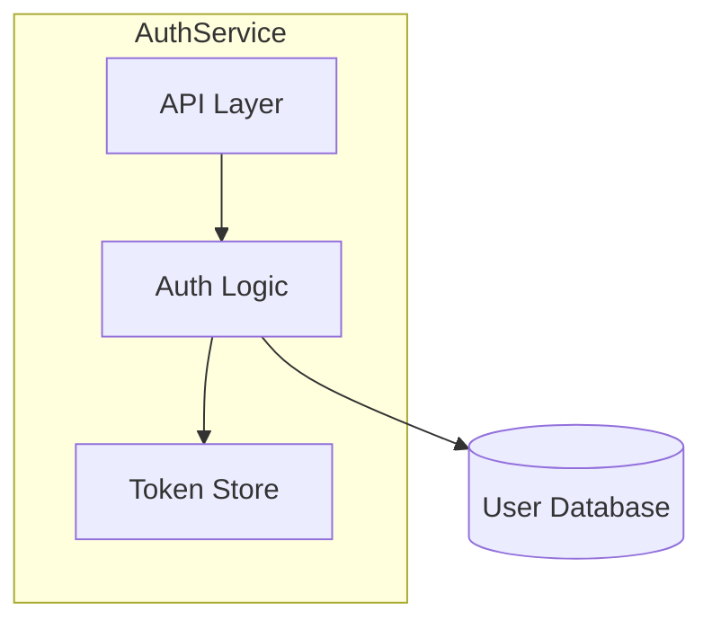

# Condensation Subroutine

This is a self-contained, callable procedure for generating `draft/.ai-context.md` and `draft/.ai-profile.md` from `draft/architecture.md`. Any skill that mutates `architecture.md` should execute this subroutine afterward to keep the derived context files in sync.

**Called by:** `/draft:init`, `/draft:init refresh`, `/draft:implement`, `/draft:decompose`, `/draft:coverage`, `/draft:index`, `/draft:adr`

### Inputs

| Input | Path | Description |
|-------|------|-------------|
| architecture.md | `draft/architecture.md` | Comprehensive human-readable engineering reference (source of truth) |

### Outputs

| Output | Path | Description |
|--------|------|-------------|
| .ai-context.md | `draft/.ai-context.md` | Token-optimized, machine-readable AI context (200-400 lines) |
| .ai-profile.md | `draft/.ai-profile.md` | Ultra-compact, always-injected project profile (20-50 lines) |

**Note:** `.ai-profile.md` generation is a separate step defined in `/draft:init`. The Condensation Subroutine generates `.ai-context.md` only. Skills that call this subroutine should also trigger profile regeneration if `.ai-profile.md` exists.

### Target Size

- **Minimum**: 200 lines
- **Maximum**: 400 lines
- Under 200 lines indicates incomplete condensation — go back and ensure all sections are represented
- Over 400 lines indicates insufficient compression — apply prioritization rules below

### Procedure

#### Step 1: Read Source

Read the full contents of `draft/architecture.md`. Extract the YAML frontmatter metadata block — it will be reused (with updated `generated_by` and `generated_at`) for the output file.

#### Step 2: Write YAML Frontmatter

Start `draft/.ai-context.md` with an updated YAML frontmatter block. Copy all `git.*` and `synced_to_commit` fields from `architecture.md`. Set:
- `generated_by`: the calling command (e.g., `draft:init`, `draft:implement`)
- `generated_at`: current ISO 8601 timestamp

#### Step 3: Transform Sections

Transform each `architecture.md` section into machine-optimized format using this mapping:

| architecture.md Section | .ai-context.md Section | Transformation |
|------------------------|------------------------|----------------|
| Executive Summary | META | Extract key-value pairs only (type, lang, pattern, build, test, entry, config) |
| Architecture Overview (Mermaid) | GRAPH:COMPONENTS | Convert Mermaid diagrams to tree notation using `├─` / `└─` |
| Component Map | GRAPH:COMPONENTS | Merge into the same tree |
| Data Flow (Mermaid) | GRAPH:DATAFLOW | Convert to `FLOW:{Name}` with arrow notation: `source --{type}--> sink` |
| External Dependencies | GRAPH:DEPENDENCIES | Convert to `A -[protocol]-> B` format |
| Dependency Injection | WIRING | Extract mechanism + tokens/getters lists |
| Critical Invariants | INVARIANTS | One line per invariant: `[CATEGORY] name: rule @file:line` |
| Framework/Extension Points | INTERFACES + EXTEND | Condensed signatures + cookbook steps |
| Full Catalog | CATALOG:{Category} | Pipe-separated rows: `id|type|file|purpose` |
| Concurrency Model | THREADS + CONCURRENCY | Pipe-separated rows + rules with violation consequences |
| Configuration | CONFIG | Pipe-separated rows: `param|default|critical:Y/N|purpose` |
| Error Handling | ERRORS | Key-value pairs: `scenario: recovery` |
| Build/Test | TEST + META | Extract exact commands |
| File Structure | FILES | Concept-to-path mappings: `entry: path`, `config: path`, etc. |
| Glossary | VOCAB | `term: definition` pairs |

#### Step 4: Apply Compression

- Remove all prose paragraphs — use structured key-value pairs instead
- Remove Mermaid syntax — use text-based graph notation (`├─`, `-->`, `-[proto]->`)
- Remove markdown formatting (no `**bold**`, no `_italic_`, no headers beyond `##`)
- Abbreviate common words: `fn`=function, `ret`=returns, `cfg`=config, `impl`=implementation, `req`=required, `opt`=optional, `dep`=dependency, `auth`=authentication, `authz`=authorization
- Use symbols: `@`=at/in file, `->`=calls/leads-to, `|`=column separator, `?`=optional, `!`=required/critical

#### Step 5: Prioritize Content

If the output exceeds 400 lines, cut sections in this order (bottom = cut first):

| Priority | Section | Rule |
|----------|---------|------|
| 1 (never cut) | INVARIANTS | Safety critical — preserve every invariant |
| 2 (never cut) | EXTEND | Agent productivity critical — preserve all cookbook steps |
| 3 | GRAPH:* | Keep all component, dependency, and dataflow graphs |
| 4 | INTERFACES | Keep all signatures |
| 5 | CATALOG | Can abbreviate to top 20 entries per category |
| 6 | CONFIG | Can abbreviate to `critical:Y` entries only |
| 7 (cut first) | VOCAB | Can abbreviate to 10 most important terms |

#### Step 6: Quality Check

Before writing `draft/.ai-context.md`, verify:

- [ ] No prose paragraphs remain (all content is structured data)
- [ ] No Mermaid syntax (all diagrams converted to text graphs)
- [ ] No references to `architecture.md` (file must be self-contained)
- [ ] All invariants from architecture.md are preserved
- [ ] Extension cookbooks are complete (an agent can follow them without other files)
- [ ] Output is within 200-400 lines
- [ ] YAML frontmatter metadata is present at the top

#### Step 7: Write Output

Write the completed content to `draft/.ai-context.md`.

### Example Transformation

**architecture.md input:**
```markdown
### 4.1 High-Level Topology

The AuthService is a microservice that handles user authentication...


```

**.ai-context.md output:**
```
## GRAPH:COMPONENTS
AuthService
  ├─API: handles HTTP requests
  ├─Logic: validates credentials, generates tokens
  └─Store: caches active tokens

## GRAPH:DEPENDENCIES
AuthService.Logic -[PostgreSQL]-> UserDB
```

### Reference for Other Skills

Other skills that mutate `draft/architecture.md` should invoke this subroutine with:
> "After updating `draft/architecture.md`, regenerate `draft/.ai-context.md` and `draft/.ai-profile.md` using the Condensation Subroutine defined in `core/shared/condensation.md`."
