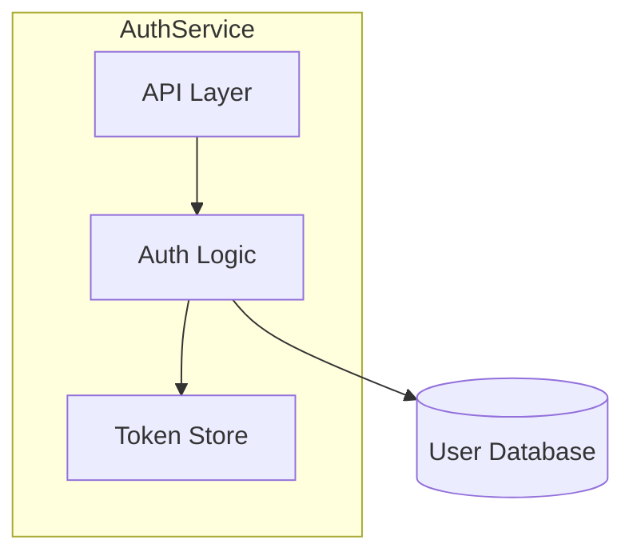

# Condensation Subroutine

> Generates `.ai-context.md` from `architecture.md`. Called by multiple skills after modifying architecture.

---

This is a self-contained, callable procedure for generating `draft/.ai-context.md` from `draft/architecture.md`. 

**Critical fidelity requirement**: The condensation must faithfully preserve the core operational models (workflows, lifecycles, state machines) from architecture.md §3 "Primary Control & Data Flows", along with invariants (§2) and extension points (§8). These behavioral models are the highest-value content for downstream coding accuracy.

**Mapping (architecture.md → .ai-context.md)** (modern 10-section graph-primary):
- Primary Control & Data Flows (§3) → `## GRAPH:OPERATIONAL` + GRAPH:DATAFLOW (states, transitions, error/recovery paths in compact form)
- Module & Dependency Map (§4) + hotspots → `GRAPH:MODULE-HOTSPOTS`, `GRAPH:FAN-IN`, `GRAPH:PROTO-MAP` etc.
- Critical Invariants (§2) → INVARIANTS
- Extension Points (§8) → EXTEND + INTERFACES

Any skill that mutates `architecture.md` should execute this subroutine afterward to keep the derived context files in sync.

**Called by:** `/draft:init`, `/draft:init refresh`, `/draft:implement`, `/draft:decompose`, `/draft:coverage`

### Inputs

| Input | Path | Description |
|-------|------|-------------|
| architecture.md | `draft/architecture.md` | Comprehensive human-readable engineering reference (source of truth) |
| schema.yaml | `draft/graph/schema.yaml` | Graph metrics for tier computation (optional — skip if absent) |

### Outputs

| Output | Path | Description |
|--------|------|-------------|
| .ai-context.md | `draft/.ai-context.md` | Token-optimized, machine-readable AI context (tier-scaled budget) |
| .ai-profile.md | `draft/.ai-profile.md` | Ultra-compact, always-injected project profile (20-50 lines) |

**Note:** `.ai-profile.md` generation is a separate step (the Profile Generation Subroutine defined in `skills/init/SKILL.md`). The Condensation Subroutine generates `.ai-context.md` only. Skills that call this subroutine should also trigger profile regeneration if `draft/.ai-profile.md` exists.

### Target Size

Compute tier from `draft/graph/schema.yaml` after graph build:

  M = stats.modules
  F = stats.go_functions + stats.py_functions
  P = stats.proto_rpcs

| Tier | Label | Condition | Budget |
|------|--------|----------------------------------------|---------------|
| 1 | micro | M≤5 AND F≤50 AND P≤10 | 100–180 lines |
| 2 | small | M≤15 AND F≤300 AND P≤30 | 180–280 lines |
| 3 | medium | M≤40 AND F≤1000 AND P≤100 | 280–400 lines |
| 4 | large | M≤100 AND F≤5000 AND P≤500 | 400–600 lines |
| 5 | XL | M>100 OR F>5000 OR P>500 | 600–900 lines |

If `schema.yaml` does not exist: default to tier 2 (180–280 lines).

- Below tier minimum: incomplete condensation — ensure all sections are represented
- Above tier maximum: insufficient compression — apply prioritization rules below

### Procedure

#### Step 1: Read Source

Read the full contents of `draft/architecture.md`. Extract the YAML frontmatter metadata block — it will be reused (with updated `generated_by` and `generated_at`) for the output file.

#### Step 2: Write YAML Frontmatter

Start `draft/.ai-context.md` with a stable frontmatter block. Git state is centralized in `draft/metadata.json` — do NOT copy `git.*` or `synced_to_commit` from `architecture.md` into this file. Set:
- `project`: from `architecture.md` frontmatter
- `module`: from `architecture.md` frontmatter (usually `root`)
- `generated_by`: the calling command (e.g., `draft:init`, `draft:implement`)
- `generated_at`: current ISO 8601 timestamp

#### Step 3: Transform Sections

Transform each `architecture.md` section into machine-optimized format using this mapping:

| architecture.md Section (10-section graph-primary) | .ai-context.md Section | Transformation |
|--------------------------------------------------|------------------------|----------------|
| §1 Executive Summary + Graph Health Dashboard | META + GRAPH:HEALTH | Extract key-value pairs; dashboard metrics as compact rows |
| §2 Critical Invariants & Safety Rules | INVARIANTS | One line per invariant: `[CATEGORY] name: rule @file:line` |
| §3 Primary Control & Data Flows | GRAPH:OPERATIONAL + GRAPH:DATAFLOW | Convert Mermaid to `FLOW:{Name}` arrow notation |
| §4 Module & Dependency Map | GRAPH:COMPONENTS + GRAPH:MODULES | Tree notation `├─` / `└─`; module fan-in/out from graph |
| §5 Concurrency, Ownership & Isolation | THREADS + CONCURRENCY | Pipe-separated rows + isolation rules |
| §6 Error Handling & Failure Mode Catalog | ERRORS | Key-value pairs: `scenario: recovery` |
| §7 State & Data Truth Sources | GRAPH:DATAFLOW + STATE | Truth sources and reconciliation paths |
| §8 Extension Points & Safe Mutation | INTERFACES + EXTEND | Condensed signatures + cookbook steps |
| §9 Graph Coverage Gaps | GRAPH:GAPS | Bullet list of known limitations |
| §10 Relationship to Other Docs | META:DOCS | Pointer map to authoritative files |

#### Step 3.5: Generate Graph Summary Sections

If `draft/graph/schema.yaml` exists, generate these sections via live engine queries.

**GRAPH:MODULES** (tier ≥ 2 only):
- Query: `scripts/tools/graph-arch.sh --repo . | jq '.packages[]'` (each has `name`, `node_count`, `fan_in`, `fan_out`)
- Format: `{name}|{node_count} nodes|fan_in:{fan_in} fan_out:{fan_out}`
- Order by `node_count` descending
- Omit this section entirely for tier-1 codebases (≤5 modules) where Component Graph is sufficient

**GRAPH:HOTSPOTS** (all tiers):
- Query: `scripts/tools/hotspot-rank.sh --repo . --top 10`; take top 10 results
- Format: `{name}|fanIn:{fanIn}` (use `id` for disambiguation when names collide)
- Always include regardless of tier

**GRAPH:CYCLES** (all tiers):
- Run `scripts/tools/cycle-detect.sh --repo .`; read `.cycles[]` (each is an array of qualified symbol names)
- Output `None ✓` if empty
- Otherwise output each cycle on its own line: `"A → B → C → A"`
- Always include — absence is positive signal that the call graph is acyclic

**GRAPH:MODULE-HOTSPOTS** (tier ≥ 3 only):
- Query: `scripts/tools/hotspot-rank.sh --repo .`; group results by the package segment of each `id` (the qualified name minus the leaf symbol)
- For each module: take its top 3 symbols by `fanIn`, format as indented lines under the module name
- Format: `{module}: {name}|fanIn:{N}` with subsequent symbols indented to align
- Order modules by their highest-fanIn symbol, descending
- Omit modules with no hotspot entries; omit entire section for tier 1–2 (covered by global GRAPH:HOTSPOTS)

**GRAPH:FAN-IN** (tier ≥ 3 only):
- Query: `scripts/tools/graph-arch.sh --repo . | jq '.packages[]'`, use the `fan_in` field per module
- Format: `{name}|fanIn:{fan_in}|fanOut:{fan_out}`
- Order by `fan_in` descending; include only modules with `fan_in ≥ 2`; cap at 15 rows
- Omit entire section for tier 1–2 (trivially small graph)

**GRAPH:PROTO-MAP** (only when routes are non-empty):
- Query: `scripts/tools/graph-arch.sh --repo . | jq '.routes[]'` (each has `method`, `path`, `handler`)
- Format: `{method} {path} → {handler}`
- One line per route
- Omit entire section if `.routes` is empty — do not write an empty section

#### Step 4: Apply Compression

- Remove all prose paragraphs — use structured key-value pairs instead
- Remove Mermaid syntax — use text-based graph notation (`├─`, `-->`, `-[proto]->`)
- Remove markdown formatting (no `**bold**`, no `_italic_`, no headers beyond `##`)
- Abbreviate common words: `fn`=function, `ret`=returns, `cfg`=config, `impl`=implementation, `req`=required, `opt`=optional, `dep`=dependency, `auth`=authentication, `authz`=authorization
- Use symbols: `@`=at/in file, `->`=calls/leads-to, `|`=column separator, `?`=optional, `!`=required/critical

#### Step 5: Prioritize Content

If the output exceeds the tier maximum, cut sections in this order (bottom = cut first):

| Priority | Section | Rule |
|----------|---------|------|
| 1 (never cut) | INVARIANTS | Safety critical — preserve every invariant |
| 2 (never cut) | EXTEND | Agent productivity critical — preserve all cookbook steps |
| 3 (keep) | GRAPH:HOTSPOTS | Always include — needed for impact awareness |
| 3 (keep) | GRAPH:CYCLES | Always include — always 1-2 lines; absence is signal |
| 3 (keep) | GRAPH:PROTO-MAP | Never cut when protos exist — RPC contracts are critical for AI agents |
| 3 | GRAPH:* | Keep all component, dependency, and dataflow graphs |
| 4 (scale) | GRAPH:MODULES | Include tier ≥ 2; omit for tier 1 |
| 4 (scale) | GRAPH:MODULE-HOTSPOTS | Include tier ≥ 3; cut to top-5 modules if budget tight |
| 4 (scale) | GRAPH:FAN-IN | Include tier ≥ 3; cut to top-10 rows if budget tight |
| 4 | INTERFACES | Keep all signatures |
| 5 | CATALOG | Can abbreviate to top 20 entries per category |
| 6 | CONFIG | Can abbreviate to `critical:Y` entries only |
| 7 (cut first) | VOCAB | Can abbreviate to 10 most important terms |

#### Step 6: Quality Check

Before writing `draft/.ai-context.md`, verify:

- [ ] No prose paragraphs remain (all content is structured data)
- [ ] No Mermaid syntax (all diagrams converted to text graphs)
- [ ] No references to `architecture.md` (file must be self-contained)
- [ ] All invariants from architecture.md are preserved
- [ ] Extension cookbooks are complete (an agent can follow them without other files)
- [ ] Output is within tier budget bounds (compute from schema.yaml or default tier 2)
- [ ] GRAPH:HOTSPOTS present (or note "No hotspot data available" if graph absent)
- [ ] GRAPH:CYCLES present ("None ✓" or cycle list; or note if graph absent)
- [ ] GRAPH:MODULE-HOTSPOTS present for tier ≥ 3 (or note if no hotspot data)
- [ ] GRAPH:FAN-IN present for tier ≥ 3
- [ ] GRAPH:PROTO-MAP present when engine reports non-empty routes (omit entirely if no protos)
- [ ] YAML frontmatter metadata is present at the top

#### Step 7: Write Output

Write the completed content to `draft/.ai-context.md`.

#### Step 8: Normalise Whitespace

After writing both output files, strip trailing whitespace and blank lines at EOF to prevent GitHub upload failures. Resolve the script via the canonical tool resolver (see [tool-resolver.md](tool-resolver.md)):

```bash
DRAFT_TOOLS="${DRAFT_PLUGIN_ROOT:-$HOME/.claude/plugins/draft}/scripts/tools"
[ -d "$DRAFT_TOOLS" ] || DRAFT_TOOLS="$HOME/.cursor/plugins/local/draft/scripts/tools"
[ -d "$DRAFT_TOOLS" ] || DRAFT_TOOLS="$PWD/scripts/tools"
[ -x "$DRAFT_TOOLS/fix-whitespace.sh" ] && bash "$DRAFT_TOOLS/fix-whitespace.sh" draft/architecture.md draft/.ai-context.md draft/.ai-profile.md 2>/dev/null || true
```

This is idempotent — run it unconditionally.

### Example Transformation

**architecture.md input:**
````markdown
### 4.1 High-Level Topology

The AuthService is a microservice that handles user authentication...


````

**.ai-context.md output:**
```
## GRAPH:COMPONENTS
AuthService
  ├─API: handles HTTP requests
  ├─Logic: validates credentials, generates tokens
  └─Store: caches active tokens

## GRAPH:DEPENDENCIES
AuthService.Logic -[PostgreSQL]-> UserDB
```

### Reference for Other Skills

Other skills that mutate `draft/architecture.md` should invoke this subroutine with:
> "After updating `draft/architecture.md`, regenerate `draft/.ai-context.md` using the Condensation Subroutine defined in `core/shared/condensation.md`. If `draft/.ai-profile.md` exists, also regenerate it using the Profile Generation Subroutine defined in `skills/init/SKILL.md`."
