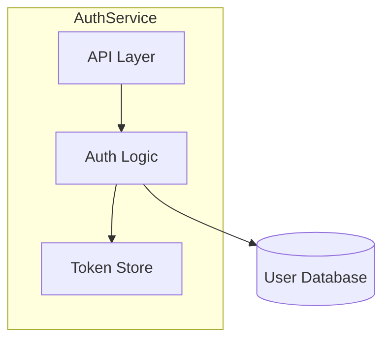

# Condensation Subroutine

> Generates `.ai-context.md` from `architecture.md`. Called by multiple skills after modifying architecture.

---

This is a self-contained, callable procedure for generating `draft/.ai-context.md` from `draft/architecture.md`. Any skill that mutates `architecture.md` should execute this subroutine afterward to keep the derived context files in sync.

**Called by:** `/draft:init`, `/draft:init refresh`, `/draft:implement`, `/draft:decompose`, `/draft:coverage`, `/draft:index`

### Inputs

| Input | Path | Description |
|-------|------|-------------|
| architecture.md | `draft/architecture.md` | Comprehensive human-readable engineering reference (source of truth) |
| schema.yaml | `draft/graph/schema.yaml` | Graph metrics for tier computation (optional — skip if absent) |

### Outputs

| Output | Path | Description |
|--------|------|-------------|
| .ai-context.md | `draft/.ai-context.md` | Token-optimized, machine-readable AI context (tier-scaled budget) |
| .ai-profile.md | `draft/.ai-profile.md` | Ultra-compact, always-injected project profile (20-50 lines) |

**Note:** `.ai-profile.md` generation is a separate step (the Profile Generation Subroutine defined in `skills/init/SKILL.md`). The Condensation Subroutine generates `.ai-context.md` only. Skills that call this subroutine should also trigger profile regeneration if `draft/.ai-profile.md` exists.

### Target Size

Compute tier from `draft/graph/schema.yaml` after graph build:

  M = stats.modules
  F = stats.go_functions + stats.py_functions
  P = stats.proto_rpcs

| Tier | Label  | Condition                              | Budget        |
|------|--------|----------------------------------------|---------------|
| 1    | micro  | M≤5 AND F≤50 AND P≤10                 | 100–180 lines |
| 2    | small  | M≤15 AND F≤300 AND P≤30               | 180–280 lines |
| 3    | medium | M≤40 AND F≤1000 AND P≤100             | 280–400 lines |
| 4    | large  | M≤100 AND F≤5000 AND P≤500            | 400–600 lines |
| 5    | XL     | M>100 OR F>5000 OR P>500              | 600–900 lines |

If `schema.yaml` does not exist: default to tier 2 (180–280 lines).

- Below tier minimum: incomplete condensation — ensure all sections are represented
- Above tier maximum: insufficient compression — apply prioritization rules below

### Procedure

#### Step 1: Read Source

Read the full contents of `draft/architecture.md`. Extract the YAML frontmatter metadata block — it will be reused (with updated `generated_by` and `generated_at`) for the output file.

#### Step 2: Write YAML Frontmatter

Start `draft/.ai-context.md` with an updated YAML frontmatter block. Copy all `git.*` and `synced_to_commit` fields from `architecture.md`. Set:
- `generated_by`: the calling command (e.g., `draft:init`, `draft:implement`)
- `generated_at`: current ISO 8601 timestamp

#### Step 3: Transform Sections

Transform each `architecture.md` section into machine-optimized format using this mapping:

| architecture.md Section | .ai-context.md Section | Transformation |
|------------------------|------------------------|----------------|
| Executive Summary | META | Extract key-value pairs only (type, lang, pattern, build, test, entry, config) |
| Architecture Overview (Mermaid) | GRAPH:COMPONENTS | Convert Mermaid diagrams to tree notation using `├─` / `└─` |
| Component Map | GRAPH:COMPONENTS | Merge into the same tree |
| Data Flow (Mermaid) | GRAPH:DATAFLOW | Convert to `FLOW:{Name}` with arrow notation: `source --{type}--> sink` |
| External Dependencies | GRAPH:DEPENDENCIES | Convert to `A -[protocol]-> B` format |
| Dependency Injection | WIRING | Extract mechanism + tokens/getters lists |
| Critical Invariants | INVARIANTS | One line per invariant: `[CATEGORY] name: rule @file:line` |
| Framework/Extension Points | INTERFACES + EXTEND | Condensed signatures + cookbook steps |
| Full Catalog | CATALOG:{Category} | Pipe-separated rows: `id|type|file|purpose` |
| Concurrency Model | THREADS + CONCURRENCY | Pipe-separated rows + rules with violation consequences |
| Configuration | CONFIG | Pipe-separated rows: `param|default|critical:Y/N|purpose` |
| Error Handling | ERRORS | Key-value pairs: `scenario: recovery` |
| Build/Test | TEST + META | Extract exact commands |
| File Structure | FILES | Concept-to-path mappings: `entry: path`, `config: path`, etc. |
| Glossary | VOCAB | `term: definition` pairs |

#### Step 3.5: Generate Graph Summary Sections

If `draft/graph/schema.yaml` exists, generate these three sections from graph JSONL:

**GRAPH:MODULES** (tier ≥ 2 only):
- Read `draft/graph/module-graph.jsonl`, extract `kind: "node"` records and `kind: "edge"` records
- For each node: `{name}|{sizeKB}KB|{lang_counts} → {comma-separated target modules}`
- `lang_counts` = `go:N,proto:N,cc:N` from node.files (omit zero-count languages)
- `deps` = edge targets where `source == this module name`
- Order by sizeKB descending
- Omit this section entirely for tier-1 codebases (≤5 modules) where Component Graph is sufficient

**GRAPH:HOTSPOTS** (all tiers):
- Read `draft/graph/hotspots.jsonl`, take top 10 by score (score = lines + fanIn × 50)
- Format: `{file}|{lines}L|fanIn:{fanIn}`
- Always include regardless of tier

**GRAPH:CYCLES** (all tiers):
- Inspect `draft/graph/module-graph.jsonl` edges; detect cycles using DFS (same logic as `graph/src/query.js` detectCycles)
- Output `None ✓` if no cycles
- Otherwise output each cycle path on its own line: `"A → B → C → A"`
- Always include — absence is positive signal that architecture is acyclic

**GRAPH:MODULE-HOTSPOTS** (tier ≥ 3 only):
- Read `draft/graph/hotspots.jsonl`, group records by `module` field
- For each module: take top 3 files by score (lines + fanIn×50), format as indented lines under the module name
- Format: `{module}:  {file}|{lines}L|fanIn:{N}` with subsequent files indented to align
- Order modules by their highest-scoring file, descending
- Omit modules with no hotspot entries; omit entire section for tier 1–2 (covered by global GRAPH:HOTSPOTS)

**GRAPH:FAN-IN** (tier ≥ 3 only):
- Read `draft/graph/module-graph.jsonl`, count `kind: "edge"` records by target module name to get per-module incoming edge count
- Format: `{module}|fanIn:{N}|callers:{comma-separated source modules}`
- Order by fanIn descending; include only modules with fanIn ≥ 2; cap at 15 rows
- Omit entire section for tier 1–2 (trivially small graph)

**GRAPH:PROTO-MAP** (only when `stats.proto_rpcs > 0` in schema.yaml):
- Read `draft/graph/proto-index.jsonl`, extract service name, rpc name, request type, response type, source file
- Format: `{ServiceName}: {rpc}({RequestType}) → {ResponseType} @{file}`
- Group entries by service name; one line per RPC
- Omit entire section if `stats.proto_rpcs == 0` — do not write an empty section

#### Step 4: Apply Compression

- Remove all prose paragraphs — use structured key-value pairs instead
- Remove Mermaid syntax — use text-based graph notation (`├─`, `-->`, `-[proto]->`)
- Remove markdown formatting (no `**bold**`, no `_italic_`, no headers beyond `##`)
- Abbreviate common words: `fn`=function, `ret`=returns, `cfg`=config, `impl`=implementation, `req`=required, `opt`=optional, `dep`=dependency, `auth`=authentication, `authz`=authorization
- Use symbols: `@`=at/in file, `->`=calls/leads-to, `|`=column separator, `?`=optional, `!`=required/critical

#### Step 5: Prioritize Content

If the output exceeds the tier maximum, cut sections in this order (bottom = cut first):

| Priority | Section | Rule |
|----------|---------|------|
| 1 (never cut) | INVARIANTS | Safety critical — preserve every invariant |
| 2 (never cut) | EXTEND | Agent productivity critical — preserve all cookbook steps |
| 3 (keep) | GRAPH:HOTSPOTS | Always include — needed for impact awareness |
| 3 (keep) | GRAPH:CYCLES | Always include — always 1-2 lines; absence is signal |
| 3 (keep) | GRAPH:PROTO-MAP | Never cut when protos exist — RPC contracts are critical for AI agents |
| 3 | GRAPH:* | Keep all component, dependency, and dataflow graphs |
| 4 (scale) | GRAPH:MODULES | Include tier ≥ 2; omit for tier 1 |
| 4 (scale) | GRAPH:MODULE-HOTSPOTS | Include tier ≥ 3; cut to top-5 modules if budget tight |
| 4 (scale) | GRAPH:FAN-IN | Include tier ≥ 3; cut to top-10 rows if budget tight |
| 4 | INTERFACES | Keep all signatures |
| 5 | CATALOG | Can abbreviate to top 20 entries per category |
| 6 | CONFIG | Can abbreviate to `critical:Y` entries only |
| 7 (cut first) | VOCAB | Can abbreviate to 10 most important terms |

#### Step 6: Quality Check

Before writing `draft/.ai-context.md`, verify:

- [ ] No prose paragraphs remain (all content is structured data)
- [ ] No Mermaid syntax (all diagrams converted to text graphs)
- [ ] No references to `architecture.md` (file must be self-contained)
- [ ] All invariants from architecture.md are preserved
- [ ] Extension cookbooks are complete (an agent can follow them without other files)
- [ ] Output is within tier budget bounds (compute from schema.yaml or default tier 2)
- [ ] GRAPH:HOTSPOTS present (or note "No hotspot data available" if graph absent)
- [ ] GRAPH:CYCLES present ("None ✓" or cycle list; or note if graph absent)
- [ ] GRAPH:MODULE-HOTSPOTS present for tier ≥ 3 (or note if no hotspot data)
- [ ] GRAPH:FAN-IN present for tier ≥ 3
- [ ] GRAPH:PROTO-MAP present when `stats.proto_rpcs > 0` (omit entirely if no protos)
- [ ] YAML frontmatter metadata is present at the top

#### Step 7: Write Output

Write the completed content to `draft/.ai-context.md`.

### Example Transformation

**architecture.md input:**
````markdown
### 4.1 High-Level Topology

The AuthService is a microservice that handles user authentication...


````

**.ai-context.md output:**
```
## GRAPH:COMPONENTS
AuthService
  ├─API: handles HTTP requests
  ├─Logic: validates credentials, generates tokens
  └─Store: caches active tokens

## GRAPH:DEPENDENCIES
AuthService.Logic -[PostgreSQL]-> UserDB
```

### Reference for Other Skills

Other skills that mutate `draft/architecture.md` should invoke this subroutine with:
> "After updating `draft/architecture.md`, regenerate `draft/.ai-context.md` using the Condensation Subroutine defined in `core/shared/condensation.md`. If `draft/.ai-profile.md` exists, also regenerate it using the Profile Generation Subroutine defined in `skills/init/SKILL.md`."
