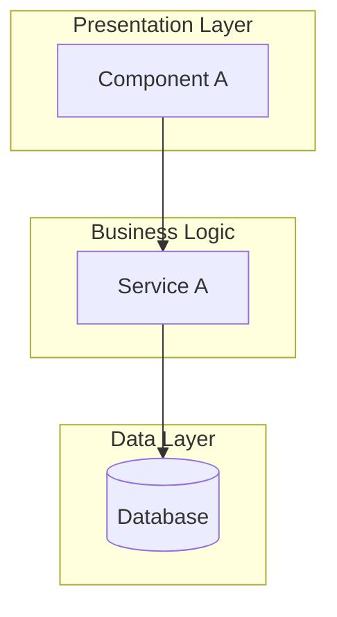
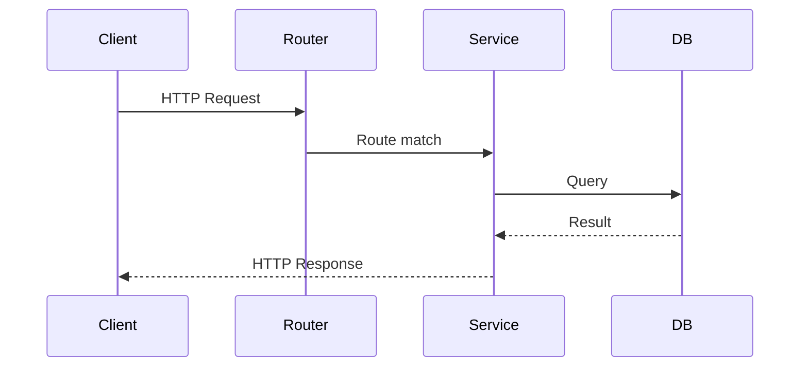
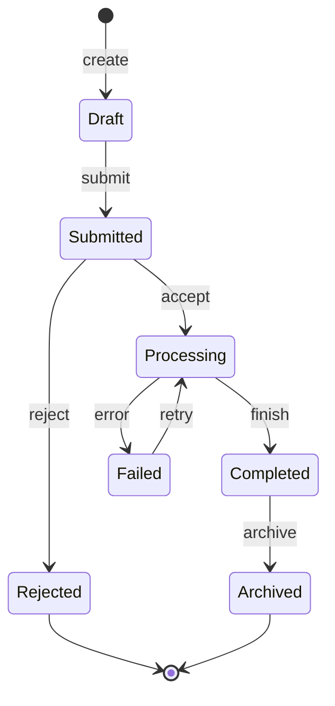
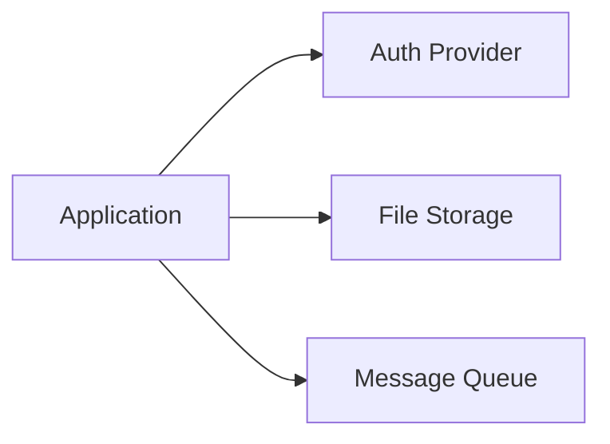
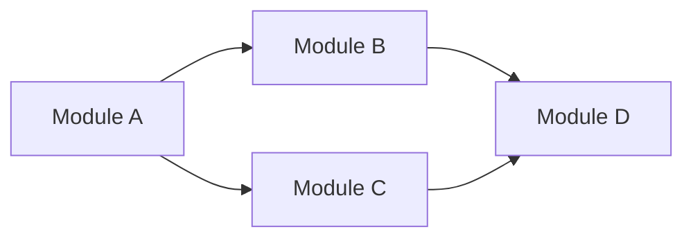

# .ai-context

> Source of truth for AI agents. Dense, machine-optimized codebase understanding.
> Derived `architecture.md` is generated from this file for human consumption.
> Template variables: {date}, {name}, {lang}, {framework}, {architecture_style}, {entry_point_file}, {build_command}, {test_command}, {local_branch}, {remote_branch_or_none}, {short_sha}, {commit_message_first_line}

```yaml
---
generated: {date}
module: {name}
language: {lang}
framework: {framework}
pattern: {architecture_style}
entry_point: {entry_point_file}
build: {build_command}
test: {test_command}
git:
  branch: {local_branch}
  remote: {remote_branch_or_none}
  commit: {short_sha}
  message: {commit_message_first_line}
---
```

## Quick Reference

| Field | Value |
|-------|-------|
| Module | {name} |
| Root | [project root path] |
| Language | [e.g., TypeScript 5.x] |
| Build | [e.g., `npm run build`] |
| Test | [e.g., `npm test`] |
| Entry Point | [file → function, e.g., `src/index.ts → main()`] |
| Config System | [e.g., `.env` + `config.ts`] |
| Extension Point | [interface to implement + where to register, or "N/A"] |

**Before Changes:**
1. [Primary invariant check — #1 thing that must not break]
2. [Thread-safety / async-safety consideration, or "single-threaded — no concerns"]
3. [Test command to run after changes]
4. [API / schema versioning rule, if applicable]

**Never:**
- [Critical safety rule 1]
- [Critical safety rule 2]
- [Critical safety rule 3]

## System Overview

[One paragraph: what the system IS, what it DOES, its role in the larger context]



> Replace with actual system layers and components discovered during analysis.

## Directory Structure

| Directory | Responsibility | Key Files |
|-----------|---------------|-----------|
| `src/` | Main application code | [entry point files] |
| `tests/` | Test suites | [test config] |
| `config/` | Configuration | [env, app config] |

## Entry Points

| Entry Point | Type | File | Description |
|-------------|------|------|-------------|
| Application startup | Main | `src/index.ts` | Initializes app, connects DB, starts server |
| API routes | HTTP | `src/routes/` | Request handling entry |
| Background jobs | Worker | `src/jobs/` | Scheduled/queued task entry |

## Request/Response Flow



> Trace one representative request. Use actual file/class names.

## Tech Stack

| Category | Technology | Version | Config File |
|----------|-----------|---------|-------------|
| Language | [e.g., TypeScript] | [e.g., 5.x] | `tsconfig.json` |
| Framework | [e.g., Express] | [e.g., 4.18] | `package.json` |
| Database | [e.g., PostgreSQL] | [e.g., 15] | `docker-compose.yml` |
| Testing | [e.g., Jest] | [e.g., 29.x] | `jest.config.ts` |

## Data Lifecycle

### Domain Objects

| Object | Created At | Modified At | Persisted In | Key Fields |
|--------|-----------|-------------|--------------|------------|
| [e.g., User] | `src/auth/register.ts` | `src/user/profile.ts` | `users` table | id, email, role |

### State Machines

> For each primary domain object, document its valid states and transitions.



| Object | State | Transitions Out | Trigger | Invariant | Enforced At |
|--------|-------|----------------|---------|-----------|-------------|
| [e.g., Order] | `draft` | → submitted | User submits | All required fields present | `services/order.ts:45` |
| | `submitted` | → processing, → rejected | System accepts / admin rejects | Payment pre-authorized | `services/payment.ts:88` |
| | `processing` | → completed, → failed | Processing finishes / error | Inventory reserved | `services/inventory.ts:23` |
| | `failed` | → processing | Manual retry | Max retries not exceeded | `services/order.ts:112` |

> Invalid state transitions are bugs. This table is the contract.

### Storage Topology

> Where data lives at each tier. Answers: "if this tier fails, what's lost?"

| Tier | Technology | Objects Stored | Durability | TTL / Eviction | Recovery |
|------|-----------|----------------|------------|----------------|----------|
| L1 Cache | [e.g., In-memory / Redis] | [e.g., Session, User profile] | None — volatile | [e.g., 15min TTL, LRU] | Reload from L2/L3 |
| L2 Primary DB | [e.g., PostgreSQL] | [e.g., All domain objects] | WAL + replicas | Permanent | Point-in-time recovery |
| L3 Event Log | [e.g., Kafka] | [e.g., Domain events] | Replicated, retention-based | [e.g., 7 days] | Replay from offset |
| L4 Archive | [e.g., S3 / GCS] | [e.g., Completed orders, audit logs] | Durable, versioned | [e.g., 7 years] | Restore from bucket |

> For single-service apps with one database, simplify: "Single DB (PostgreSQL) — all domain objects. No caching tier. No event log."

### Data Transformation Chain

> How data shape changes as it crosses boundaries. Each boundary is a potential data loss/corruption point.

| Boundary | From Shape | To Shape | Transform Location | Lossy? | Validation |
|----------|-----------|----------|-------------------|--------|------------|
| API ingress | HTTP JSON payload | `CreateUserDTO` | `controllers/user.ts:30` | Yes — unknown fields dropped | Schema validation |
| DTO → Domain | `CreateUserDTO` | `User` (domain model) | `services/user.ts:15` | No — enriched (defaults, IDs) | Business rules |
| Domain → Persistence | `User` | `UserRow` (DB model) | `repos/user.ts:42` | Yes — computed fields dropped | DB constraints |
| Domain → Event | `User` | `UserCreatedEvent` | `events/user.ts:8` | Yes — subset of fields | Event schema |
| Event → Consumer | `UserCreatedEvent` | Consumer-specific model | Consumer service | Varies | Consumer validates |

> For simple apps: "Single shape throughout — no transformation boundaries."

## Design Patterns

| Pattern | Where Used | Purpose |
|---------|-----------|---------|
| [e.g., Repository] | `src/repos/` | Data access abstraction |
| [e.g., Middleware] | `src/middleware/` | Cross-cutting concerns |

## Anti-Patterns & Hotspots

| Location | Issue | Severity |
|----------|-------|----------|
| [e.g., `src/legacy/handler.ts`] | [e.g., God function, 500+ lines] | High |

> Flag areas of high complexity, god objects, circular dependencies. Mark unclear business logic as "Unknown/Legacy Context Required".

## Conventions

| Convention | Pattern | Example |
|-----------|---------|---------|
| Error handling | [e.g., Custom error classes] | `throw new AppError('NOT_FOUND', 404)` |
| Logging | [e.g., Structured JSON] | `logger.info({ userId, action })` |
| Naming | [e.g., kebab-case files] | `user-service.ts` |
| Validation | [e.g., Zod schemas] | `const schema = z.object({...})` |

## External Dependencies

| Service | Type | Critical? | Integration Point |
|---------|------|-----------|-------------------|
| [e.g., Stripe] | Payment API | Yes | `src/payments/stripe.ts` |
| [e.g., Redis] | Cache | No | `src/cache/redis.ts` |



## Critical Invariants

| Category | Invariant | Why | Where Enforced | Violation Pattern |
|----------|-----------|-----|----------------|-------------------|
| Data Safety | [e.g., All writes wrapped in transactions] | [Data corruption on partial writes] | `src/db/transaction.ts` | [Forgetting to wrap multi-table writes] |
| Security | [e.g., All API routes require auth middleware] | [Unauthorized access] | `src/middleware/auth.ts` | [Adding route without middleware chain] |
| Concurrency | [e.g., Lock ordering: DB → Cache → File] | [Deadlock] | [Comment in lock utils] | [Acquiring locks in reverse order] |
| Ordering | [e.g., Validate before persist] | [Invalid data in DB] | `src/services/base.ts` | [Calling save() before validate()] |
| Idempotency | [e.g., All payment ops use idempotency keys] | [Double charges] | `src/payments/handler.ts` | [Omitting idempotency key on retry] |
| Backward Compat | [e.g., API v1 endpoints never removed] | [Client breakage] | `src/routes/v1/` | [Deleting deprecated endpoints] |

> Scan for assertions, validation logic, auth checks, lock acquisitions, transaction boundaries. Group by category.

## Security Architecture

- **Authentication:** [How identity is established — JWT, OAuth, API keys, etc.]
- **Authorization:** [Where permission checks happen — middleware, service layer, decorators]
- **Data Sanitization:** [Input validation boundaries and sanitization logic]
- **Secrets Management:** [How keys/credentials are loaded — env vars, Vault, AWS Secrets Manager]
- **Network Security:** [TLS termination, mTLS, allowlists/blocklists, or N/A]

## Concurrency Model

- **Execution Model:** [single-threaded / multi-threaded / async-await / actor / goroutine / event-loop]
- **Thread/Worker Pools:** [table if applicable, or "single-threaded — N/A"]
- **Async Patterns:** [callbacks / promises / channels — cancellation, timeout handling]
- **Locking Strategy:** [locks, mutexes, semaphores — granularity and ordering rules]
- **Pitfalls:** [specific anti-patterns to avoid in this codebase]

> For single-threaded or simple modules, state "Single-threaded — N/A" and skip subsections.

## Error Handling

- **Propagation Model:** [return codes / exceptions / Result monads / error proto]
- **Retry Policy:**

| Operation | Retry Policy | Backoff | Max Attempts |
|-----------|-------------|---------|--------------|
| [e.g., API call] | Exponential | 1s-30s | 3 |

- **Failure Modes:**

| Failure Scenario | Symptoms | Root Cause | Recovery |
|------------------|----------|------------|----------|
| [e.g., DB connection lost] | [500 errors on writes] | [Connection pool exhaustion] | [Auto-reconnect with backoff] |

- **Graceful Degradation:** [behavior when dependencies are unavailable]

## Observability

- **Logging:** [framework, structured keys, log levels]
- **Tracing:** [spans, context propagation mechanism, or N/A]
- **Metrics:** [counters, gauges, histograms defined in module]
- **Health Checks:** [liveness, readiness endpoints, or N/A]

## Extension Cookbooks

> Step-by-step guides for each extension point. Adapt titles to match the project's actual extension points.

### How to Add a New [Endpoint / Handler / Plugin / ...]

1. [File to create and naming convention]
2. [Interface / base class to implement]
3. [Where to register]
4. [Build / package dependencies to add]
5. [Configuration to add]
6. [Tests required]
7. [Minimal working example]

### How to Add a New [Model / Entity / ...]

1. [Schema/migration file to create]
2. [Model definition location]
3. [Repository/DAO to create or extend]
4. [Service layer integration]
5. [Tests required]

### How to Add a New [Integration / Data Source / ...]

1. [Client/adapter to create]
2. [Registration / configuration mechanism]
3. [Serialization / schema requirements]
4. [Error handling and retry requirements]
5. [Tests required]

## Modules

> **Init vs Decompose**: `/draft:init` discovers and documents **existing** modules. `/draft:decompose` plans **new** modules. Both write to this section. Existing modules (`[x] Existing`) should not be removed by decompose.

<!-- STATUS: [ ] Not Started, [~] In Progress, [x] Existing, [!] Blocked -->

### Module: [name]
- **Responsibility:** [one sentence]
- **Files:** [actual source files]
- **API Surface:** [key exported functions/classes/interfaces]
- **Dependencies:** [which modules it imports from]
- **Complexity:** [Low / Medium / High]
- **Story:** [Brief summary with file references, e.g.: "Handles auth via JWT — see `src/auth/index.ts:1-45`"]
- **Status:** [x] Existing

### Module: [name]
- **Responsibility:** [one sentence]
- **Files:** [actual source files]
- **API Surface:** [key exported functions/classes/interfaces]
- **Dependencies:** [which modules it imports from]
- **Complexity:** [Low / Medium / High]
- **Story:** [Brief summary with file references]
- **Status:** [x] Existing

## Module Dependency Diagram



## Dependency Table

| Module | Depends On | Depended By | Circular? |
|--------|-----------|-------------|-----------|
| Module A | — | Module B, Module C | No |
| Module B | Module A | Module D | No |

## Dependency Order

1. [Leaf module — no dependencies] (foundational)
2. [Module depending on #1]
3. [Module depending on #2] (most dependent)

## Critical Paths

### Synchronous Write Paths

| Step | Location | Description | Consistency | Failure Mode |
|------|----------|-------------|-------------|--------------|
| 1. Entry | `routes/users.ts:42` | POST /users handler | — | 400/422 returned |
| 2. Validation | `middleware/validate.ts:28` | Request schema validation | — | Rejected before write |
| 3. Service | `services/user.ts:88` | Business logic | — | Exception, no side effects |
| 4. Repository | `repos/user.ts:23` | Database insert | **Strong — commit point** | TX rollback, 500 returned |
| 5. Event publish | `events/user.ts:15` | Emit UserCreated event | Eventual | Event lost — data saved but downstream unaware |

> Mark the **commit point** — the step where data becomes durable. Everything before is retriable; failures after require reconciliation.

### Synchronous Read Paths

| Step | Location | Description | Staleness | Cache Invalidation |
|------|----------|-------------|-----------|-------------------|
| 1. Entry | `routes/users.ts:67` | GET /users/:id handler | — | — |
| 2. Cache | `cache/user.ts:8` | Check cache | [e.g., Up to 15min stale] | [e.g., TTL / write-through] |
| 3. Repository | `repos/user.ts:12` | Database query | Consistent (primary) | — |

### Asynchronous / Event Paths

> Queues, event buses, CDC streams, scheduled jobs. These are invisible write paths that cause the majority of distributed system bugs.

| Path Name | Trigger | Source | Channel | Consumer | Ordering | Delivery | Dead Letter |
|-----------|---------|--------|---------|----------|----------|----------|-------------|
| [e.g., Order fulfillment] | Order.completed | `services/order.ts` | [e.g., Kafka `orders` topic] | `workers/fulfillment.ts` | [e.g., Partition-key ordered] | [e.g., At-least-once] | [e.g., `orders-dlq` topic] |
| [e.g., Nightly cleanup] | Cron 02:00 UTC | Scheduler | — | `jobs/cleanup.ts` | N/A | Exactly-once (singleton) | Alert on failure |

> For apps with no async paths: "No async data paths — all operations are synchronous request/response."

### Consistency Boundaries

> Where strong consistency ends and eventual consistency begins.

| Boundary | Strong Side | Eventual Side | Lag | Reconciliation |
|----------|------------|---------------|-----|----------------|
| [e.g., DB → Cache] | PostgreSQL write | Redis cache | [e.g., ≤15min (TTL)] | [e.g., Cache miss triggers DB read] |
| [e.g., Service → Event consumer] | Order service DB | Fulfillment service | [e.g., ≤5s (Kafka lag)] | [e.g., Idempotent consumer + DLQ retry] |
| [e.g., Primary → Read replica] | Primary DB | Read replica | [e.g., ≤1s replication lag] | [e.g., Read-your-writes via primary for critical reads] |

> For single-DB apps: "Single database — all reads and writes are strongly consistent. No eventual consistency boundaries."

### Failure & Recovery Matrix

> What happens to in-flight data at each stage when failure occurs.

| Failure Point | Data State | Impact | Recovery | Idempotent? |
|--------------|------------|--------|----------|-------------|
| [e.g., Before DB commit] | Not persisted | No data loss | Client retries | Yes — no side effects |
| [e.g., After DB commit, before event] | Persisted, event lost | Downstream unaware | [e.g., Outbox pattern / reconciliation job] | DB write is idempotent (upsert) |
| [e.g., Consumer crash mid-processing] | Event consumed, side effects partial | Inconsistent state | [e.g., Reprocess from offset, idempotent handler] | Must be idempotent |
| [e.g., Cache corruption] | Stale/wrong data served | Incorrect reads | [e.g., Cache flush + rebuild] | N/A — read path |

> For simple apps: "Single request-response cycle. Failure = transaction rollback. No partial states possible."

### Cross-Cutting Concerns

| Concern | Implementation | Applied To |
|---------|---------------|------------|
| Logging | `middleware/logger.ts` | All routes |
| Error handling | `middleware/error.ts` | All routes |

## Schemas & Contracts

| Type | Location | Services/Endpoints |
|------|----------|-------------------|
| [e.g., OpenAPI] | `openapi.yaml` | [List endpoints] |
| [e.g., Database] | `prisma/schema.prisma` | [List models] |

## Tests & Config

### Test Coverage Map

| Module | Test Files | Test Type |
|--------|-----------|-----------|
| `src/auth/` | `tests/auth/*.test.ts` | Unit + Integration |
| `src/orders/` | `tests/orders/*.test.ts` | Unit + E2E |

### Configuration

| File | Purpose | Environment Variables |
|------|---------|----------------------|
| `.env.example` | Environment template | DATABASE_URL, API_KEY |
| `config/default.ts` | Default config | — |

## Notes

- [Architecture decisions, trade-offs, constraints]
- [Areas flagged as "Unknown/Legacy Context Required"]
