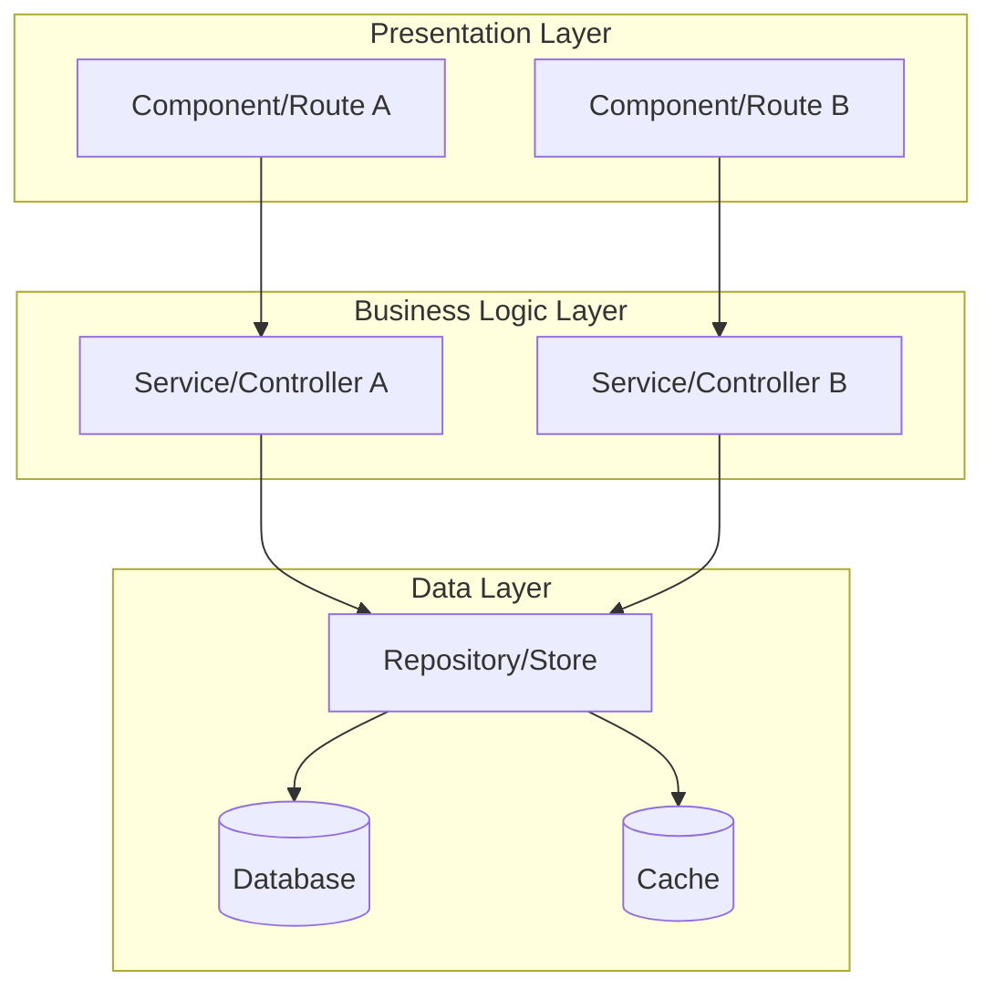
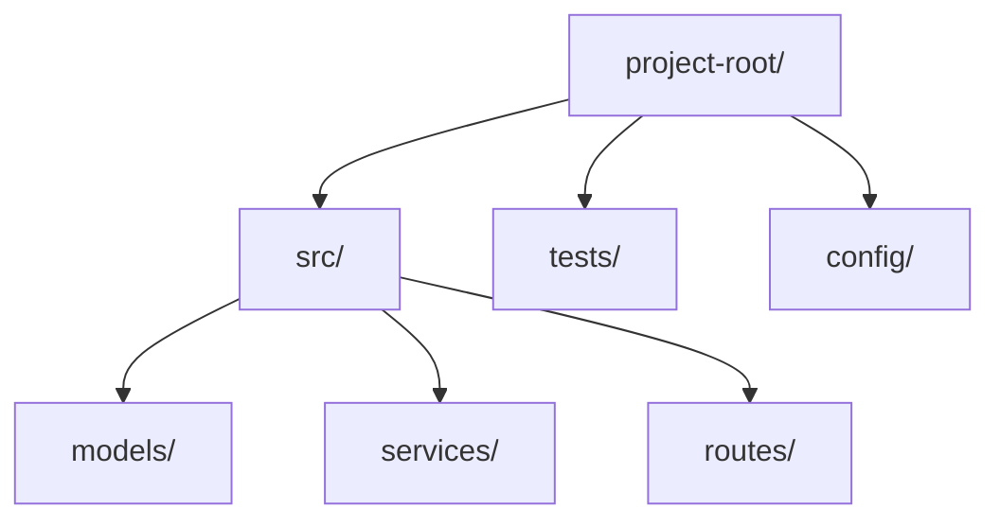
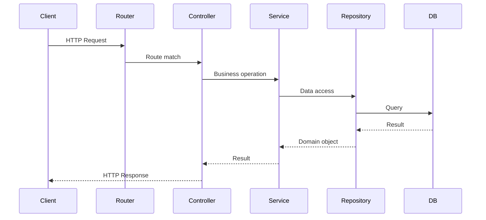
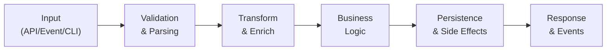
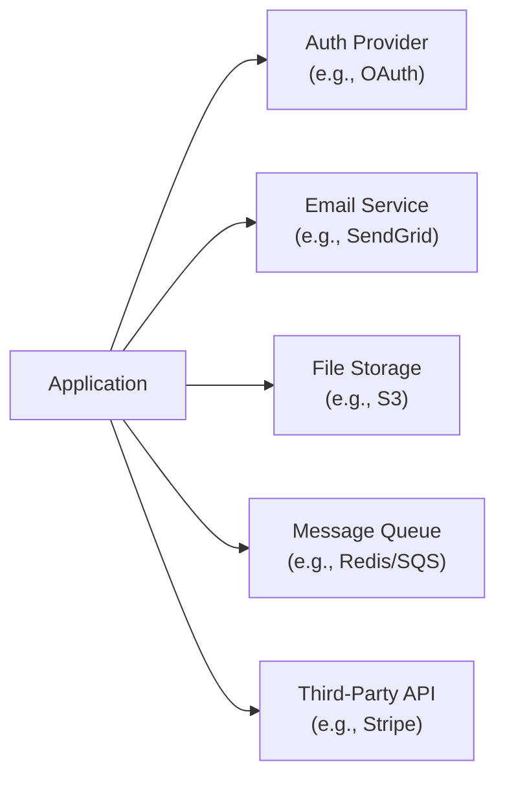
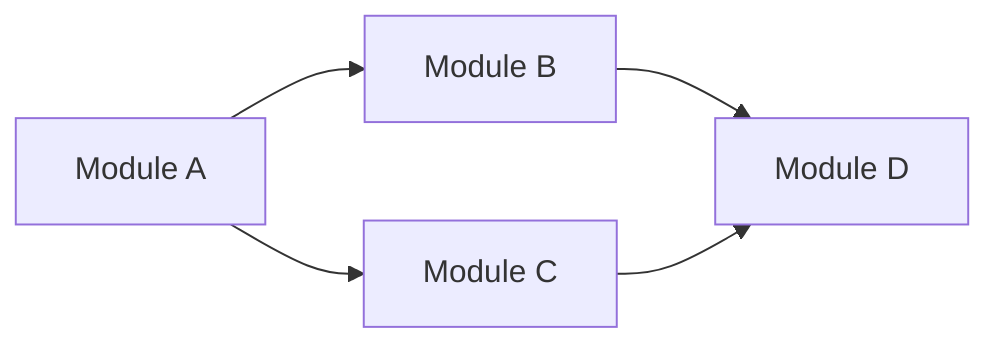
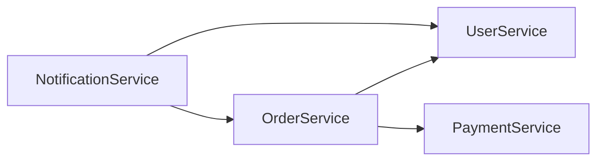

# Architecture: [Name]

## System Overview

**Key Takeaway:** [One-paragraph summary of the system's purpose, primary function, and what makes it tick]

### System Architecture Diagram

> Replace with actual system layers and components discovered during codebase analysis.

---

## Phase 1: Orientation

### Directory Structure

| Directory | Responsibility | Key Files |
|-----------|---------------|-----------|
| `src/` | Main application code | [entry point files] |
| `tests/` | Test suites | [test config] |
| `config/` | Configuration | [env, app config] |

> Map top-level directories and their single-sentence responsibilities. Respect `.gitignore`.

### Entry Points & Critical Paths

| Entry Point | Type | File | Description |
|-------------|------|------|-------------|
| Application startup | Main | `src/index.ts` | Initializes app, connects DB, starts server |
| API routes | HTTP | `src/routes/` | Request handling entry |
| Background jobs | Worker | `src/jobs/` | Scheduled/queued task entry |
| CLI commands | CLI | `src/cli/` | Command-line interface entry |

> Identify primary entry points: API routes, main loops, event listeners, CLI commands, serverless handlers.

### Request/Response Flow

> Trace one representative request through the full stack. Replace with actual layers.

### Tech Stack Inventory

| Category | Technology | Version | Config File |
|----------|-----------|---------|-------------|
| Language | [e.g., TypeScript] | [e.g., 5.x] | `tsconfig.json` |
| Framework | [e.g., Express] | [e.g., 4.18] | `package.json` |
| Database | [e.g., PostgreSQL] | [e.g., 15] | `docker-compose.yml` |
| ORM | [e.g., Prisma] | [e.g., 5.x] | `prisma/schema.prisma` |
| Testing | [e.g., Jest] | [e.g., 29.x] | `jest.config.ts` |

> Auto-detected from package manager files. Cross-referenced with `draft/tech-stack.md`.

---

## Phase 2: Logic

### Data Lifecycle

> Map how primary data objects enter, transform, persist, and exit the system.

### Primary Data Objects

| Object | Created At | Modified At | Persisted In | Key Fields |
|--------|-----------|-------------|--------------|------------|
| [e.g., User] | `src/auth/register.ts` | `src/user/profile.ts` | `users` table | id, email, role |
| [e.g., Order] | `src/orders/create.ts` | `src/orders/update.ts` | `orders` table | id, status, total |

> Track the lifecycle of 3-5 primary domain objects through the system.

### Design Patterns

| Pattern | Where Used | Purpose |
|---------|-----------|---------|
| [e.g., Repository] | `src/repos/` | Data access abstraction |
| [e.g., Factory] | `src/factories/` | Object creation |
| [e.g., Middleware] | `src/middleware/` | Cross-cutting concerns |
| [e.g., Observer/Events] | `src/events/` | Decoupled communication |

### Anti-Patterns & Complexity Hotspots

| Location | Issue | Severity | Notes |
|----------|-------|----------|-------|
| [e.g., `src/legacy/handler.ts`] | [e.g., God function, 500+ lines] | High | [Unknown/Legacy Context Required] |

> Flag areas of high cyclomatic complexity, god objects, circular dependencies, or code that deviates from the dominant patterns. Mark unclear business reasons as "Unknown/Legacy Context Required".

### Conventions & Guardrails

| Convention | Pattern | Example |
|-----------|---------|---------|
| Error handling | [e.g., Custom error classes] | `throw new AppError('NOT_FOUND', 404)` |
| Logging | [e.g., Structured JSON] | `logger.info({ userId, action })` |
| Naming | [e.g., kebab-case files, PascalCase classes] | `user-service.ts`, `class UserService` |
| Validation | [e.g., Zod schemas at boundaries] | `const schema = z.object({...})` |

> Extract conventions the codebase already follows. New code must respect these.

### External Dependencies & Integrations

> Map external service dependencies. Identify which are critical vs. optional.

---

## Phase 3: Module Discovery

> **Init vs Decompose**: `/draft:init` discovers and documents **existing** modules by analyzing the codebase's import graph and directory boundaries. `/draft:decompose` plans **new** modules for features or refactors. Both write to this section — init sets the baseline, decompose extends it. Existing modules (`[x] Existing`) should not be removed by decompose.

### Module Dependency Diagram

> Generated from import/require analysis. Use actual module names from the codebase.

### Dependency Table

| Module | Depends On | Depended By | Circular? |
|--------|-----------|-------------|-----------|
| Module A | - | Module B, Module C | No |
| Module B | Module A | Module D | No |
| Module C | Module A | Module D | No |
| Module D | Module B, Module C | - | No |

### Modules

#### Module: [name]
- **Responsibility:** [one sentence — what this module does]
- **Files:** [actual source files in this module]
- **API Surface:** [Key exported functions/classes/interfaces. Use language-specific format:]
  - TypeScript: `createUser(data: CreateUserInput): Promise<User>`, `interface UserRepository { ... }`
  - Python: `create_user(data: CreateUserInput) -> User`, `class UserRepository(Protocol): ...`
  - Go: `func CreateUser(data CreateUserInput) (*User, error)`, `type UserRepository interface { ... }`
  - Rust: `pub fn create_user(data: CreateUserInput) -> Result<User, Error>`, `pub trait UserRepository { ... }`
- **Dependencies:** [which modules it imports from]
- **Complexity:** [Low / Medium / High]
- **Story:** [Brief summary of what this module currently does with file references, e.g.: "Handles user authentication via JWT — see `src/auth/index.ts:1-45`"]
- **Status:** [x] Existing

#### Module: [name]
- **Responsibility:** [one sentence]
- **Files:** [actual source files]
- **API Surface:** [Use language-specific format — see first module example above]
- **Dependencies:** [which modules it imports from]
- **Complexity:** [Low / Medium / High]
- **Story:** [Brief summary with file references]
- **Status:** [x] Existing

### Dependency Order

1. [Leaf module — no dependencies] (foundational)
2. [Module depending on #1]
3. [Module depending on #1]
4. [Module depending on #2 and #3] (most dependent)

> Topological ordering from leaf to root. Helps engineers understand which parts are foundational vs. built on top.

---

## Phase 4: Critical Paths (Deep Depth Only)

> This section is generated with `--depth deep`. It traces end-to-end read/write paths with `file:line` references.

### Write Paths

#### Write Path: [Operation Name]

| Step | Location | Description |
|------|----------|-------------|
| 1. Entry | `routes/users.ts:42` | POST /users handler |
| 2. Middleware | `middleware/auth.ts:15` | Authentication check |
| 3. Validation | `middleware/validate.ts:28` | Request schema validation |
| 4. Service | `services/user.ts:88` | Business logic, password hashing |
| 5. Repository | `repos/user.ts:23` | Database insert |
| 6. Events | `events/user.ts:12` | Emit UserCreated event |
| 7. Response | `serializers/user.ts:5` | Format response |

> Trace each write operation from entry to persistence and response.

### Read Paths

#### Read Path: [Operation Name]

| Step | Location | Description |
|------|----------|-------------|
| 1. Entry | `routes/users.ts:67` | GET /users/:id handler |
| 2. Middleware | `middleware/auth.ts:15` | Authentication |
| 3. Service | `services/user.ts:45` | Permission check |
| 4. Cache | `cache/user.ts:8` | Check cache, return if hit |
| 5. Repository | `repos/user.ts:12` | Database query |
| 6. Cache | `cache/user.ts:15` | Populate cache |
| 7. Response | `serializers/user.ts:5` | Format response |

> Trace each read operation from entry through cache/DB to response.

### Cross-Cutting Concerns

| Concern | Implementation | Applied To |
|---------|---------------|------------|
| Logging | `middleware/logger.ts` | All routes |
| Error handling | `middleware/error.ts` | All routes |
| Metrics | `middleware/metrics.ts` | All routes |
| Tracing | `middleware/tracing.ts` | All routes |

> Middleware, interceptors, or aspects that apply across multiple paths.

---

## Phase 5: Schemas & Contracts (Deep Depth Only)

> This section is generated with `--depth deep`. It analyzes API schemas and service contracts.

### API Schemas & Contracts

| Type | Location | Services/Endpoints |
|------|----------|-------------------|
| Protobuf | `proto/*.proto` | [List services and methods] |
| OpenAPI | `openapi.yaml` | [List endpoints] |
| GraphQL | `schema.graphql` | [List queries and mutations] |
| Database | `prisma/schema.prisma` | [List models] |

### Service Definitions

#### [ServiceName] (from `proto/service.proto`)

| Method | Request | Response | Description |
|--------|---------|----------|-------------|
| Create | CreateRequest | CreateResponse | Creates a new resource |
| Get | GetRequest | GetResponse | Retrieves a resource by ID |
| Update | UpdateRequest | UpdateResponse | Updates an existing resource |
| Delete | DeleteRequest | Empty | Deletes a resource |

### Inter-Service Dependencies

| Caller | Callee | Purpose |
|--------|--------|---------|
| OrderService | UserService | Get user details for order |
| OrderService | PaymentService | Process payment |
| NotificationService | UserService | Get notification targets |

### Contract Validation

| Schema Type | Validation Tool | CI Integration |
|-------------|----------------|----------------|
| Protobuf | `buf lint` | Yes |
| OpenAPI | `spectral` | Yes |
| GraphQL | `graphql-inspector` | No |

---

## Phase 6: Tests & Config (Deep Depth Only)

> This section is generated with `--depth deep`. It maps test coverage and configuration.

### Test Coverage Map

| Module | Test Files | Test Type | Coverage |
|--------|-----------|-----------|----------|
| `src/auth/` | `tests/auth/*.test.ts` | Unit + Integration | [%] |
| `src/orders/` | `tests/orders/*.test.ts`, `e2e/orders.spec.ts` | Unit + E2E | [%] |
| `src/utils/` | — | No tests | 0% |

> Cross-reference with modules from Phase 3. Flag modules without tests.

### Configuration

| File | Purpose | Environment Variables |
|------|---------|----------------------|
| `.env.example` | Environment template | DATABASE_URL, API_KEY, ... |
| `config/default.ts` | Default config | — |
| `config/production.ts` | Production overrides | — |

### Feature Flags

| Flag | Purpose | Default |
|------|---------|---------|
| `ENABLE_NEW_CHECKOUT` | Gates new checkout flow | false |
| `BETA_FEATURES` | Enables beta feature set | false |

### Secrets & Sensitive Config

| Secret | Source | Required For |
|--------|--------|-------------|
| DATABASE_URL | Environment | Database connection |
| API_KEY | Environment | Third-party API |
| JWT_SECRET | AWS Secrets Manager | Token signing |

> Identify where secrets are expected (NOT their values). Flag missing `.env.example` entries.

---

## Notes

- [Architecture decisions, trade-offs, or constraints worth documenting]
- [Areas flagged as "Unknown/Legacy Context Required" need team input]
- **Analysis Depth:** [quick / standard / deep] — run `/draft:init refresh --depth deep` for additional phases
