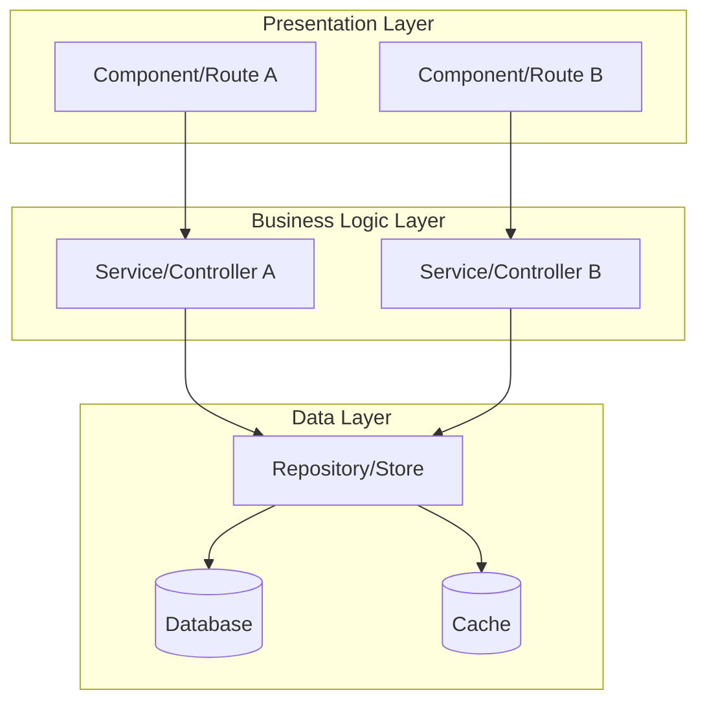
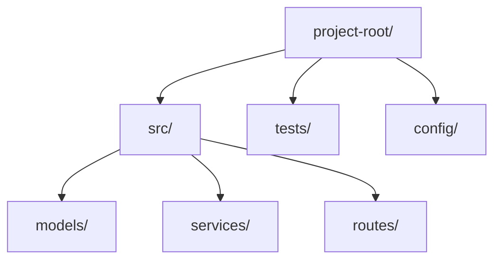
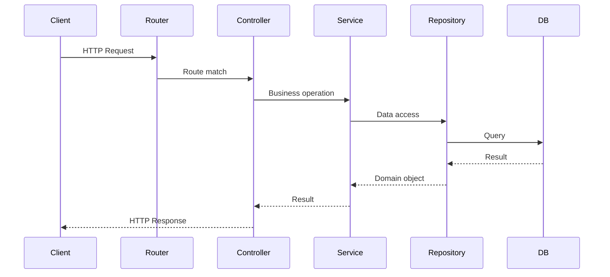
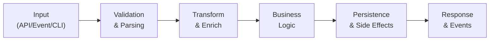
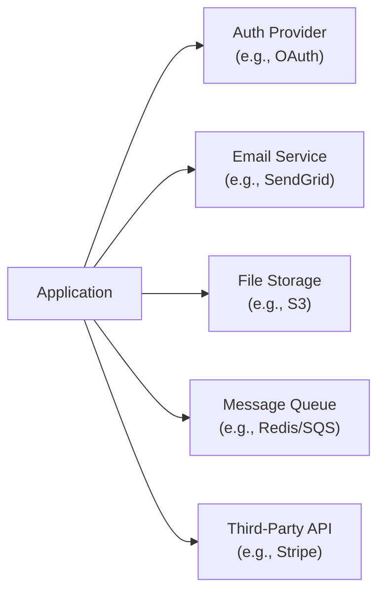
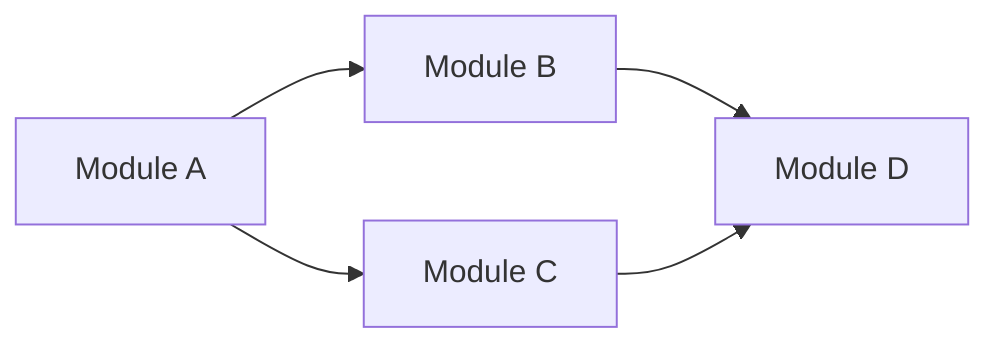

# Architecture: [Name]

## System Overview

**Key Takeaway:** [One-paragraph summary of the system's purpose, primary function, and what makes it tick]

### System Architecture Diagram

> Replace with actual system layers and components discovered during codebase analysis.

---

## Phase 1: Orientation

### Directory Structure

| Directory | Responsibility | Key Files |
|-----------|---------------|-----------|
| `src/` | Main application code | [entry point files] |
| `tests/` | Test suites | [test config] |
| `config/` | Configuration | [env, app config] |

> Map top-level directories and their single-sentence responsibilities. Respect `.gitignore`.

### Entry Points & Critical Paths

| Entry Point | Type | File | Description |
|-------------|------|------|-------------|
| Application startup | Main | `src/index.ts` | Initializes app, connects DB, starts server |
| API routes | HTTP | `src/routes/` | Request handling entry |
| Background jobs | Worker | `src/jobs/` | Scheduled/queued task entry |
| CLI commands | CLI | `src/cli/` | Command-line interface entry |

> Identify primary entry points: API routes, main loops, event listeners, CLI commands, serverless handlers.

### Request/Response Flow

> Trace one representative request through the full stack. Replace with actual layers.

### Tech Stack Inventory

| Category | Technology | Version | Config File |
|----------|-----------|---------|-------------|
| Language | [e.g., TypeScript] | [e.g., 5.x] | `tsconfig.json` |
| Framework | [e.g., Express] | [e.g., 4.18] | `package.json` |
| Database | [e.g., PostgreSQL] | [e.g., 15] | `docker-compose.yml` |
| ORM | [e.g., Prisma] | [e.g., 5.x] | `prisma/schema.prisma` |
| Testing | [e.g., Jest] | [e.g., 29.x] | `jest.config.ts` |

> Auto-detected from package manager files. Cross-referenced with `draft/tech-stack.md`.

---

## Phase 2: Logic

### Data Lifecycle

> Map how primary data objects enter, transform, persist, and exit the system.

### Primary Data Objects

| Object | Created At | Modified At | Persisted In | Key Fields |
|--------|-----------|-------------|--------------|------------|
| [e.g., User] | `src/auth/register.ts` | `src/user/profile.ts` | `users` table | id, email, role |
| [e.g., Order] | `src/orders/create.ts` | `src/orders/update.ts` | `orders` table | id, status, total |

> Track the lifecycle of 3-5 primary domain objects through the system.

### Design Patterns

| Pattern | Where Used | Purpose |
|---------|-----------|---------|
| [e.g., Repository] | `src/repos/` | Data access abstraction |
| [e.g., Factory] | `src/factories/` | Object creation |
| [e.g., Middleware] | `src/middleware/` | Cross-cutting concerns |
| [e.g., Observer/Events] | `src/events/` | Decoupled communication |

### Anti-Patterns & Complexity Hotspots

| Location | Issue | Severity | Notes |
|----------|-------|----------|-------|
| [e.g., `src/legacy/handler.ts`] | [e.g., God function, 500+ lines] | High | [Unknown/Legacy Context Required] |

> Flag areas of high cyclomatic complexity, god objects, circular dependencies, or code that deviates from the dominant patterns. Mark unclear business reasons as "Unknown/Legacy Context Required".

### Conventions & Guardrails

| Convention | Pattern | Example |
|-----------|---------|---------|
| Error handling | [e.g., Custom error classes] | `throw new AppError('NOT_FOUND', 404)` |
| Logging | [e.g., Structured JSON] | `logger.info({ userId, action })` |
| Naming | [e.g., kebab-case files, PascalCase classes] | `user-service.ts`, `class UserService` |
| Validation | [e.g., Zod schemas at boundaries] | `const schema = z.object({...})` |

> Extract conventions the codebase already follows. New code must respect these.

### External Dependencies & Integrations

> Map external service dependencies. Identify which are critical vs. optional.

---

## Module Dependency Diagram

## Dependency Table

| Module | Depends On | Depended By |
|--------|-----------|-------------|
| Module A | - | Module B, Module C |
| Module B | Module A | Module D |
| Module C | Module A | Module D |
| Module D | Module B, Module C | - |

## Modules

### Module: [name]
- **Responsibility:** [one sentence]
- **Files:** [expected source files]
- **API Surface:** [Use language-specific format from `core/agents/architect.md`. Examples:]
  - TypeScript: `createUser(data: CreateUserInput): Promise<User>`, `interface UserRepository { ... }`
  - Python: `create_user(data: CreateUserInput) -> User`, `class UserRepository(Protocol): ...`
  - Go: `func CreateUser(data CreateUserInput) (*User, error)`, `type UserRepository interface { ... }`
  - Rust: `pub fn create_user(data: CreateUserInput) -> Result<User, Error>`, `pub trait UserRepository { ... }`
- **Dependencies:** [which modules it imports from]
- **Complexity:** [Low / Medium / High]
- **Story:** [placeholder - filled during `/draft:implement`. See `core/agents/architect.md` Story Lifecycle for format. Will become a summary + file reference, e.g.: "Documented in `src/auth.ts:1-12` — validates token, resolves user, checks permissions"]
- **Status:** [ ] Not Started

### Module: [name]
- **Responsibility:** [one sentence]
- **Files:** [expected source files]
- **API Surface:** [Use language-specific format — see first module example above]
- **Dependencies:** [which modules it imports from]
- **Complexity:** [Low / Medium / High]
- **Story:** [placeholder - filled during `/draft:implement`. See `core/agents/architect.md` Story Lifecycle for format. Will become a summary + file reference, e.g.: "Documented in `src/auth.ts:1-12` — validates token, resolves user, checks permissions"]
- **Status:** [ ] Not Started

## Implementation Order

1. [Module with no dependencies] (leaf node)
2. [Module depending on #1]
3. [Module depending on #1]
4. [Module depending on #2 and #3]

## Notes

- [Architecture decisions, trade-offs, or constraints worth documenting]
- [Areas flagged as "Unknown/Legacy Context Required" need team input]
