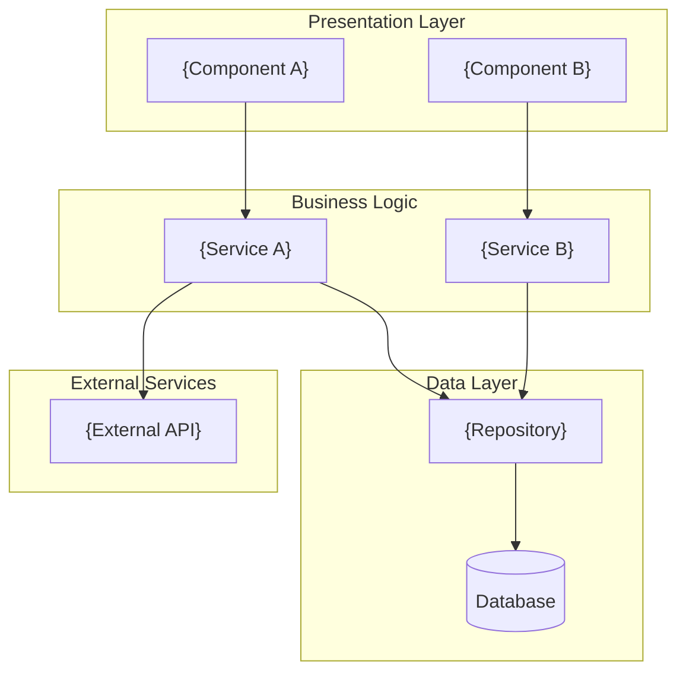
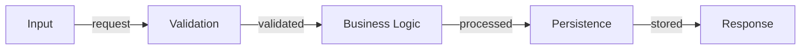
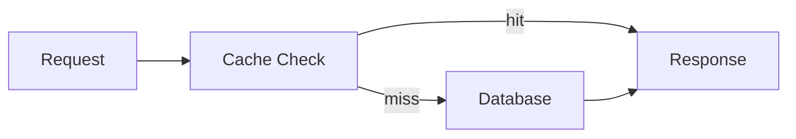
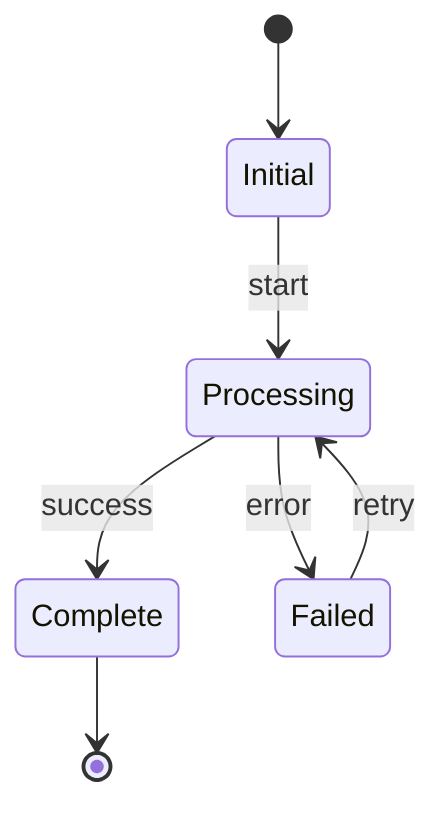
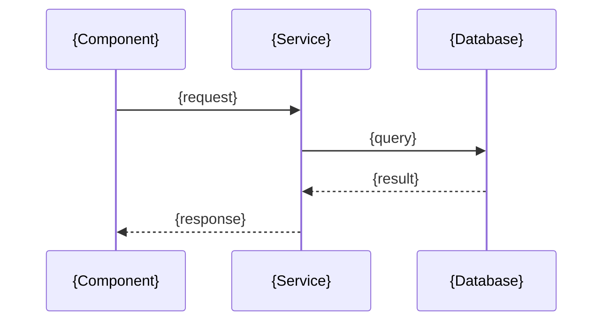
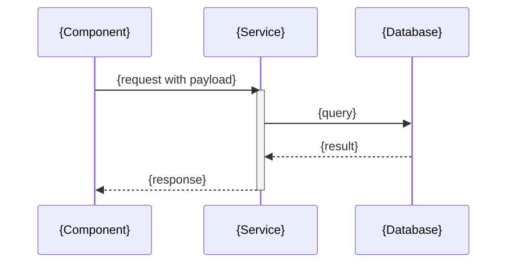

# Architecture: {PROJECT_NAME}

> Human-readable engineering reference. 30-45 pages.
> For token-optimized AI context, see `draft/.ai-context.md`.

| Field | Value |
|-------|-------|
| **Branch** | `{LOCAL_BRANCH}` → `{REMOTE/BRANCH}` |
| **Commit** | `{SHORT_SHA}` — {COMMIT_MESSAGE} |
| **Generated** | {ISO_TIMESTAMP} |
| **Synced To** | `{FULL_SHA}` |

---

## Table of Contents

1. [Executive Summary](#1-executive-summary)
2. [System Identity & Purpose](#2-system-identity--purpose)
3. [Architecture Overview](#3-architecture-overview)
4. [Component Map & Interactions](#4-component-map--interactions)
5. [Data Flow — End to End](#5-data-flow--end-to-end)
6. [Core Modules Deep Dive](#6-core-modules-deep-dive)
7. [Concurrency Model & Thread Safety](#7-concurrency-model--thread-safety)
8. [Framework & Extension Points](#8-framework--extension-points)
9. [Full Catalog of Implementations](#9-full-catalog-of-implementations)
10. [API & Interface Definitions](#10-api--interface-definitions)
11. [External Dependencies](#11-external-dependencies)
12. [Cross-Module Integration Points](#12-cross-module-integration-points)
13. [Critical Invariants & Safety Rules](#13-critical-invariants--safety-rules)
14. [Security Architecture](#14-security-architecture)
15. [Observability & Telemetry](#15-observability--telemetry)
16. [Error Handling & Failure Modes](#16-error-handling--failure-modes)
17. [State Management & Persistence](#17-state-management--persistence)
18. [Key Design Patterns](#18-key-design-patterns)
19. [Configuration & Tuning](#19-configuration--tuning)
20. [Performance Characteristics & Hot Paths](#20-performance-characteristics--hot-paths)
21. [How to Extend — Step-by-Step Cookbooks](#21-how-to-extend--step-by-step-cookbooks)
22. [Build System & Development Workflow](#22-build-system--development-workflow)
23. [Testing Infrastructure](#23-testing-infrastructure)
24. [Known Technical Debt & Limitations](#24-known-technical-debt--limitations)
25. [Glossary](#25-glossary)
- [Appendix A: File Structure Summary](#appendix-a-file-structure-summary)
- [Appendix B: Data Source → Implementation Mapping](#appendix-b-data-source--implementation-mapping)
- [Appendix C: Output Flow — Implementation to Target](#appendix-c-output-flow--implementation-to-target)
- [Appendix D: Mermaid Sequence Diagrams — Critical Flows](#appendix-d-mermaid-sequence-diagrams--critical-flows)

---

## 1. Executive Summary

{One paragraph describing what the module IS, what it DOES, and its role in the larger system.}

**Key Facts:**
- **Language**: {e.g., TypeScript 5.3}
- **Entry Point**: `{file}` → `{function}`
- **Architecture Style**: {e.g., Hexagonal, MVC, Microservice}
- **Component Count**: {N major components}
- **Primary Data Sources**: {databases, queues, APIs this reads from}
- **Primary Action Targets**: {databases, services, files this writes to}

---

## 2. System Identity & Purpose

### What {PROJECT_NAME} Does

1. {Core responsibility 1}
2. {Core responsibility 2}
3. {Core responsibility 3}

### Why {PROJECT_NAME} Exists

{Paragraph explaining the business/system problem it solves, including what would go wrong without it. Frame in terms of data integrity, performance, compliance, operational safety, or user experience.}

---

## 3. Architecture Overview

### 3.1 High-Level Topology

{Paragraph introducing the architecture and its key design decisions.}



### 3.2 Process Lifecycle

{For services: startup to steady state. For libraries: import to teardown. For CLI: args to exit.}

1. **Startup**: {description}
2. **Initialization**: {description}
3. **Ready**: {description}
4. **Steady State**: {description}
5. **Shutdown**: {description}

---

## 4. Component Map & Interactions

### 4.1 Top-Level Orchestrator

{One sentence describing the main controller/manager/app class.}

| Component | Type | Purpose |
|-----------|------|---------|
| `{name}` | `{class}` | {purpose} |

### 4.2 Dependency Injection Pattern

{Paragraph describing how components reference each other: constructor injection, service locator, module system, DI container, etc.}

### 4.3 Interaction Matrix

| | Component A | Component B | Component C |
|---|---|---|---|
| **Component A** | — | ✓ | ✓(HTTP) |
| **Component B** | ✓ | — | ✓(queue) |
| **Component C** | | ✓ | — |

Legend: ✓ direct call, ✓(RPC), ✓(HTTP), ✓(queue), ✓(DB), ✓(event)

---

## 5. Data Flow — End to End

{Paragraph introducing the major data flows through the system.}

### 5.1 Primary Processing Pipeline



### 5.2 Read Path



### 5.3 Safety Mechanisms

{Description of transactions, idempotency guards, version checks, distributed locks.}

---

## 6. Core Modules Deep Dive

{For each major module (5-8), provide detailed analysis.}

### 6.1 {Module Name}

**Role**: {One-line description}

**Responsibilities**:
- {responsibility 1}
- {responsibility 2}

**Key Operations**:

| Operation | Description |
|-----------|-------------|
| `{method}()` | {description} |

**State Machine** (if applicable):



**Notable Mechanisms**: {backpressure, retry, caching, rate limiting, etc.}

---

## 7. Concurrency Model & Thread Safety

{For single-threaded modules: "This module is single-threaded — N/A."}

### 7.1 Execution Model

{single-threaded, multi-threaded, async/await, actor model, goroutine-based, event-loop}

### 7.2 Thread Pool Map

| Pool / Executor | Purpose | What Runs On It |
|-----------------|---------|-----------------|
| `{pool}` | {purpose} | {workloads} |

### 7.3 Locking Strategy

{Locks, mutexes, semaphores — granularity and ordering rules.}

### 7.4 Common Concurrency Pitfalls

- {pitfall 1}
- {pitfall 2}

---

## 8. Framework & Extension Points

{Skip if no plugin/handler/middleware/algorithm system.}

### 8.1 Plugin Types

| Type | Interface | Description |
|------|-----------|-------------|
| `{type}` | `{Interface}` | {description} |

### 8.2 Registry Mechanism

{How plugins are registered: explicit calls, decorators, convention-based, config-driven.}

### 8.3 Core Interfaces

```{language}
// {Interface description}
{actual code from codebase with inline comments}
```

---

## 9. Full Catalog of Implementations

{Skip if Section 8 was skipped.}

### 9.1 By Category

| Category | Implementations |
|----------|-----------------|
| {category} | `{impl1}`, `{impl2}`, `{impl3}` |

### 9.2 Complete List

| # | Name | Type | Description |
|---|------|------|-------------|
| 1 | `{name}` | `{type}` | {description} |

---

## 10. API & Interface Definitions

### 10.1 Endpoints

| Endpoint | Method | Purpose |
|----------|--------|---------|
| `{path}` | {GET/POST/...} | {purpose} |

### 10.2 Data Models

| Model | Purpose |
|-------|---------|
| `{Model}` | {purpose} |

### 10.3 Definition Files

- {`.proto`, OpenAPI spec, GraphQL schema, TypeScript types}

---

## 11. External Dependencies

### 11.1 Service Dependencies

| Service | Client Path | Usage |
|---------|-------------|-------|
| `{service}` | `{path}` | {usage} |

### 11.2 Infrastructure Libraries

| Library | Usage |
|---------|-------|
| `{library}` | {usage} |

---

## 12. Cross-Module Integration Points

{For each external service interaction.}

### 12.1 {Service Name} Integration

- **Contract**: {API version, response format, latency SLA}
- **Failure Isolation**: {what happens when down}
- **Version Coupling**: {compatibility requirements}
- **Integration Tests**: {how tested}

### 12.2 Sequence Diagram — {Flow Name}



---

## 13. Critical Invariants & Safety Rules

{For each invariant (8-15): What, Why, Where Enforced, Common Violation Pattern.}

### Data Safety

| Invariant | Why | Enforced At | Violation Pattern |
|-----------|-----|-------------|-------------------|
| {rule} | {consequence} | `{file}:{line}` | {how broken} |

### Security

| Invariant | Why | Enforced At | Violation Pattern |
|-----------|-----|-------------|-------------------|
| {rule} | {consequence} | `{file}:{line}` | {how broken} |

### Concurrency

| Invariant | Why | Enforced At | Violation Pattern |
|-----------|-----|-------------|-------------------|
| {rule} | {consequence} | `{file}:{line}` | {how broken} |

---

## 14. Security Architecture

### Authentication

{How identity is established: JWT, OAuth, API keys, certificates.}

### Authorization

{Where permission checks happen: middleware, service layer, decorators.}

### Data Sanitization

{Input validation boundaries and sanitization logic.}

### Secrets Management

{How keys/credentials are loaded: env vars, Vault, cloud secrets manager.}

### Network Security

{TLS termination, mTLS, allowlists/blocklists.}

---

## 15. Observability & Telemetry

### Logging

- **Framework**: {logger}
- **Structured Keys**: `{key1}`, `{key2}`, `{key3}`
- **Log Levels**: {when each level is used}

### Distributed Tracing

- **Spans**: {where trace context is extracted/injected}
- **Propagation**: {mechanism}

### Metrics

| Metric | Type | Purpose |
|--------|------|---------|
| `{name}` | {counter/gauge/histogram} | {purpose} |

### Health Checks

- **Liveness**: `{endpoint}`
- **Readiness**: `{endpoint}`

---

## 16. Error Handling & Failure Modes

### Error Propagation Model

{Return codes, exceptions, Result monads, error protos.}

```{language}
// Canonical error handling pattern
{actual code example from codebase}
```

### Retry Semantics

| Operation | Policy | Backoff | Max Attempts |
|-----------|--------|---------|--------------|
| `{op}` | {policy} | {backoff} | {N} |

### Common Failure Modes

| Scenario | Symptoms | Root Cause | Recovery |
|----------|----------|------------|----------|
| {scenario} | {symptoms} | {cause} | {recovery} |

### Graceful Degradation

{Behavior when dependencies unavailable.}

---

## 17. State Management & Persistence

### State Inventory

| State | Storage | Durability | Recovery |
|-------|---------|------------|----------|
| {state} | {storage} | {durability} | {recovery} |

### Persistence Formats

{What is serialized, where, in what format: protobuf, JSON, SQL rows.}

### Recovery Sequences

{What happens on crash-restart, how state is reconstructed.}

### Schema Migration

{How persistent state evolves across versions.}

---

## 18. Key Design Patterns

### 18.1 {Pattern Name}

{2-4 sentence description of the pattern and how it is applied.}

```{language}
// {Pattern implementation}
{actual code from codebase}
```

**Used in**: `{file1}`, `{file2}`

---

## 19. Configuration & Tuning

### Key Parameters

| Parameter | Default | Purpose |
|-----------|---------|---------|
| `{param}` | `{value}` | {purpose} |

### Scheduling Configuration

{How recurring work is configured: cron, intervals, tickers.}

### Config Code

```{language}
// Configuration schema/struct
{actual code}
```

---

## 20. Performance Characteristics & Hot Paths

### Hot Paths

- `{file}:{function}` — {why critical}

### Scaling Dimensions

| Dimension | Scales With | Bottleneck |
|-----------|-------------|------------|
| {dimension} | {factor} | {bottleneck} |

### Memory Profile

{Large memory consumers, budgets, OOM risks.}

### I/O Patterns

{Disk I/O, network I/O, database queries characteristics.}

---

## 21. How to Extend — Step-by-Step Cookbooks

### 21.1 Adding a New {ExtensionType}

1. **Create file**: `{path}` (naming: `{convention}`)
2. **Implement interface**:
   - Required: `{method1}()`, `{method2}()`
   - Optional: `{method3}?()`
3. **Register**: Add to `{registry_file}` via `{mechanism}`
4. **Build dependencies**: {instructions}
5. **Configuration**: {if any}
6. **Tests**: Create `{test_path}` covering {scenarios}

**Minimal working example**:

```{language}
{simplest implementation that compiles/runs}
```

---

## 22. Build System & Development Workflow

### Build System

{Bazel, CMake, npm, Cargo, Maven, etc.}

### Key Targets

| Target | Type | What It Does |
|--------|------|--------------|
| `{target}` | {type} | {description} |

### How to Build

- **Full**: `{command}`
- **Single component**: `{command}`
- **Debug mode**: `{command}`

### How to Test

- **Full suite**: `{command}`
- **Single test**: `{command}`
- **With coverage**: `{command}`

### How to Run Locally

```bash
{commands to run locally}
```

### Common Build Issues

- {issue 1}: {solution}

### Code Style

{File naming, function naming, package naming conventions.}

### CI/CD

{What runs in pre-submit, what runs nightly.}

---

## 23. Testing Infrastructure

### Framework

{GTest, pytest, Jest, JUnit, etc.}

### Test Patterns

- {Mock/stub injection points}
- {In-memory substitutes}
- {Test data builders/fixtures}
- {Integration test setup}

### Test-to-Feature Mapping

| Feature | Test Suite |
|---------|------------|
| {feature} | `{test_path}` |

### Coverage Expectations

{What should be tested for new code.}

---

## 24. Known Technical Debt & Limitations

### Deprecated Code

| Component | Status | Migration Path |
|-----------|--------|----------------|
| `{component}` | {status} | {path} |

### Known Workarounds

- `{file}:{line}` — {TODO/FIXME description}

### Scaling Limitations

{Known ceilings and their causes.}

### Complexity Hotspots

| Location | Issue | Severity |
|----------|-------|----------|
| `{file}` | {issue} | {High/Med/Low} |

---

## 25. Glossary

| Term | Definition |
|------|------------|
| {term} | {1-2 sentence definition} |

---

## Appendix A: File Structure Summary

```
{project}/
├── {dir}/                 ← {description}
│   ├── {subdir}/          ← {description}
│   └── {file}             ← {description}
└── {dir}/                 ← {description}
```

---

## Appendix B: Data Source → Implementation Mapping

| Data Source | Implementations Reading It |
|-------------|---------------------------|
| `{source}` | `{impl1}`, `{impl2}` |

---

## Appendix C: Output Flow — Implementation to Target

| Implementation | Output Type | Target |
|----------------|-------------|--------|
| `{impl}` | {type} | `{target}` |

---

## Appendix D: Mermaid Sequence Diagrams — Critical Flows

### {Flow Name}



---

End of analysis. For AI-optimized context, see `draft/.ai-context.md`.
