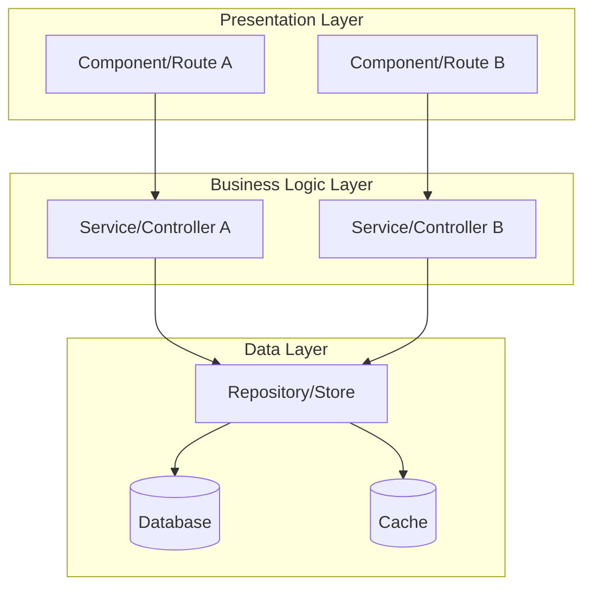
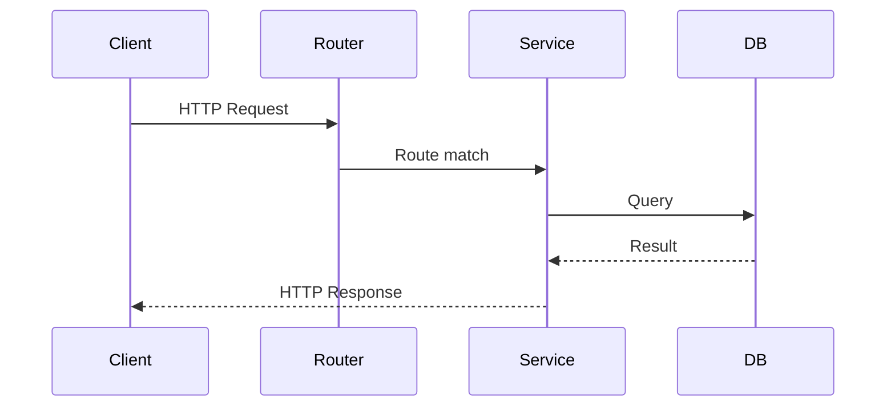
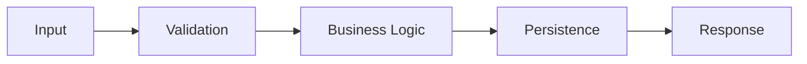
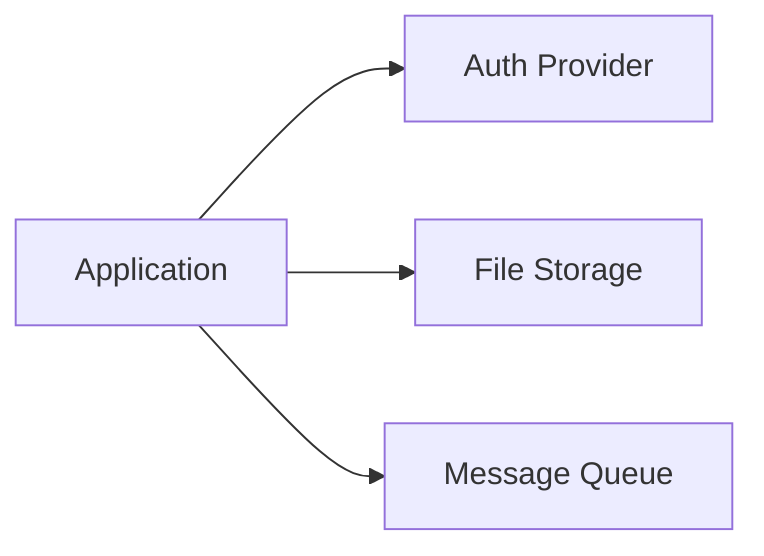
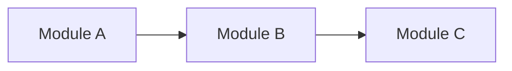

# Architecture: [Name]

> Human-readable engineering guide. Derived from `.ai-context.md` by the `/draft:init` Derivation Subroutine.
> For the machine-optimized source of truth, see `draft/.ai-context.md`.
> To regenerate this file: run `/draft:init refresh`.

## System Overview

**Key Takeaway:** [One-paragraph summary of the system's purpose, primary function, and what makes it tick]

### System Architecture Diagram

---

## Getting Started

[Brief onboarding paragraph: how to set up the project, run it locally, and run tests. Written for a new engineer joining the team.]

---

## Directory Structure

[Prose paragraph describing the project organization philosophy.]

| Directory | Responsibility | Key Files |
|-----------|---------------|-----------|
| `src/` | Main application code | [entry point files] |
| `tests/` | Test suites | [test config] |
| `config/` | Configuration | [env, app config] |

---

## Entry Points

[Paragraph explaining the system's main entry points and how requests flow through.]

| Entry Point | Type | File | Description |
|-------------|------|------|-------------|
| Application startup | Main | `src/index.ts` | Initializes app, connects DB, starts server |
| API routes | HTTP | `src/routes/` | Request handling entry |

### Request/Response Flow

---

## Tech Stack

| Category | Technology | Version | Config File |
|----------|-----------|---------|-------------|
| Language | [e.g., TypeScript] | [e.g., 5.x] | `tsconfig.json` |
| Framework | [e.g., Express] | [e.g., 4.18] | `package.json` |

---

## Data Lifecycle

[Paragraph explaining how data flows through the system — from ingestion to persistence.]

| Object | Created At | Modified At | Persisted In |
|--------|-----------|-------------|--------------|
| [e.g., User] | `src/auth/register.ts` | `src/user/profile.ts` | `users` table |

---

## Design Patterns

[Paragraph summarizing the dominant architectural patterns and why they were chosen.]

| Pattern | Where Used | Purpose |
|---------|-----------|---------|
| [e.g., Repository] | `src/repos/` | Data access abstraction |
| [e.g., Middleware] | `src/middleware/` | Cross-cutting concerns |

---

## Conventions

[Paragraph on coding conventions and how they maintain consistency.]

| Convention | Pattern | Example |
|-----------|---------|---------|
| Error handling | [e.g., Custom error classes] | `throw new AppError('NOT_FOUND', 404)` |
| Naming | [e.g., kebab-case files] | `user-service.ts` |

---

## External Dependencies

[Paragraph describing the system's integration landscape.]

---

## Security & Invariants

[Paragraph summarizing the security posture and critical rules that must never be violated.]

- **Authentication:** [mechanism]
- **Authorization:** [where enforced]
- **Key Invariants:** [top 3-5 rules]

---

## Modules

[Paragraph explaining the module structure — what each module owns and how they relate.]

### Module Dependency Diagram

### Module Summary

| Module | Responsibility | Dependencies | Complexity |
|--------|---------------|--------------|------------|
| [name] | [one sentence] | [list] | [Low/Med/High] |

### Dependency Order

1. [Leaf module] (foundational)
2. [Module depending on #1]
3. [Most dependent module]

---

## Critical Paths

[Paragraph explaining how critical operations flow through the system.]

### Write Paths

| Step | Location | Description |
|------|----------|-------------|
| 1 | `routes/users.ts:42` | POST /users handler |
| 2 | `services/user.ts:88` | Business logic |
| 3 | `repos/user.ts:23` | Database insert |

### Read Paths

| Step | Location | Description |
|------|----------|-------------|
| 1 | `routes/users.ts:67` | GET /users/:id handler |
| 2 | `repos/user.ts:12` | Database query |

---

## Schemas & Contracts

| Type | Location | Services/Endpoints |
|------|----------|-------------------|
| [e.g., OpenAPI] | `openapi.yaml` | [endpoints] |
| [e.g., Database] | `prisma/schema.prisma` | [models] |

---

## Tests

| Module | Test Files | Test Type |
|--------|-----------|-----------|
| `src/auth/` | `tests/auth/*.test.ts` | Unit + Integration |

---

## Notes

- [Architecture decisions, trade-offs, constraints]
- [Areas flagged as "Unknown/Legacy Context Required"]
