# Architecture: {PROJECT_NAME}

> Comprehensive human-readable engineering reference.
> For token-optimized AI context, see `draft/.ai-context.md`.

| Field | Value |
|-------|-------|
| **Branch** | `{LOCAL_BRANCH}` → `{REMOTE/BRANCH}` |
| **Commit** | `{SHORT_SHA}` — {COMMIT_MESSAGE} |
| **Generated** | {ISO_TIMESTAMP} |
| **Synced To** | `{FULL_SHA}` |

---

## Table of Contents

1. [Executive Summary](#1-executive-summary)
2. [System Identity & Purpose](#2-system-identity--purpose)
3. [Architecture Overview](#3-architecture-overview)
4. [Component Map & Interactions](#4-component-map--interactions)
5. [Data Flow — End to End](#5-data-flow--end-to-end)
6. [Core Modules Deep Dive](#6-core-modules-deep-dive)
7. [Concurrency Model & Thread Safety](#7-concurrency-model--thread-safety)
8. [Framework & Extension Points](#8-framework--extension-points)
9. [Full Catalog of Implementations](#9-full-catalog-of-implementations)
10. [API & Interface Definitions](#10-api--interface-definitions)
11. [External Dependencies](#11-external-dependencies)
12. [Cross-Module Integration Points](#12-cross-module-integration-points)
13. [Critical Invariants & Safety Rules](#13-critical-invariants--safety-rules)
14. [Security Architecture](#14-security-architecture)
15. [Observability & Telemetry](#15-observability--telemetry)
16. [Error Handling & Failure Modes](#16-error-handling--failure-modes)
17. [State Management & Persistence](#17-state-management--persistence)
18. [Key Design Patterns](#18-key-design-patterns)
19. [Configuration & Tuning](#19-configuration--tuning)
20. [Performance Characteristics & Hot Paths](#20-performance-characteristics--hot-paths)
21. [How to Extend — Step-by-Step Cookbooks](#21-how-to-extend--step-by-step-cookbooks)
22. [Build System & Development Workflow](#22-build-system--development-workflow)
23. [Testing Infrastructure](#23-testing-infrastructure)
24. [Known Technical Debt & Limitations](#24-known-technical-debt--limitations)
25. [Glossary](#25-glossary)
26. [Domain Model](#26-domain-model)
27. [Execution Flow Mapping](#27-execution-flow-mapping)
28. [Interaction Surfaces](#28-interaction-surfaces)
- [Appendix A: File Structure Summary](#appendix-a-file-structure-summary)
- [Appendix B: Data Source → Implementation Mapping](#appendix-b-data-source--implementation-mapping)
- [Appendix C: Output Flow — Implementation to Target](#appendix-c-output-flow--implementation-to-target)
- [Appendix D: Mermaid Sequence Diagrams — Critical Flows](#appendix-d-mermaid-sequence-diagrams--critical-flows)
- [Appendix E: Dependency Graph Visualization](#appendix-e-dependency-graph-visualization)
- [Appendix F: Context Index](#appendix-f-context-index)

---

## 1. Executive Summary

{One paragraph describing what the module IS, what it DOES, and its role in the larger system.}

**Key Facts:**
- **Language**: {e.g., TypeScript 5.3}
- **Entry Point**: `{file}` → `{function}`
- **Architecture Style**: {e.g., Hexagonal, MVC, Microservice}
- **Component Count**: {N major components}
- **Primary Data Sources**: {databases, queues, APIs this reads from}
- **Primary Action Targets**: {databases, services, files this writes to}

---

## 2. System Identity & Purpose

### What {PROJECT_NAME} Does

1. {Core responsibility 1}
2. {Core responsibility 2}
3. {Core responsibility 3}

### Why {PROJECT_NAME} Exists

{Paragraph explaining the business/system problem it solves, including what would go wrong without it. Frame in terms of data integrity, performance, compliance, operational safety, or user experience.}

---

## 3. Architecture Overview

### 3.1 High-Level Topology

{Paragraph introducing the architecture and its key design decisions.}

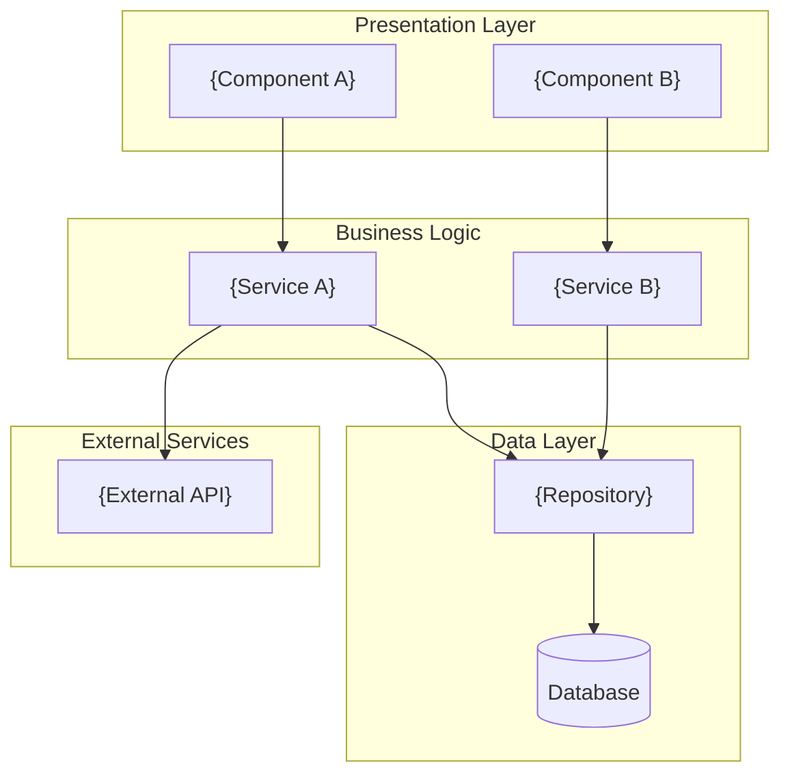
```mermaid
flowchart TD
    subgraph Presentation["Presentation Layer"]
        A["{Component A}"]
        B["{Component B}"]
    end
    subgraph Logic["Business Logic"]
        C["{Service A}"]
        D["{Service B}"]
    end
    subgraph Data["Data Layer"]
        E["{Repository}"]
        F[("Database")]
    end
    subgraph External["External Services"]
        G["{External API}"]
    end

    A --> C
    B --> D
    C --> E
    D --> E
    E --> F
    C --> G
```

### 3.2 Entry Points Catalog

| Entry Point | Type | File | Function/Class | Trigger |
|-------------|------|------|-----------------|---------|
| `{name}` | {CLI/API/Scheduler/Event/Worker} | `{file}` | `{function}` | {how invoked} |

### 3.3 Build & Runtime Artifacts

| Artifact | Type | Path | Purpose |
|----------|------|------|---------|
| `{name}` | {Dockerfile/CI pipeline/Helm chart/Terraform/binary} | `{path}` | {purpose} |

{Describe deployment topology: containers, serverless functions, static assets, etc.}

### 3.4 Process Lifecycle

{For services: startup to steady state. For libraries: import to teardown. For CLI: args to exit.}

1. **Startup**: {description}
2. **Initialization**: {description}
3. **Ready**: {description}
4. **Steady State**: {description}
5. **Shutdown**: {description}

---

## 4. Component Map & Interactions

### 4.1 Top-Level Orchestrator

{One sentence describing the main controller/manager/app class.}

| Component | Type | Purpose |
|-----------|------|---------|
| `{name}` | `{class}` | {purpose} |

### 4.2 Dependency Injection Pattern

{Paragraph describing how components reference each other: constructor injection, service locator, module system, DI container, etc.}

### 4.3 Interaction Matrix

| | Component A | Component B | Component C |
|---|---|---|---|
| **Component A** | — | ✓ | ✓(HTTP) |
| **Component B** | ✓ | — | ✓(queue) |
| **Component C** | | ✓ | — |

Legend: ✓ direct call, ✓(RPC), ✓(HTTP), ✓(queue), ✓(DB), ✓(event)

---

## 5. Data Flow — End to End

{Paragraph introducing the major data flows through the system.}

### 5.1 Primary Processing Pipeline

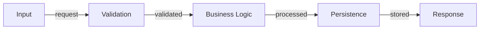
```mermaid
flowchart LR
    A["Input"] -->|"request"| B["Validation"]
    B -->|"validated"| C["Business Logic"]
    C -->|"processed"| D["Persistence"]
    D -->|"stored"| E["Response"]
```

### 5.2 Read Path

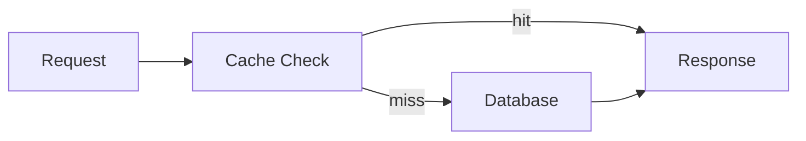
```mermaid
flowchart LR
    A["Request"] --> B["Cache Check"]
    B -->|"miss"| C["Database"]
    B -->|"hit"| D["Response"]
    C --> D
```

### 5.3 Data Ingress & Egress Points

| Direction | Point | Protocol | Data Format | Rate/Volume |
|-----------|-------|----------|-------------|-------------|
| Ingress | `{endpoint/topic/file}` | {HTTP/gRPC/AMQP/file} | {JSON/protobuf/CSV} | {rate} |
| Egress | `{endpoint/topic/file}` | {HTTP/gRPC/AMQP/file} | {JSON/protobuf/CSV} | {rate} |

### 5.4 Serialization & Deserialization Boundaries

| Boundary | Location | Format In | Format Out | Library |
|----------|----------|-----------|------------|---------|
| `{name}` | `{file}:{line}` | {format} | {format} | {library} |

{Document where data changes shape: API controllers, message handlers, DB repositories, file parsers.}

### 5.5 Schema Evolution & Data Contracts

| Contract | Owner | Consumers | Versioning Strategy | Breaking Change Policy |
|----------|-------|-----------|--------------------|-----------------------|
| `{schema/proto/type}` | `{module}` | `{modules}` | {semver/field evolution/migration} | {policy} |

### 5.6 Safety Mechanisms

{Description of transactions, idempotency guards, version checks, distributed locks.}

---

## 6. Core Modules Deep Dive

{For EVERY module in the final combined list (structural candidates from step 1b Tier 1/Tier 2 + logical modules from Phase 2), provide detailed analysis. No cap on module count. Sub-modules get nested subsections under their parent.}

### 6.1 {Module Name}

**Role**: {One-line description}

**Responsibilities**:
- {responsibility 1}
- {responsibility 2}

**Key Operations**:

| Operation | Description |
|-----------|-------------|
| `{method}()` | {description} |

**State Machine** (if applicable):

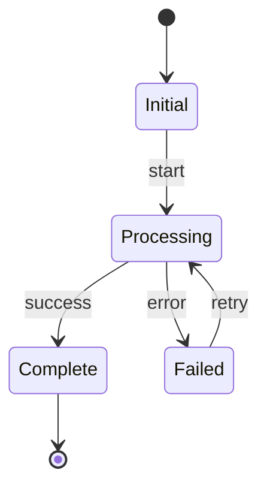
```mermaid
stateDiagram-v2
    [*] --> Initial
    Initial --> Processing: start
    Processing --> Complete: success
    Processing --> Failed: error
    Failed --> Processing: retry
    Complete --> [*]
```

**Notable Mechanisms**: {backpressure, retry, caching, rate limiting, etc.}

---

## 7. Concurrency Model & Thread Safety

{For single-threaded modules: "This module is single-threaded — N/A."}

### 7.1 Execution Model

{single-threaded, multi-threaded, async/await, actor model, goroutine-based, event-loop}

### 7.2 Thread Pool Map

| Pool / Executor | Purpose | What Runs On It |
|-----------------|---------|-----------------|
| `{pool}` | {purpose} | {workloads} |

### 7.3 Locking Strategy

{Locks, mutexes, semaphores — granularity and ordering rules.}

### 7.4 Resource Management

| Resource | Budget/Limit | Managed By | Exhaustion Behavior |
|----------|-------------|------------|---------------------|
| CPU | {limit} | {scheduler/pool} | {backpressure/queuing/rejection} |
| Memory | {limit} | {allocator/GC/pool} | {OOM behavior/eviction policy} |
| I/O | {limit} | {connection pool/rate limiter} | {queuing/timeout/circuit break} |
| File Descriptors | {limit} | {OS/pool} | {error handling} |

### 7.5 Scaling Characteristics

- **Horizontal scaling**: {how the system scales out — stateless services, sharding, partitioning}
- **Vertical scaling**: {bottlenecks that limit vertical scaling — memory-bound, CPU-bound, I/O-bound}
- **Scaling triggers**: {metrics/thresholds that indicate scaling is needed}
- **Scaling constraints**: {state affinity, ordering requirements, connection limits}

### 7.6 Common Concurrency Pitfalls

- {pitfall 1}
- {pitfall 2}

---

## 8. Framework & Extension Points

{Skip if no plugin/handler/middleware/algorithm system.}

### 8.1 Plugin Types

| Type | Interface | Description |
|------|-----------|-------------|
| `{type}` | `{Interface}` | {description} |

### 8.2 Registry Mechanism

{How plugins are registered: explicit calls, decorators, convention-based, config-driven.}

### 8.3 Core Interfaces

```{language}
// {Interface description}
{actual code from codebase with inline comments}
```

---

## 9. Full Catalog of Implementations

{Skip if Section 8 was skipped.}

### 9.1 By Category

| Category | Implementations |
|----------|-----------------|
| {category} | `{impl1}`, `{impl2}`, `{impl3}` |

### 9.2 Complete List

| # | Name | Type | Description |
|---|------|------|-------------|
| 1 | `{name}` | `{type}` | {description} |

---

## 10. API & Interface Definitions

### 10.1 Endpoints

| Endpoint | Method | Purpose |
|----------|--------|---------|
| `{path}` | {GET/POST/...} | {purpose} |

### 10.2 Data Models

| Model | Purpose |
|-------|---------|
| `{Model}` | {purpose} |

### 10.3 Definition Files

- {`.proto`, OpenAPI spec, GraphQL schema, TypeScript types}

---

## 11. External Dependencies

### 11.1 Service Dependencies

| Service | Client Path | Usage |
|---------|-------------|-------|
| `{service}` | `{path}` | {usage} |

### 11.2 Infrastructure Libraries

| Library | Usage |
|---------|-------|
| `{library}` | {usage} |

### 11.3 Version Constraints & Compatibility Risks

| Dependency | Current Version | Constraint | Risk | Notes |
|-----------|----------------|------------|------|-------|
| `{dep}` | `{version}` | {pinned/range/latest} | {High/Med/Low} | {EOL date, known CVEs, upgrade blockers} |

{Identify dependencies that are: pinned to old versions, approaching EOL, have known security issues, or constrain upgrades of other dependencies.}

---

## 12. Cross-Module Integration Points

{For each external service interaction.}

### 12.1 {Service Name} Integration

- **Contract**: {API version, response format, latency SLA}
- **Failure Isolation**: {what happens when down}
- **Version Coupling**: {compatibility requirements}
- **Integration Tests**: {how tested}

### 12.2 Sequence Diagram — {Flow Name}

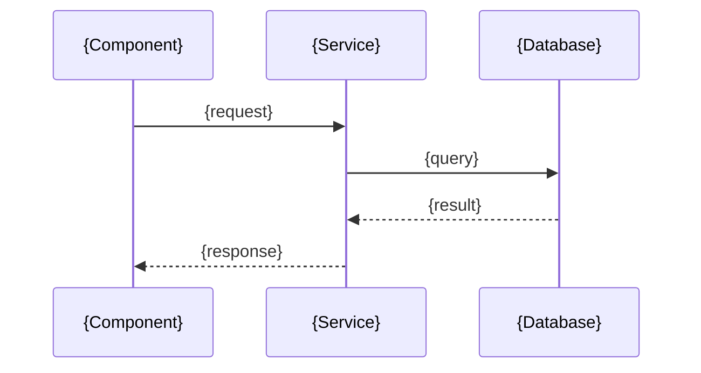
```mermaid
sequenceDiagram
    participant A as {Component}
    participant B as {Service}
    participant C as {Database}

    A->>B: {request}
    B->>C: {query}
    C-->>B: {result}
    B-->>A: {response}
```

---

## 13. Critical Invariants & Safety Rules

{For each invariant (8-15): What, Why, Where Enforced, Common Violation Pattern.}

### Data Safety

| Invariant | Why | Enforced At | Violation Pattern |
|-----------|-----|-------------|-------------------|
| {rule} | {consequence} | `{file}:{line}` | {how broken} |

### Security

| Invariant | Why | Enforced At | Violation Pattern |
|-----------|-----|-------------|-------------------|
| {rule} | {consequence} | `{file}:{line}` | {how broken} |

### Concurrency

| Invariant | Why | Enforced At | Violation Pattern |
|-----------|-----|-------------|-------------------|
| {rule} | {consequence} | `{file}:{line}` | {how broken} |

---

## 14. Security Architecture

### Authentication

{How identity is established: JWT, OAuth, API keys, certificates.}

### Authorization

{Where permission checks happen: middleware, service layer, decorators.}

### Data Sanitization

{Input validation boundaries and sanitization logic.}

### Secrets Management

{How keys/credentials are loaded: env vars, Vault, cloud secrets manager.}

### Network Security

{TLS termination, mTLS, allowlists/blocklists.}

---

## 15. Observability & Telemetry

### Logging

- **Framework**: {logger}
- **Structured Keys**: `{key1}`, `{key2}`, `{key3}`
- **Log Levels**: {when each level is used}

### Distributed Tracing

- **Spans**: {where trace context is extracted/injected}
- **Propagation**: {mechanism}

### Metrics

| Metric | Type | Purpose |
|--------|------|---------|
| `{name}` | {counter/gauge/histogram} | {purpose} |

### Health Checks

- **Liveness**: `{endpoint}`
- **Readiness**: `{endpoint}`

### Debug Surfaces

| Surface | Type | Access | Purpose |
|---------|------|--------|---------|
| `{endpoint/flag/tool}` | {HTTP endpoint/CLI flag/env var/REPL} | {local/authenticated/admin} | {purpose} |

{Document how developers inspect runtime state: debug endpoints, verbose logging modes, REPL access, profiling hooks, memory dumps, thread dumps.}

---

## 16. Error Handling & Failure Modes

### Error Propagation Model

{Return codes, exceptions, Result monads, error protos.}

```{language}
// Canonical error handling pattern
{actual code example from codebase}
```

### Retry Semantics

| Operation | Policy | Backoff | Max Attempts |
|-----------|--------|---------|--------------|
| `{op}` | {policy} | {backoff} | {N} |

### Common Failure Modes

| Scenario | Symptoms | Root Cause | Recovery |
|----------|----------|------------|----------|
| {scenario} | {symptoms} | {cause} | {recovery} |

### Graceful Degradation

{Behavior when dependencies unavailable.}

### Error Propagation Paths

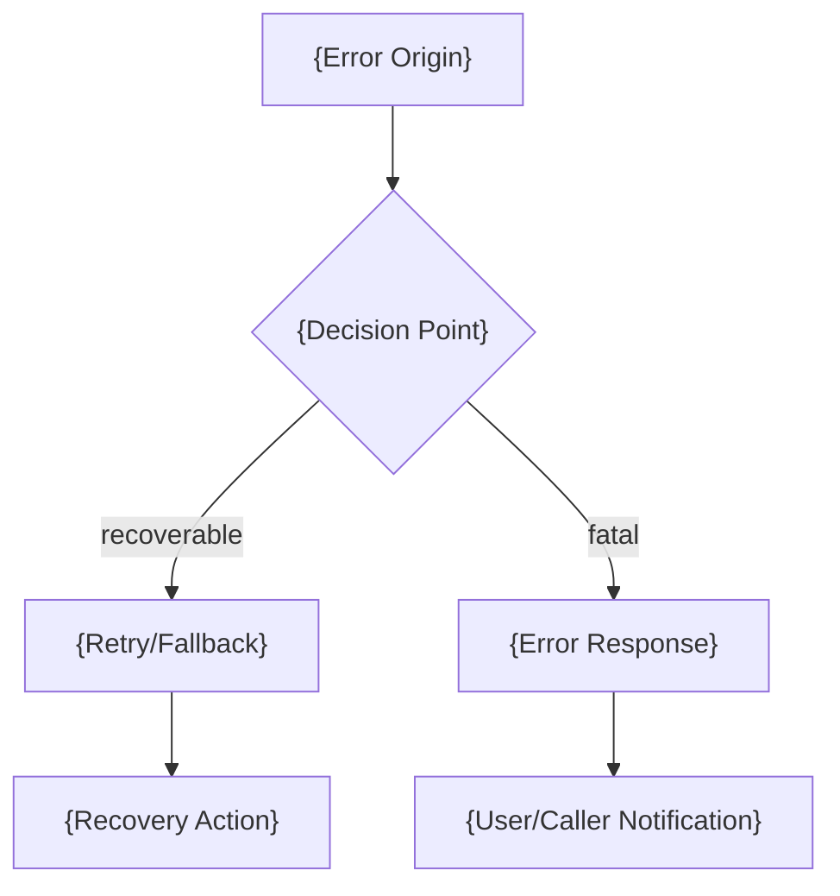
```mermaid
flowchart TD
    A["{Error Origin}"] --> B{"{Decision Point}"}
    B -->|"recoverable"| C["{Retry/Fallback}"]
    B -->|"fatal"| D["{Error Response}"]
    C --> E["{Recovery Action}"]
    D --> F["{User/Caller Notification}"]
```

{For each major error category, trace the path from origin through handlers to final disposition. Show where errors are caught, transformed, logged, and surfaced.}

| Error Category | Origin | Propagation Path | Final Handler | User-Visible Effect |
|---------------|--------|------------------|---------------|---------------------|
| `{category}` | `{file}:{line}` | {module} → {module} → {module} | `{handler}` | {effect} |

---

## 17. State Management & Persistence

### State Inventory

| State | Storage | Durability | Recovery |
|-------|---------|------------|----------|
| {state} | {storage} | {durability} | {recovery} |

### Persistence Formats

{What is serialized, where, in what format: protobuf, JSON, SQL rows.}

### Recovery Sequences

{What happens on crash-restart, how state is reconstructed.}

### Schema Migration

{How persistent state evolves across versions.}

---

## 18. Key Design Patterns

### 18.1 {Pattern Name}

{2-4 sentence description of the pattern and how it is applied.}

```{language}
// {Pattern implementation}
{actual code from codebase}
```

**Used in**: `{file1}`, `{file2}`

---

## 19. Configuration & Tuning

### Key Parameters

| Parameter | Default | Purpose |
|-----------|---------|---------|
| `{param}` | `{value}` | {purpose} |

### Scheduling Configuration

{How recurring work is configured: cron, intervals, tickers.}

### Environment Variable Hierarchy

{Document the precedence order for configuration resolution.}

| Priority | Source | Example | Override Behavior |
|----------|--------|---------|-------------------|
| 1 (highest) | {e.g., CLI flags} | `--port=3000` | {overrides all} |
| 2 | {e.g., Environment variables} | `PORT=3000` | {overrides file-based config} |
| 3 | {e.g., Config file} | `config.yaml` | {overrides defaults} |
| 4 (lowest) | {e.g., Code defaults} | `const PORT = 8080` | {fallback} |

### Feature Flags

| Flag | Default | Source | Runtime Toggleable | Purpose |
|------|---------|--------|-------------------|---------|
| `{flag}` | {on/off} | {env/config/remote} | {Yes/No} | {purpose} |

{Document the feature flag system: how flags are defined, evaluated, and toggled. Include any remote configuration services (LaunchDarkly, Split, etc.).}

### Deployment-time vs Runtime Configuration

| Parameter | When Resolved | Can Change At Runtime | Restart Required |
|-----------|--------------|----------------------|-----------------|
| `{param}` | {build/deploy/startup/runtime} | {Yes/No} | {Yes/No} |

{Distinguish between configuration that is baked at build time, set at deployment, loaded at startup, or dynamically changeable at runtime.}

### Config Code

```{language}
// Configuration schema/struct
{actual code}
```

---

## 20. Performance Characteristics & Hot Paths

### Hot Paths

- `{file}:{function}` — {why critical}

### Scaling Dimensions

| Dimension | Scales With | Bottleneck |
|-----------|-------------|------------|
| {dimension} | {factor} | {bottleneck} |

### Memory Profile

{Large memory consumers, budgets, OOM risks.}

### I/O Patterns

{Disk I/O, network I/O, database queries characteristics.}

---

## 21. How to Extend — Step-by-Step Cookbooks

### 21.1 Adding a New {ExtensionType}

1. **Create file**: `{path}` (naming: `{convention}`)
2. **Implement interface**:
   - Required: `{method1}()`, `{method2}()`
   - Optional: `{method3}?()`
3. **Register**: Add to `{registry_file}` via `{mechanism}`
4. **Build dependencies**: {instructions}
5. **Configuration**: {if any}
6. **Tests**: Create `{test_path}` covering {scenarios}

**Minimal working example**:

```{language}
{simplest implementation that compiles/runs}
```

---

## 22. Build System & Development Workflow

### Build System

{Bazel, CMake, npm, Cargo, Maven, etc.}

### Key Targets

| Target | Type | What It Does |
|--------|------|--------------|
| `{target}` | {type} | {description} |

### How to Build

- **Full**: `{command}`
- **Single component**: `{command}`
- **Debug mode**: `{command}`

### How to Test

- **Full suite**: `{command}`
- **Single test**: `{command}`
- **With coverage**: `{command}`

### How to Run Locally

```bash
{commands to run locally}
```

### Common Build Issues

- {issue 1}: {solution}

### Code Style

{File naming, function naming, package naming conventions.}

### CI/CD

{What runs in pre-submit, what runs nightly.}

---

## 23. Testing Infrastructure

### Framework

{GTest, pytest, Jest, JUnit, etc.}

### Test Patterns

- {Mock/stub injection points}
- {In-memory substitutes}
- {Test data builders/fixtures}
- {Integration test setup}

### Test-to-Feature Mapping

| Feature | Test Suite |
|---------|------------|
| {feature} | `{test_path}` |

### Coverage Expectations

{What should be tested for new code.}

---

## 24. Known Technical Debt & Limitations

### Deprecated Code

| Component | Status | Migration Path |
|-----------|--------|----------------|
| `{component}` | {status} | {path} |

### Known Workarounds

- `{file}:{line}` — {TODO/FIXME description}

### Scaling Limitations

{Known ceilings and their causes.}

### Complexity Hotspots

| Location | Issue | Severity |
|----------|-------|----------|
| `{file}` | {issue} | {High/Med/Low} |

### High Churn Files

{Identify files with the highest commit frequency — these are change hotspots that warrant extra test coverage and review attention.}

| File | Commits (Last 6 Months) | Reason for Churn | Risk |
|------|------------------------|------------------|------|
| `{file}` | {N} | {frequent bug fixes/feature additions/config changes} | {High/Med/Low} |

### Fragile Area Risk Map

{Identify areas where changes frequently cause cascading failures or regressions.}

| Area | Fragility Indicator | Blast Radius | Mitigation |
|------|---------------------|-------------|------------|
| `{module/file}` | {tight coupling/shared state/implicit contracts/no tests} | {local/cross-module/system-wide} | {test coverage/interface stabilization/decoupling} |

---

## 25. Glossary

| Term | Definition |
|------|------------|
| {term} | {1-2 sentence definition} |

---

## 26. Domain Model

### 26.1 Core Entities & Relationships

```mermaid
erDiagram
    {ENTITY_A} ||--o{ {ENTITY_B} : "{relationship}"
    {ENTITY_B} }|--|| {ENTITY_C} : "{relationship}"
    {ENTITY_A} ||--|| {ENTITY_D} : "{relationship}"
```

| Entity | Definition | Key Attributes | Lifecycle |
|--------|-----------|----------------|-----------|
| `{Entity}` | {what it represents in the domain} | `{attr1}`, `{attr2}`, `{attr3}` | {created → active → archived/deleted} |

### 26.2 Domain Invariants & Constraints

| Invariant | Entities Involved | Enforcement Location | Violation Consequence |
|-----------|-------------------|---------------------|----------------------|
| {rule} | `{Entity}`, `{Entity}` | `{file}:{line}` | {data corruption/invalid state/business rule violation} |

### 26.3 Business Logic vs Infrastructure Boundaries

{Identify where business rules live vs infrastructure/plumbing code. This enables safe refactoring — infrastructure can be swapped without touching business logic.}

| Layer | Responsibility | Key Files | Depends On |
|-------|---------------|-----------|------------|
| Domain / Business Logic | {core rules, validation, calculations} | `{files}` | {nothing external — pure logic} |
| Application / Use Cases | {orchestration, workflows, transactions} | `{files}` | {domain layer} |
| Infrastructure | {DB, HTTP, messaging, file I/O} | `{files}` | {application layer} |
| Presentation | {API routes, CLI handlers, UI} | `{files}` | {application layer} |

### 26.4 Aggregate Boundaries

{For DDD-style architectures: identify aggregate roots and their boundaries. For non-DDD: identify transactional consistency boundaries — groups of entities that must change together atomically.}

| Aggregate / Boundary | Root Entity | Contains | Consistency Rule |
|---------------------|-------------|----------|-----------------|
| `{name}` | `{entity}` | `{entity1}`, `{entity2}` | {must be updated atomically / eventual consistency} |

---

## 27. Execution Flow Mapping

### 27.1 End-to-End Request Lifecycle

{Trace the complete lifecycle of a primary request from entry point through processing to response.}

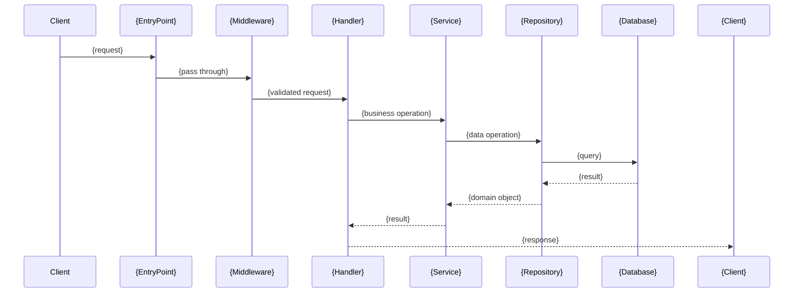
```mermaid
sequenceDiagram
    participant Client
    participant {EntryPoint}
    participant {Middleware}
    participant {Handler}
    participant {Service}
    participant {Repository}
    participant {Database}

    Client->>{EntryPoint}: {request}
    {EntryPoint}->>{Middleware}: {pass through}
    {Middleware}->>{Handler}: {validated request}
    {Handler}->>{Service}: {business operation}
    {Service}->>{Repository}: {data operation}
    {Repository}->>{Database}: {query}
    {Database}-->>{Repository}: {result}
    {Repository}-->>{Service}: {domain object}
    {Service}-->>{Handler}: {result}
    {Handler}-->>{Client}: {response}
```

### 27.2 Control Flow Paths

#### Happy Path

| Step | Component | Action | Output |
|------|-----------|--------|--------|
| 1 | `{component}` | {action} | {output} |
| 2 | `{component}` | {action} | {output} |

#### Failure Paths

| Failure Point | Error Type | Handler | Recovery | User Effect |
|--------------|-----------|---------|----------|-------------|
| `{component}` | {error type} | `{handler}` | {retry/fallback/abort} | {error message/degraded service/timeout} |

#### Retry & Fallback Flows

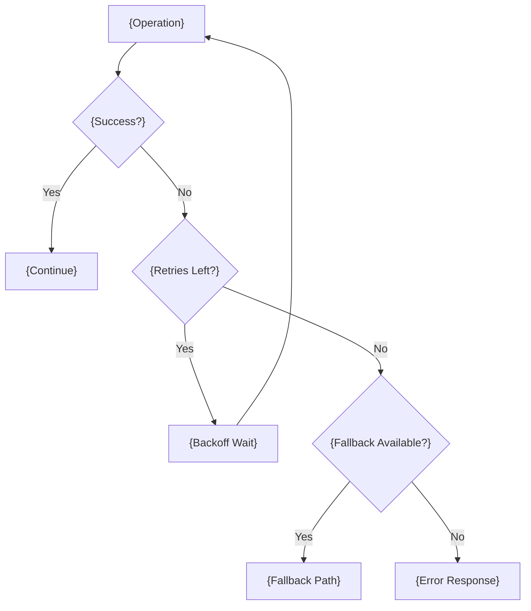
```mermaid
flowchart TD
    A["{Operation}"] --> B{"{Success?}"}
    B -->|"Yes"| C["{Continue}"]
    B -->|"No"| D{"{Retries Left?}"}
    D -->|"Yes"| E["{Backoff Wait}"] --> A
    D -->|"No"| F{"{Fallback Available?}"}
    F -->|"Yes"| G["{Fallback Path}"]
    F -->|"No"| H["{Error Response}"]
```

### 27.3 State Transitions

{For stateful systems: document all valid state transitions and their triggers.}

```mermaid
stateDiagram-v2
    [*] --> {InitialState}
    {InitialState} --> {State2}: {trigger}
    {State2} --> {State3}: {trigger}
    {State2} --> {ErrorState}: {failure}
    {State3} --> [*]: {completion}
    {ErrorState} --> {State2}: {retry}
    {ErrorState} --> [*]: {abandon}
```

| From State | To State | Trigger | Guard Condition | Side Effects |
|-----------|----------|---------|-----------------|-------------|
| `{state}` | `{state}` | {event} | {condition} | {actions performed during transition} |

---

## 28. Interaction Surfaces

### 28.1 Service-to-Service Communication

| Source | Target | Protocol | Pattern | Payload | SLA |
|--------|--------|----------|---------|---------|-----|
| `{service}` | `{service}` | {REST/gRPC/AMQP/WebSocket/GraphQL} | {sync/async/pub-sub/request-reply} | {format} | {latency/throughput} |

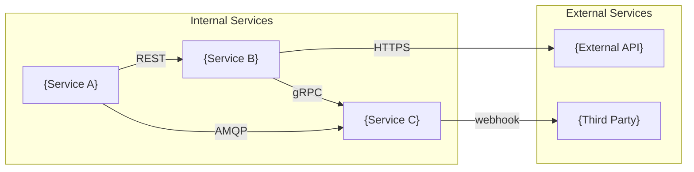
```mermaid
graph LR
    subgraph Internal["Internal Services"]
        A["{Service A}"]
        B["{Service B}"]
        C["{Service C}"]
    end
    subgraph External["External Services"]
        D["{External API}"]
        E["{Third Party}"]
    end
    A -->|"REST"| B
    B -->|"gRPC"| C
    A -->|"AMQP"| C
    B -->|"HTTPS"| D
    C -->|"webhook"| E
```

### 28.2 External Integration Points

| Integration | Direction | Protocol | Auth Method | Rate Limit | Circuit Breaker |
|-------------|-----------|----------|-------------|------------|-----------------|
| `{service}` | {inbound/outbound/bidirectional} | {protocol} | {API key/OAuth/mTLS} | {limit} | {Yes/No — threshold} |

### 28.3 Human Interaction Layers

| Interface | Type | Users | Entry Point | Key Flows |
|-----------|------|-------|-------------|-----------|
| `{name}` | {CLI/Web UI/Mobile/Admin Panel/Config File} | {user type} | `{file/URL}` | {primary user flows} |

### 28.4 Event & Message Contracts

| Event/Message | Publisher | Subscriber(s) | Schema | Delivery Guarantee |
|---------------|-----------|---------------|--------|-------------------|
| `{event}` | `{module}` | `{module1}`, `{module2}` | `{schema file/type}` | {at-most-once/at-least-once/exactly-once} |

---

## Appendix A: File Structure Summary

```
{project}/
├── {dir}/                 ← {description}
│   ├── {subdir}/          ← {description}
│   └── {file}             ← {description}
└── {dir}/                 ← {description}
```

---

## Appendix B: Data Source → Implementation Mapping

| Data Source | Implementations Reading It |
|-------------|---------------------------|
| `{source}` | `{impl1}`, `{impl2}` |

---

## Appendix C: Output Flow — Implementation to Target

| Implementation | Output Type | Target |
|----------------|-------------|--------|
| `{impl}` | {type} | `{target}` |

---

## Appendix D: Mermaid Sequence Diagrams — Critical Flows

### {Flow Name}

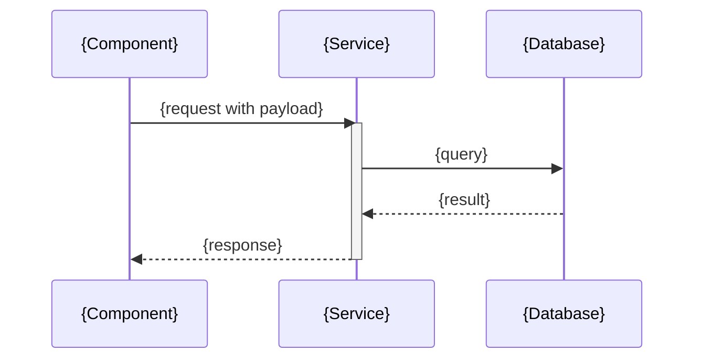
```mermaid
sequenceDiagram
    participant A as {Component}
    participant B as {Service}
    participant C as {Database}

    A->>B: {request with payload}
    activate B
    B->>C: {query}
    C-->>B: {result}
    B-->>A: {response}
    deactivate B
```

---

## Appendix E: Dependency Graph Visualization

### Internal Module Dependencies (Layered)

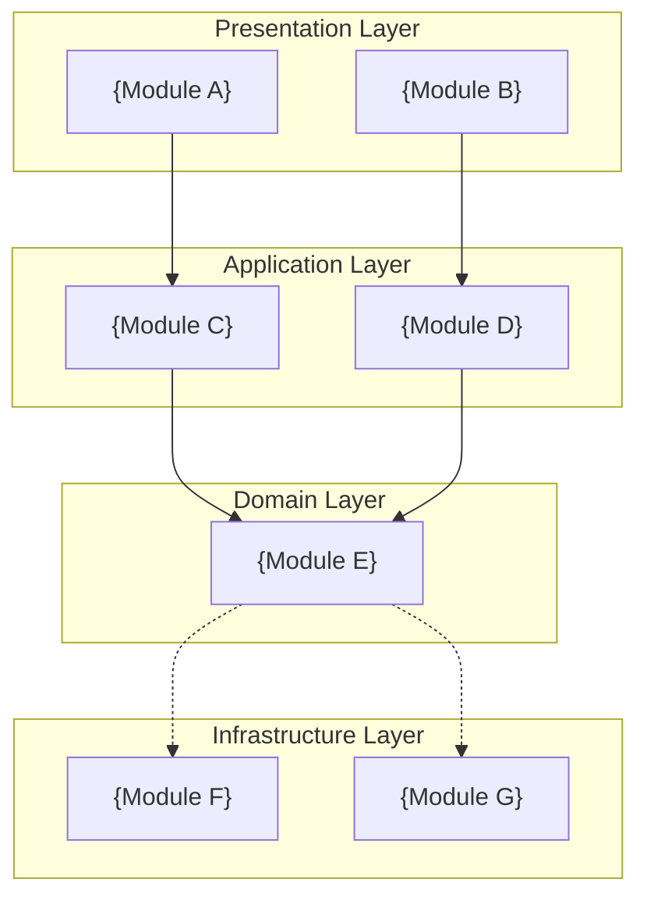
```mermaid
graph TD
    subgraph Layer1["Presentation Layer"]
        A["{Module A}"]
        B["{Module B}"]
    end
    subgraph Layer2["Application Layer"]
        C["{Module C}"]
        D["{Module D}"]
    end
    subgraph Layer3["Domain Layer"]
        E["{Module E}"]
    end
    subgraph Layer4["Infrastructure Layer"]
        F["{Module F}"]
        G["{Module G}"]
    end
    A --> C
    B --> D
    C --> E
    D --> E
    E -.-> F
    E -.-> G
```

### Adjacency Matrix (Internal)

| Module | Depends On | Depended By | Coupling Score |
|--------|-----------|-------------|---------------|
| `{module}` | `{dep1}`, `{dep2}` | `{dep1}`, `{dep2}` | {High/Med/Low} |

### External Dependency Graph

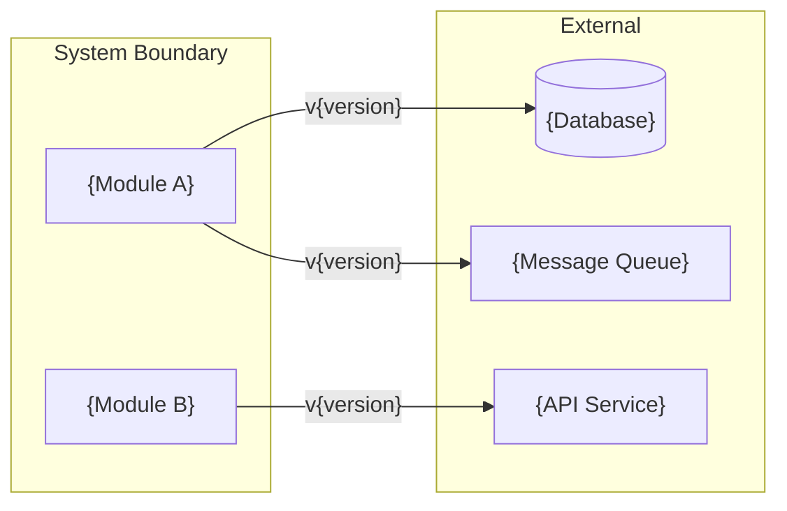
```mermaid
graph LR
    subgraph System["System Boundary"]
        A["{Module A}"]
        B["{Module B}"]
    end
    subgraph External["External"]
        C[("{Database}")]
        D["{API Service}"]
        E["{Message Queue}"]
    end
    A -->|"v{version}"| C
    B -->|"v{version}"| D
    A -->|"v{version}"| E
```

| External Dependency | Version | Constraint | Consumers | Upgrade Risk |
|--------------------|---------|------------|-----------|-------------|
| `{dep}` | `{version}` | {pinned/range/latest} | `{modules}` | {breaking changes/deprecation/none} |

---

## Appendix F: Context Index

{Machine-navigable index mapping every significant file to its role, dependencies, and entry points. This enables deterministic lookup: given a file, know exactly what it does and what depends on it.}

| File | Responsibility | Module | Depends On | Depended By | Entry Points | Test Coverage |
|------|---------------|--------|-----------|-------------|-------------|--------------|
| `{path}` | {5-10 word description} | `{module}` | `{file1}`, `{file2}` | `{file1}`, `{file2}` | {CLI/API/scheduler/none} | `{test_file}` |

### Responsibility Categories

| Category | Files | Description |
|----------|-------|-------------|
| Entry Point | `{files}` | {application entry, CLI handlers, API route registration} |
| Business Logic | `{files}` | {core domain logic, validation, calculations} |
| Data Access | `{files}` | {repositories, ORM models, query builders} |
| Infrastructure | `{files}` | {HTTP clients, message producers, file I/O} |
| Configuration | `{files}` | {config loading, env parsing, feature flags} |
| Testing | `{files}` | {test utilities, fixtures, mocks} |
| Build/Deploy | `{files}` | {CI/CD, Dockerfiles, scripts} |

---

End of analysis. For AI-optimized context, see `draft/.ai-context.md`.
