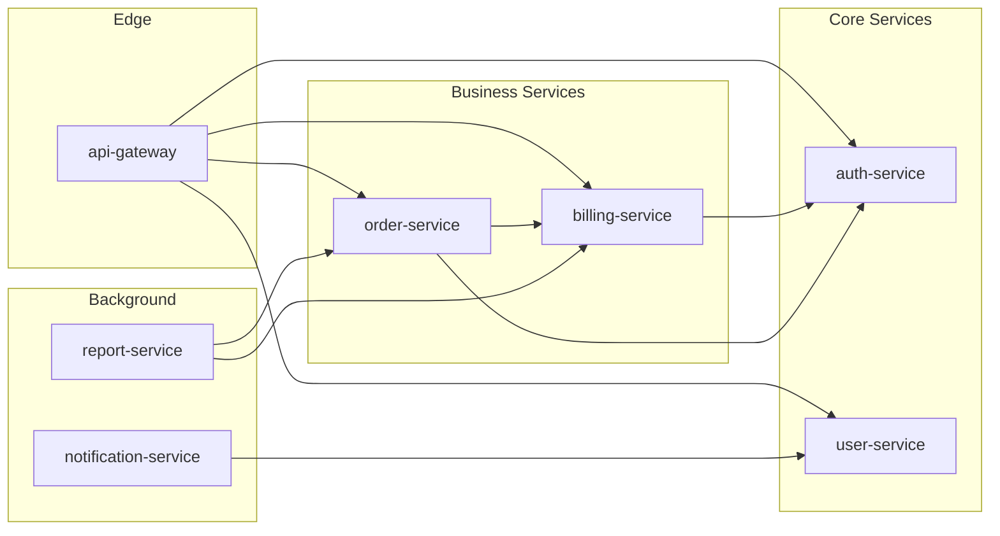

# Service Dependency Graph

| Field | Value |
|-------|-------|
| **Branch** | `{LOCAL_BRANCH}` → `{REMOTE/BRANCH}` |
| **Commit** | `{SHORT_SHA}` — {COMMIT_MESSAGE} |
| **Generated** | {ISO_TIMESTAMP} |
| **Synced To** | `{FULL_SHA}` |

> Auto-generated. Do not edit directly.
> Re-run `/draft:index` to update.

---

## System Topology

> Services without `draft/` are shown with dashed borders when detected.

## Dependency Matrix

| Service | Depends On | Depended By | Circular? |
|---------|-----------|-------------|-----------|
| auth-service | - | billing, orders, gateway | No |
| user-service | auth | gateway, notifications | No |
| billing-service | auth | orders, gateway, reports | No |
| order-service | auth, billing | gateway, reports | No |
| api-gateway | auth, users, billing, orders | - | No |
| notification-service | users | - | No |
| report-service | billing, orders | - | No |

## Dependency Order (Topological)

Build/deploy order for cross-service changes:

1. **auth-service** — foundational, no internal dependencies
2. **user-service** — depends on: auth
3. **billing-service** — depends on: auth
4. **order-service** — depends on: auth, billing
5. **notification-service** — depends on: users
6. **report-service** — depends on: billing, orders
7. **api-gateway** — depends on: auth, users, billing, orders (deploy last)

> This ordering helps when planning cross-service changes, understanding blast radius, or sequencing deployments.

## Impact Analysis

When modifying a service, these services may be affected:

| If You Change... | Check These Services |
|------------------|---------------------|
| auth-service | billing, orders, gateway, users |
| billing-service | orders, gateway, reports |
| user-service | gateway, notifications |

## External Dependencies

Services depending on external systems:

| External System | Used By | Purpose |
|----------------|---------|---------|
| [Stripe] | billing-service | Payment processing |
| [SendGrid] | notification-service | Email delivery |
| [AWS S3] | report-service | Report storage |
