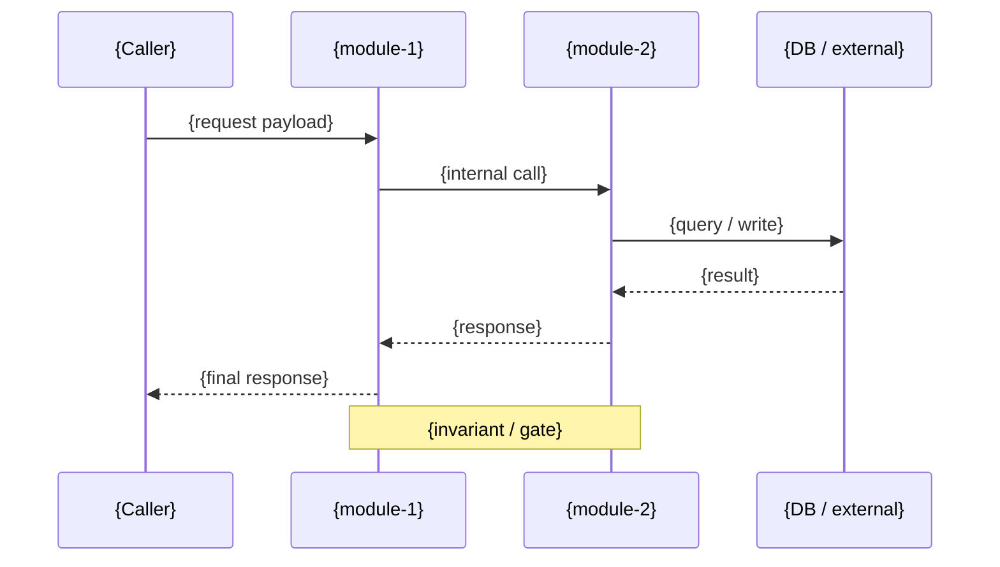

# {TRACK_TITLE} — LLD

**_TBD_author_** (_TBD_email_) <!-- REQUIRED -->

**Status:** <!-- META:status --> <!-- REQUIRED -->

> Track ID: `{TRACK_ID}` — generated by `draft:decompose`. Sibling docs: [`./hld.md`](./hld.md), [`./spec.md`](./spec.md), [`./plan.md`](./plan.md). For project-wide architecture, see [`../../architecture.md`](../../architecture.md).

## Approvals

> **Pre-fill:** Pulled from `spec.md` frontmatter `approvers.{team_leads, tech_leads, qa}`. Captured per row before code review begins.

| Role | Approver | Date | Comments | <!-- REQUIRED for criticality ∈ {high, mission-critical} -->
|------|----------|------|----------|
| Team Leads | _TBD_approver_team_leads_ | _TBD_date_ | _TBD_comments_ |
| Technical Leads | _TBD_approver_tech_leads_ | _TBD_date_ | _TBD_comments_ |
| Quality Assurance | _TBD_approver_qa_ | _TBD_date_ | _TBD_comments_ |

---

## Table of Contents

1. [Background](#background)
2. [Requirements](#requirements)
3. [Low Level Design](#low-level-design)
4. [Observability](#observability)

---

## Background

<Link to HLD and explain context here>

> See [`./hld.md` §Background](./hld.md#background) for the high-level rationale. Use this section only for component-internal context the HLD doesn't cover.

> **Citations.** Use `path/to/file.ext:LINE` (or `LINE-RANGE`); verifier:
> `scripts/tools/verify-citations.sh`. Prefer `// DRAFT-CITE: <id>` source
> anchors over raw line numbers for code that moves often.

---

## Requirements

> **Source:** [`./spec.md`](./spec.md). Whitebox (per-component) requirements live there. Do not duplicate.

- **Whitebox requirements scorecard:** see [`./spec.md` §Requirements](./spec.md#requirements)
- **Acceptance criteria mapped to this LLD:** {list AC IDs covered by this LLD}

---

## Low Level Design

> **NOTE:**
> - HLD and Detailed Design covers components and interactions across various services that the feature touches
> - LLD to be documented here is for each such component and internal implementation
> - A single doc here can cover all components, or they can be split up, but the key is to ensure every component in every service the design touches has an LLD

### Classes and Interfaces

**Describe the class level design preferably with a diagram**

- This should convey what interfaces each class provides and how it interacts with other classes
- Describe choice of message queues vs RPCs for interactions

<!-- GRAPH:track-class-table:START -->
<!-- Rendered by draft:decompose Step 5b for each module marked New/Modified.
     Per-module table. Columns: Symbol, Kind (class/iface/func/method),
     Signature, Visibility, Citation, Concurrency Notes, lock_acquired,
     reentrant. -->
<!-- WS-7 required columns: lock_acquired (named lock or "none"),
     reentrant (yes/no/n/a). -->
<!-- GRAPH:track-class-table:END -->

#### [Component/Service Name]

**Public API:**

| Function / Method | Signature | Params | Returns | Errors / Exceptions | Citation |
|-------------------|-----------|--------|---------|---------------------|----------|
| `{name}` | `{lang-appropriate signature}` | `{param: type — constraint}` | `{type — shape}` | `{error types / codes}` | `path:line` |

**Preconditions:** {what must be true before call — caller responsibilities}
**Postconditions:** {what is guaranteed after successful call}
**Invariants:** {properties preserved across calls — thread safety, idempotency, ordering}

{Repeat per component.}

---

### Data Model

**Describe the schemas of persistent state - protobuf or db schemas**

- Describe the schemas of messages / RPCs
- Describe caching considerations

<!-- GRAPH:track-data-models:START -->
<!-- Rendered by draft:decompose Step 5b. One block per new/modified entity.
     Pulls proto/struct/class declarations + field metadata from the graph. -->
<!-- GRAPH:track-data-models:END -->

#### [Component/Service Name]

**`{ModelName}`** (`path:line`)

```{language}
{actual type definition — struct, class, interface, proto message, TypedDict, etc.}
```

| Field | Type | Nullable | Default | Validation / Constraint |
|-------|------|----------|---------|-------------------------|
| `{field}` | `{type}` | yes/no | `{default or —}` | `{rule}` |

**Storage:** {where persisted — table, collection, key prefix}
**Indexes / Keys:** {primary key, unique constraints, indexed fields}
**Migration:** {if this is a schema change — migration path and rollback}

{Repeat per model.}

---

### Eligibility / Cap Tables <!-- OPTIONAL -->

> When the LLD specifies caps (byte limits, row limits, concurrency caps),
> use this schema. Every cap value carries `derived_from` (a flag, threshold,
> benchmark, or vendor limit). Pure invention without `derived_from` is
> rejected by the deploy-checklist gate.

| Cap | Value | derived_from | Notes | <!-- REQUIRED if section present -->
|-----|-------|--------------|-------|
| _TBD_cap_1_name_ | _TBD_cap_1_value_ | _TBD_cap_1_derived_from_ | _TBD_cap_1_notes_ |

---

### Key Algorithms and Workflows

**Describe certain key algorithms / workflows**

> **WS-7 sequence-diagram rule.** When the prose enumerates edge cases (cap
> exceeded, OOM, flag flip mid-flow, retry exhausted), the Mermaid sequence
> diagram **must** include an explicit `alt` / `opt` block per edge case.
> `Note over X,Y: ... TBD policy ...` is **not** sufficient. Reviewers and
> deploy-checklist fail on bare prose without diagram blocks.

Examples:
- List of steps to failover a multi-region database cluster
- Analysis phase of a background data indexing service
- Transferring session state information between authentication and profile services via a secure messaging protocol

#### [Algorithm/Workflow Name]

**Inputs:** `{...}`
**Outputs:** `{...}`
**Complexity:** `O({...})` time, `O({...})` space



**Pseudocode:**

```
1. validate inputs
2. ...
3. return result
```

**Edge cases handled:**
- {case 1 — what happens}
- {case 2 — what happens}

---

### Error Handling & Retry Semantics

| Operation | Error Class | Classification | Retry? | Backoff | Max Attempts | Fallback | fault_injection_site | <!-- REQUIRED -->
|-----------|-------------|----------------|--------|---------|--------------|----------|----------------------|
| _TBD_err_1_op_ | _TBD_err_1_class_ | _TBD_err_1_classification_ | _TBD_err_1_retry_ | _TBD_err_1_backoff_ | _TBD_err_1_max_attempts_ | _TBD_err_1_fallback_ | _TBD_err_1_fault_injection_site_ |

**Propagation model:** {Result type / exceptions / error codes}
**Circuit breaker:** {thresholds, half-open policy, reset} — omit if N/A
**Idempotency:** {which operations are idempotent and how — dedup key, tx id}

---

### Refactoring of Existing Code

<Describe if large sections of existing code is being refactored, and why (e.g., not modular and hence can't be reused; can't write UTs well as interfaces are not defined cleanly)>

---

### Programming Language Choice and Unit Testing

#### Programming Language Choice

<Describe Programming Language choice and justification>

#### Unit Testing Strategy

- **Mock Interfaces:**
  - How mock interfaces are going to be implemented and used in UTs
  
- **Functional Test Cases:**
  - What are major cases to be UT'd functionally
  
- **Error & Fault Injection:**
  - How errors & faults are injected
  
- **Race Condition Simulation:**
  - How race conditions are simulated

> See `/draft:testing-strategy` for the project's authoritative test strategy. This LLD section captures only what is specific to this track's components.

---

### PaaS Choices

<Describe the choices made in each of the following areas with justification:>

#### Data Store

- Relational vs NoSQL
- Justification

#### Workflow Engine

- (e.g., Temporal, etc.)
- Justification

#### Operational State Checkpointing Store

- (e.g., Scribe, Mongo, etc.)
- Justification

---

## Observability

### Metrics

List down all metrics that developers and SREs need to look at to identify issues:

- 
- 
- 

### Alerting Thresholds

List down alerting thresholds on those metrics:

| Metric | Threshold | Severity | Action |
|--------|-----------|----------|--------|
| | | | |

> `/draft:deploy-checklist` validates this table is populated before deploy.
