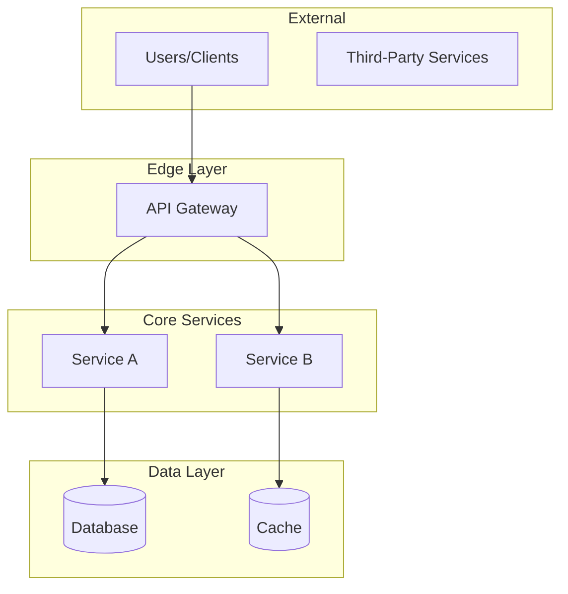
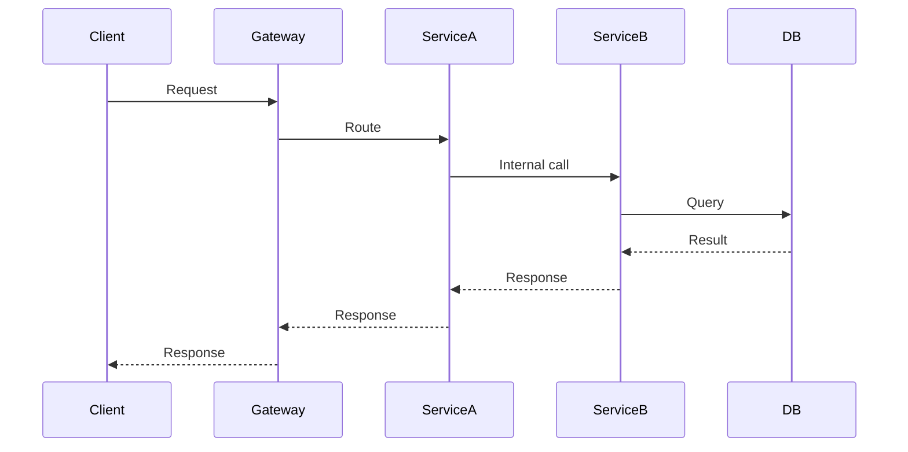

# Architecture: [Org/Product Name]

> Synthesized from [X] service contexts by `/draft:index` on [DATE].
> This is a **system-of-systems** view. For service internals, see individual service drafts.
> Re-running `/draft:index` will update auto-generated sections but preserve manual edits.

## System Overview

**Key Takeaway:** [One paragraph synthesizing overall system purpose from service summaries — what this platform does, who it serves, and its primary value proposition]

### System Topology

> Diagram auto-generated from service dependencies. Edit to add context.

## Service Directory

| Service | Responsibility | Tech | Status | Details |
|---------|---------------|------|--------|---------|
| [service-name] | [One-line responsibility] | [Primary tech] | ✓ Active | [→ architecture](../services/[name]/draft/architecture.md) |

> **Status:** ✓ Active = initialized and maintained, ○ Legacy = initialized but deprecated, ? = not initialized

## Shared Infrastructure

<!-- Extracted from common external dependencies across services -->

| Component | Purpose | Used By |
|-----------|---------|---------|
| [PostgreSQL] | [Primary datastore] | [service-a, service-b] |
| [Redis] | [Caching, sessions] | [service-a, service-c] |
| [RabbitMQ] | [Async messaging] | [service-b, service-d] |

## Cross-Service Patterns

<!-- Extracted from common conventions across service architecture.md files -->

| Pattern | Description | Services |
|---------|-------------|----------|
| [JWT Auth] | [All services validate JWT via auth-service] | [all] |
| [Event-Driven] | [Async events via message queue] | [notifications, reports] |

## Data Flows

### [Primary Flow Name]

> Add primary cross-service data flows here.

<!-- MANUAL START -->
## Architectural Decisions

[Document key architectural decisions, trade-offs, and rationale here — preserved on re-index]

### ADR-001: [Decision Title]

**Context:** [Why this decision was needed]
**Decision:** [What was decided]
**Consequences:** [Impact of the decision]

<!-- MANUAL END -->

## Notes

- For detailed service architecture, navigate to individual service drafts via the Details column
- This file is regenerable via `/draft:index`
- Manual edits between `<!-- MANUAL START -->` and `<!-- MANUAL END -->` are preserved
