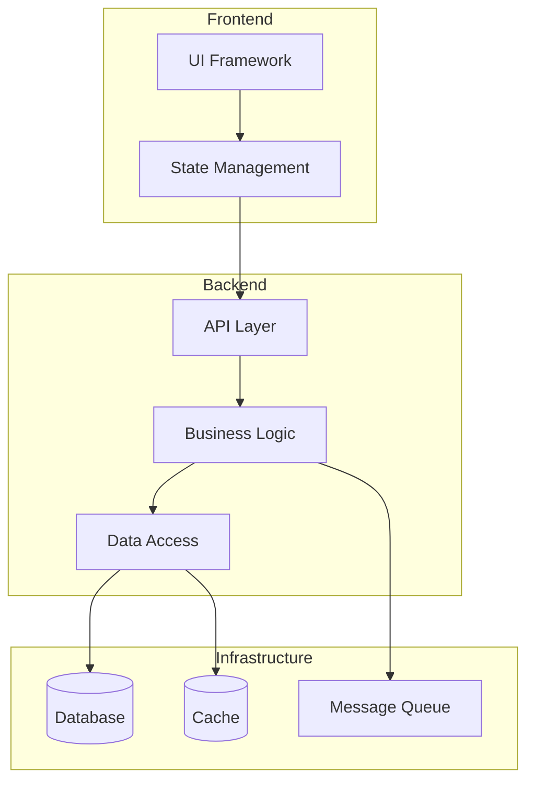

# Tech Stack

| Field | Value |
|-------|-------|
| **Branch** | `{LOCAL_BRANCH}` → `{REMOTE/BRANCH}` |
| **Commit** | `{SHORT_SHA}` — {COMMIT_MESSAGE} |
| **Generated** | {ISO_TIMESTAMP} |
| **Synced To** | `{FULL_SHA}` |

---

## Languages

| Language | Version | Purpose |
|----------|---------|---------|
| [Primary] | [Version] | Main application code |
| [Secondary] | [Version] | [Scripts/tooling/etc] |

---

## Frameworks & Libraries

### Core
| Name | Version | Purpose |
|------|---------|---------|
| [Framework] | [Version] | [Purpose] |
| [Library] | [Version] | [Purpose] |

### Development
| Name | Version | Purpose |
|------|---------|---------|
| [Tool] | [Version] | [Purpose] |

---

## Database

| Type | Technology | Purpose |
|------|------------|---------|
| Primary | [DB Name] | Main data storage |
| Cache | [Cache Name] | [If applicable] |
| Search | [Search Engine] | [If applicable] |

---

## Testing

| Level | Framework | Coverage Target |
|-------|-----------|-----------------|
| Unit | [Framework] | [80%+] |
| Integration | [Framework] | [Key flows] |
| E2E | [Framework] | [Critical paths] |

---

## Build & Deploy

### Build
- **Tool**: [Webpack/Vite/esbuild/etc]
- **Output**: [dist/build/etc]

### CI/CD
- **Platform**: [GitHub Actions/CircleCI/etc]
- **Triggers**: [on push, PR, etc]

### Deployment
- **Target**: [Vercel/AWS/GCP/etc]
- **Environments**: [dev, staging, prod]

---

## Code Patterns

### Architecture
- **Pattern**: [Clean Architecture/MVC/Hexagonal/etc]
- **Rationale**: [Why this pattern]

### State Management
- **Approach**: [Redux/Zustand/Context/etc]
- **Rationale**: [Why this approach]

### Error Handling
- **Strategy**: [Centralized/per-module/etc]
- **Logging**: [Tool/service]

### API Design
- **Style**: [REST/GraphQL/gRPC]
- **Conventions**: [Naming, versioning]

---

## Component Overview

> Replace with actual components and their relationships from the codebase. For detailed architecture analysis see `draft/.ai-context.md`.

---

## External Services

| Service | Purpose | Credentials Location |
|---------|---------|---------------------|
| [Service 1] | [Purpose] | [.env / secrets manager] |
| [Service 2] | [Purpose] | [.env / secrets manager] |

---

## Code Style

### Linting
- **Tool**: [ESLint/Prettier/etc]
- **Config**: [.eslintrc / prettier.config.js]

### Formatting
- **Indentation**: [2 spaces / 4 spaces / tabs]
- **Line Length**: [80 / 100 / 120]
- **Quotes**: [single / double]

### Naming Conventions
- **Files**: [kebab-case / camelCase / PascalCase]
- **Functions**: [camelCase]
- **Classes**: [PascalCase]
- **Constants**: [SCREAMING_SNAKE_CASE]

---

## Accepted Patterns

<!-- Intentional design decisions that may appear unusual but are correct -->
<!-- bughunt, validate, and review commands will honor these exceptions -->

| Pattern | Location | Rationale |
|---------|----------|-----------|
| [e.g., Empty catch blocks] | [src/resilient-loader.ts] | [Intentional silent failure for optional plugins] |
| [e.g., Circular import] | [moduleA ↔ moduleB] | [Lazy resolution pattern, not a bug] |
| [e.g., `any` type usage] | [src/legacy-adapter.ts] | [Bridging untyped legacy API] |

> Add patterns here that static analysis might flag but are intentional. Include enough context for reviewers to understand the decision.
