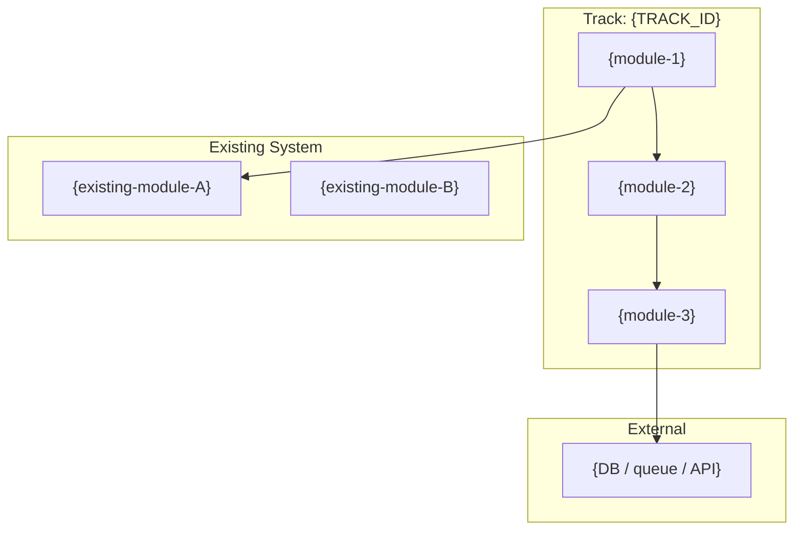
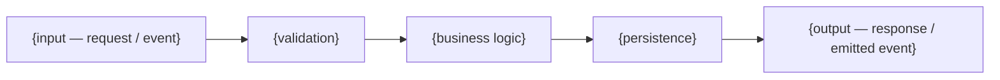
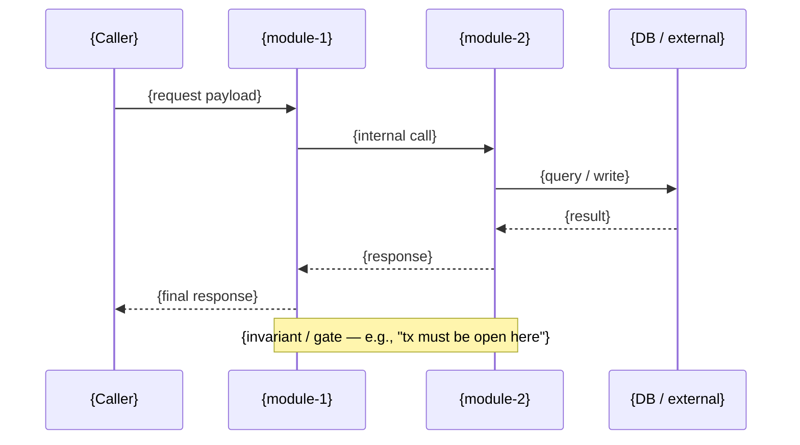
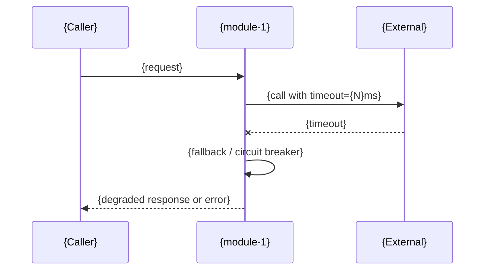
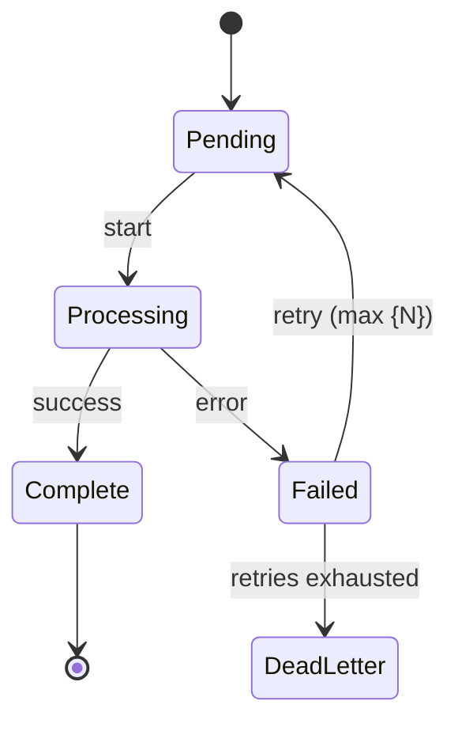

# Track Architecture: {TRACK_TITLE}

> Track-scoped HLD/LLD for a single feature, bug fix, or refactor.
> Source of truth for implementation — `/draft:implement` consumes this to guide build order, contracts, and story generation.
> For project-wide architecture, see `draft/architecture.md`.

| Field | Value |
|-------|-------|
| **Track ID** | `{TRACK_ID}` |
| **Spec** | `./spec.md` |
| **Plan** | `./plan.md` |
| **Branch** | `{LOCAL_BRANCH}` → `{REMOTE/BRANCH}` |
| **Commit** | `{SHORT_SHA}` — {COMMIT_MESSAGE} |
| **Generated** | {ISO_TIMESTAMP} |
| **LLD Included** | {true | false} |

---

## Table of Contents

1. [Overview](#1-overview)
2. [Module Breakdown](#2-module-breakdown)
3. [High-Level Design (HLD)](#3-high-level-design-hld)
   - 3.1 Component Diagram
   - 3.2 Data Flow
   - 3.3 Sequence Diagrams (Critical Flows)
   - 3.4 State Machine(s)
4. [Dependency Analysis](#4-dependency-analysis)
5. [Implementation Order](#5-implementation-order)
6. [Low-Level Design (LLD)](#6-low-level-design-lld)
   - 6.1 Per-Module API Contracts
   - 6.2 Data Models & Schemas
   - 6.3 Error Handling & Retry Semantics
   - 6.4 Algorithm Pseudocode (where non-trivial)
7. [Notes & Decisions](#7-notes--decisions)

---

## 1. Overview

**What this track delivers:** {one paragraph from spec.md — the feature, bug fix, or refactor being scoped}

**Inputs:** {what triggers or feeds into this feature}
**Outputs:** {what this feature produces — data, side effects, API responses}
**Constraints:** {latency, throughput, compatibility, security — anything from spec.md Non-Functional Requirements}

**Integration points:** {which existing modules from `draft/.ai-context.md` this track touches}

---

## 2. Module Breakdown

### Modules Introduced or Modified

For each module in scope, fill out one block:

#### Module: `{module-name}`

- **Status:** `[ ] New` | `[ ] Modified` | `[x] Existing (unchanged)`
- **Responsibility:** {one sentence — what this module owns}
- **Files:** `{path/to/file1}`, `{path/to/file2}`
- **API Surface:** {public functions, classes, or interfaces — names only, contracts in §6.1}
- **Dependencies:** {other modules this imports from}
- **Complexity:** `Low` | `Medium` | `High`
- **Story placeholder:** _populated by `/draft:implement`_

{Repeat for each module.}

---

## 3. High-Level Design (HLD)

### 3.1 Component Diagram

Shows modules in scope + the external collaborators they talk to.



> Draw one node per module in scope. Include existing modules only when this track calls into them. Label edges with the transport (HTTP, RPC, queue, direct call) when non-obvious.

### 3.2 Data Flow

End-to-end flow of data through the track's modules.



> Replace with the actual transforms. If the track has distinct read and write paths, draw them separately.

### 3.3 Sequence Diagrams — Critical Flows

One sequence per acceptance criterion that involves more than a single module call. Skip for trivial single-module tracks.

#### Flow: {name — e.g., "Happy path: user submits X"}



#### Flow: {error path — e.g., "Dependency timeout"}



### 3.4 State Machine(s)

Include only if the track introduces or modifies stateful entities. Omit otherwise.



---

## 4. Dependency Analysis

### ASCII Dependency Graph

```
[module-1] ──> [module-2]
    │              │
    └──> [module-3] <──┘
```

### Dependency Table

| Module | Depends On | Depended By | Cycle? |
|--------|------------|-------------|--------|
| `{mod}` | `{list}` | `{list}` | no |

### Cycle Mitigation

_If any cycles detected, describe how they are broken (shared interface extraction, dependency inversion, etc.). Otherwise: "No cycles detected."_

---

## 5. Implementation Order

Topological sort — leaves first.

1. `{module-A}` (no internal deps) — foundational
2. `{module-B}` (depends on: A)
3. `{module-C}` (depends on: A, B)

**Parallel opportunities:** {which modules can be built concurrently}

---

## 6. Low-Level Design (LLD)

> Present when `--lld` flag was passed to `/draft:decompose` OR any module in §2 has `Complexity: High`. Otherwise this section reads: _"LLD not generated. Run `/draft:decompose --lld` to expand."_

### 6.1 Per-Module API Contracts

For each module in §2 marked `New` or `Modified`:

#### `{module-name}` — Public API

| Function / Method | Signature | Params | Returns | Errors / Exceptions |
|-------------------|-----------|--------|---------|---------------------|
| `{name}` | `{lang-appropriate signature}` | `{param: type — constraint}` | `{type — shape}` | `{error types / codes}` |

**Preconditions:** {what must be true before call — caller responsibilities}
**Postconditions:** {what is guaranteed after successful call}
**Invariants:** {properties preserved across calls — thread safety, idempotency, ordering}

{Repeat per module.}

### 6.2 Data Models & Schemas

Concrete shapes for every new or modified entity this track introduces.

#### `{ModelName}`

```{language}
{actual type definition — struct, class, interface, proto message, TypedDict, etc.}
```

| Field | Type | Nullable | Default | Validation / Constraint |
|-------|------|----------|---------|-------------------------|
| `{field}` | `{type}` | yes/no | `{default or —}` | `{rule}` |

**Storage:** {where persisted — table, collection, key prefix}
**Indexes / Keys:** {primary key, unique constraints, indexed fields}
**Migration:** {if this is a schema change — migration path and rollback}

{Repeat per model.}

### 6.3 Error Handling & Retry Semantics

Per-operation policy. One row per operation that has non-trivial error handling.

| Operation | Error Class | Classification | Retry? | Backoff | Max Attempts | Fallback |
|-----------|-------------|----------------|--------|---------|--------------|----------|
| `{op}` | `{ErrorType}` | transient / permanent / timeout | yes/no | `{policy}` | `{N}` | `{behavior}` |

**Propagation model:** {how errors surface — Result type, exceptions, error codes}
**Circuit breaker:** {thresholds, half-open policy, reset} — omit if N/A
**Idempotency:** {which operations are idempotent and how — dedup key, tx id}

### 6.4 Algorithm Pseudocode

Include only for non-trivial logic. Skip for straightforward CRUD.

#### {Algorithm name}

**Inputs:** `{...}`
**Outputs:** `{...}`
**Complexity:** `O({...})` time, `O({...})` space

```
{numbered or indented pseudocode — language-agnostic}
1. validate inputs
2. ...
3. return result
```

**Edge cases handled:**
- {case 1 — what happens}
- {case 2 — what happens}

---

## 7. Notes & Decisions

### Architecture Decisions

- {decision 1 — rationale, alternatives considered}
- {decision 2 — rationale, alternatives considered}

### Open Questions

- {question tracked during decomposition — to resolve before or during implementation}

### Links

- Spec: `./spec.md`
- Plan: `./plan.md`
- Related ADRs: `{paths if any, created via /draft:adr}`
- Project architecture: `draft/.ai-context.md` → `draft/architecture.md`
