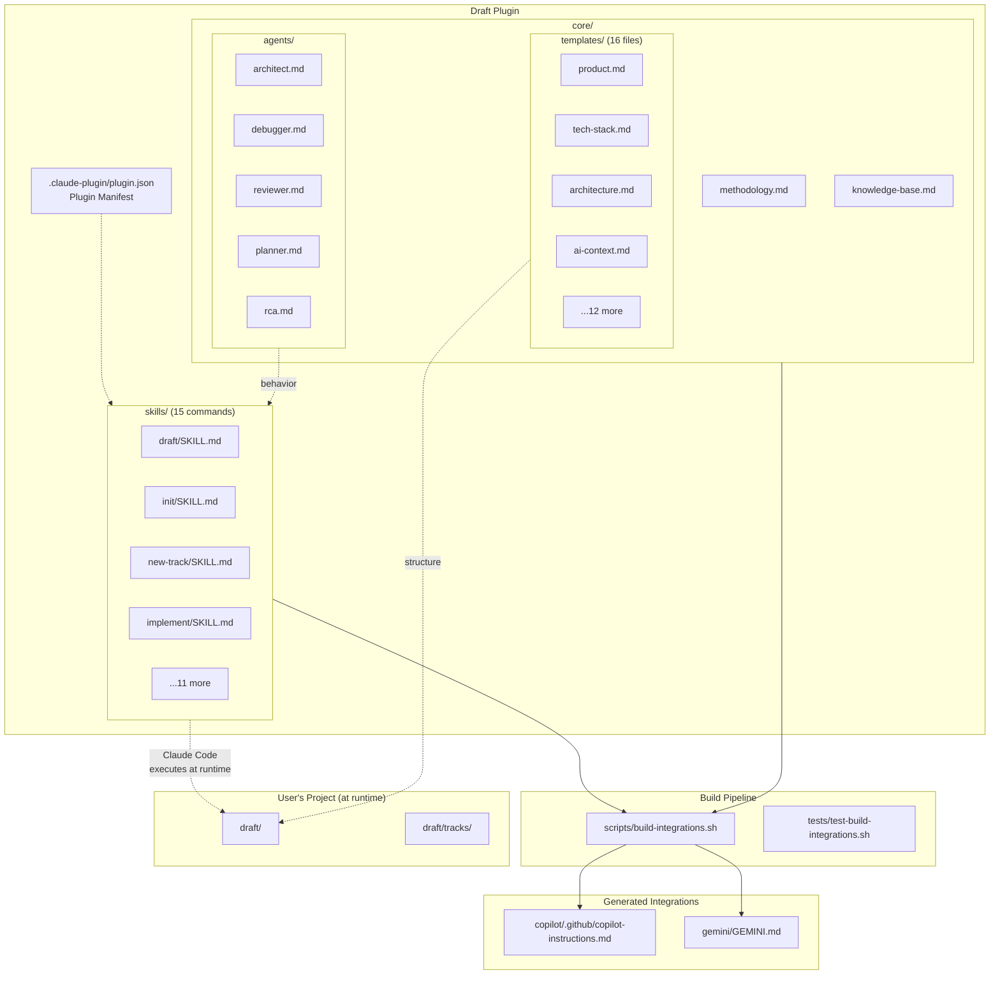
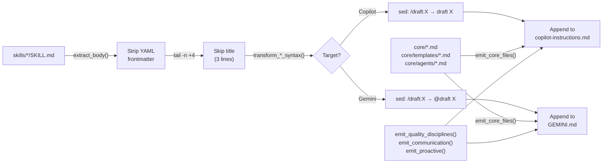
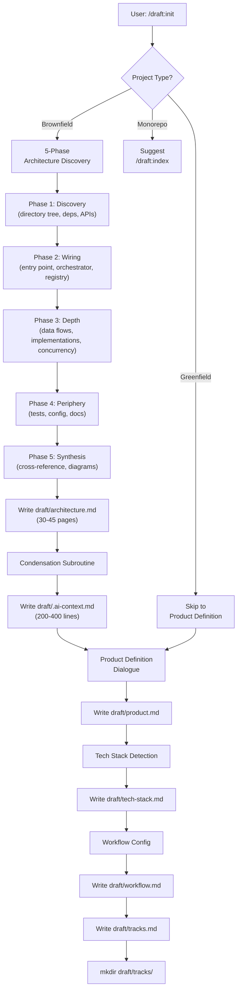
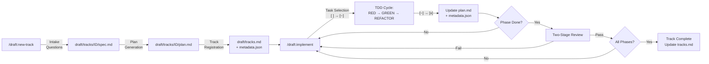
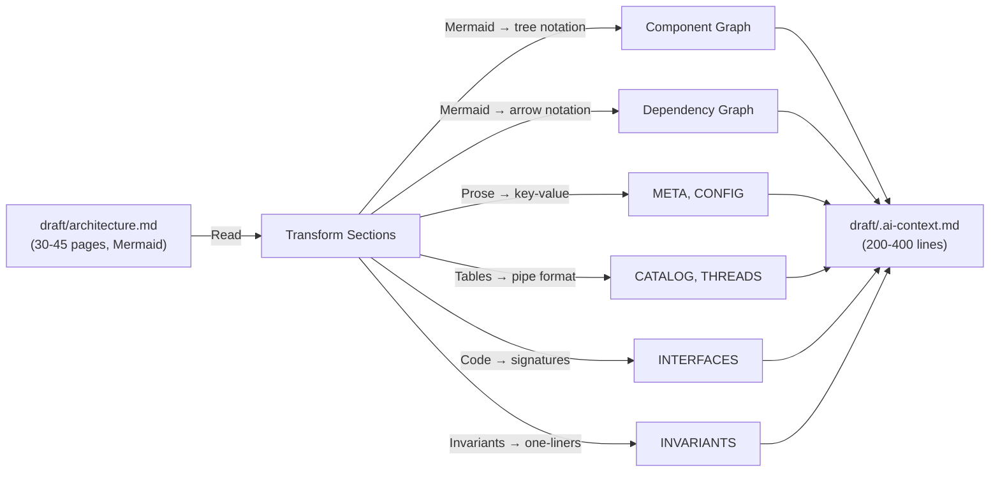
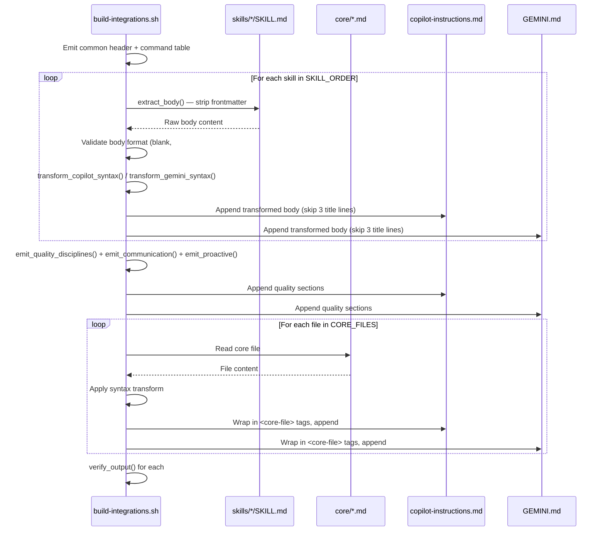
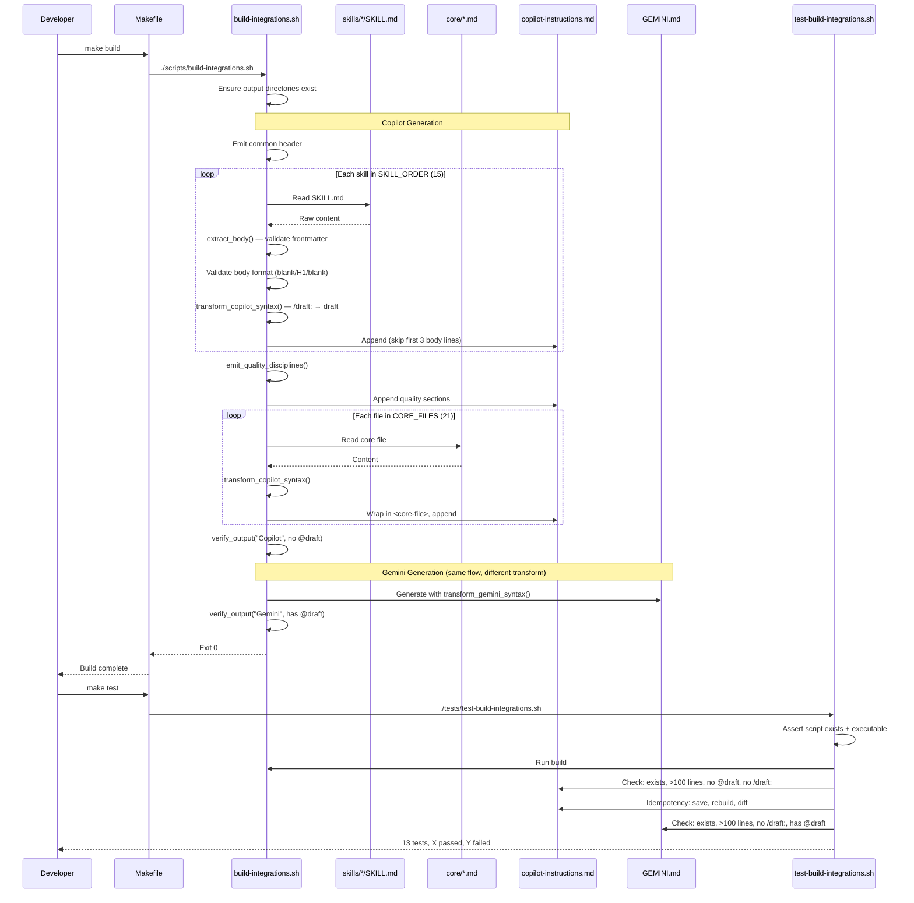
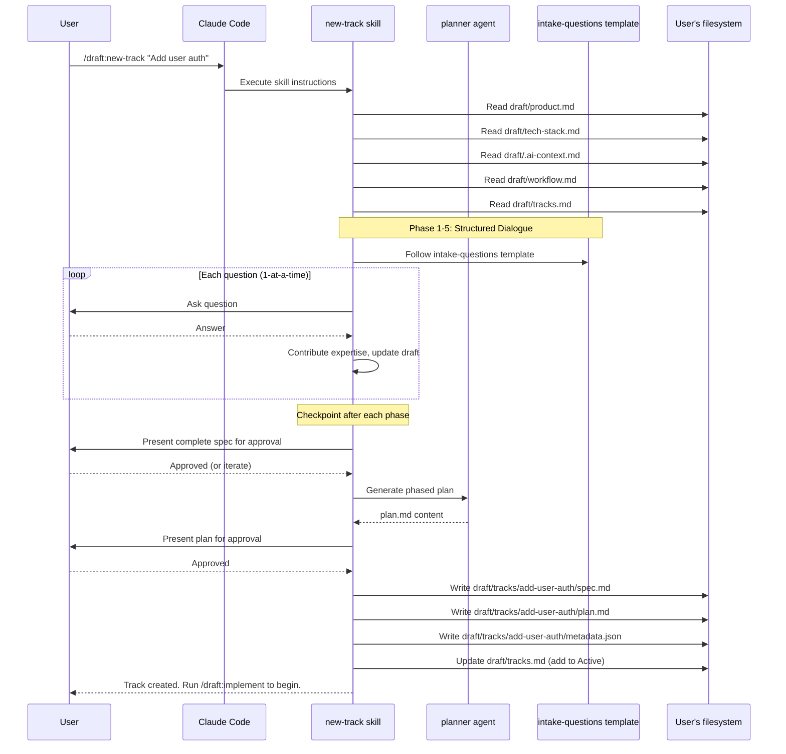
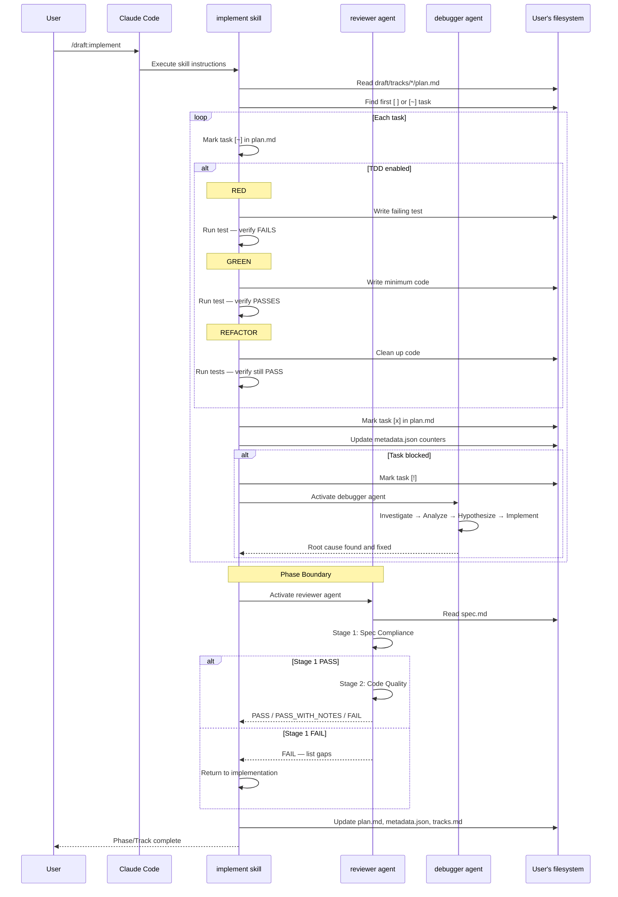

# Architecture: draft

> Human-readable engineering reference. 30-45 pages.
> For token-optimized AI context, see `draft/.ai-context.md`.

---

## Table of Contents

1. [Executive Summary](#1-executive-summary)
2. [AI Agent Quick Reference](#2-ai-agent-quick-reference)
3. [System Identity & Purpose](#3-system-identity--purpose)
4. [Architecture Overview](#4-architecture-overview)
5. [Component Map & Interactions](#5-component-map--interactions)
6. [Data Flow — End to End](#6-data-flow--end-to-end)
7. [Core Modules Deep Dive](#7-core-modules-deep-dive)
8. [Concurrency Model & Thread Safety](#8-concurrency-model--thread-safety)
9. [Framework & Extension Points](#9-framework--extension-points)
10. [Full Catalog of Implementations](#10-full-catalog-of-implementations)
11. [API & Interface Definitions](#11-api--interface-definitions)
12. [External Dependencies](#12-external-dependencies)
13. [Cross-Module Integration Points](#13-cross-module-integration-points)
14. [Critical Invariants & Safety Rules](#14-critical-invariants--safety-rules)
15. [Security Architecture](#15-security-architecture)
16. [Observability & Telemetry](#16-observability--telemetry)
17. [Error Handling & Failure Modes](#17-error-handling--failure-modes)
18. [State Management & Persistence](#18-state-management--persistence)
19. [Key Design Patterns](#19-key-design-patterns)
20. [Configuration & Tuning](#20-configuration--tuning)
21. [Performance Characteristics & Hot Paths](#21-performance-characteristics--hot-paths)
22. [How to Extend — Step-by-Step Cookbooks](#22-how-to-extend--step-by-step-cookbooks)
23. [Build System & Development Workflow](#23-build-system--development-workflow)
24. [Testing Infrastructure](#24-testing-infrastructure)
25. [Known Technical Debt & Limitations](#25-known-technical-debt--limitations)
26. [Glossary](#26-glossary)
- [Appendix A: File Structure Summary](#appendix-a-file-structure-summary)
- [Appendix B: Data Source → Implementation Mapping](#appendix-b-data-source--implementation-mapping)
- [Appendix C: Output Flow — Implementation to Target](#appendix-c-output-flow--implementation-to-target)
- [Appendix D: Mermaid Sequence Diagrams — Critical Flows](#appendix-d-mermaid-sequence-diagrams--critical-flows)

---

## 1. Executive Summary

Draft is a Claude Code plugin that implements Context-Driven Development methodology. It provides 15 slash commands (`/draft:init`, `/draft:new-track`, `/draft:implement`, etc.) that impose structured workflows on AI-assisted software development: specifications before code, phased plans before execution, and verification before completion claims. The plugin is a collection of Markdown-based skill files, shell scripts for cross-platform integration generation, and template files for consistent document output. It targets Claude Code natively, with generated integrations for GitHub Copilot and Gemini.

**Key Facts:**
- **Languages**: Markdown (skill definitions, ~12,000 lines), Bash (build/test scripts, ~762 lines), HTML (landing page, ~3,600 lines)
- **Entry Point**: `.claude-plugin/plugin.json` → auto-discovery of `skills/*/SKILL.md`
- **Architecture Style**: Convention-over-configuration plugin system; document-driven methodology engine
- **Component Count**: 15 skills, 5 agent behaviors, 16 templates, 1 build script, 1 test script
- **Primary Data Sources**: User's `draft/` directory (product.md, tech-stack.md, .ai-context.md, tracks/), user's git repository
- **Primary Action Targets**: User's `draft/` directory (generates/updates markdown files, JSON metadata), integration output files (copilot-instructions.md, GEMINI.md)

---

## 2. AI Agent Quick Reference

```
**Module**           : draft
**Root Path**        : ./
**Language**         : Markdown (skill definitions), Bash (build tooling)
**Build**            : `make build` or `./scripts/build-integrations.sh`
**Test**             : `make test` or `./tests/test-build-integrations.sh`
**Entry Point**      : `.claude-plugin/plugin.json` → Claude Code auto-discovers `skills/*/SKILL.md`
**Config System**    : YAML frontmatter in SKILL.md files (name, description)
**Extension Point**  : Create `skills/<name>/SKILL.md` with YAML frontmatter + add to SKILL_ORDER in build script
**API Definition**   : N/A (no runtime API — plugin operates via AI prompt injection)
**Key Config Prefix**: YAML frontmatter fields: `name:`, `description:`

**Before Making Changes, Always:**
1. Verify SKILL.md body format: blank line, `# Title`, blank line (build script validates this)
2. Ensure YAML frontmatter has `name:` and `description:` fields
3. Run `make build` to regenerate integration files after skill changes
4. Run `make test` to verify integration output correctness

**Never:**
- Edit integration files directly (integrations/copilot/, integrations/gemini/) — they are generated
- Use `/draft:` syntax in generated Copilot output (must be `draft `)
- Use `/draft:` syntax in generated Gemini output (must be `@draft `)
- Skip frontmatter validation — build script will fail on malformed skills
```

---

## 3. System Identity & Purpose

### What Draft Does

1. **Provides structured AI development workflows** via 15 slash commands that enforce context-first development
2. **Generates persistent project context** (product.md, tech-stack.md, architecture.md, .ai-context.md) that constrains AI behavior across sessions
3. **Manages feature tracks** with specifications, phased plans, metadata tracking, and two-stage reviews
4. **Builds cross-platform integration files** from skill sources for Copilot and Gemini
5. **Enforces quality disciplines** including TDD cycles, systematic debugging, root cause analysis, and verification-before-completion
6. **Supports monorepo workflows** via service indexing and aggregation commands

### Why Draft Exists

Without Draft, AI coding assistants make assumptions about requirements, choose arbitrary technical approaches, produce code misaligned with existing codebases, and claim completion without evidence. Draft solves this by treating AI context as a managed artifact: structured documents constrain and guide AI behavior so every interaction is grounded in persistent project awareness. The spec-before-code workflow catches design issues before implementation, reduces rework, and makes AI outputs reviewable via standard git workflows.

---

## 4. Architecture Overview

### 4.1 High-Level Topology

Draft is a **document-driven plugin** — there is no runtime server, no compiled binary, no API. The plugin manifest (`.claude-plugin/plugin.json`) declares metadata; Claude Code auto-discovers skills from the `skills/` directory by convention. A build script transforms skills into integration files for other AI tools. Agent behaviors (in `core/agents/`) provide specialized behavioral guidance embedded within skill execution contexts.



### 4.2 Usage Lifecycle

Draft operates through two distinct lifecycles:

**Plugin Development Lifecycle (maintainers):**
1. Edit skill in `skills/<name>/SKILL.md` or update `core/methodology.md`
2. Run `./scripts/build-integrations.sh` — validates frontmatter, extracts bodies, applies syntax transforms, inlines core files
3. Outputs `integrations/copilot/.github/copilot-instructions.md` and `integrations/gemini/GEMINI.md`
4. Run `./tests/test-build-integrations.sh` — verifies structure, syntax, idempotency
5. Commit and publish

**Plugin Usage Lifecycle (end users):**
1. User installs plugin: `claude plugin install draft`
2. Claude Code reads `.claude-plugin/plugin.json`, auto-discovers `skills/*/SKILL.md`
3. User invokes `/draft:init` — skill instructions guide Claude to analyze codebase, create `draft/` directory
4. User invokes `/draft:new-track` — skill guides Claude through collaborative spec/plan creation
5. User invokes `/draft:implement` — skill guides Claude through TDD cycle per task
6. Supporting commands (`/draft:status`, `/draft:review`, `/draft:validate`, etc.) provide ongoing quality enforcement

---

## 5. Component Map & Interactions

### 5.1 Top-Level Component Registry

The plugin has no runtime orchestrator. Claude Code's plugin system serves as the discovery and dispatch mechanism. Components interact through document references (skill A references template B, agent C references methodology M).

| Component | Type | Purpose | Lines |
|-----------|------|---------|-------|
| `skills/init/SKILL.md` | Skill | Initialize project context with 5-phase codebase analysis | 1971 |
| `skills/bughunt/SKILL.md` | Skill | 12-dimension exhaustive bug discovery | 985 |
| `skills/validate/SKILL.md` | Skill | Codebase quality validation (5 categories) | 869 |
| `skills/index/SKILL.md` | Skill | Monorepo service aggregation | 794 |
| `skills/review/SKILL.md` | Skill | Two-stage code review orchestration | 730 |
| `skills/new-track/SKILL.md` | Skill | Collaborative spec + plan creation | 567 |
| `skills/jira-preview/SKILL.md` | Skill | Generate Jira export from plan | 457 |
| `skills/implement/SKILL.md` | Skill | TDD task execution | 417 |
| `skills/decompose/SKILL.md` | Skill | Module decomposition + dependency mapping | 328 |
| `skills/jira-create/SKILL.md` | Skill | Create Jira issues via MCP | 297 |
| `skills/adr/SKILL.md` | Skill | Architecture Decision Records | 237 |
| `skills/coverage/SKILL.md` | Skill | Code coverage reporting | 184 |
| `skills/revert/SKILL.md` | Skill | Git-aware rollback | 147 |
| `skills/status/SKILL.md` | Skill | Progress overview | 133 |
| `skills/draft/SKILL.md` | Skill | Overview and command listing | 101 |
| `core/methodology.md` | Reference | Master methodology (1212 lines) | 1212 |
| `core/knowledge-base.md` | Reference | Vetted source citations | 127 |
| `core/agents/architect.md` | Agent | Module decomposition, stories, skeletons | 336 |
| `core/agents/rca.md` | Agent | Root cause analysis methodology | 253 |
| `core/agents/reviewer.md` | Agent | Two-stage review process | 165 |
| `core/agents/planner.md` | Agent | Plan generation and task breakdown | 145 |
| `core/agents/debugger.md` | Agent | Systematic debugging process | 114 |
| `scripts/build-integrations.sh` | Script | Integration file generator | 642 |
| `tests/test-build-integrations.sh` | Script | Build output verification | 120 |

### 5.2 Interaction Model

Components reference each other via document paths, not code imports:

| | Skills | Agents | Templates | Methodology | Build Script |
|---|---|---|---|---|---|
| **Skills** | — | Reference behavior | Use structure | Follow principles | — |
| **Agents** | Embedded in skills | — | — | Specialize aspects | — |
| **Templates** | Define output format | — | — | — | Inlined into output |
| **Methodology** | Source of truth | Source of truth | — | — | — |
| **Build Script** | Reads + transforms | — | Reads + inlines | Reads + inlines | — |

---

## 6. Data Flow — End to End

### 6.1 Build Pipeline Flow (Developer → Integration Files)



### 6.2 Init Flow (User → Project Context)



### 6.3 Track Lifecycle Flow



### 6.4 Condensation Flow (architecture.md → .ai-context.md)



---

## 7. Core Modules Deep Dive

### 7.1 Skills Module (skills/)

**Role**: Define the execution instructions for each `/draft:*` slash command.

**Source Files**:
- `skills/init/SKILL.md` — Project initialization and architecture discovery (1971 lines)
- `skills/new-track/SKILL.md` — Collaborative spec/plan creation (567 lines)
- `skills/implement/SKILL.md` — TDD task execution (417 lines)
- `skills/bughunt/SKILL.md` — 12-dimension bug discovery (985 lines)
- `skills/validate/SKILL.md` — Quality validation (869 lines)
- `skills/review/SKILL.md` — Code review orchestration (730 lines)
- `skills/index/SKILL.md` — Monorepo aggregation (794 lines)
- `skills/decompose/SKILL.md` — Module decomposition (328 lines)
- `skills/jira-preview/SKILL.md` — Jira export generation (457 lines)
- `skills/jira-create/SKILL.md` — Jira issue creation via MCP (297 lines)
- `skills/adr/SKILL.md` — Architecture Decision Records (237 lines)
- `skills/coverage/SKILL.md` — Coverage reporting (184 lines)
- `skills/revert/SKILL.md` — Git-aware rollback (147 lines)
- `skills/status/SKILL.md` — Progress overview (133 lines)
- `skills/draft/SKILL.md` — Methodology overview (101 lines)

**File Format** (enforced by build script):
```yaml
---
name: skill-name
description: Brief description
---

# Skill Title

Execution instructions...
```

**Body Format Constraint**: After frontmatter, body must be: blank line, `# Title` heading, blank line. The build script (`build-integrations.sh:482-495`) validates this with:
```bash
line1=$(echo "$body_head" | sed -n '1p')  # must be blank
line2=$(echo "$body_head" | sed -n '2p')  # must start with "# "
line3=$(echo "$body_head" | sed -n '3p')  # must be blank
```
Integration output skips these 3 lines via `tail -n +4`.

**Skill Categories**:

| Category | Skills | Purpose |
|----------|--------|---------|
| Setup | init, index | Project/monorepo initialization |
| Planning | new-track, decompose, adr | Specification and architecture |
| Execution | implement, coverage | Code writing and testing |
| Quality | validate, bughunt, review | Defect detection and review |
| Management | status, revert | Progress and rollback |
| Integration | jira-preview, jira-create | External tool export |
| Meta | draft | Overview and help |

### 7.2 Agents Module (core/agents/)

**Role**: Provide specialized behavioral protocols that skills embed during specific workflow phases.

**Source Files**:
- `core/agents/architect.md` — Module decomposition, stories, skeletons (336 lines)
- `core/agents/rca.md` — Root cause analysis methodology (253 lines)
- `core/agents/reviewer.md` — Two-stage review process (165 lines)
- `core/agents/planner.md` — Plan generation and task breakdown (145 lines)
- `core/agents/debugger.md` — Systematic debugging process (114 lines)

**Activation Triggers**:

| Agent | Activated By | When |
|-------|-------------|------|
| Architect | `/draft:decompose`, `/draft:implement` | Module decomposition; architecture mode pre-implementation |
| RCA | `/draft:new-track` (bug type) | Bug/incident investigation tracks |
| Reviewer | `/draft:implement` | Phase boundary review checkpoints |
| Planner | `/draft:new-track`, `/draft:decompose` | Plan creation and task breakdown |
| Debugger | `/draft:implement` | When task status is `[!]` Blocked |

**Key Protocols**:

- **Architect**: 5 module decomposition rules (single responsibility, size ≤3 files, clear API, minimal coupling, testable isolation). Cycle-breaking framework with 3 strategies (extract shared interface, invert dependency, merge modules). Story lifecycle (placeholder → written → updated).
- **Debugger**: 4-phase process (Investigate → Analyze → Hypothesize → Implement). Iron law: no fixes without root cause. Escalation after 3 failed hypothesis cycles.
- **RCA**: Extends debugger with blast radius scoping, differential analysis, 5 Whys technique, hypothesis logging table, root cause classification (8 categories), blameless RCA summary template.
- **Reviewer**: 2-stage review (Spec Compliance → Code Quality). 3-tier severity (Critical blocks, Important should-fix, Minor note-later). Stage 2 only runs if Stage 1 passes.
- **Planner**: Phase decomposition (Foundation → Implementation → Integration → Polish). Task granularity guidelines. Integration with Architect agent for module-aligned plans.

### 7.3 Templates Module (core/templates/)

**Role**: Define the structure and YAML frontmatter format for all generated files in the user's `draft/` directory.

**Source Files**:
- `core/templates/architecture.md` — 28-section engineering reference template (709 lines)
- `core/templates/ai-context.md` — Token-optimized context template (209 lines)
- `core/templates/intake-questions.md` — 6-phase structured dialogue for new tracks (396 lines)
- `core/templates/spec.md` — Track specification template (123 lines)
- `core/templates/product.md` — Product vision template (119 lines)
- `core/templates/workflow.md` — TDD/commit/review configuration template (194 lines)
- `core/templates/tech-stack.md` — Technology stack template (178 lines)
- `core/templates/jira.md` — Jira configuration and story template (112 lines)
- `core/templates/metadata.json` — Track status/progress JSON schema (25 lines)
- `core/templates/service-index.md` — Monorepo service registry template (64 lines)
- `core/templates/dependency-graph.md` — Service dependency topology template (112 lines)
- `core/templates/tech-matrix.md` — Technology distribution template (110 lines)
- `core/templates/root-product.md` — Synthesized monorepo product vision template (62 lines)
- `core/templates/root-architecture.md` — System-of-systems architecture template (136 lines)
- `core/templates/root-tech-stack.md` — Org-wide tech standards template (126 lines)

**Standard Metadata Header** (all templates start with):
```yaml
---
project: "{PROJECT_NAME}"
module: "root"
generated_by: "draft:init"
generated_at: "{ISO_TIMESTAMP}"
git:
  branch: "{LOCAL_BRANCH}"
  remote: "{REMOTE/BRANCH}"
  commit: "{FULL_SHA}"
  commit_short: "{SHORT_SHA}"
  commit_date: "{COMMIT_DATE}"
  commit_message: "{COMMIT_MESSAGE}"
  dirty: {true|false}
synced_to_commit: "{FULL_SHA}"
---
```

This metadata enables incremental refresh: `synced_to_commit` tracks which commit the docs were last synced to, allowing `git diff --name-only <SYNCED_SHA> HEAD` to find only changed files.

### 7.4 Build Pipeline Module (scripts/)

**Role**: Generate platform-specific integration files from skill sources.

**Source Files**:
- `scripts/build-integrations.sh` — Main build script (642 lines)
- `tests/test-build-integrations.sh` — Build output verification (120 lines)

**Build Script Architecture**:

The build script has 5 logical sections:

1. **Metadata** (lines 30-114): `SKILL_ORDER` array defines inclusion order. Three `case` statement functions map skill names to display headers, Gemini triggers, and Copilot triggers.

2. **Content Extraction** (lines 120-178): `extract_body()` strips YAML frontmatter via `awk`, validates `name:` and `description:` fields. `transform_gemini_syntax()` and `transform_copilot_syntax()` apply `sed` transforms for platform-specific command syntax.

3. **Core File Inlining** (lines 184-247): `CORE_FILES` array lists 21 core files. `emit_core_files()` wraps each in `<core-file>` tags and applies syntax transforms.

4. **Quality/Communication** (lines 253-364): `emit_quality_disciplines()`, `emit_communication()`, `emit_proactive()` emit shared methodology sections as heredocs.

5. **Integration Builder** (lines 370-539): `build_integration()` is the main generator — emits header, command table, iterates skills with extraction + transform, emits quality/communication, inlines core files. Called twice: once for Copilot (`build_copilot`), once for Gemini (`build_gemini`).

6. **Verification** (lines 560-609): `verify_output()` checks line count, skill count, absence of `/draft:` syntax, and correct `@draft` presence/absence per platform.

### 7.5 Methodology Module (core/methodology.md)

**Role**: Master methodology documentation — single source of truth for all skill behaviors and quality disciplines.

**Key Sections** (1212 lines):
- Philosophy (why context-driven development)
- Installation & Getting Started
- Core Workflow (Context → Spec & Plan → Implement)
- Tracks (lifecycle, ID generation, directory structure)
- Project Context Files (product.md, tech-stack.md, architecture.md, .ai-context.md, workflow.md)
- Command Workflows (detailed workflow for each of 15 commands)
- Architecture Mode (decompose → implement with checkpoints)
- Quality Disciplines (verification, debugging, RCA, review)
- Agents (5 agent descriptions with activation triggers)
- Communication Style
- Principles

**Update Hierarchy**: methodology.md → skills → integrations. Changes flow top-down.

### 7.6 Knowledge Base Module (core/knowledge-base.md)

**Role**: Curated reference library for AI guidance during track creation. Provides citation sources for advice.

**Categories** (127 lines):
- Books: 12 references across Architecture, Reliability, Craft, Microservices, Testing
- Standards: OWASP, SOLID, 12-Factor, REST, CNCF
- Patterns: GoF (Creational, Structural, Behavioral), Resilience, Data, Integration (EIP)
- Anti-Patterns: Distributed systems, Architecture, Code, Security

**Citation Format**: `"Consider CQRS here (DDIA, Ch. 11) — separates read/write concerns..."`

---

## 8. Concurrency Model & Thread Safety

Draft is a **document-based plugin with no runtime process**. There is no concurrency model.

The build script (`build-integrations.sh`) runs sequentially: Copilot generation → verification → Gemini generation → verification. No parallelism.

User-facing skill execution happens within Claude Code's single-conversation context — no concurrent access concerns.

---

## 9. Framework & Extension Points

### 9.1 Plugin/Skill Types

| Type | Interface | Description |
|------|-----------|-------------|
| Skill | `skills/<name>/SKILL.md` with YAML frontmatter | Slash command implementation |
| Agent | `core/agents/<name>.md` with YAML frontmatter | Behavioral protocol for skills |
| Template | `core/templates/<name>.md` | Output structure definition |
| Integration | Generated from skills + core | Platform-specific output |

### 9.2 Skill Discovery Mechanism

Claude Code auto-discovers skills via convention:
1. Plugin manifest at `.claude-plugin/plugin.json` declares the plugin
2. Claude Code scans `skills/*/SKILL.md` within the plugin directory
3. Each SKILL.md's `name:` frontmatter field becomes the command suffix: `/draft:<name>`
4. No explicit registration in plugin.json is required

For integration generation, skills must also be listed in the `SKILL_ORDER` array in `scripts/build-integrations.sh:30-46`.

### 9.3 Per-Skill Metadata

| Property | Type | Required | Description |
|----------|------|----------|-------------|
| `name` | string | Yes | Kebab-case command name (e.g., `new-track`) |
| `description` | string | Yes | One-line description shown in plugin listing |
| Body (after `---`) | Markdown | Yes | Execution instructions for Claude |

### 9.4 Build Script Extension Points

| Extension | Location | Description |
|-----------|----------|-------------|
| `SKILL_ORDER` | `build-integrations.sh:30-46` | Array controlling skill inclusion order |
| `get_skill_header()` | `build-integrations.sh:48-68` | Case statement mapping skill → display name |
| `get_gemini_trigger()` | `build-integrations.sh:71-91` | Case statement mapping skill → Gemini invocation |
| `get_copilot_trigger()` | `build-integrations.sh:94-114` | Case statement mapping skill → Copilot invocation |
| `CORE_FILES` | `build-integrations.sh:187-213` | Array of core files to inline |

---

## 10. Full Catalog of Implementations

### 10.1 Skills (15)

| # | Name | Category | Lines | Purpose |
|---|------|----------|-------|---------|
| 1 | `draft` | Meta | 101 | Methodology overview, command listing |
| 2 | `init` | Setup | 1971 | Project initialization, 5-phase architecture discovery |
| 3 | `index` | Setup | 794 | Monorepo service context aggregation |
| 4 | `new-track` | Planning | 567 | Collaborative spec + plan creation |
| 5 | `decompose` | Planning | 328 | Module decomposition with dependency mapping |
| 6 | `implement` | Execution | 417 | TDD task execution with checkpoints |
| 7 | `coverage` | Execution | 184 | Code coverage measurement and gap analysis |
| 8 | `validate` | Quality | 869 | 5-category codebase quality validation |
| 9 | `bughunt` | Quality | 985 | 12-dimension exhaustive bug discovery |
| 10 | `review` | Quality | 730 | Two-stage code review orchestrator |
| 11 | `adr` | Planning | 237 | Architecture Decision Record management |
| 12 | `status` | Management | 133 | Progress overview display |
| 13 | `revert` | Management | 147 | Git-aware rollback at task/phase/track level |
| 14 | `jira-preview` | Integration | 457 | Generate Jira export from plan |
| 15 | `jira-create` | Integration | 297 | Create Jira issues via MCP server |

### 10.2 Agents (5)

| # | Name | Lines | Activated By | Purpose |
|---|------|-------|-------------|---------|
| 1 | `architect` | 336 | decompose, implement | Module decomposition, stories, skeletons |
| 2 | `rca` | 253 | new-track (bug) | Root cause analysis methodology |
| 3 | `reviewer` | 165 | implement | Phase boundary two-stage review |
| 4 | `planner` | 145 | new-track, decompose | Plan generation and task breakdown |
| 5 | `debugger` | 114 | implement | Systematic debugging for blocked tasks |

### 10.3 Templates (16)

| # | Name | Lines | Used By |
|---|------|-------|---------|
| 1 | `architecture.md` | 709 | init, decompose |
| 2 | `ai-context.md` | 209 | init (condensation) |
| 3 | `intake-questions.md` | 396 | new-track |
| 4 | `workflow.md` | 194 | init |
| 5 | `tech-stack.md` | 178 | init |
| 6 | `root-architecture.md` | 136 | index |
| 7 | `root-tech-stack.md` | 126 | index |
| 8 | `spec.md` | 123 | new-track |
| 9 | `product.md` | 119 | init |
| 10 | `jira.md` | 112 | jira-preview, jira-create |
| 11 | `dependency-graph.md` | 112 | index |
| 12 | `tech-matrix.md` | 110 | index |
| 13 | `root-product.md` | 62 | index |
| 14 | `service-index.md` | 64 | index |
| 15 | `metadata.json` | 25 | new-track |
| 16 | `intake-questions.md` | 396 | new-track |

### 10.4 Core References (2)

| # | Name | Lines | Purpose |
|---|------|-------|---------|
| 1 | `methodology.md` | 1212 | Master methodology documentation |
| 2 | `knowledge-base.md` | 127 | Vetted citation sources for AI guidance |

---

## 11. API & Interface Definitions

Draft has no runtime API. The "interfaces" are document formats:

### 11.1 Skill File Interface

```yaml
---
name: string          # kebab-case, becomes /draft:<name>
description: string   # one-line, shown in plugin listing
---
                      # blank line (mandatory)
# Title              # H1 heading (mandatory)
                      # blank line (mandatory)
[Execution body...]   # Free-form markdown instructions
```

### 11.2 Metadata JSON Interface

```json
{
  "id": "string (kebab-case track ID)",
  "title": "string (human-readable)",
  "type": "feature|bugfix|refactor",
  "status": "planning|in_progress|completed",
  "created": "ISO 8601",
  "updated": "ISO 8601",
  "phases": { "total": 0, "completed": 0 },
  "tasks": { "total": 0, "completed": 0 },
  "lastReviewed": "ISO 8601",
  "reviewCount": 0,
  "lastReviewVerdict": "PASS|PASS_WITH_NOTES|FAIL"
}
```

### 11.3 YAML Frontmatter Metadata Interface

All `draft/*.md` files include:
```yaml
---
project: string
module: string
generated_by: string       # "draft:<command>"
generated_at: ISO 8601
git:
  branch: string
  remote: string
  commit: string           # full SHA
  commit_short: string     # 7-char SHA
  commit_date: string
  commit_message: string
  dirty: boolean
synced_to_commit: string   # full SHA for incremental refresh
---
```

### 11.4 Status Markers

| Marker | Meaning | Used In |
|--------|---------|---------|
| `[ ]` | Pending | plan.md, spec.md |
| `[~]` | In Progress | plan.md |
| `[x]` | Completed | plan.md, spec.md |
| `[!]` | Blocked | plan.md |

---

## 12. External Dependencies

### 12.1 Runtime Dependencies

| Dependency | Type | Required | Usage |
|-----------|------|----------|-------|
| Claude Code CLI | Runtime | Yes | Plugin host, skill discovery, command execution |
| Git | CLI tool | Yes | Metadata gathering, track history, revert operations |
| Bash | Shell | Yes | Build script execution |

### 12.2 Optional Dependencies

| Dependency | Type | Required By | Usage |
|-----------|------|-------------|-------|
| MCP-Jira server | Service | jira-create | Create Jira issues programmatically |
| Make | CLI tool | — | Convenience wrapper (`make build`, `make test`) |

### 12.3 Build Script Dependencies

| Tool | Usage |
|------|-------|
| `bash` | Script execution (set -euo pipefail) |
| `awk` | YAML frontmatter extraction |
| `sed` | Syntax transformation (/draft: → @draft / draft) |
| `grep` | Frontmatter validation, output verification |
| `wc` | Line count verification |
| `diff` | Idempotency testing |
| `head` / `tail` | Body extraction, line skipping |
| `cat` | Heredoc emission |
| `mkdir` | Output directory creation |

---

## 13. Cross-Module Integration Points

### 13.1 Skill → Template Integration

Skills reference templates by path for output structure:
- `init` references `core/templates/product.md`, `core/templates/tech-stack.md`, `core/templates/workflow.md`, `core/templates/architecture.md`, `core/templates/ai-context.md`
- `new-track` references `core/templates/spec.md`, `core/templates/intake-questions.md`, `core/templates/metadata.json`
- `index` references `core/templates/service-index.md`, `core/templates/dependency-graph.md`, `core/templates/tech-matrix.md`, `core/templates/root-*.md`

### 13.2 Skill → Agent Integration

Skills embed agent behaviors at specific workflow points:
- `implement` activates `reviewer` at phase boundaries, `debugger` when task is `[!]`, `architect` when architecture mode is active
- `new-track` activates `planner` for plan generation, `rca` for bug-type tracks
- `decompose` activates `architect` for module decomposition, `planner` for plan restructuring

### 13.3 Build Script → Skill/Core Integration



### 13.4 Condensation Subroutine Integration

The `init` skill defines a "Condensation Subroutine" that other skills reference:

| Skill | Triggers Condensation | Context |
|-------|----------------------|---------|
| `init` | After generating architecture.md | Initial project setup |
| `init refresh` | After updating architecture.md | Incremental refresh |
| `implement` | After module status updates | Module completion |
| `decompose` | After adding new modules | Module decomposition |

---

## 14. Critical Invariants & Safety Rules

### Data Safety

| Invariant | Why | Enforced At | Violation Pattern |
|-----------|-----|-------------|-------------------|
| YAML frontmatter must have `name:` and `description:` | Build script fails on malformed skills | `build-integrations.sh:139-147` | Creating SKILL.md without frontmatter fields |
| Body must start: blank, `# Title`, blank | Integration output depends on `tail -n +4` skipping exactly 3 lines | `build-integrations.sh:482-495` | Adding content before H1 heading |
| `tracks.md` never overwritten by init | Destroys track history | `skills/init/SKILL.md` (Refresh Mode) | Running `/draft:init` on existing project |
| `synced_to_commit` must be valid git SHA | Incremental refresh uses `git diff` against this SHA | Template metadata header | Manual editing of frontmatter SHA |
| `metadata.json` must be written before `tracks.md` update | Prevents orphan track entries | `skills/new-track/SKILL.md` | Updating tracks.md before metadata.json exists |

### Build Safety

| Invariant | Why | Enforced At | Violation Pattern |
|-----------|-----|-------------|-------------------|
| No `/draft:` in integration output | Platform-specific syntax required | `build-integrations.sh:580-588` | Incomplete sed transform |
| No `@draft` in Copilot output | Copilot uses bare `draft ` syntax | `build-integrations.sh:593-602` | Missed transform in copilot path |
| Skill names must be `[a-z0-9-]+` | Prevents path traversal in `$SKILLS_DIR/$skill/SKILL.md` | `build-integrations.sh:474-478` | Skill name with special characters |
| Integration files are generated, never edited | Source of truth is skills/, not integrations/ | `CLAUDE.md` documentation | Direct edits to copilot-instructions.md or GEMINI.md |
| Build must be idempotent | Same input → same output | `tests/test-build-integrations.sh:88-97` | Non-deterministic content generation |

### Methodology Safety

| Invariant | Why | Enforced At | Violation Pattern |
|-----------|-----|-------------|-------------------|
| No `[x]` without verification evidence | Prevents false completion claims | `core/methodology.md:1028-1040` | Marking tasks complete without running tests |
| No fixes without root cause | Prevents symptom-masking | `core/agents/debugger.md:12` | Applying "quick fixes" to blocked tasks |
| Stage 1 review must pass before Stage 2 | Spec compliance > code quality | `core/agents/reviewer.md:37-38` | Jumping to code quality review |
| Spec approved before plan generated | Plans must implement approved requirements | `core/agents/planner.md:132` | Generating plan before developer approves spec |
| Architecture.md is primary, .ai-context.md is derived | Condensation subroutine transforms architecture.md into .ai-context.md | `skills/init/SKILL.md` (Condensation Subroutine) | Manually editing .ai-context.md without updating architecture.md |

---

## 15. Security Architecture

### Input Validation

- **Skill name validation**: Build script validates `[a-z0-9-]+` regex (`build-integrations.sh:474-478`) to prevent path traversal attacks via malicious skill names
- **Frontmatter validation**: `extract_body()` (`build-integrations.sh:121-163`) validates presence of `---` delimiters and required fields before processing

### Secrets Management

- No secrets are stored in the repository
- `.gitignore` excludes common sensitive patterns
- `workflow.md` template includes guardrail: "No secrets/credentials in code"

### Network Security

- Draft has no network component — all operations are local filesystem
- Jira integration (via MCP) delegates authentication to the MCP server configuration

---

## 16. Observability & Telemetry

Draft has no logging, metrics, or tracing infrastructure. It is a document-generation tool.

**Progress Observability** is provided through:
- `metadata.json` — task/phase completion counters
- Status markers in `plan.md` — `[ ]`, `[~]`, `[x]`, `[!]`
- `/draft:status` command — reads and summarizes progress state
- Git tracking table in generated files — branch, commit, sync status

---

## 17. Error Handling & Failure Modes

### Build Script Error Handling

| Scenario | Detection | Recovery |
|----------|-----------|----------|
| Missing frontmatter | `extract_body()` checks for `---` delimiters | Script exits with error message and file path |
| Missing `name:` field | grep check in `extract_body()` | Error message: "Missing 'name:' field in frontmatter of $file" |
| Missing `description:` field | grep check in `extract_body()` | Error message: "Missing 'description:' field in frontmatter of $file" |
| Invalid body format | Line-by-line validation after extraction | Error with expected vs actual line content |
| Invalid skill name | Regex check `[a-z0-9-]+` | "Invalid skill name" error, script exits |
| Missing skill file | `-f` check in loop | "WARNING: Skill file not found" to stderr |
| Missing core file | `-f` check in `emit_core_files()` | "WARNING: Core file not found" to stderr |
| `/draft:` syntax in output | `verify_output()` grep check | "WARNING: Found N '/draft:' references" |
| `@draft` in Copilot output | Platform-specific `verify_output()` check | "WARNING: Found N '@draft' references" |

**Error propagation**: `set -euo pipefail` causes immediate exit on any unhandled error. Verification failures in `verify_output()` return non-zero, caught by `|| exit 1` in main.

### Skill Execution Error Handling

Skills contain "Red Flags" sections that define stop conditions. Example from `init/SKILL.md`:
- "Re-initializing a project that already has `draft/` without using `refresh` mode"
- "Skipping brownfield analysis for an existing codebase"
- "Overwriting existing tracks.md"

These are instruction-level guardrails — the AI executing the skill checks these conditions and halts.

---

## 18. State Management & Persistence

### State Inventory

| State | Storage | Durability | Recovery |
|-------|---------|------------|----------|
| Plugin definition | `.claude-plugin/plugin.json` | Git-tracked | Clone repository |
| Skill definitions | `skills/*/SKILL.md` | Git-tracked | Clone repository |
| Generated integrations | `integrations/*/` | Git-tracked | Run `make build` |
| User project context | User's `draft/*.md` | User's git | Re-run `/draft:init` |
| Track state | User's `draft/tracks/*/` | User's git | Track-level `/draft:revert` |
| Track progress | `metadata.json` + `plan.md` markers | User's git | Parse `plan.md` markers |
| Build script state | None (stateless) | N/A | N/A |

### Persistence Formats

| File | Format | Schema |
|------|--------|--------|
| `metadata.json` | JSON | Fixed schema: id, title, type, status, phases, tasks, review |
| `*.md` files | YAML frontmatter + Markdown body | Variable per template |
| `plugin.json` | JSON | name, description, version, author, homepage, license, keywords |
| `marketplace.json` | JSON | Marketplace listing wrapper around plugin.json |

### Recovery

- **Build artifacts corrupted**: Delete `integrations/*/` outputs, run `make build`
- **User context lost**: Re-run `/draft:init` (destructive — rebuilds from scratch)
- **Track state inconsistent**: Parse `plan.md` status markers as source of truth; `metadata.json` can be reconstructed from plan.md
- **Incremental refresh fails**: If `synced_to_commit` SHA doesn't exist in git history, falls back to full 5-phase analysis

---

## 19. Key Design Patterns

### 19.1 Convention-Over-Configuration Pattern

**Description**: Skills are discovered by file location (`skills/<name>/SKILL.md`) rather than explicit registration in a manifest. This eliminates configuration boilerplate and makes adding new skills as simple as creating a directory with a SKILL.md file.

**Where Used**:
- `skills/*/SKILL.md` — Claude Code auto-discovery
- `docs/PLUGIN_ARCHITECTURE.md:5-9` — documents the convention

```bash
# From build-integrations.sh - skills are discovered by filesystem convention
SKILL_ORDER=(
    draft init index new-track decompose implement coverage
    validate bughunt review adr status revert jira-preview jira-create
)
# Each name maps to skills/<name>/SKILL.md
```

**Anti-Pattern**: Adding skills to plugin.json. The manifest is metadata-only.

### 19.2 Source-of-Truth Hierarchy Pattern

**Description**: A strict hierarchy defines which files are authoritative and which are derived. Changes flow top-down; derived files are regenerated, never manually edited.

**Where Used**:
- `CLAUDE.md` — documents the hierarchy
- `build-integrations.sh` — implements the derivation

```
1. core/methodology.md         (master methodology)
2. skills/<name>/SKILL.md      (skill implementations, derive from methodology)
3. integrations/copilot/       (GENERATED from skills)
4. integrations/gemini/        (GENERATED from skills)
```

For user projects:
```
architecture.md (PRIMARY)  →  .ai-context.md (DERIVED via Condensation Subroutine)
```

### 19.3 Syntax Transform Pipeline Pattern

**Description**: A single build function generates content for all platforms, with platform-specific `sed` transforms applied as the final step. This ensures content parity while supporting different invocation syntaxes.

**Where Used**:
- `build-integrations.sh:165-178` — transform functions
- `build-integrations.sh:370-539` — unified builder

```bash
# Same content, different transforms
transform_gemini_syntax() {
    sed -E -e 's|/draft:([a-z-]+)|@draft \1|g'
}
transform_copilot_syntax() {
    sed -E \
        -e 's|/draft:([a-z-]+)|draft \1|g' \
        -e 's|@draft\b|draft|g'
}
```

### 19.4 Progressive Refinement Pattern

**Description**: User-facing workflows proceed through structured phases with mandatory checkpoints between them. Each phase narrows the solution space before the next begins.

**Where Used**:
- `core/templates/intake-questions.md` — 6-phase intake with checkpoints
- `core/methodology.md` — Context → Spec & Plan → Implement
- `core/agents/architect.md` — Story → Execution State → Skeleton → TDD

**Anti-Pattern**: Skipping phases. "Jumping straight to implementation without reading existing Draft context."

### 19.5 Metadata-Driven Incremental Refresh Pattern

**Description**: Every generated document includes YAML frontmatter with git metadata (branch, commit SHA, dirty flag). The `synced_to_commit` field enables incremental refresh by computing `git diff` against the last sync point.

**Where Used**:
- Every template in `core/templates/`
- `skills/init/SKILL.md` (Refresh Mode section)

```bash
# Refresh reads synced_to_commit, diffs against HEAD
git diff --name-only <SYNCED_SHA> HEAD -- . ':!draft/'
```

---

## 20. Configuration & Tuning

### Key Configuration Parameters

| Parameter | Location | Default | Purpose |
|-----------|----------|---------|---------|
| `name` | `plugin.json` | `"draft"` | Plugin identifier |
| `version` | `plugin.json` | `"1.3.0"` | Plugin version |
| `SKILL_ORDER` | `build-integrations.sh:30` | 15 skills | Controls skill inclusion order in integrations |
| `CORE_FILES` | `build-integrations.sh:187` | 21 files | Core files inlined into integrations |
| TDD Mode | `workflow.md` (user) | `strict\|flexible\|none` | Test-driven development preference |
| Auto-validate | `workflow.md` (user) | Unchecked | Auto-run validate at track completion |
| Blocking behavior | `workflow.md` (user) | Unchecked | Halt on validation failures |
| Commit format | `workflow.md` (user) | `type(scope): description` | Commit message convention |
| Coverage target | `workflow.md` (user) | 95% | Code coverage threshold |
| Validation categories | `workflow.md` (user) | All checked | Which validation categories to run |

### User Project Configuration

Users configure Draft behavior via `draft/workflow.md` checkboxes:
- TDD mode selection (strict/flexible/none)
- Commit frequency (per-task/per-phase/per-session)
- Guardrails (no direct commits to main, no secrets in code, etc.)
- Validation scope (architecture, security, performance, etc.)

---

## 21. Performance Characteristics & Hot Paths

### Build Script Performance

- **Expected runtime**: < 2 seconds (documented in test file header)
- **Hot path**: `extract_body()` called 15 times (once per skill)
- **Bottleneck**: `emit_core_files()` reads 21 files × 2 integrations = 42 file reads
- **Output size**: Integration files are ~20,000+ lines each (all skills + all core files inlined)

### User-Facing Performance

- **Init (brownfield)**: Slow — reads entire codebase, generates 30-45 page architecture.md
- **Init (greenfield)**: Fast — dialogue only, no codebase analysis
- **New-track**: Medium — multi-phase dialogue, generates spec.md + plan.md
- **Implement**: Variable — depends on task complexity, TDD cycle count
- **Status**: Fast — reads metadata.json and plan.md markers

---

## 22. How to Extend — Step-by-Step Cookbooks

### 22.1 Adding a New Skill

1. **Create directory**: `mkdir -p skills/my-skill`
2. **Create SKILL.md** with YAML frontmatter:
   ```yaml
   ---
   name: my-skill
   description: What this skill does
   ---

   # My Skill Title

   Execution instructions here...
   ```
3. **Add to SKILL_ORDER** in `scripts/build-integrations.sh:30-46`
4. **Add display name** to `get_skill_header()` case statement (`build-integrations.sh:48-68`)
5. **Add trigger** to `get_gemini_trigger()` (`build-integrations.sh:71-91`)
6. **Add trigger** to `get_copilot_trigger()` (`build-integrations.sh:94-114`)
7. **Rebuild**: `make build`
8. **Test**: `make test`
9. **Document** in `README.md` and `CLAUDE.md`

### 22.2 Adding a New Agent

1. **Create file**: `core/agents/my-agent.md` with YAML frontmatter:
   ```yaml
   ---
   description: What this agent does
   capabilities:
     - capability 1
     - capability 2
   ---
   ```
2. **Define activation triggers**: When should this agent behavior activate?
3. **Reference from skill**: In the relevant SKILL.md, add instructions that reference `core/agents/my-agent.md`
4. **Add to CORE_FILES** in `build-integrations.sh:187-213` if it should be inlined into integrations
5. **Document** in `core/methodology.md` under Agents section

### 22.3 Adding a New Template

1. **Create file**: `core/templates/my-template.md`
2. **Include standard metadata header** with YAML frontmatter placeholders
3. **Reference from skill**: In the relevant SKILL.md, add "Create file using template from `core/templates/my-template.md`"
4. **Add to CORE_FILES** in `build-integrations.sh:187-213` if needed by integrations
5. **Add `<!-- MANUAL START -->` / `<!-- MANUAL END -->` blocks** if sections should survive re-indexing

### 22.4 Adding a New Integration Target

1. **Create output directory**: `integrations/<platform>/`
2. **Add build function** in `build-integrations.sh`:
   - Create `build_<platform>()` calling `build_integration()` with correct params
   - Define `get_<platform>_trigger()` case statement
   - Define `transform_<platform>_syntax()` sed transform
3. **Add to main()**: Generate → verify → report
4. **Add output variables** at script top
5. **Update tests** in `tests/test-build-integrations.sh`

---

## 23. Build System & Development Workflow

### Build System

GNU Make wrapping Bash scripts.

### Key Targets

| Target | Type | What It Does |
|--------|------|--------------|
| `make build` | Generation | Runs `./scripts/build-integrations.sh` |
| `make test` | Verification | Runs `./tests/test-build-integrations.sh` |
| `make clean` | Cleanup | No-op ("Nothing to clean") |
| `make help` | Documentation | Lists available targets |

### How to Build

- **Full**: `make build`
- **Direct**: `./scripts/build-integrations.sh`

### How to Test

- **Full**: `make test`
- **Direct**: `./tests/test-build-integrations.sh`
- **Expected runtime**: < 2 seconds
- **Exit code**: Number of failed tests (0 = all pass)

### Code Style & Naming Conventions

| Element | Convention | Example |
|---------|-----------|---------|
| Skill directories | kebab-case | `skills/new-track/` |
| Skill files | Always `SKILL.md` | `skills/init/SKILL.md` |
| Agent files | lowercase.md | `core/agents/debugger.md` |
| Template files | kebab-case.md | `core/templates/tech-stack.md` |
| Shell scripts | kebab-case.sh | `scripts/build-integrations.sh` |
| Plugin config | plugin.json | `.claude-plugin/plugin.json` |
| Shell variables | SCREAMING_SNAKE | `SKILL_ORDER`, `ROOT_DIR` |
| Shell functions | snake_case | `extract_body`, `get_skill_header` |
| Indentation (Bash) | 4 spaces | `.editorconfig` |
| Indentation (Markdown) | 2 spaces | `.editorconfig` |
| Indentation (JSON/YAML) | 2 spaces | `.editorconfig` |

### CI/CD

No CI/CD pipeline configured. Build and test are manual (`make build && make test`).

---

## 24. Testing Infrastructure

### Framework

Bash-based test script with custom `assert()` function.

### Test Suite: `tests/test-build-integrations.sh`

| Test Category | Tests | What It Verifies |
|---------------|-------|-----------------|
| Script existence | 2 | Build script exists and is executable |
| Copilot output | 6 | Generated, has >100 lines, no `@draft`, no `/draft:`, has header, uses `draft <cmd>` syntax |
| Gemini output | 4 | Generated, has >100 lines, no `/draft:`, has `@draft` references |
| Idempotency | 1 | Rebuild produces identical output |
| **Total** | **13** | |

### What Is NOT Tested

(Documented in test file header):
- Skill content correctness
- Skill frontmatter validation (handled by build script)
- Error handling for malformed skill files
- Individual skill inclusion/exclusion

### Test Patterns

- **Black-box**: Tests observe build outputs, not internal state
- **Assert function**: Simple pass/fail with description string
- **Exit code**: Returns failure count (0 = all pass)
- **Idempotency**: Run build twice, `diff` outputs

---

## 25. Known Technical Debt & Limitations

### Limitations

| Limitation | Impact | Mitigation |
|-----------|--------|------------|
| No CI/CD pipeline | Manual build/test only | `Makefile` targets provide consistency |
| No per-skill integration tests | Content correctness not verified | Build script validates format; manual review |
| `SKILL_ORDER` is manual | New skills must be added in 4 places | Documented in CLAUDE.md and PLUGIN_ARCHITECTURE.md |
| Integration files are massive | 20,000+ lines each (all skills + core inlined) | Necessary for platforms without runtime access to core/ |
| No skill versioning | All skills share plugin version | Acceptable for current scope |
| Cursor integration removed | Was previously generated | Cursor now supports `.claude/` natively |
| `make clean` is no-op | No generated artifacts to clean | Integration files are git-tracked |
| index.html is 136,162 lines | Single-file landing page | Acceptable for GitHub Pages hosting |

### Complexity Hotspots

| Location | Issue | Severity |
|----------|-------|----------|
| `skills/init/SKILL.md` (1971 lines) | Largest skill, covers 5-phase analysis + condensation + templates + refresh | High |
| `skills/bughunt/SKILL.md` (985 lines) | Complex 12-dimension analysis + test generation | Medium |
| `scripts/build-integrations.sh` (642 lines) | Multiple case statements need sync when adding skills | Medium |

---

## 26. Glossary

| Term | Definition |
|------|------------|
| **Track** | A unit of work (feature, bug fix, refactor) with spec.md, plan.md, and metadata.json |
| **Skill** | A SKILL.md file in `skills/` that defines a `/draft:*` slash command's execution instructions |
| **Agent** | A behavioral protocol in `core/agents/` that activates during specific workflow phases |
| **Template** | A Markdown file in `core/templates/` defining the structure for generated output files |
| **Phase** | A group of related tasks within a plan, reviewed as a unit at phase boundaries |
| **Status Marker** | Checkbox syntax (`[ ]`, `[~]`, `[x]`, `[!]`) tracking task/requirement progress |
| **Brownfield** | An existing codebase with code, dependencies, and git history |
| **Greenfield** | A new/empty project without existing code |
| **Architecture Mode** | Enhanced implementation workflow activated when architecture.md exists for a track |
| **Condensation Subroutine** | Process of transforming human-readable architecture.md into token-optimized .ai-context.md |
| **Frontmatter** | YAML metadata block between `---` delimiters at the top of Markdown files |
| **Integration** | Generated platform-specific instruction file (Copilot, Gemini) derived from skills |
| **TDD Cycle** | RED (failing test) → GREEN (minimum code) → REFACTOR (clean up) |
| **Two-Stage Review** | Stage 1: Spec Compliance, Stage 2: Code Quality (only if Stage 1 passes) |
| **Blast Radius** | The scope of impact of a bug or change — what's broken AND what's not |
| **RCA** | Root Cause Analysis — structured investigation methodology for bugs |
| **Iron Law** | An inviolable principle (e.g., "no fixes without root cause") |
| **Guardrail** | A hard constraint in workflow.md enforced by validation commands |
| **Accepted Pattern** | An intentional design decision in tech-stack.md that quality tools should honor |
| **Context-Driven Development** | Methodology where structured documents constrain and guide AI behavior |
| **Monorepo** | Repository containing multiple services/projects with shared root |
| **SKILL_ORDER** | Array in build-integrations.sh controlling skill inclusion order |
| **MCP** | Model Context Protocol — enables AI tool integrations (used for Jira) |

---

## Appendix A: File Structure Summary

```
draft/
├── .claude-plugin/
│   ├── plugin.json           ← Plugin manifest (name, version, author, license)
│   └── marketplace.json      ← Marketplace listing wrapper
├── core/
│   ├── methodology.md        ← Master methodology (1212 lines, source of truth)
│   ├── knowledge-base.md     ← Vetted citation sources for AI guidance
│   ├── agents/
│   │   ├── architect.md      ← Module decomposition, stories, skeletons
│   │   ├── debugger.md       ← Systematic debugging (4-phase process)
│   │   ├── planner.md        ← Plan generation and task breakdown
│   │   ├── rca.md            ← Root cause analysis methodology
│   │   └── reviewer.md       ← Two-stage review (spec + quality)
│   └── templates/
│       ├── ai-context.md     ← Token-optimized AI context template
│       ├── architecture.md   ← 28-section engineering reference template
│       ├── dependency-graph.md ← Service dependency topology template
│       ├── intake-questions.md ← 6-phase structured dialogue template
│       ├── jira.md           ← Jira config and story template
│       ├── metadata.json     ← Track metadata JSON schema
│       ├── product.md        ← Product vision template
│       ├── root-architecture.md ← Monorepo system-of-systems template
│       ├── root-product.md   ← Monorepo synthesized product template
│       ├── root-tech-stack.md ← Monorepo org standards template
│       ├── service-index.md  ← Monorepo service registry template
│       ├── spec.md           ← Track specification template
│       ├── tech-matrix.md    ← Technology distribution template
│       ├── tech-stack.md     ← Technology stack template
│       └── workflow.md       ← TDD/commit/review config template
├── skills/
│   ├── adr/SKILL.md          ← Architecture Decision Records (237 lines)
│   ├── bughunt/SKILL.md      ← 12-dimension bug discovery (985 lines)
│   ├── coverage/SKILL.md     ← Code coverage reporting (184 lines)
│   ├── decompose/SKILL.md    ← Module decomposition (328 lines)
│   ├── draft/SKILL.md        ← Methodology overview (101 lines)
│   │   └── bughunt-report.md ← Example bughunt report
│   ├── implement/SKILL.md    ← TDD task execution (417 lines)
│   ├── index/SKILL.md        ← Monorepo aggregation (794 lines)
│   ├── init/SKILL.md         ← Project init + architecture discovery (1971 lines)
│   ├── jira-create/SKILL.md  ← Jira issue creation via MCP (297 lines)
│   ├── jira-preview/SKILL.md ← Jira export generation (457 lines)
│   ├── new-track/SKILL.md    ← Collaborative spec + plan (567 lines)
│   ├── revert/SKILL.md       ← Git-aware rollback (147 lines)
│   ├── review/SKILL.md       ← Code review orchestrator (730 lines)
│   ├── status/SKILL.md       ← Progress overview (133 lines)
│   └── validate/SKILL.md     ← Quality validation (869 lines)
├── integrations/
│   ├── copilot/.github/
│   │   └── copilot-instructions.md  ← GENERATED from skills + core
│   └── gemini/
│       └── GEMINI.md                ← GENERATED from skills + core
├── scripts/
│   └── build-integrations.sh ← Integration file generator (642 lines)
├── tests/
│   └── test-build-integrations.sh ← Build verification (120 lines, 13 tests)
├── docs/
│   └── PLUGIN_ARCHITECTURE.md ← Plugin system documentation
├── CLAUDE.md                  ← Repository instructions for Claude Code
├── README.md                  ← Project overview and quickstart
├── CHANGELOG.md               ← Version history
├── CONTRIBUTING.md             ← Contribution guidelines
├── SECURITY.md                 ← Security policy
├── LICENSE                     ← Apache 2.0
├── Makefile                    ← Build/test targets
├── CNAME                       ← getdraft.dev (GitHub Pages)
├── index.html                  ← Landing page (getdraft.dev)
├── .editorconfig               ← Editor formatting rules
└── .gitignore                  ← Git exclusions
```

---

## Appendix B: Data Source → Implementation Mapping

| Data Source | Read By |
|-------------|---------|
| `skills/*/SKILL.md` | Claude Code (auto-discovery), `build-integrations.sh` (extraction + transform) |
| `core/methodology.md` | `build-integrations.sh` (inlined into integrations) |
| `core/agents/*.md` | `build-integrations.sh` (inlined), skills (behavioral reference) |
| `core/templates/*.md` | `build-integrations.sh` (inlined), skills (structural reference) |
| `core/knowledge-base.md` | `build-integrations.sh` (inlined), new-track skill (citation source) |
| `.claude-plugin/plugin.json` | Claude Code (plugin registration) |
| User's `draft/product.md` | new-track, implement, validate, bughunt, review |
| User's `draft/tech-stack.md` | new-track, implement, validate, bughunt, review |
| User's `draft/.ai-context.md` | new-track, implement, validate, bughunt, review, decompose |
| User's `draft/architecture.md` | init refresh, decompose (fallback for .ai-context.md) |
| User's `draft/workflow.md` | implement (TDD mode), validate (guardrails) |
| User's `draft/tracks.md` | new-track (overlap check), status, implement |
| User's `draft/tracks/*/plan.md` | implement (task selection), status, review, revert |
| User's `draft/tracks/*/spec.md` | implement (requirements), review (spec compliance) |
| User's `draft/tracks/*/metadata.json` | implement (progress), status, review |
| User's git repository | init (codebase analysis), revert (commit history) |

---

## Appendix C: Output Flow — Implementation to Target

| Generator | Output | Target |
|-----------|--------|--------|
| `build-integrations.sh` | `copilot-instructions.md` | `integrations/copilot/.github/` |
| `build-integrations.sh` | `GEMINI.md` | `integrations/gemini/` |
| `init` skill | `architecture.md` | User's `draft/` |
| `init` skill | `.ai-context.md` | User's `draft/` |
| `init` skill | `product.md` | User's `draft/` |
| `init` skill | `tech-stack.md` | User's `draft/` |
| `init` skill | `workflow.md` | User's `draft/` |
| `init` skill | `tracks.md` | User's `draft/` |
| `new-track` skill | `spec.md` | User's `draft/tracks/<id>/` |
| `new-track` skill | `plan.md` | User's `draft/tracks/<id>/` |
| `new-track` skill | `metadata.json` | User's `draft/tracks/<id>/` |
| `index` skill | `service-index.md` | User's `draft/` |
| `index` skill | `dependency-graph.md` | User's `draft/` |
| `index` skill | `tech-matrix.md` | User's `draft/` |
| `validate` skill | `validation-report.md` | User's `draft/` or `draft/tracks/<id>/` |
| `bughunt` skill | `bughunt-report.md` | User's `draft/` or `draft/tracks/<id>/` |
| `decompose` skill | `architecture.md` + `.ai-context.md` | User's `draft/` or `draft/tracks/<id>/` |
| `adr` skill | `NNNN-title.md` | User's `draft/adrs/` |
| `jira-preview` skill | `jira-export.md` | User's `draft/tracks/<id>/` |

---

## Appendix D: Mermaid Sequence Diagrams — Critical Flows

### Build Integration Generation



### User Track Creation Flow



### User Implementation Flow



---

End of analysis. Queries should reference the .ai-context.md file for token efficiency.
