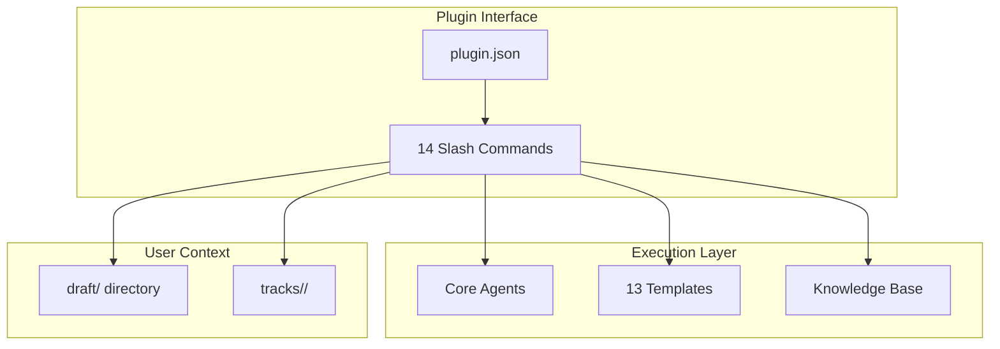
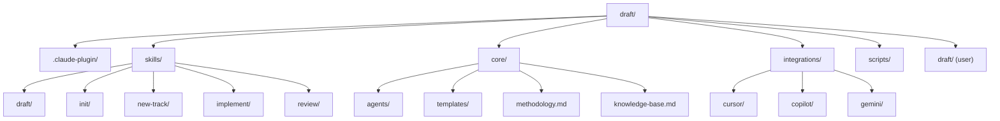
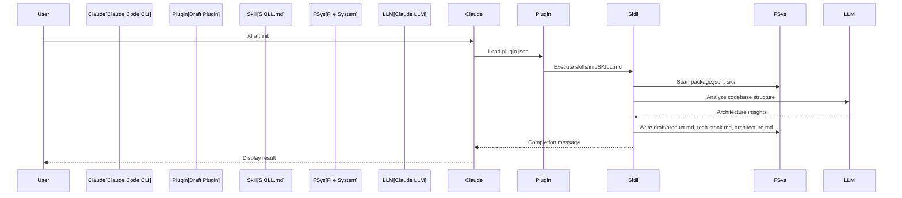
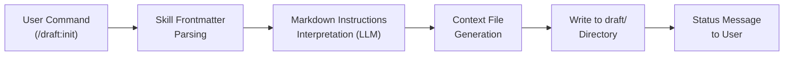
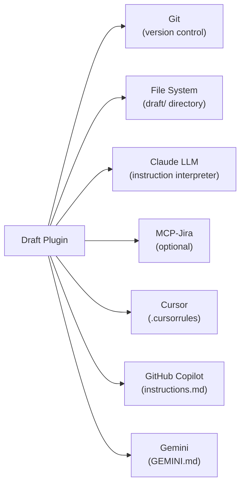
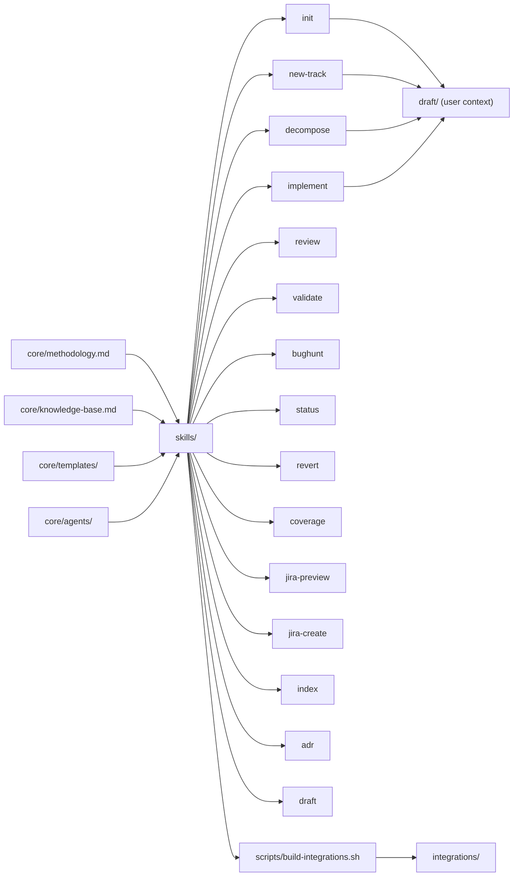

# Architecture: Draft Plugin

## System Overview

**Key Takeaway:** Draft is a Claude Code plugin that implements Context-Driven Development methodology, providing a suite of 15 slash commands (`/draft:*`) for structured software development through specifications and plans before implementation. It operationalizes the constraint hierarchy: `product.md` → `tech-stack.md` → `architecture.md` → `spec.md` → `plan.md`, ensuring AI systems work within pre-approved constraints rather than making autonomous decisions.

### System Architecture Diagram

---

## Phase 1: Orientation

### Directory Structure

| Directory | Responsibility | Key Files |
|-----------|---------------|-----------|
| `.claude-plugin/` | Plugin manifest & marketplace config | `plugin.json`, `marketplace.json` |
| `skills/` | Command implementations (15 skills) | `*/SKILL.md` |
| `core/agents/` | Specialized agents | `architect.md`, `reviewer.md`, `debugger.md`, `planner.md`, `rca.md` |
| `core/templates/` | Context file templates (15) | `ai-context.md`, `architecture.md`, `product.md`, `tech-stack.md`, `workflow.md`, `intake-questions.md`, `jira.md`, `dependency-graph.md`, `root-architecture.md`, `root-product.md`, `root-tech-stack.md`, `service-index.md`, `tech-matrix.md`, `spec.md`, `metadata.json` |
| `core/` | Methodology documentation | `methodology.md`, `knowledge-base.md` |
| `integrations/` | Generated integration files | `copilot/.github/copilot-instructions.md`, `gemini/GEMINI.md` |
| `scripts/` | Build automation | `build-integrations.sh` |
| `draft/` | User project context (generated) | `product.md`, `tech-stack.md`, `tracks.md`, `tracks/` |

### Entry Points & Critical Paths

| Entry Point | Type | File | Description |
|-------------|------|------|-------------|
| Plugin manifest | Claude Code | `.claude-plugin/plugin.json` | Declares plugin name, version, skills directory |
| Slash commands | User invocation | `skills/*/SKILL.md` | 15 commands: `/draft:init`, `/draft:new-track`, `/draft:implement`, `/draft:adr`, etc. |
| Build script | Developer workflow | `scripts/build-integrations.sh` | Regenerates Cursor/Copilot/Gemini integrations from skills |

### Request/Response Flow

### Tech Stack Inventory

| Category | Technology | Version | Config File |
|----------|-----------|---------|-------------|
| Plugin Framework | Claude Code Plugin API | v1.2.0 | `.claude-plugin/plugin.json` |
| Skill Format | Markdown + YAML frontmatter | - | `skills/*/SKILL.md` |
| Build Tool | Bash | 5.x | `scripts/build-integrations.sh` |
| Version Control | Git | 2.x | `.git/` |
| Documentation | Markdown, Mermaid | - | `*.md` |
| Integration Targets | Cursor, GitHub Copilot, Gemini | - | `integrations/*/` |

---

## Phase 2: Logic

### Data Lifecycle

### Primary Data Objects

| Object | Created At | Modified At | Persisted In | Key Fields |
|--------|-----------|-------------|--------------|------------|
| Project Context | `skills/init/SKILL.md` | `/draft:init refresh` | `draft/product.md`, `draft/tech-stack.md`, `draft/architecture.md` | Vision, stack, modules |
| Track | `skills/new-track/SKILL.md` | `/draft:implement`, `/draft:review` | `draft/tracks/<id>/` | spec.md, plan.md, metadata.json |
| Module Definition | `skills/decompose/SKILL.md` | Manual edits | `draft/tracks/<id>/architecture.md` | Modules, dependencies, API surface |
| Validation Report | `skills/validate/SKILL.md` | Re-run validation | `draft/validation-report.md`, `draft/tracks/<id>/validation-report.md` | Findings, severity |

### Design Patterns

| Pattern | Where Used | Purpose |
|---------|-----------|---------|
| **Frontmatter + Body** | `skills/*/SKILL.md` | Metadata (name, description) + execution instructions |
| **Template-Driven Generation** | `core/templates/*.md` | Consistent structure for product.md, spec.md, plan.md |
| **Constraint Hierarchy** | All skills | product.md → tech-stack.md → architecture.md → spec.md → plan.md |
| **Two-Stage Review** | `skills/review/SKILL.md`, `core/agents/reviewer.md` | Spec compliance first, code quality second |
| **Agent Delegation** | `skills/` referencing `core/agents/` | Specialized logic (architect, reviewer, debugger) |

### Anti-Patterns & Complexity Hotspots

| Location | Issue | Severity | Notes |
|----------|-------|----------|-------|
| `scripts/build-integrations.sh:466` | Hard-coded `tail -n +4` assumes 3-line preamble | Medium | Fragile if skill format changes |
| `index.html` | 3000+ lines of HTML/CSS/JS in single file | Medium | Marketing site, not critical |

### Conventions & Guardrails

| Convention | Pattern | Example |
|-----------|---------|---------|
| Status markers | `[ ]`, `[~]`, `[x]`, `[!]` | `[ ] Pending`, `[x] Completed` |
| Track IDs | kebab-case | `add-user-auth`, `fix-login-bug` |
| Skill naming | Lowercase, hyphenated | `new-track`, `jira-create` |
| File structure | Markdown with specific headings | `## Problem Statement`, `## Phases` |
| Commit messages | `type(scope): description` | `feat(review): add bughunt integration` |

### External Dependencies & Integrations

---

## Phase 3: Module Discovery

### Module Dependency Diagram

### Dependency Table

| Module | Depends On | Depended By | Circular? |
|--------|-----------|-------------|-----------|
| `core/methodology.md` | - | All skills | No |
| `core/knowledge-base.md` | - | `new-track`, `review`, `validate` | No |
| `core/templates/` | - | `init`, `new-track`, `decompose`, `index` | No |
| `core/agents/` | - | `decompose`, `implement`, `review`, `bughunt` | No |
| `skills/draft` | `methodology.md` | User entry point | No |
| `skills/init` | `methodology.md`, `templates/` | `new-track` | No |
| `skills/new-track` | `methodology.md`, `templates/`, `knowledge-base.md` | `implement` | No |
| `skills/decompose` | `agents/architect.md`, `templates/` | `implement` | No |
| `skills/implement` | `agents/architect.md`, `agents/debugger.md` | `review` | No |
| `skills/review` | `agents/reviewer.md`, `validate`, `bughunt` | - | No |
| `skills/validate` | `knowledge-base.md` | `review` | No |
| `skills/bughunt` | `agents/rca.md` | `review` | No |
| `skills/adr` | `methodology.md` | - | No |
| `scripts/build-integrations.sh` | `skills/` | `integrations/` | No |

### Modules

#### Module: core/methodology.md
- **Responsibility:** Master specification for Context-Driven Development philosophy, constraint hierarchy, workflow
- **Files:** `core/methodology.md`
- **API Surface:** Markdown documentation referenced by all skills
- **Dependencies:** None (foundational)
- **Complexity:** High (10,000+ lines)
- **Story:** Defines the entire Draft methodology including problem statement, solution approach, constraint hierarchy, command reference, and workflow — see [core/methodology.md:1-10000](core/methodology.md)
- **Status:** [x] Existing

#### Module: core/knowledge-base.md
- **Responsibility:** Vetted sources for architectural guidance (books, patterns, standards)
- **Files:** `core/knowledge-base.md`
- **API Surface:** Citation format for guidance: `"Consider CQRS (DDIA, Ch. 11)"`
- **Dependencies:** None
- **Complexity:** Medium
- **Story:** Provides grounded, citation-backed architectural advice during track creation and review — see [core/knowledge-base.md:1-500](core/knowledge-base.md)
- **Status:** [x] Existing

#### Module: core/templates/
- **Responsibility:** Template files for all generated context artifacts
- **Files:** `core/templates/ai-context.md`, `architecture.md`, `product.md`, `tech-stack.md`, `workflow.md`, `spec.md`, `intake-questions.md`, `jira.md`, `dependency-graph.md`, `root-architecture.md`, `root-product.md`, `root-tech-stack.md`, `service-index.md`, `tech-matrix.md`, `metadata.json` (15 files)
- **API Surface:** Markdown templates with placeholder sections
- **Dependencies:** None
- **Complexity:** Low
- **Story:** Ensures consistent structure for all user-facing Draft files. Includes monorepo templates (`root-*`, `service-index`, `tech-matrix`) added for `/draft:index` support — see [core/templates/](core/templates/)
- **Status:** [x] Existing

#### Module: core/agents/
- **Responsibility:** Specialized agent behaviors for architecture design, review, debugging, planning
- **Files:** `architect.md`, `reviewer.md`, `debugger.md`, `planner.md`, `rca.md`
- **API Surface:** Markdown instructions for specific agent roles
- **Dependencies:** None
- **Complexity:** Medium
- **Story:** Provides expert-level processes for complex tasks like two-stage review, module decomposition, systematic debugging — see [core/agents/](core/agents/)
- **Status:** [x] Existing

#### Module: skills/draft
- **Responsibility:** Overview of Draft methodology and command routing
- **Files:** `skills/draft/SKILL.md`
- **API Surface:** `/draft:draft` command
- **Dependencies:** `core/methodology.md`
- **Complexity:** Low
- **Story:** Entry point explaining Draft philosophy and available commands — see [skills/draft/SKILL.md:1-50](skills/draft/SKILL.md)
- **Status:** [x] Existing

#### Module: skills/init
- **Responsibility:** Project discovery and initial context file generation (brownfield and greenfield)
- **Files:** `skills/init/SKILL.md`
- **API Surface:** `/draft:init`, `/draft:init refresh` command
- **Dependencies:** `core/templates/`, `core/methodology.md`
- **Complexity:** High
- **Story:** Scans codebase, detects tech stack, generates product.md, tech-stack.md, architecture.md (brownfield only) — see [skills/init/SKILL.md:1-300](skills/init/SKILL.md)
- **Status:** [x] Existing

#### Module: skills/new-track
- **Responsibility:** Collaborative intake process for creating feature/bugfix tracks
- **Files:** `skills/new-track/SKILL.md`
- **API Surface:** `/draft:new-track <description>` command
- **Dependencies:** `core/templates/intake-questions.md`, `core/knowledge-base.md`, `core/methodology.md`
- **Complexity:** High
- **Story:** Guides user through structured questions, generates spec.md and plan.md with AI collaboration — see [skills/new-track/SKILL.md:1-400](skills/new-track/SKILL.md)
- **Status:** [x] Existing

#### Module: skills/decompose
- **Responsibility:** Module decomposition and dependency analysis for tracks
- **Files:** `skills/decompose/SKILL.md`
- **API Surface:** `/draft:decompose` command
- **Dependencies:** `core/agents/architect.md`, `core/templates/architecture.md`, `core/templates/dependency-graph.md`
- **Complexity:** High
- **Story:** Creates track-level architecture.md with module definitions, mermaid diagrams, dependency order — see [skills/decompose/SKILL.md:1-250](skills/decompose/SKILL.md)
- **Status:** [x] Existing

#### Module: skills/implement
- **Responsibility:** TDD-driven task execution with optional Story writing (architecture mode)
- **Files:** `skills/implement/SKILL.md`
- **API Surface:** `/draft:implement` command
- **Dependencies:** `core/agents/architect.md`, `core/agents/debugger.md`, `core/methodology.md`
- **Complexity:** High
- **Story:** Executes tasks from plan.md using RED → GREEN → REFACTOR workflow — see [skills/implement/SKILL.md:1-500](skills/implement/SKILL.md)
- **Status:** [x] Existing

#### Module: skills/review
- **Responsibility:** Orchestrates two-stage code review (spec compliance + code quality)
- **Files:** `skills/review/SKILL.md`
- **API Surface:** `/draft:review --track <id>` command
- **Dependencies:** `core/agents/reviewer.md`, `skills/validate`, `skills/bughunt`, `core/knowledge-base.md`
- **Complexity:** High
- **Story:** Runs spec compliance check first, then code quality; integrates validate and bughunt — see [skills/review/SKILL.md:1-300](skills/review/SKILL.md)
- **Status:** [x] Existing

#### Module: skills/validate
- **Responsibility:** Codebase quality validation (architecture, security, performance)
- **Files:** `skills/validate/SKILL.md`
- **API Surface:** `/draft:validate --track <id>` command
- **Dependencies:** `core/knowledge-base.md`, `core/methodology.md`
- **Complexity:** Medium
- **Story:** Checks architecture conformance, OWASP security patterns, performance anti-patterns — see [skills/validate/SKILL.md:1-200](skills/validate/SKILL.md)
- **Status:** [x] Existing

#### Module: skills/bughunt
- **Responsibility:** Exhaustive bug hunting using Draft context
- **Files:** `skills/bughunt/SKILL.md`
- **API Surface:** `/draft:bughunt --track <id>` command
- **Dependencies:** `core/agents/rca.md`, `core/methodology.md`
- **Complexity:** High
- **Story:** Analyzes code across 12 dimensions, produces severity-ranked bug report with verification protocol — see [skills/bughunt/SKILL.md:1-300](skills/bughunt/SKILL.md)
- **Status:** [x] Existing

#### Module: skills/status
- **Responsibility:** Progress reporting for active tracks
- **Files:** `skills/status/SKILL.md`
- **API Surface:** `/draft:status` command
- **Dependencies:** None (read-only)
- **Complexity:** Low
- **Story:** Parses metadata.json, plan.md, tracks.md to display completion percentages and blockers — see [skills/status/SKILL.md:1-100](skills/status/SKILL.md)
- **Status:** [x] Existing

#### Module: skills/revert
- **Responsibility:** Git-aware rollback of track work (task, phase, or full track)
- **Files:** `skills/revert/SKILL.md`
- **API Surface:** `/draft:revert <track-id> <scope>` command
- **Dependencies:** Git history
- **Complexity:** Medium
- **Story:** Reverts commits while preserving Draft context (spec.md, plan.md) — see [skills/revert/SKILL.md:1-150](skills/revert/SKILL.md)
- **Status:** [x] Existing

#### Module: skills/coverage
- **Responsibility:** Code coverage analysis targeting 95%+
- **Files:** `skills/coverage/SKILL.md`
- **API Surface:** `/draft:coverage --track <id>` command
- **Dependencies:** Coverage tools (Jest, pytest, etc.)
- **Complexity:** Medium
- **Story:** Computes coverage, reports gaps, justifies uncovered lines — see [skills/coverage/SKILL.md:1-100](skills/coverage/SKILL.md)
- **Status:** [x] Existing

#### Module: skills/jira-preview
- **Responsibility:** Generate Jira export preview from track plan
- **Files:** `skills/jira-preview/SKILL.md`
- **API Surface:** `/draft:jira-preview <track-id>` command
- **Dependencies:** `core/templates/jira.md`
- **Complexity:** Low
- **Story:** Maps track → epic, phase → story, task → sub-task; outputs jira-export.md — see [skills/jira-preview/SKILL.md:1-100](skills/jira-preview/SKILL.md)
- **Status:** [x] Existing

#### Module: skills/jira-create
- **Responsibility:** Create Jira issues via MCP-Jira integration
- **Files:** `skills/jira-create/SKILL.md`
- **API Surface:** `/draft:jira-create <track-id>` command
- **Dependencies:** MCP-Jira server, `skills/jira-preview`
- **Complexity:** Medium
- **Story:** Reads jira-export.md, calls MCP API to create epics/stories/subtasks — see [skills/jira-create/SKILL.md:1-100](skills/jira-create/SKILL.md)
- **Status:** [x] Existing

#### Module: skills/index
- **Responsibility:** Monorepo service aggregation and federated knowledge index
- **Files:** `skills/index/SKILL.md`
- **API Surface:** `/draft:index` command
- **Dependencies:** `core/templates/root-architecture.md`, `core/templates/service-index.md`, `core/templates/tech-matrix.md`
- **Complexity:** High
- **Story:** Scans child services, aggregates Draft contexts, builds root-level product.md and architecture.md — see [skills/index/SKILL.md:1-400](skills/index/SKILL.md)
- **Status:** [x] Existing

#### Module: skills/adr
- **Responsibility:** Architecture Decision Record creation and management
- **Files:** `skills/adr/SKILL.md`
- **API Surface:** `/draft:adr [title|list|supersede <number>]` command
- **Dependencies:** `core/methodology.md`
- **Complexity:** Low
- **Story:** Creates and manages ADRs in `draft/adrs/` directory, documenting significant technical decisions with context, alternatives considered, and consequences — see [skills/adr/SKILL.md:1-150](skills/adr/SKILL.md)
- **Status:** [x] Existing

#### Module: scripts/build-integrations.sh
- **Responsibility:** Auto-generate Cursor/Copilot/Gemini integration files from skills
- **Files:** `scripts/build-integrations.sh`
- **API Surface:** Bash script (run manually or via CI)
- **Dependencies:** `skills/*/SKILL.md`
- **Complexity:** Medium
- **Story:** Extracts frontmatter + body from all SKILL.md files, generates `.cursorrules`, `copilot-instructions.md`, `GEMINI.md` — see [scripts/build-integrations.sh:1-500](scripts/build-integrations.sh)
- **Status:** [x] Existing

### Dependency Order

1. `core/methodology.md`, `core/knowledge-base.md`, `core/templates/`, `core/agents/` (foundational)
2. `skills/draft`, `skills/init` (project setup)
3. `skills/new-track`, `skills/decompose`, `skills/adr` (track creation & decision documentation)
4. `skills/implement`, `skills/validate`, `skills/bughunt` (execution)
5. `skills/review` (depends on validate, bughunt)
6. `skills/status`, `skills/revert`, `skills/coverage`, `skills/jira-preview`, `skills/jira-create`, `skills/index` (auxiliary)
7. `scripts/build-integrations.sh`, `integrations/` (deployment)

---

## Notes

- Draft is a **methodology project**, not a runtime application — skills are markdown instructions interpreted by Claude LLM
- **Source of truth hierarchy:** `core/methodology.md` → `skills/` → `integrations/` (generated)
- Integration files (`.cursorrules`, `copilot-instructions.md`, `GEMINI.md`) are auto-generated — never edit directly
- After editing skills, run `./scripts/build-integrations.sh` to regenerate integrations
- User-facing Draft files (`draft/product.md`, `draft/tracks.md`, etc.) are created by `/draft:init` and `/draft:new-track`
- Architecture mode is automatically enabled when `architecture.md` exists (project-level or track-level)
- For detailed command workflows, see individual `skills/*/SKILL.md` files
