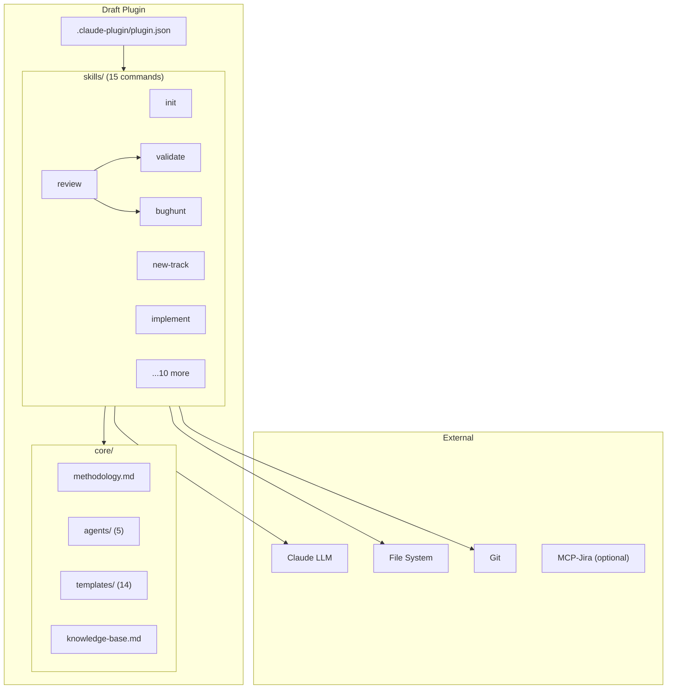
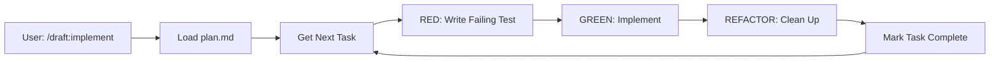
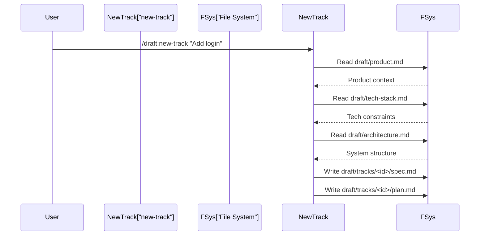
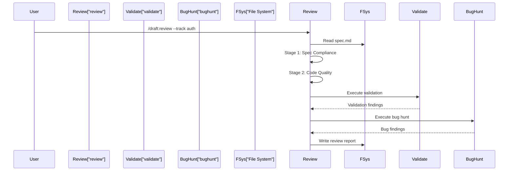

# Architecture: Draft Plugin

> Human-readable engineering reference. 30-45 pages.
> For token-optimized AI context, see `draft/.ai-context.md`.

---

## Table of Contents

1. [Executive Summary](#1-executive-summary)
2. [AI Agent Quick Reference](#2-ai-agent-quick-reference)
3. [System Identity & Purpose](#3-system-identity--purpose)
4. [Architecture Overview](#4-architecture-overview)
5. [Component Map & Interactions](#5-component-map--interactions)
6. [Data Flow — End to End](#6-data-flow--end-to-end)
7. [Core Modules Deep Dive](#7-core-modules-deep-dive)
8. [Concurrency Model & Thread Safety](#8-concurrency-model--thread-safety)
9. [Framework & Extension Points](#9-framework--extension-points)
10. [Full Catalog of Implementations](#10-full-catalog-of-implementations)
11. [API & Interface Definitions](#11-api--interface-definitions)
12. [External Dependencies](#12-external-dependencies)
13. [Cross-Module Integration Points](#13-cross-module-integration-points)
14. [Critical Invariants & Safety Rules](#14-critical-invariants--safety-rules)
15. [Security Architecture](#15-security-architecture)
16. [Error Handling & Failure Modes](#16-error-handling--failure-modes)
17. [State Management & Persistence](#17-state-management--persistence)
18. [Key Design Patterns](#18-key-design-patterns)
19. [Configuration & Tuning](#19-configuration--tuning)
20. [How to Extend — Step-by-Step Cookbooks](#20-how-to-extend--step-by-step-cookbooks)
21. [Build System & Development Workflow](#21-build-system--development-workflow)
22. [Testing Infrastructure](#22-testing-infrastructure)
23. [Known Technical Debt & Limitations](#23-known-technical-debt--limitations)
24. [Glossary](#24-glossary)
25. [Appendix A: File Structure Summary](#appendix-a-file-structure-summary)
26. [Appendix B: Data Source → Implementation Mapping](#appendix-b-data-source--implementation-mapping)

---

## 1. Executive Summary

Draft is a Claude Code plugin implementing Context-Driven Development methodology. It provides 15 slash commands (`/draft:*`) for structured software development through specifications and plans before implementation. The plugin operationalizes a constraint hierarchy: `product.md` → `tech-stack.md` → `architecture.md` → `spec.md` → `plan.md`, ensuring AI systems work within pre-approved constraints.

**Key Facts:**
- **Primary language**: Markdown (skills as LLM-interpreted instructions)
- **Entry point**: `.claude-plugin/plugin.json` manifest
- **Architecture style**: Document-driven methodology (no runtime code)
- **Version**: 1.3.0
- **Components**: 15 skills, 5 agents, 14 templates
- **Primary data sources**: User's codebase, `draft/` context files
- **Primary action targets**: File system (`draft/` directory), Git

---

## 2. AI Agent Quick Reference

```
**Module**           : draft
**Root Path**        : ./
**Language**         : Markdown + YAML frontmatter + Bash
**Build**            : ./scripts/build-integrations.sh
**Test**             : Manual slash command invocation
**Entry Point**      : .claude-plugin/plugin.json → skills/*/SKILL.md
**Config System**    : YAML frontmatter in SKILL.md files
**Extension Point**  : Create skills/<name>/SKILL.md with frontmatter
**API Definition**   : Slash commands (/draft:<name>)
**Key Config Prefix**: N/A (no runtime config)

**Before Making Changes, Always:**
1. Check core/methodology.md for workflow constraints
2. Verify skill frontmatter format (name, description required)
3. Run ./scripts/build-integrations.sh after skill changes
4. Test command via Claude Code CLI

**Never:**
- Edit integration files directly (copilot-instructions.md, GEMINI.md)
- Modify skill body structure without updating build script
- Skip frontmatter metadata in new skills
```

---

## 3. System Identity & Purpose

### What Draft Does

1. **Initializes project context** — `/draft:init` scans codebase, generates product.md, tech-stack.md, architecture.md
2. **Manages feature tracks** — `/draft:new-track` creates spec.md + plan.md for features/bugs
3. **Executes implementation** — `/draft:implement` follows TDD workflow (RED→GREEN→REFACTOR)
4. **Validates quality** — `/draft:validate`, `/draft:bughunt`, `/draft:review` check code quality
5. **Integrates with tools** — `/draft:jira-preview`, `/draft:jira-create` for Jira export
6. **Supports monorepos** — `/draft:index` aggregates service contexts

### Why Draft Exists

Without Draft, AI-assisted development suffers from:
- **Context loss** — AI lacks product vision, tech constraints, prior decisions
- **Specification drift** — Implementation diverges from requirements
- **Quality inconsistency** — No systematic validation or review process
- **Collaboration friction** — No shared structure for feature planning

---

## 4. Architecture Overview

### 4.1 High-Level Topology



### 4.2 Process Lifecycle

1. **Plugin Load**: Claude Code reads `.claude-plugin/plugin.json`
2. **Command Parse**: User invokes `/draft:<command> [args]`
3. **Skill Load**: Plugin loads `skills/<command>/SKILL.md`
4. **Frontmatter Parse**: Extract `name`, `description` metadata
5. **Instruction Execute**: Claude LLM interprets markdown body
6. **File Operations**: Skill reads/writes to `draft/` directory
7. **Status Report**: Completion message to user

---

## 5. Component Map & Interactions

### 5.1 Top-Level Orchestrator

The plugin manifest (`.claude-plugin/plugin.json`) declares the skill directory. Claude Code routes commands to corresponding `SKILL.md` files.

**Owned Components:**

| Component | Type | Purpose |
|-----------|------|---------|
| `skills/` | Directory | 15 slash command implementations |
| `core/agents/` | Directory | 5 specialized agent behaviors |
| `core/templates/` | Directory | 14 file templates |
| `core/methodology.md` | File | Master methodology specification |
| `core/knowledge-base.md` | File | Architectural guidance sources |
| `scripts/build-integrations.sh` | Script | Integration file generator |

### 5.2 Dependency Injection / Wiring Pattern

Skills reference other components via markdown include-style instructions:
- "Use the template from `core/templates/product.md`"
- "Follow the reviewer agent behavior in `core/agents/reviewer.md`"

No runtime DI — all wiring is declarative in skill bodies.

### 5.3 Interaction Matrix

| | init | new-track | implement | review | validate | bughunt |
|---|---|---|---|---|---|---|
| init | — | provides context | provides context | — | — | — |
| new-track | reads draft/ | — | provides plan.md | — | — | — |
| implement | — | reads plan.md | — | — | — | — |
| review | — | reads spec.md | — | — | calls | calls |
| validate | reads tech-stack | — | — | called by | — | — |
| bughunt | reads architecture | — | — | called by | — | — |

---

## 6. Data Flow — End to End

### 6.1 Project Initialization Flow


### 6.2 Track Creation Flow


### 6.3 Implementation Flow



### 6.4 Review Flow


---

## 7. Core Modules Deep Dive

### 7.1 core/methodology.md

**Role**: Master specification for Context-Driven Development philosophy.

**Source Files**:
- `core/methodology.md` — 10,000+ lines

**Responsibilities**:
1. Define constraint hierarchy (product → tech-stack → architecture → spec → plan)
2. Specify workflow phases (intake, planning, implementation, review)
3. Document all 15 commands with usage patterns
4. Establish quality disciplines (TDD, two-stage review, validation)

**Notable Mechanisms**:
- Status markers: `[ ]` Pending, `[~]` In Progress, `[x]` Completed, `[!]` Blocked
- Track lifecycle: Draft → Active → Review → Completed/Archived

---

### 7.2 skills/init

**Role**: Project discovery and initial context file generation.

**Source Files**:
- `skills/init/SKILL.md` — 1970 lines

**Responsibilities**:
1. Detect brownfield vs greenfield projects
2. Scan and detect tech stack from manifests
3. Execute 5-phase architecture discovery
4. Generate architecture.md (30-45 pages)
5. Derive .ai-context.md (200-400 lines, token-optimized)
6. Generate product.md, tech-stack.md, workflow.md, tracks.md

**Key Operations**:

| Operation | Purpose |
|-----------|---------|
| Pre-Check | Detect existing draft/, monorepo, migration scenarios |
| Refresh Mode | Incremental update using synced_to_commit metadata |
| Architecture Discovery | 5-phase exhaustive codebase analysis |
| Condensation Subroutine | Transform architecture.md → .ai-context.md |

---

### 7.3 skills/new-track

**Role**: Collaborative intake process for creating feature/bugfix tracks.

**Source Files**:
- `skills/new-track/SKILL.md`

**Responsibilities**:
1. Guide user through structured intake questions
2. Load and apply context from product.md, tech-stack.md, architecture.md
3. Generate spec.md with problem statement, scope, success criteria
4. Generate plan.md with phases and tasks
5. Create metadata.json for track state
6. Update tracks.md with new track entry

---

### 7.4 skills/implement

**Role**: TDD-driven task execution.

**Source Files**:
- `skills/implement/SKILL.md`

**Responsibilities**:
1. Load current task from plan.md
2. Execute RED → GREEN → REFACTOR cycle
3. Update task status markers
4. Track progress in metadata.json
5. Invoke debugger agent on failures

---

### 7.5 core/agents/reviewer.md

**Role**: Two-stage code review process.

**Source Files**:
- `core/agents/reviewer.md`

**Responsibilities**:
1. Stage 1: Spec compliance check (does code match spec.md?)
2. Stage 2: Code quality check (patterns, security, performance)
3. Generate actionable feedback with file:line references
4. Integrate with validate and bughunt outputs

---

## 8. Concurrency Model & Thread Safety

**Execution Model**: Single-threaded (LLM instruction interpretation).

Draft skills are markdown instructions executed sequentially by Claude LLM. No concurrent execution, no shared state beyond file system.

**File System Considerations**:
- Multiple `/draft:implement` sessions on same track could cause conflicts
- Recommendation: One active implementation session per track

---

## 9. Framework & Extension Points

### 9.1 Skill Types

| Type | Interface | Description |
|------|-----------|-------------|
| Skill | `skills/<name>/SKILL.md` | Slash command implementation |
| Agent | `core/agents/<name>.md` | Specialized behavior (reviewer, debugger, etc.) |
| Template | `core/templates/<name>.md` | File generation template |

### 9.2 Registration Mechanism

Skills are auto-discovered by Claude Code from the `skills/` directory. No explicit registration required.

**Requirements**:
- Directory: `skills/<command-name>/`
- File: `SKILL.md` with YAML frontmatter

### 9.3 Frontmatter Schema

```yaml
---
name: skill-name        # Required: slash command name
description: Brief text  # Required: shown in /help
---
```

---

## 10. Full Catalog of Implementations

### 10.1 Skills (15)

| # | Skill | Command | Purpose |
|---|-------|---------|---------|
| 1 | draft | `/draft:draft` | Methodology overview, command routing |
| 2 | init | `/draft:init` | Project discovery, context generation |
| 3 | new-track | `/draft:new-track` | Create feature/bug track |
| 4 | implement | `/draft:implement` | TDD task execution |
| 5 | review | `/draft:review` | Two-stage code review |
| 6 | validate | `/draft:validate` | Quality validation |
| 7 | bughunt | `/draft:bughunt` | Exhaustive bug hunting |
| 8 | status | `/draft:status` | Progress reporting |
| 9 | revert | `/draft:revert` | Git-aware rollback |
| 10 | coverage | `/draft:coverage` | Code coverage analysis |
| 11 | decompose | `/draft:decompose` | Module decomposition |
| 12 | adr | `/draft:adr` | Architecture Decision Records |
| 13 | index | `/draft:index` | Monorepo service aggregation |
| 14 | jira-preview | `/draft:jira-preview` | Generate Jira export preview |
| 15 | jira-create | `/draft:jira-create` | Create Jira issues via MCP |

### 10.2 Agents (5)

| Agent | File | Purpose |
|-------|------|---------|
| architect | `core/agents/architect.md` | Module design, dependency analysis |
| reviewer | `core/agents/reviewer.md` | Two-stage code review |
| debugger | `core/agents/debugger.md` | Systematic debugging |
| planner | `core/agents/planner.md` | Task breakdown, phase planning |
| rca | `core/agents/rca.md` | Root cause analysis |

### 10.3 Templates (14)

| Template | File | Used By |
|----------|------|---------|
| ai-context | `core/templates/ai-context.md` | init |
| architecture | `core/templates/architecture.md` | init, decompose |
| product | `core/templates/product.md` | init |
| tech-stack | `core/templates/tech-stack.md` | init |
| workflow | `core/templates/workflow.md` | init |
| spec | `core/templates/spec.md` | new-track |
| intake-questions | `core/templates/intake-questions.md` | new-track |
| jira | `core/templates/jira.md` | jira-preview |
| dependency-graph | `core/templates/dependency-graph.md` | decompose |
| root-architecture | `core/templates/root-architecture.md` | index |
| root-product | `core/templates/root-product.md` | index |
| root-tech-stack | `core/templates/root-tech-stack.md` | index |
| service-index | `core/templates/service-index.md` | index |
| tech-matrix | `core/templates/tech-matrix.md` | index |

---

## 11. API & Interface Definitions

### 11.1 Slash Commands

| Command | Arguments | Purpose |
|---------|-----------|---------|
| `/draft:draft` | — | Show methodology overview |
| `/draft:init` | `[refresh]` | Initialize or refresh context |
| `/draft:new-track` | `<description>` | Create new feature/bug track |
| `/draft:implement` | — | Execute next task from plan |
| `/draft:review` | `[--track <id>]` | Run two-stage review |
| `/draft:validate` | `[--track <id>]` | Run quality validation |
| `/draft:bughunt` | `[--track <id>]` | Run bug hunting |
| `/draft:status` | — | Show track progress |
| `/draft:revert` | `<track-id> <scope>` | Rollback work |
| `/draft:coverage` | `[--track <id>]` | Analyze coverage |
| `/draft:decompose` | — | Decompose into modules |
| `/draft:adr` | `[title\|list\|supersede <n>]` | Manage ADRs |
| `/draft:index` | — | Aggregate monorepo services |
| `/draft:jira-preview` | `<track-id>` | Generate Jira export |
| `/draft:jira-create` | `<track-id>` | Create Jira issues |

### 11.2 Generated Files

| File | Created By | Purpose |
|------|-----------|---------|
| `draft/product.md` | init | Product vision, users, goals |
| `draft/tech-stack.md` | init | Languages, frameworks, patterns |
| `draft/architecture.md` | init | 30-45 page engineering reference |
| `draft/.ai-context.md` | init | Token-optimized AI context |
| `draft/workflow.md` | init | TDD preferences, commit strategy |
| `draft/tracks.md` | init | Master track list |
| `draft/tracks/<id>/spec.md` | new-track | Feature specification |
| `draft/tracks/<id>/plan.md` | new-track | Implementation plan |
| `draft/tracks/<id>/metadata.json` | new-track | Track state |

---

## 12. External Dependencies

### 12.1 Service Dependencies

| Service | Usage |
|---------|-------|
| Claude LLM | Interprets skill instructions, generates content |
| File System | Reads codebase, writes draft/ files |
| Git | Version control, commit history for revert |
| MCP-Jira (optional) | Creates Jira issues from export |

### 12.2 Infrastructure

| Tool | Usage |
|------|-------|
| Claude Code CLI | Plugin host, command routing |
| Bash | Build script execution |

---

## 13. Cross-Module Integration Points

### 13.1 init → new-track

**Contract**: new-track expects `draft/product.md`, `draft/tech-stack.md`, `draft/architecture.md` to exist.

**Sequence**:


### 13.2 review → validate + bughunt

**Contract**: review orchestrates validate and bughunt, aggregates results.

**Sequence**:


---

## 14. Critical Invariants & Safety Rules

### [DATA] Constraint Hierarchy

**What**: product.md → tech-stack.md → architecture.md → spec.md → plan.md must be respected.

**Why**: Violating hierarchy causes specification drift. Implementation diverges from product vision.

**Where Enforced**: All skills read upstream files before generating downstream files.

**Common Violation Patterns**:
1. Editing plan.md directly without updating spec.md
2. Implementing features not in product.md scope
3. Using technologies not approved in tech-stack.md

---

### [DATA] YAML Frontmatter Required

**What**: All SKILL.md files must have YAML frontmatter with `name` and `description`.

**Why**: Claude Code uses frontmatter for command registration and help text.

**Where Enforced**: Build script parses frontmatter; fails silently on malformed files.

**Common Violation Patterns**:
1. Missing `---` delimiters
2. Typos in `name` field (command won't register)

---

### [DATA] Synced Commit Tracking

**What**: `synced_to_commit` in architecture.md metadata tracks last analyzed commit.

**Why**: Enables incremental refresh without full re-analysis.

**Where Enforced**: `skills/init/SKILL.md` refresh mode.

---

### [ORD] Build After Skill Changes

**What**: Run `./scripts/build-integrations.sh` after any skill modification.

**Why**: Integration files (copilot-instructions.md, GEMINI.md) are generated from skills.

**Where Enforced**: Manual discipline, documented in CLAUDE.md.

---

### [COMPAT] Skill Body Format

**What**: Skill body must start with `# Title` heading followed by blank line.

**Why**: Build script uses `tail -n +4` to skip first 3 lines (frontmatter + blank + title).

**Where Enforced**: `scripts/build-integrations.sh:466`

---

## 15. Security Architecture

**Authentication**: N/A (plugin runs locally in Claude Code CLI).

**Authorization**: File system permissions govern write access.

**Secrets Management**: MCP-Jira credentials managed by MCP server config, not Draft.

**Data Handling**: Draft reads but does not transmit code externally (except to Claude LLM for analysis).

---

## 16. Error Handling & Failure Modes

### Error Propagation

Skills provide inline error guidance:
- "If X fails, try Y"
- "If validation fails, do not proceed"

No structured error types — errors are natural language in skill output.

### Common Failure Modes

| Scenario | Symptoms | Recovery |
|----------|----------|----------|
| Missing draft/ | "Project not initialized" | Run /draft:init |
| Missing track | "Track not found" | Check tracks.md, verify track ID |
| Build script fails | No integration file output | Check SKILL.md frontmatter format |
| Git not initialized | Revert commands fail | Initialize git repository |

---

## 17. State Management & Persistence

### State Inventory

| State | Storage | Durability |
|-------|---------|------------|
| Project context | `draft/*.md` | Persistent (file system) |
| Track state | `draft/tracks/<id>/*` | Persistent (file system) |
| Task progress | `plan.md` markers, `metadata.json` | Persistent (file system) |

### Recovery

All state in markdown files. Recovery = read files. No complex reconstruction.

---

## 18. Key Design Patterns

### 18.1 Frontmatter + Body Pattern

**Description**: YAML metadata header followed by markdown instructions. Separates registration data from execution logic.

**Where Used**:
- `skills/*/SKILL.md` — all 15 skills

**Implementation**:
```yaml
---
name: init
description: Initialize Draft project context
---

# Draft Init

You are initializing a Draft project...
```

---

### 18.2 Template-Driven Generation

**Description**: Skills reference templates in `core/templates/` for consistent file structure.

**Where Used**:
- `skills/init` → `core/templates/product.md`, `core/templates/tech-stack.md`
- `skills/new-track` → `core/templates/spec.md`

---

### 18.3 Agent Delegation

**Description**: Complex behaviors extracted to `core/agents/` for reuse across skills.

**Where Used**:
- `skills/review` → `core/agents/reviewer.md`
- `skills/implement` → `core/agents/debugger.md`
- `skills/decompose` → `core/agents/architect.md`

---

### 18.4 Status Markers

**Description**: Standard markers for tracking progress in markdown.

**Pattern**:
- `[ ]` — Pending
- `[~]` — In Progress
- `[x]` — Completed
- `[!]` — Blocked

**Where Used**: `plan.md`, `tracks.md`, `spec.md`

---

## 19. Configuration & Tuning

### 19.1 Plugin Configuration

| Parameter | Location | Default | Purpose |
|-----------|----------|---------|---------|
| `name` | plugin.json | `draft` | Plugin identifier |
| `version` | plugin.json | `1.3.0` | Semantic version |
| `skills` | Directory | `skills/` | Skill discovery path |

### 19.2 Workflow Configuration

| Parameter | Location | Options | Purpose |
|-----------|----------|---------|---------|
| TDD mode | workflow.md | strict/flexible/none | Test-first discipline |
| Auto-validate | workflow.md | true/false | Run validation on completion |
| Commit strategy | workflow.md | atomic/batch | Commit frequency |

---

## 20. How to Extend — Step-by-Step Cookbooks

### 20.1 How to Add a New Skill

1. **Create directory**: `skills/<skill-name>/`
2. **Create SKILL.md** with frontmatter:
   ```yaml
   ---
   name: skill-name
   description: Brief description for /help
   ---

   # Skill Title

   Execution instructions...
   ```
3. **Reference core resources** as needed:
   - Templates: `core/templates/<name>.md`
   - Agents: `core/agents/<name>.md`
   - Methodology: `core/methodology.md`
4. **Rebuild integrations**: `./scripts/build-integrations.sh`
5. **Test**: Invoke `/draft:<skill-name>` in Claude Code

### 20.2 How to Add a New Template

1. **Create file**: `core/templates/<name>.md`
2. **Define structure** with placeholder sections
3. **Reference from skills** that need it

### 20.3 How to Add a New Agent

1. **Create file**: `core/agents/<name>.md`
2. **Define specialized behavior** in markdown
3. **Reference from skills**: "Follow the <agent> behavior in `core/agents/<name>.md`"

---

## 21. Build System & Development Workflow

### Build System

- **Tool**: Bash
- **Script**: `scripts/build-integrations.sh`

### Key Build Targets

| Command | Output |
|---------|--------|
| `./scripts/build-integrations.sh` | Regenerates `copilot-instructions.md`, `GEMINI.md` |

### Development Workflow

1. Edit skills in `skills/*/SKILL.md`
2. Run `./scripts/build-integrations.sh`
3. Test command via Claude Code CLI
4. Commit changes

---

## 22. Testing Infrastructure

### Test Framework

Manual testing via Claude Code CLI command invocation.

### Test Patterns

- Invoke each command with various arguments
- Verify expected files created/modified
- Check output messages for correctness

### Build Script Test

`tests/test-build.sh` validates build script output structure.

---

## 23. Known Technical Debt & Limitations

### Build Script Fragility

**Location**: `scripts/build-integrations.sh:466`
**Issue**: Hard-coded `tail -n +4` assumes 3-line preamble (frontmatter + blank + title)
**Impact**: If skill format changes, build breaks silently
**Mitigation**: Document format requirement in CLAUDE.md

### index.html Complexity

**Location**: `index.html`
**Issue**: 3000+ lines of HTML/CSS/JS in single file
**Impact**: Marketing site maintenance difficulty
**Mitigation**: Not critical — separate from plugin functionality

---

## 24. Glossary

| Term | Definition |
|------|------------|
| **Brownfield** | Existing codebase with established structure |
| **Constraint hierarchy** | product.md → tech-stack.md → architecture.md → spec.md → plan.md |
| **Draft** | The plugin and methodology name |
| **Greenfield** | New project with minimal existing code |
| **Intake** | Structured question process for track creation |
| **Monorepo** | Repository containing multiple services/packages |
| **Skill** | A slash command implementation in `skills/*/SKILL.md` |
| **Spec** | Specification document (`spec.md`) defining feature requirements |
| **Track** | A feature or bug work unit with spec.md, plan.md, metadata.json |
| **TDD** | Test-Driven Development (RED → GREEN → REFACTOR) |
| **Two-stage review** | Spec compliance check, then code quality check |

---

## Appendix A: File Structure Summary

```
draft/
├── .claude-plugin/
│   └── plugin.json              ← Plugin manifest
├── skills/                      ← 15 slash command implementations
│   ├── draft/SKILL.md
│   ├── init/SKILL.md
│   ├── new-track/SKILL.md
│   ├── implement/SKILL.md
│   ├── review/SKILL.md
│   ├── validate/SKILL.md
│   ├── bughunt/SKILL.md
│   ├── status/SKILL.md
│   ├── revert/SKILL.md
│   ├── coverage/SKILL.md
│   ├── decompose/SKILL.md
│   ├── adr/SKILL.md
│   ├── index/SKILL.md
│   ├── jira-preview/SKILL.md
│   └── jira-create/SKILL.md
├── core/
│   ├── methodology.md           ← Master methodology spec
│   ├── knowledge-base.md        ← Architectural guidance sources
│   ├── agents/                  ← 5 specialized agents
│   │   ├── architect.md
│   │   ├── reviewer.md
│   │   ├── debugger.md
│   │   ├── planner.md
│   │   └── rca.md
│   └── templates/               ← 14 file templates
│       ├── ai-context.md
│       ├── architecture.md
│       ├── product.md
│       ├── tech-stack.md
│       ├── workflow.md
│       ├── spec.md
│       ├── intake-questions.md
│       ├── jira.md
│       ├── dependency-graph.md
│       ├── root-architecture.md
│       ├── root-product.md
│       ├── root-tech-stack.md
│       ├── service-index.md
│       └── tech-matrix.md
├── integrations/                ← GENERATED files
│   ├── copilot/.github/
│   │   └── copilot-instructions.md
│   └── gemini/
│       └── GEMINI.md
├── scripts/
│   └── build-integrations.sh    ← Regenerates integrations
└── draft/                       ← User context (this project's own)
    ├── product.md
    ├── tech-stack.md
    ├── architecture.md
    ├── .ai-context.md
    ├── workflow.md
    ├── tracks.md
    └── tracks/
```

---

## Appendix B: Data Source → Implementation Mapping

| Data Source | Skills Reading It |
|-------------|-------------------|
| `draft/product.md` | new-track, implement, review, validate |
| `draft/tech-stack.md` | new-track, implement, validate, bughunt |
| `draft/architecture.md` | new-track, implement, decompose, bughunt |
| `draft/.ai-context.md` | All skills (primary context source) |
| `draft/tracks.md` | status, new-track |
| `draft/tracks/<id>/spec.md` | implement, review |
| `draft/tracks/<id>/plan.md` | implement, status, review |
| `draft/tracks/<id>/metadata.json` | status, implement |
| `core/methodology.md` | All skills (foundational reference) |
| `core/knowledge-base.md` | new-track, review, validate |

---

End of analysis. Queries should reference the .ai-context.md file for token efficiency.
