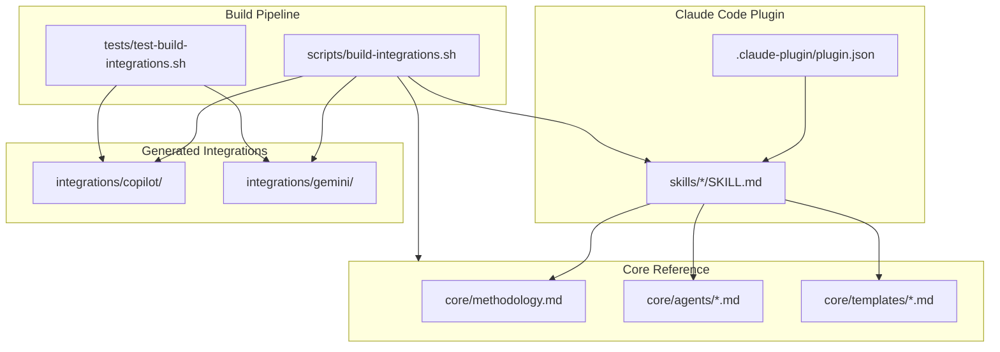

# Tech Stack

| Field | Value |
|-------|-------|
| **Branch** | `main` → `origin/main` |
| **Commit** | `8b120fb` — fix(landing): update social share links to point to research tab |
| **Generated** | 2026-02-15T09:15:00Z |
| **Synced To** | `8b120fb6de234d14c78e637bc90c0238308f2321` |

---

## Languages

| Language | Version | Purpose |
|----------|---------|---------|
| Markdown | N/A | Primary — all skill definitions, methodology, templates, agents (~12,000 lines) |
| Bash | 5.x | Build system, test harness (~762 lines) |
| HTML/CSS/JS | ES6+ | Landing page (index.html) |

---

## Frameworks & Libraries

### Core
| Name | Version | Purpose |
|------|---------|---------|
| Claude Code Plugin System | 1.x | Plugin discovery via `.claude-plugin/plugin.json` |
| YAML Frontmatter | N/A | Skill metadata (name, description) and file tracking (git state) |

### Development
| Name | Version | Purpose |
|------|---------|---------|
| GNU Make | 4.x | Build orchestration (`make build`, `make test`, `make clean`) |
| GNU sed | 4.x | Platform-specific syntax transforms in build script |
| Bash (set -euo pipefail) | 5.x | Strict error handling in scripts |

---

## Database

No database. Draft is a document-driven plugin with no persistent state beyond files in the user's `draft/` directory.

---

## Testing

| Level | Framework | Coverage Target |
|-------|-----------|-----------------|
| Build Verification | `tests/test-build-integrations.sh` | 13 tests across 4 categories |
| Existence | assert() helper | Verify generated files exist |
| Content | grep-based assertions | Verify output correctness (no `/draft:` syntax, correct triggers) |
| Idempotency | diff-based | Same input produces same output |

---

## Build & Deploy

### Build
- **Tool**: `scripts/build-integrations.sh` (642 lines Bash)
- **Output**: `integrations/copilot/.github/copilot-instructions.md`, `integrations/gemini/GEMINI.md`
- **Command**: `make build` or `./scripts/build-integrations.sh`

### CI/CD
- **Platform**: None configured (manual build + test)
- **Verification**: `make test` runs 13 build verification tests

### Deployment
- **Target**: GitHub repository (plugin installed via Claude Code)
- **Landing page**: `index.html` served at getdraft.dev (via CNAME)

---

## Code Patterns

### Architecture
- **Pattern**: Convention-over-configuration plugin system
- **Rationale**: Claude Code auto-discovers skills from `skills/*/SKILL.md` via plugin manifest — no registration code needed

### State Management
- **Approach**: File-based state in user's `draft/` directory
- **Rationale**: No runtime process; all state persists as Markdown/JSON files

### Error Handling
- **Strategy**: `set -euo pipefail` in all Bash scripts; build script validates frontmatter, body format, skill names, and output syntax
- **Logging**: stderr for warnings, stdout for normal output

### API Design
- **Style**: Slash commands (`/draft:<name>`) — no REST/GraphQL/gRPC
- **Conventions**: Skill names are kebab-case `[a-z0-9-]+`, enforced by build script regex

---

## Component Overview

---

## External Services

| Service | Purpose | Credentials Location |
|---------|---------|---------------------|
| GitHub | Repository hosting, plugin distribution | SSH keys / PAT |
| getdraft.dev | Landing page (CNAME to GitHub Pages) | DNS configuration |

---

## Code Style

### Formatting
- **Indentation**: 2 spaces (enforced by `.editorconfig`)
- **Line Length**: 120 max
- **End of Line**: LF
- **Final Newline**: Required

### Naming Conventions
- **Skill directories**: kebab-case (`new-track`, `jira-create`)
- **Skill files**: `SKILL.md` (uppercase, always)
- **Agent files**: lowercase kebab (`debugger.md`, `rca.md`)
- **Template files**: lowercase kebab (`tech-stack.md`, `intake-questions.md`)
- **Build scripts**: lowercase kebab (`build-integrations.sh`)

---

## Accepted Patterns

| Pattern | Location | Rationale |
|---------|----------|-----------|
| Massive single files (1000+ lines) | `skills/init/SKILL.md` (1971 lines) | Skills are self-contained instruction sets — splitting would break plugin discovery |
| `tail -n +4` to skip body header | `build-integrations.sh:extract_body()` | Convention: SKILL.md body starts with `# Title` + blank line; build strips these 3 lines |
| Duplicated git metadata in every file | All `draft/*.md` files | Enables incremental refresh via `synced_to_commit` without external state |
| Generated files checked into git | `integrations/copilot/`, `integrations/gemini/` | Users clone the repo to use integrations; build-from-source is optional |
