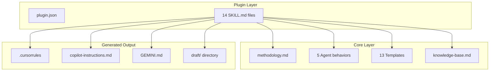

# Tech Stack

## Languages

| Language | Version | Purpose |
|----------|---------|---------|
| Markdown | - | All skill definitions, methodology, templates, user-facing artifacts |
| YAML | - | Skill frontmatter (name, description metadata) |
| Bash | 5.x | Build script for integration file generation |
| Mermaid | - | Architecture diagrams (graph, sequence, flowchart) |

---

## Frameworks & Libraries

### Core
| Name | Version | Purpose |
|------|---------|---------|
| Claude Code Plugin API | v1.2.0 | Plugin manifest, skill registration, slash command routing |

### Development
| Name | Version | Purpose |
|------|---------|---------|
| Git | 2.x | Version control, track history, revert workflows |

---

## Database

N/A — Draft is a methodology plugin with no persistent data storage. All state lives in markdown files within the `draft/` directory.

---

## Testing

| Level | Framework | Coverage Target |
|-------|-----------|-----------------|
| Integration | `tests/test-build.sh` | Build script output validation |
| Manual | Slash command invocation | All 14 commands functional |

---

## Build & Deploy

### Build
- **Tool**: `scripts/build-integrations.sh` (Bash)
- **Output**: `integrations/copilot/.github/copilot-instructions.md`, `integrations/gemini/GEMINI.md`
- **Process**: Extracts frontmatter + body from `skills/*/SKILL.md`, inlines into platform-specific formats

### CI/CD
- **Platform**: Manual (run `./scripts/build-integrations.sh` after skill changes)

### Deployment
- **Target**: Claude Code Plugin Marketplace (`/plugin marketplace add mayurpise/draft`)
- **Distribution**: Git repository clone, marketplace install

---

## Code Patterns

### Architecture
- **Pattern**: Document-driven methodology (skills as markdown instructions interpreted by LLM)
- **Rationale**: No runtime code needed — Claude LLM executes markdown instructions directly

### Error Handling
- **Strategy**: Skills include verification steps and rollback instructions within their markdown bodies
- **Logging**: Status markers (`[ ]`, `[~]`, `[x]`, `[!]`) tracked in plan.md and tracks.md

### API Design
- **Style**: Slash command interface (`/draft:<command> [args]`)
- **Conventions**: kebab-case command names, structured markdown output

---

## Component Overview

---

## External Services

| Service | Purpose | Credentials Location |
|---------|---------|---------------------|
| MCP-Jira (optional) | Jira issue creation from tracks | MCP server config |
| Claude LLM | Instruction interpretation and execution | Claude Code CLI auth |

---

## Code Style

### Formatting
- **Indentation**: 2 spaces (markdown, YAML, Bash)
- **Line Length**: No hard limit (markdown prose)

### Naming Conventions
- **Files**: kebab-case (`new-track`, `jira-create`)
- **Skills**: `skills/<name>/SKILL.md`
- **Templates**: `core/templates/<name>.md`
- **Agents**: `core/agents/<name>.md`
- **Status markers**: `[ ]` Pending, `[~]` In Progress, `[x]` Completed, `[!]` Blocked
- **Commit messages**: `type(scope): description`
