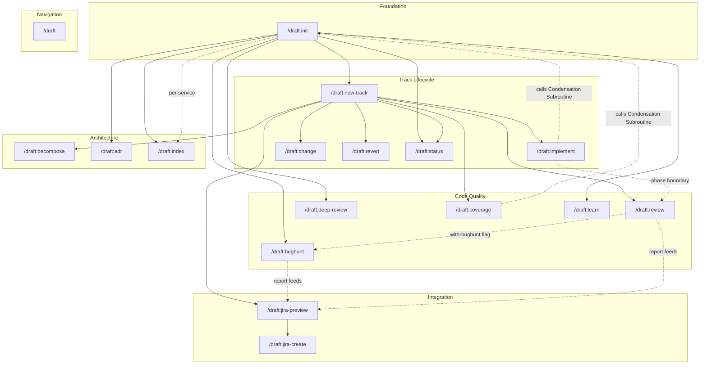

# Skill Dependency Graph

> Reference artifact mapping relationships between all Draft skills. Not a skill itself.
> Regenerate after adding/removing skills or changing cross-skill references.

---

## System Topology



## Dependency Matrix

| Skill | Requires | Required By | Shared Artifacts |
|-------|----------|-------------|-----------------|
| `init` | — | all others | architecture.md, .ai-context.md, product.md, tech-stack.md, guardrails.md, .state/* |
| `new-track` | init | implement, review, change, revert, coverage, decompose, jira-preview, status | spec.md, plan.md, metadata.json |
| `implement` | init, new-track | review (triggers at phase boundaries) | Modifies source code; regenerates .ai-context.md |
| `review` | init, new-track | implement (called at phase boundaries) | review-report-latest.md |
| `bughunt` | init | review (optional), index (optional), jira-preview (optional) | bughunt-report-latest.md |
| `deep-review` | init | — | deep-review audit report |
| `coverage` | init, new-track | — | Regenerates .ai-context.md |
| `decompose` | init, new-track | implement (optional) | Updates architecture.md; regenerates .ai-context.md |
| `change` | init, new-track | — | Modifies spec.md, plan.md |
| `revert` | init, new-track | — | Updates tracks.md, git state |
| `status` | init | — | Read-only (tracks.md, plan.md, metadata.json) |
| `learn` | init | — | Updates guardrails.md (conventions, anti-patterns) |
| `adr` | init | — | Creates ADR files in draft/adrs/ |
| `index` | init (per-service) | — | service-index.md, dependency-graph.md, tech-matrix.md |
| `jira-preview` | new-track | jira-create | jira-export-latest.md |
| `jira-create` | jira-preview | — | Creates Jira issues via API |
| `draft` | — | — | Navigation only — references all skills |

## Execution Chains

### Standard Development Flow
```
init → new-track → implement → review → (done)
                       ↑           |
                       └───────────┘  (iterate at phase boundaries)
```

### Monorepo Flow
```
init (per-service) → index (at root) → aggregated context
```

### Quality Audit Flow
```
init → deep-review
init → decompose (optional pre-step for large modules)
init → bughunt
init → new-track → coverage
```

### Jira Integration Flow
```
new-track → jira-preview → jira-create
                ↑
         bughunt + review reports (optional enrichment)
```

### Learning Flow
```
init → learn → (updates guardrails.md)
                    ↓
         All quality skills read guardrails.md
         (bughunt, review, deep-review, coverage)
```

## Shared Subroutines

| Subroutine | Defined In | Called By |
|------------|-----------|----------|
| Condensation Subroutine (.ai-context.md regeneration) | `init` | implement, decompose, coverage, index |
| Standard File Metadata (YAML frontmatter) | `init` | All skills that generate draft/ files |
| Three-Stage Review | `review` | implement (at phase boundaries) |
| Signal Classification | `init` | init refresh, index (future) |
| Pattern Learning | `core/shared/pattern-learning.md` | learn, bughunt, review, deep-review (updates guardrails.md) |

## Artifact Flow

```
                    ┌─────────────────────────────────────────────┐
                    │              draft/.state/                   │
                    │  freshness.json  signals.json  run-memory   │
                    └──────────────────┬──────────────────────────┘
                                       │ read by refresh
                    ┌──────────────────▼──────────────────────────┐
                    │              draft/                          │
  init ──────────►  │  architecture.md ──► .ai-context.md         │
                    │  product.md  tech-stack.md  guardrails.md   │
                    │  workflow.md  tracks.md                      │
                    └──────────────────┬──────────────────────────┘
                                       │ read by all skills
           ┌───────────────────────────┼───────────────────────┐
           ▼                           ▼                       ▼
    new-track                      bughunt               learn
    ┌──────────┐              ┌────────────┐        ┌──────────┐
    │ spec.md  │              │ report.md  │        │guardrails│
    │ plan.md  │              └─────┬──────┘        │  update  │
    │metadata  │                    │               └──────────┘
    └────┬─────┘                    │
         │                          ▼
         ▼                    jira-preview
    implement                 ┌──────────┐
    ┌──────────┐              │export.md │
    │  code    │              └────┬─────┘
    │ changes  │                   │
    └────┬─────┘                   ▼
         │                    jira-create
         ▼                    ┌──────────┐
      review                  │Jira API  │
    ┌──────────┐              └──────────┘
    │report.md │
    └──────────┘
```
