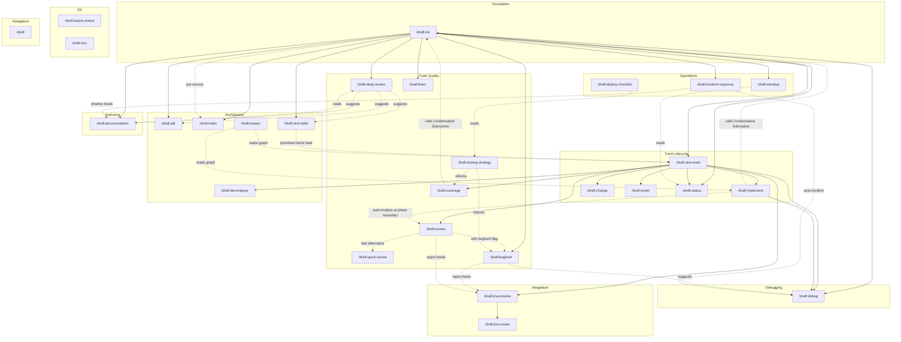

# Skill Dependency Graph

> Reference artifact mapping relationships between all Draft skills. Not a skill itself.
> Regenerate after adding/removing skills or changing cross-skill references.

---

## Two-Tier Architecture

### Primary Workflow (4 commands)
```
init → new-track → implement → review
                       ↑           |
                       └───────────┘  (auto-invoked at phase boundaries)
```

### Specialist Commands
Grouped into subsystems that primary commands auto-invoke or that users invoke directly.

---

## System Topology



## Dependency Matrix

| Skill | Requires | Required By | Shared Artifacts |
|-------|----------|-------------|-----------------|
| `init` | -- | all others | architecture.md, .ai-context.md, .ai-profile.md, product.md, tech-stack.md, guardrails.md, .state/* |
| `new-track` | init | implement, review, change, revert, coverage, decompose, jira-preview, status, debug | spec.md, plan.md, metadata.json |
| `implement` | init, new-track | review (triggers at phase boundaries) | Modifies source code; regenerates .ai-context.md |
| `review` | init, new-track | implement (called at phase boundaries) | review-report-latest.md |
| `quick-review` | init | review (fast alternative) | quick-review-report.md |
| `bughunt` | init | review (optional), index (optional), jira-preview (optional) | bughunt-report-latest.md |
| `deep-review` | init | -- | deep-review audit report |
| `coverage` | init, new-track | -- | Regenerates .ai-context.md |
| `testing-strategy` | init | coverage (informs), bughunt (informs) | testing-strategy.md |
| `debug` | init, new-track | implement (fix feeds back) | debug-report.md |
| `decompose` | init, new-track | implement (optional) | Updates architecture.md; regenerates .ai-context.md |
| `change` | init, new-track | -- | Modifies spec.md, plan.md |
| `revert` | init, new-track | -- | Updates tracks.md, git state |
| `status` | init | standup (reads) | Read-only (tracks.md, plan.md, metadata.json) |
| `learn` | init | -- | Updates guardrails.md (conventions, anti-patterns) |
| `adr` | init | deep-review (suggests) | Creates ADR files in draft/adrs/ |
| `tech-debt` | init | deep-review (suggests), new-track (feeds prioritized items) | draft/tech-debt-report-latest.md |
| `impact` | init, graph | new-track, implement | Reads graph; emits blast-radius reports |
| `deploy-checklist` | init | -- | deploy-checklist.md |
| `incident-response` | init | -- | incident-<timestamp>.md, postmortem-<timestamp>.md |
| `standup` | init | -- | standup summary (reads status, git log) |
| `documentation` | init | deep-review (suggests), incident-response (feeds) | Generated docs, runbooks |
| `index` | init (per-service) | -- | service-index.md, dependency-graph.md, tech-matrix.md |
| `jira-preview` | new-track | jira-create | jira-export-latest.md |
| `jira-create` | jira-preview | -- | Creates Jira issues via API |
| `assist-review` | init | -- | Inline PR review assistance |
| `tour` | init | -- | Read-only architecture walk |
| `draft` | -- | -- | Navigation only -- references all skills |

## Execution Chains

### Standard Development Flow
```
init → new-track → implement → review → (git push + PR)
                       ↑           |
                       └───────────┘
                    (iterate at phase boundaries)
```

### Bug Fix Flow
```
new-track (bug) → debug → implement → review
                    ↑                      |
                    └──────────────────────┘ (iterate if fix incomplete)
```

### Incident Response Flow
```
incident-response → debug → implement → review
        |
        └→ documentation (post-incident report)
```

### Operations Flow
```
standup ←── status (reads tracks + git log)
deep-review ──→ tech-debt ──→ new-track (prioritized items)
```

### Monorepo Flow
```
init (per-service) → index (at root) → aggregated context
```

### Quality Audit Flow
```
init → quick-review (fast sanity check)
init → review (full three-stage)
init → bughunt (14-dimension sweep)
init → deep-review (module audit)
init → testing-strategy → coverage
init → decompose (optional pre-step for large modules)
```

### Jira Integration Flow
```
new-track → jira-preview → jira-create
                ↑
         bughunt + review reports (optional enrichment)
```

### Learning Flow
```
init → learn → (updates guardrails.md)
                    ↓
         All quality skills read guardrails.md
         (bughunt, review, deep-review, coverage, quick-review)
```

## Shared Subroutines

| Subroutine | Defined In | Called By |
|------------|-----------|----------|
| Condensation Subroutine (.ai-context.md regeneration) | `core/shared/condensation.md` | implement, decompose, coverage, index |
| Standard File Metadata (YAML frontmatter) | `init` | All skills that generate draft/ files |
| Three-Stage Review | `review` | implement (at phase boundaries) |
| Signal Classification | `init` | init refresh, index (future) |
| Pattern Learning | `core/shared/pattern-learning.md` | learn, bughunt, review, deep-review (updates guardrails.md) |
| Context Loading | `core/shared/draft-context-loading.md` | All skills requiring draft/ context |
| Cross-Skill Dispatch | `core/shared/cross-skill-dispatch.md` | bughunt, deep-review, implement, review |
| Jira Sync | `core/shared/jira-sync.md` | bughunt, review, implement (when ticket linked) |
| Graph Query | `core/shared/graph-query.md` | init, implement, bughunt, review, debug, decompose, index, impact |
| Graph Mermaid | `graph/src/mermaid.js` | init (injects module-deps + proto-map into architecture.md) |

## Artifact Flow

```
                    ┌─────────────────────────────────────────────┐
                    │              draft/.state/                   │
                    │  freshness.json  signals.json  run-memory   │
                    └──────────────────┬──────────────────────────┘
                                       │ read by refresh
                    ┌──────────────────▼──────────────────────────┐
                    │              draft/                          │
  init ──────────►  │  architecture.md ──► .ai-context.md         │
                    │  product.md  tech-stack.md  guardrails.md   │
                    │  workflow.md  tracks.md  tech-debt.md       │
                    │  graph/ (module-graph, hotspots, proto,      │
                    │         module-deps.mermaid, proto-map..)   │
                    └──────────────────┬──────────────────────────┘
                                       │ read by all skills
           ┌───────────────────────────┼───────────────────────┐
           ▼                           ▼                       ▼
    new-track                      bughunt               learn
    ┌──────────┐              ┌────────────┐        ┌──────────┐
    │ spec.md  │              │ report.md  │        │guardrails│
    │ plan.md  │              └─────┬──────┘        │  update  │
    │metadata  │                    │               └──────────┘
    └────┬─────┘                    │
         │                     ┌────┴─────┐
         ▼                     ▼          ▼
    implement             jira-preview  debug
    ┌──────────┐          ┌──────────┐  ┌──────────┐
    │  code    │          │export.md │  │report.md │
    │ changes  │          └────┬─────┘  └──────────┘
    └────┬─────┘               │
         │                     ▼
         ▼                jira-create
      review              ┌──────────┐
    ┌──────────┐          │Jira API  │
    │report.md │          └──────────┘
    └──────────┘
```
