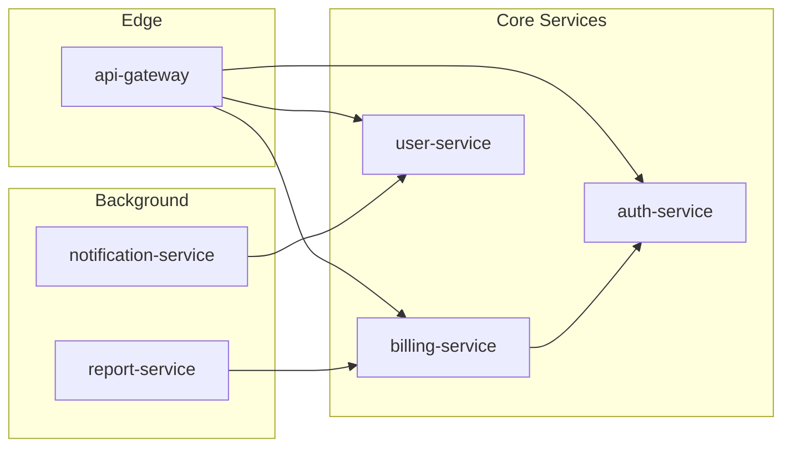
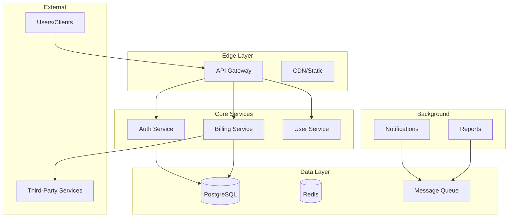

# Draft Index

You are building a federated knowledge index for a monorepo with multiple services.

## Red Flags - STOP if you're:

- Running at a non-root directory in a monorepo
- Indexing services that haven't been initialized with `/draft:init`
- Overwriting root-level context without confirming with the user
- Aggregating without verifying each service's draft/ directory exists
- Skipping dependency mapping between services

**Aggregate from initialized services only. Verify before overwriting.**

---

## Standard File Metadata

**ALL generated files MUST include the standard YAML frontmatter.** This enables refresh tracking, sync verification, and traceability.

### Gathering Git Information

Before generating any file, run these commands to gather metadata:

```bash
# Project name (from manifest or directory)
basename "$(pwd)"

# Git branch
git branch --show-current

# Git remote tracking branch
git rev-parse --abbrev-ref --symbolic-full-name @{upstream} 2>/dev/null || echo "none"

# Git commit SHA (full)
git rev-parse HEAD

# Git commit SHA (short)
git rev-parse --short HEAD

# Git commit date
git log -1 --format="%ci"

# Git commit message (first line)
git log -1 --format="%s"

# Check for uncommitted changes
git status --porcelain | head -1
```

### Metadata Template

Insert this YAML frontmatter block at the **top of every generated file** (`service-index.md`, `dependency-graph.md`, `tech-matrix.md`, `draft-index-bughunt-summary.md`):

```yaml
---
project: "{PROJECT_NAME}"
module: "root"
generated_by: "draft:index"
generated_at: "{ISO_TIMESTAMP}"
git:
  branch: "{LOCAL_BRANCH}"
  remote: "{REMOTE/BRANCH or 'none'}"
  commit: "{FULL_SHA}"
  commit_short: "{SHORT_SHA}"
  commit_date: "{COMMIT_DATE}"
  commit_message: "{FIRST_LINE_OF_COMMIT_MESSAGE}"
  dirty: {true|false}
synced_to_commit: "{FULL_SHA}"
---
```

> **Note**: `generated_by` uses `draft:command` format (not `/draft:command`) for cross-platform compatibility.

---

## Pre-Check

```bash
ls draft/ 2>/dev/null
```

**If `draft/` does NOT exist at root:**
- Announce: "Root draft/ directory not found. Run `/draft:init` at monorepo root first to create base context, then run `/draft:index` to aggregate service knowledge."
- Stop here.

**If `draft/` exists:** Continue to Step 1.

## Step 1: Parse Arguments

Check for optional arguments:
- `init-missing`: Also initialize services that don't have `draft/` directories
- `bughunt [dir1 dir2 ...]`: Run bug hunt across subdirectories with `draft/` folders
  - If no directories specified: auto-discover all subdirectories with `draft/`
  - If directories specified: run bughunt only in those subdirectories (skip if no `draft/`)
  - Generate summary report at repository root: `draft-index-bughunt-summary.md`

**If `bughunt` argument detected:** Skip to Step 1A (Bughunt Mode) instead of continuing to Step 2.

## Step 1A: Bughunt Mode

This mode runs `/draft:bughunt` across multiple subdirectories and aggregates results.

### 1A.1: Determine Target Directories

**If directories explicitly specified** (e.g., `bughunt dir1 dir2 dir3`):
- Use provided directory list as targets
- Verify each directory exists
- Check each directory for `draft/` subdirectory
- Warn and skip any directory without `draft/`

**If no directories specified** (e.g., just `bughunt`):
- Auto-discover all immediate child directories (depth=1)
- Filter for directories containing `draft/` subdirectory
- Exclude patterns: `node_modules/`, `vendor/`, `.git/`, `draft/`, `.*`

```bash
# Example auto-discovery
for dir in */; do
  if [ -d "$dir/draft" ]; then
    echo "$dir"
  fi
done
```

**Output:**
```
Target directories for bughunt:
  - services/auth/
  - services/billing/
  - services/notifications/
```

### 1A.2: Execute Bughunt Per Directory

For each target directory:

1. **Navigate to directory:**
   ```bash
   cd <target-dir>
   ```

2. **Announce:**
   ```
   Running bughunt in <target-dir>...
   ```

3. **Invoke `/draft:bughunt` skill:**
   - Let `/draft:bughunt` run its full workflow
   - Report will be generated at `<target-dir>/draft/bughunt-report.md`
   - Capture exit status (success/failure)

4. **Return to repository root:**
   ```bash
   cd -
   ```

5. **Record results:**
   - Directory path
   - Total bugs found (by severity)
   - Report location
   - Any errors encountered

**Note:** Run bughunts sequentially, not in parallel, to avoid context conflicts.

### 1A.3: Parse Individual Reports

After all bughunts complete, read each generated report:

```bash
# For each target directory
cat <dir>/draft/bughunt-report.md
```

Extract from each report:
- Branch and commit (from header)
- Summary table (bug counts by severity)
- Critical/High issue count
- Total issues count

### 1A.4: Generate Aggregate Summary Report

Create `draft-index-bughunt-summary.md` at repository root:

```markdown
# Draft Index: Bughunt Summary

**Date:** YYYY-MM-DD HH:MM
**Mode:** [Auto-discovery | Explicit directories]
**Directories Scanned:** N

## Overview

| Directory | Critical | High | Medium | Low | Total | Report |
|-----------|----------|------|--------|-----|-------|--------|
| services/auth/ | 0 | 2 | 5 | 3 | 10 | [→](services/auth/draft/bughunt-report.md) |
| services/billing/ | 1 | 1 | 2 | 1 | 5 | [→](services/billing/draft/bughunt-report.md) |
| services/notifications/ | 0 | 0 | 1 | 2 | 3 | [→](services/notifications/draft/bughunt-report.md) |

**Grand Total:** X Critical, Y High, Z Medium, W Low

## Directories With Critical Issues

| Directory | Count | Details |
|-----------|-------|---------|
| services/billing/ | 1 | [→](services/billing/draft/bughunt-report.md#critical-issues) |

## Directories With No Issues

- services/api-gateway/
- services/user-service/

## Skipped Directories

| Directory | Reason |
|-----------|--------|
| services/legacy-tools/ | No draft/ directory found |
| services/experiments/ | No draft/ directory found |

## Next Steps

1. **Prioritize Critical Issues:** Review directories with Critical bugs first
2. **Review Individual Reports:** Click links above to see detailed findings
3. **Track Fixes:** Use `/draft:new-track` to create implementation tracks for fixes
4. **Re-run After Fixes:** Run `/draft:index bughunt` again to verify

---

*Generated by `/draft:index bughunt` command*
```

### 1A.5: Completion Report

```
═══════════════════════════════════════════════════════════
              DRAFT INDEX BUGHUNT COMPLETE
═══════════════════════════════════════════════════════════

Scanned: N directories
Completed: X successful
Skipped: Y (no draft/)
Failed: Z errors

Grand Total Bugs:
  Critical: W
  High:     X
  Medium:   Y
  Low:      Z

Summary Report: draft-index-bughunt-summary.md

Directories requiring immediate attention:
  - services/billing/ (1 CRITICAL)
  - services/auth/ (2 HIGH)

═══════════════════════════════════════════════════════════
```

**STOP HERE** if bughunt mode. Do not continue to Step 2 (normal indexing flow).

## Step 2: Discover Services (Depth=1 Only)

Scan immediate child directories for service markers. Do NOT recurse beyond depth=1.

**Service detection markers (any of these):**
- `package.json` (Node.js)
- `go.mod` (Go)
- `Cargo.toml` (Rust)
- `pom.xml` or `build.gradle` (Java)
- `pyproject.toml` or `requirements.txt` (Python)
- `Dockerfile` (containerized service)
- `src/` directory with code files

**Exclude patterns:**
- `node_modules/`
- `vendor/`
- `.git/`
- `draft/` (the root draft directory itself)
- Any directory starting with `.`

```bash
# Example discovery (adapt to actual structure)
ls -d */ | head -50
```

**Output:** List of detected service directories.

## Step 3: Categorize Services

For each detected service directory, check for `draft/` subdirectory:

```bash
# For each service
ls <service>/draft/ 2>/dev/null
```

Categorize into:
- **Initialized:** Has `draft/` with context files
- **Uninitialized:** No `draft/` directory

Report:
```
Scanning immediate child directories...

Detected X service directories:
  ✓ Y initialized (draft/ found)
  ○ Z uninitialized

Initialized services:
  - services/auth/
  - services/billing/
  - ...

Uninitialized services:
  - services/legacy-reports/
  - services/admin-tools/
  - ...
```

## Step 4: Handle Uninitialized Services

**If `init-missing` argument is present:**
1. For each uninitialized service, prompt:
   ```
   Initialize <service-name>/? [y/n/all/skip-rest]
   ```
2. If user selects:
   - `y`: Run `/draft:init` in that directory
   - `n`: Skip this service
   - `all`: Initialize all remaining without prompting
   - `skip-rest`: Skip all remaining uninitialized services

**If `init-missing` argument is NOT present:**
- Just report uninitialized services and continue
- Suggest: "Run `/draft:index init-missing` to initialize these services"

## Step 5: Aggregate Context from Initialized Services

For each initialized service, read and extract:

### 5.1 From `<service>/draft/product.md`:
- Service name
- First paragraph of Vision (summary)
- Target users (list)
- Core features (list)

### 5.2 From `<service>/draft/.ai-context.md` (or legacy `<service>/draft/architecture.md`):
- Key Takeaway paragraph (from `## System Overview`)
- External dependencies (from `## External Dependencies`)
- Exposed APIs or entry points (from `## Entry Points`)
- Dependencies on other services (look for references to sibling service names)
- Critical invariants summary (from `## Critical Invariants`, if available)

### 5.3 From `<service>/draft/tech-stack.md`:
- Primary language/framework
- Database
- Key dependencies

### 5.4 Create/Update `<service>/draft/manifest.json`:
```json
{
  "name": "<service-name>",
  "type": "service",
  "summary": "<first line of product vision>",
  "primaryTech": "<main language/framework>",
  "dependencies": ["<other-service-names>", "<external-deps>"],
  "dependents": [],
  "team": "<if found in docs>",
  "initialized": "<date>",
  "lastIndexed": "<current-date>"
}
```

## Step 6: Detect Inter-Service Dependencies

Analyze extracted data to build dependency graph:

1. Look for service name references in each service's architecture.md
2. Look for API client imports or service URLs in tech-stack.md
3. Look for mentions in product.md that reference other services

Build a dependency map:
```
auth-service: []  # no dependencies on other services
billing-service: [auth-service]
api-gateway: [auth-service, billing-service]
```

Update each service's `manifest.json` with `dependents` field (reverse lookup).

## Step 7: Generate Root Aggregated Files

### 7.1 Generate `draft/service-index.md`

Use template from `core/templates/service-index.md`:

```markdown
# Service Index

> Auto-generated by `/draft:index` on <date>. Do not edit directly.
> Re-run `/draft:index` to update.

## Overview

| Metric | Count |
|--------|-------|
| Total Services Detected | X |
| Initialized | Y |
| Uninitialized | Z |

## Service Registry

| Service | Status | Tech Stack | Dependencies | Team | Details |
|---------|--------|------------|--------------|------|---------|
| auth | ✓ | Go, Postgres | - | @auth-team | [→](../services/auth/draft/.ai-context.md) |
| billing | ✓ | Node, Stripe | auth | @billing | [→](../services/billing/draft/.ai-context.md) |
| legacy-reports | ○ | - | - | - | Not initialized |

## Uninitialized Services

The following services have not been initialized with `/draft:init`:
- `services/legacy-reports/`
- `services/admin-tools/`

Run `/draft:index init-missing` or initialize individually with:
```bash
cd services/legacy-reports && /draft:init
```
```

### 7.2 Generate `draft/dependency-graph.md`

```markdown
# Service Dependency Graph

> Auto-generated by `/draft:index` on <date>. Do not edit directly.

## System Topology



## Dependency Matrix

| Service | Depends On | Depended By |
|---------|-----------|-------------|
| auth-service | - | billing, gateway, users |
| billing-service | auth | gateway, reports |
| user-service | auth | gateway, notifications |
| api-gateway | auth, billing, users | - |

## Dependency Order (Topological)

1. **auth-service** (foundational - no internal dependencies)
2. **user-service** (depends on: auth)
3. **billing-service** (depends on: auth)
4. **notification-service** (depends on: users)
5. **report-service** (depends on: billing)
6. **api-gateway** (depends on: auth, billing, users)

> This ordering helps when planning cross-service changes or understanding impact.
```

### 7.3 Generate `draft/tech-matrix.md`

```markdown
# Technology Matrix

> Auto-generated by `/draft:index` on <date>. Do not edit directly.

## Common Stack (Org Standards)

Technologies used by majority of services:

| Technology | Usage | Services |
|------------|-------|----------|
| PostgreSQL | Database | auth, billing, users (85%) |
| Redis | Caching | auth, gateway, notifications (60%) |
| Docker | Containerization | all (100%) |
| GitHub Actions | CI/CD | all (100%) |

## Technology Distribution

### Languages

| Language | Services | Percentage |
|----------|----------|------------|
| Go | auth, users, gateway | 45% |
| TypeScript | billing, notifications, reports | 45% |
| Python | ml-service, analytics | 10% |

### Databases

| Database | Services |
|----------|----------|
| PostgreSQL | auth, billing, users, reports |
| MongoDB | notifications, analytics |
| Redis | auth, gateway (cache only) |

## Variance Report

Services deviating from org standards:

| Service | Deviation | Reason |
|---------|-----------|--------|
| ml-service | Python instead of Go/TS | ML ecosystem |
| analytics | MongoDB instead of Postgres | Time-series workload |
```

### 7.4 Synthesize `draft/product.md` (if not exists or is placeholder)

Read all service product.md files and synthesize:

```markdown
# Product: [Org/Product Name]

> Synthesized from X service contexts by `/draft:index` on <date>.
> Edit this file to refine the overall product vision.

## Vision

[Synthesized from common themes across service visions - one paragraph describing what the overall product/platform does]

## Target Users

<!-- Aggregated from all services, deduplicated -->
- **End Users**: [common user types across services]
- **Developers**: [if developer-facing APIs exist]
- **Operators**: [if ops/admin services exist]

## Service Capabilities

| Capability | Provided By | Description |
|------------|-------------|-------------|
| Authentication | auth-service | User identity, JWT, OAuth |
| Payments | billing-service | Stripe integration, invoicing |
| API Access | api-gateway | Rate limiting, routing |

## Cross-Cutting Concerns

<!-- Extracted from common patterns across services -->
- **Authentication**: All services validate via auth-service
- **Observability**: [common logging/tracing approach]
- **Data Privacy**: [common compliance patterns]
```

### 7.5 Synthesize `draft/architecture.md` (if not exists or is placeholder)

```markdown
# Architecture: [Org/Product Name]

> Synthesized from X service contexts by `/draft:index` on <date>.
> This is a system-of-systems view. For service internals, see individual service drafts.

## System Overview

**Key Takeaway:** [One paragraph synthesizing overall system purpose from service summaries]

### System Topology



## Service Directory

| Service | Responsibility | Tech | Status | Details |
|---------|---------------|------|--------|---------|
| auth-service | Identity & access management | Go, Postgres | ✓ Active | [→ context](../services/auth/draft/.ai-context.md) |
| billing-service | Payments & invoicing | Node, Stripe | ✓ Active | [→ context](../services/billing/draft/.ai-context.md) |

## Shared Infrastructure

<!-- Extracted from common external dependencies -->

| Component | Purpose | Used By |
|-----------|---------|---------|
| PostgreSQL | Primary datastore | auth, billing, users |
| Redis | Caching, sessions | auth, gateway |
| RabbitMQ | Async messaging | notifications, reports |
| Stripe | Payment processing | billing |

## Cross-Service Patterns

<!-- Extracted from common conventions -->

| Pattern | Description | Services |
|---------|-------------|----------|
| JWT Auth | All services validate JWT via auth-service | all |
| Event-Driven | Async events via message queue | notifications, reports |

## Notes

- For detailed service architecture, navigate to individual service drafts
- This file is regenerable via `/draft:index`
- Manual edits to non-synthesized sections will be preserved on re-index
```

### 7.6 Synthesize `draft/tech-stack.md` (if not exists or is placeholder)

```markdown
# Tech Stack: [Org/Product Name]

> Synthesized from X service contexts by `/draft:index` on <date>.
> This defines org-wide standards. Service-specific additions are in their local tech-stack.md.

## Org Standards

### Languages
- **Primary**: [most common language] — [X% of services]
- **Secondary**: [second most common] — [Y% of services]

### Frameworks
- **API**: [common API framework]
- **Testing**: [common test framework]

### Infrastructure
- **Database**: PostgreSQL (standard), MongoDB (approved for specific use cases)
- **Caching**: Redis
- **Messaging**: RabbitMQ / SQS
- **Container**: Docker
- **Orchestration**: Kubernetes

### CI/CD
- **Platform**: GitHub Actions
- **Registry**: [container registry]

## Approved Variances

| Service | Variance | Justification |
|---------|----------|---------------|
| ml-service | Python | ML ecosystem requirements |
| analytics | MongoDB | Time-series workload |

## Shared Libraries

| Library | Purpose | Version | Used By |
|---------|---------|---------|---------|
| @org/auth-client | Auth service client | 2.x | billing, gateway, notifications |
| @org/logging | Structured logging | 1.x | all services |
```

## Step 8: Create Root Config

Create `draft/config.yaml` if not exists:

```yaml
# Draft Index Configuration

# Service detection patterns (immediate children only)
service_patterns:
  - "package.json"
  - "go.mod"
  - "Cargo.toml"
  - "pom.xml"
  - "build.gradle"
  - "pyproject.toml"
  - "requirements.txt"
  - "Dockerfile"

# Directories to exclude from scanning
exclude_patterns:
  - "node_modules"
  - "vendor"
  - ".git"
  - "draft"
  - ".*"  # Hidden directories

# Re-index on these events (for CI integration)
reindex_triggers:
  - "service added"
  - "service removed"
  - "weekly"
```

## Step 9: Completion Report

```
═══════════════════════════════════════════════════════════
                    DRAFT INDEX COMPLETE
═══════════════════════════════════════════════════════════

Scanned: X service directories (depth=1)
Indexed: Y services with draft/ context
Skipped: Z uninitialized services

Generated/Updated:
  ✓ draft/service-index.md      (service registry)
  ✓ draft/dependency-graph.md   (inter-service topology)
  ✓ draft/tech-matrix.md        (technology distribution)
  ✓ draft/product.md            (synthesized product vision)
  ✓ draft/architecture.md       (system-of-systems view)
  ✓ draft/tech-stack.md         (org standards)
  ✓ draft/config.yaml           (index configuration)

Service manifests updated: Y services

Next steps:
1. Review synthesized files in draft/
2. Edit draft/product.md to refine overall vision
3. Edit draft/architecture.md to add cross-cutting context
4. Run /draft:index periodically to refresh

For uninitialized services, run:
  /draft:index init-missing
═══════════════════════════════════════════════════════════
```

## Operational Notes

### What This Command Does NOT Do

- **No deep code analysis** — Reads only existing `draft/*.md` files
- **No source code scanning** — That's `/draft:init`'s job per service
- **No recursive scanning** — Depth=1 only, immediate children
- **No duplication** — Root files link to service files, not copy content

### When to Re-Run

- After running `/draft:init` on a new service
- After significant changes to service architectures
- Weekly/monthly as part of documentation hygiene
- Before major cross-service planning

### Preserving Manual Edits

When regenerating, the skill:
1. Reads existing root files
2. Identifies manually-added sections (not marked as auto-generated)
3. Preserves those sections while updating auto-generated parts
4. Sections between `<!-- MANUAL START -->` and `<!-- MANUAL END -->` are never overwritten
