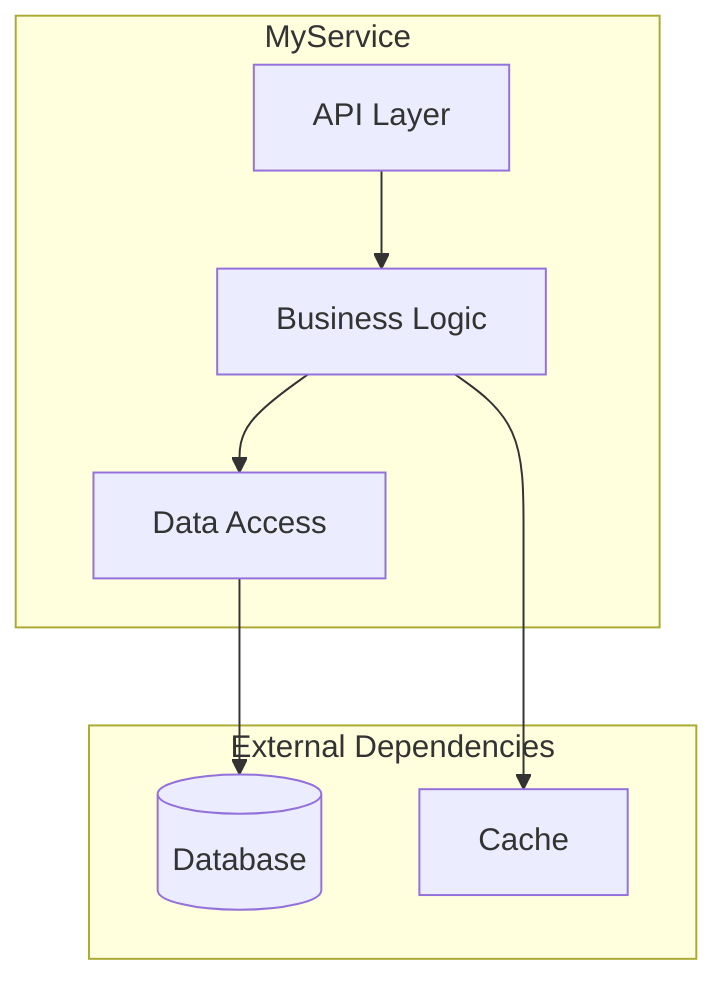
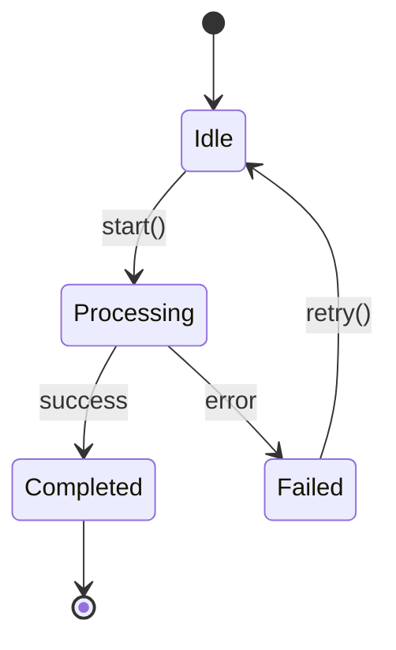
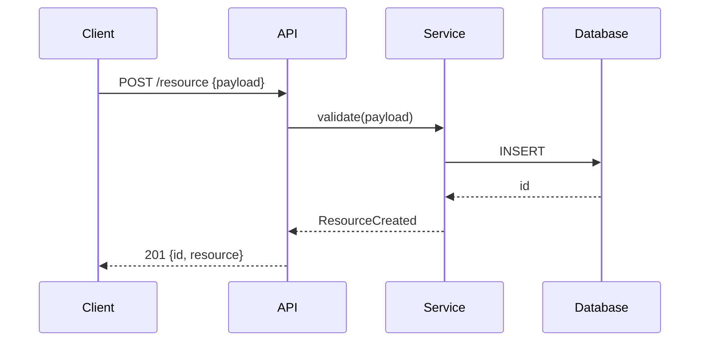
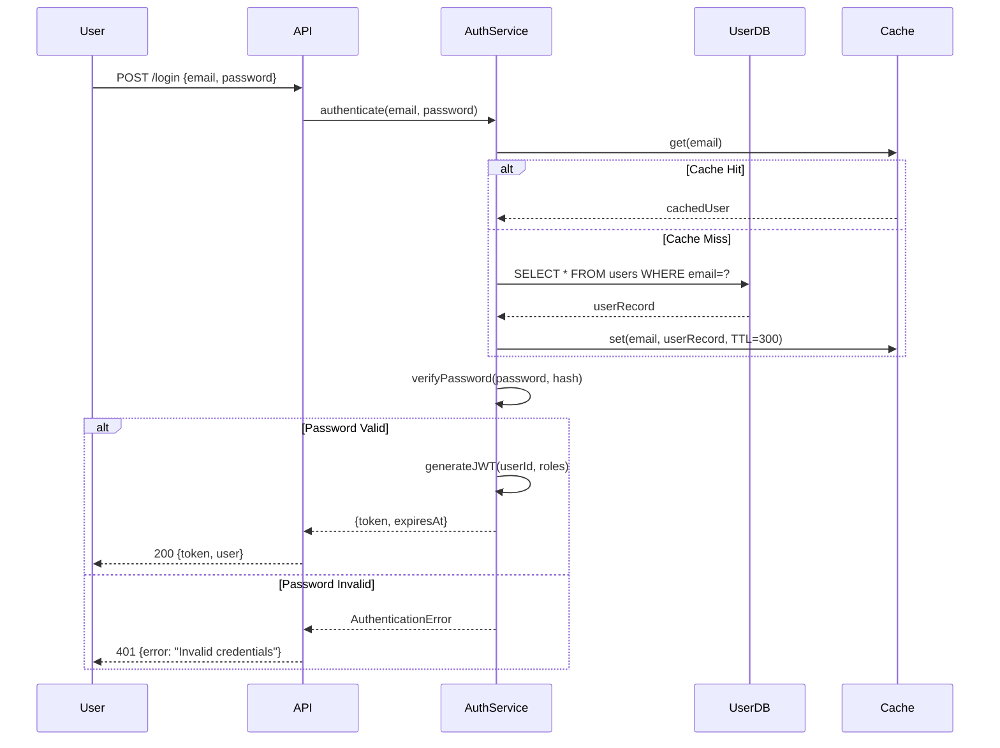
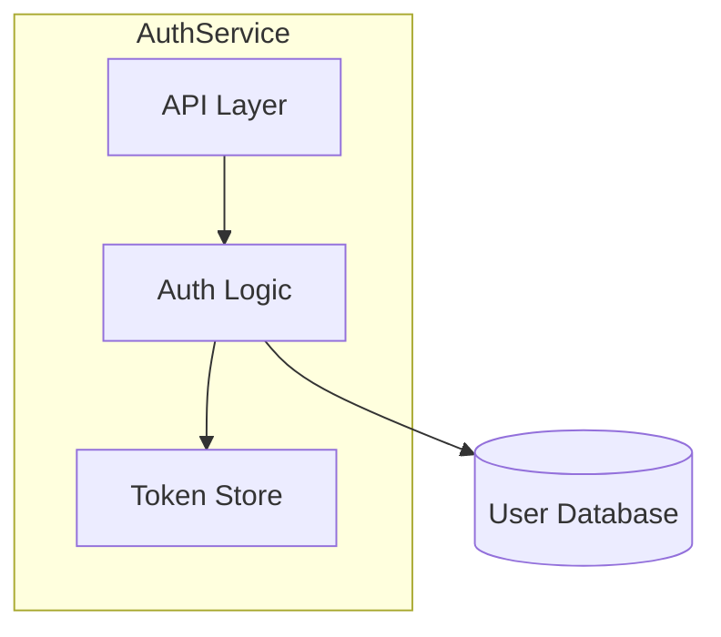

# Draft Init

You are initializing a Draft project for Context-Driven Development.

## Red Flags - STOP if you're:

- Re-initializing a project that already has `draft/` without using `refresh` mode
- Skipping brownfield analysis for an existing codebase
- Rushing through product definition questions without probing for detail
- Auto-generating tech-stack.md without verifying detected dependencies
- Not presenting .ai-context.md for developer review before proceeding
- Overwriting existing tracks.md (this destroys track history)

**Initialize once, refresh to update. Never overwrite without confirmation.**

---

## Standard File Metadata

**ALL files in `draft/` MUST include this metadata header.** This enables refresh tracking, sync verification, and traceability.

### Gathering Git Information

Before generating any file, run these commands to gather metadata:

```bash
# Project name (from manifest or directory)
basename "$(pwd)"

# Git branch
git branch --show-current

# Git remote tracking branch
git rev-parse --abbrev-ref --symbolic-full-name @{upstream} 2>/dev/null || echo "none"

# Git commit SHA (full)
git rev-parse HEAD

# Git commit SHA (short)
git rev-parse --short HEAD

# Git commit date
git log -1 --format="%ci"

# Git commit message (first line)
git log -1 --format="%s"

# Check for uncommitted changes
git status --porcelain | head -1
```

### Metadata Template

Insert this YAML frontmatter block at the **top of every draft/ file**:

```yaml
---
project: "{PROJECT_NAME}"
module: "{MODULE_NAME or 'root'}"
generated_by: "draft:{COMMAND_NAME}"
generated_at: "{ISO_TIMESTAMP}"
git:
  branch: "{LOCAL_BRANCH}"
  remote: "{REMOTE/BRANCH or 'none'}"
  commit: "{FULL_SHA}"
  commit_short: "{SHORT_SHA}"
  commit_date: "{COMMIT_DATE}"
  commit_message: "{FIRST_LINE_OF_COMMIT_MESSAGE}"
  dirty: {true|false}
synced_to_commit: "{FULL_SHA}"
---
```

> **Note**: `generated_by` uses `draft:command` format (not `/draft:command`) for cross-platform compatibility.

### Field Definitions

| Field | Description | Example |
|-------|-------------|---------|
| `project` | Project name from package.json/go.mod/Cargo.toml or directory name | `my-api-service` |
| `module` | Module name if in monorepo, otherwise `root` | `auth-service` |
| `generated_by` | The Draft command that created/updated this file | `draft:init` |
| `generated_at` | ISO 8601 timestamp when file was generated | `2024-01-15T14:30:00Z` |
| `git.branch` | Current local branch name | `main` |
| `git.remote` | Upstream tracking branch | `origin/main` |
| `git.commit` | Full SHA of HEAD when generated | `a1b2c3d4e5f6...` |
| `git.commit_short` | Short SHA (7 chars) | `a1b2c3d` |
| `git.commit_date` | Commit timestamp | `2024-01-15 10:00:00 -0500` |
| `git.commit_message` | First line of commit message | `feat: add user auth` |
| `git.dirty` | Were there uncommitted changes? | `true` or `false` |
| `synced_to_commit` | The commit SHA this doc is synchronized to | `a1b2c3d4e5f6...` |

### Usage in Refresh

The `synced_to_commit` field is critical for incremental refresh:
- `/draft:init refresh` reads this field to find changed files since last sync
- If `git.dirty: true`, warn user that docs may not reflect committed state
- After refresh, update `synced_to_commit` to current HEAD

### Example Header

```yaml
---
project: "payment-gateway"
module: "root"
generated_by: "draft:init"
generated_at: "2024-01-15T14:30:00Z"
git:
  branch: "main"
  remote: "origin/main"
  commit: "a1b2c3d4e5f6789012345678901234567890abcd"
  commit_short: "a1b2c3d"
  commit_date: "2024-01-15 10:00:00 -0500"
  commit_message: "feat: add stripe integration"
  dirty: false
synced_to_commit: "a1b2c3d4e5f6789012345678901234567890abcd"
---
```

---

## Pre-Check

Check for arguments:
- `refresh`: Update existing context without full re-init

### Standard Init Check

```bash
ls draft/ 2>/dev/null
```

If `draft/` exists with context files:
- Announce: "Project already initialized. Use `/draft:init refresh` to update context or `/draft:new-track` to create a feature."
- Stop here.

### Monorepo Detection

Check for monorepo indicators:
- Multiple `package.json` / `go.mod` / `Cargo.toml` in child directories
- `lerna.json`, `pnpm-workspace.yaml`, `nx.json`, or `turbo.json` at root
- `packages/`, `apps/`, `services/` directories with independent manifests

If monorepo detected:
- Announce: "Detected monorepo structure. Consider using `/draft:index` at root level to aggregate service context, or run `/draft:init` within individual service directories."
- Ask user to confirm: initialize here (single service) or abort (use /draft:index instead)

### Migration Detection

If `draft/architecture.md` exists WITHOUT `draft/.ai-context.md`:
- Announce: "Detected architecture.md without .ai-context.md. Would you like to generate .ai-context.md? This will condense your existing architecture.md into a token-optimized AI context file."
- If user accepts: Run the Condensation Subroutine to derive `.ai-context.md` from existing `architecture.md`
- If user declines: Continue without .ai-context.md

### Refresh Mode

If the user runs `/draft:init refresh`:

1. **Tech Stack Refresh**: Re-scan `package.json`, `go.mod`, etc. Compare with `draft/tech-stack.md`. Propose updates.

2. **Architecture Refresh**: If `draft/architecture.md` exists, use metadata-based incremental analysis:

   **a. Read synced commit from metadata:**
   ```bash
   # Extract synced_to_commit from YAML frontmatter
   grep -A1 "synced_to_commit:" draft/architecture.md | tail -1 | tr -d ' "'
   ```
   This returns the commit SHA the docs were last synced to (more reliable than file modification time).

   **b. Get changed files since that commit:**
   ```bash
   git diff --name-only <SYNCED_SHA> HEAD -- . ':!draft/'
   ```
   This lists all source files changed since the last architecture sync, excluding the draft/ directory itself.

   **c. Check if docs were generated with dirty state:**
   If the original `git.dirty: true`, warn: "Previous generation had uncommitted changes. Full refresh recommended."

   **c. Categorize changes:**
   - **Added files**: New modules, components, or features to document
   - **Modified files**: Existing sections that may need updates
   - **Deleted files**: Components to remove from documentation
   - **Renamed files**: Update file references

   **d. Targeted analysis (only changed files):**
   - Read each changed file to understand modifications
   - Identify which architecture.md sections are affected:
     - New files → Component Map, Implementation Catalog, File Structure
     - Modified interfaces → API Definitions, Interface Contracts
     - Changed dependencies → External Dependencies, Dependency Graph
     - New tests → Testing Infrastructure
     - Config changes → Configuration & Tuning
   - Preserve unchanged sections exactly as-is
   - Preserve modules added by `/draft:decompose` (planned modules)

   **e. Present incremental diff:**
   Show user:
   - Files analyzed: `N changed files since <date>`
   - Sections updated: list of affected sections
   - Summary of changes per section

   **f. On user approval:**
   - Update only the affected sections in `draft/architecture.md`
   - Regenerate `draft/.ai-context.md` using the Condensation Subroutine

   **g. On user rejection:**
   - No changes made

   **h. Fallback to full refresh:**
   If `synced_to_commit` is missing from metadata, or the commit SHA doesn't exist in git history:
   ```bash
   git cat-file -t <SYNCED_SHA> 2>/dev/null || echo "not found"
   ```
   If this returns "not found", run full 5-phase architecture discovery instead.

   - If `draft/architecture.md` does NOT exist and the project is brownfield, offer to generate it now

   **i. Update metadata after refresh:**
   After successful refresh, update the YAML frontmatter in all modified files:
   - `generated_by`: `/draft:init refresh`
   - `generated_at`: current timestamp
   - `git.*`: current git state
   - `synced_to_commit`: current HEAD SHA

3. **Product Refinement**: Ask if product vision/goals in `draft/product.md` need updates.
4. **Workflow Review**: Ask if `draft/workflow.md` settings (TDD, commits) need changing.
5. **Preserve**: Do NOT modify `draft/tracks.md` unless explicitly requested.

Stop here after refreshing. Continue to standard steps ONLY for fresh init.

## Step 1: Project Discovery

Analyze the current directory to classify the project:

**Brownfield (Existing)** indicators:
- Has `package.json`, `requirements.txt`, `go.mod`, `Cargo.toml`, etc.
- Has `src/`, `lib/`, or similar code directories
- Has git history with commits

**Greenfield (New)** indicators:
- Empty or near-empty directory
- Only has README or basic config

Respect `.gitignore` and `.claudeignore` when scanning.

If **Brownfield**: proceed to Step 1.5 (Architecture Discovery).
If **Greenfield**: skip to Step 2 (Product Definition).

---

## Step 1.5: Architecture Discovery (Brownfield Only)

Perform a **one-time, exhaustive analysis** of the existing codebase. This is NOT a summary — it is a comprehensive reference document that enables future AI agents and engineers to work without re-reading source files.

**Outputs**:
- `draft/architecture.md` — Human-readable, **30-45 page** engineering reference (PRIMARY)
- `draft/.ai-context.md` — Token-optimized, 200-400 lines, condensed from architecture.md (DERIVED)

**Target output**: A single self-contained reference document designed for **dual consumption**:
1. **LLM / AI-agent context** — enabling future code changes, Q&A, and onboarding without re-reading source files.
2. **Engineer reference** — enabling debugging, extension, and operational understanding.

### Exhaustive Analysis Mandate

**CRITICAL**: This analysis must be EXHAUSTIVE, not representative. Specifically:
- **Read ALL relevant source files** — do not sample or skim
- **Enumerate ALL implementations** — no "and others", "etc.", or "similar patterns"
- **Generate REAL Mermaid diagrams** — every section calling for a diagram MUST have one
- **Include ACTUAL code snippets** — from the codebase, not pseudocode
- **Populate ALL tables** — with real data, not placeholders or examples
- **Target 30-45 pages** — shorter output indicates incomplete analysis

If the codebase is large (200+ files), focus on the module boundaries but still enumerate exhaustively within each module.

### Execution Strategy for Depth

**Mindset**: You are creating a PERMANENT reference document. Future AI agents and engineers will use this instead of reading source code. Incomplete analysis means they'll make mistakes.

**File Reading Strategy**:
1. **Read broadly first** (Phase 1-2): Map the entire codebase structure
2. **Read deeply second** (Phase 3-4): For each major module, read the FULL implementation
3. **Cross-reference** (Phase 5): Verify every component appears in all relevant sections

**Diagram Generation Strategy**:
1. **Generate diagrams AFTER understanding** — not during exploration
2. **Use proper Mermaid syntax** — validate mentally before writing
3. **One diagram per concept** — don't combine unrelated flows
4. **Annotate arrows** — show what data moves between nodes

**Iteration Guidance**:
- After initial generation, review each HIGH-priority section
- If any section is thin (< 1 page for HIGH priority), expand it
- If any required diagram is missing, add it
- If tables have < 5 rows, verify you've enumerated exhaustively

---

### Adaptive Sections

Not every codebase has every concept. Apply these rules:

| If the codebase... | Then... |
|---------------------|---------|
| Has no plugin / algorithm / handler system | Skip Section 9 (Framework & Extension Points) and Section 10 (Full Catalog) |
| Has no V1/V2 generational split | Skip Section 11 (Secondary Subsystem) |
| Has no RPC / proto / API definitions | Skip Section 12, or retitle to "API Definitions" and cover REST / GraphQL / OpenAPI |
| Is a library (no binary / process) | Adapt Section 4.2 (Process Lifecycle) to "Usage Lifecycle" — how consumers integrate it |
| Is a frontend / UI module | Add: Component hierarchy, route map, state management, styling system |
| Uses a database directly | Add to Section 19: schema definitions, migration system, ORM models |
| Is containerized / has infra config | Add: Dockerfile, Kubernetes manifests, Helm charts, Terraform, CI/CD pipeline |
| Is a single-threaded / simple module | Simplify Section 8 (Concurrency) to note "single-threaded" and skip detailed thread maps |
| Has no configuration flags | Adapt Section 22 to cover whatever config mechanism exists (env vars, YAML, JSON, TOML, .env) |

---

### Language-Specific Exploration Guide

#### C / C++
| What to Find | Where to Look |
|-------------|--------------|
| Build targets & deps | `BUILD`, `CMakeLists.txt`, `Makefile` |
| Entry point | `main()` in `*_exec.cc`, `main.cc`, `*_main.cc` |
| Interfaces | `.h` header files (class declarations, virtual methods) |
| Implementation | `.cc` / `.cpp` files |
| API definitions | `.proto` files (protobuf), `.thrift` files |
| Config / flags | gflags: `DEFINE_*` macros in `flags.cc` / `flags.h` |
| Tests | `*_test.cc`, `*_unittest.cc`, files in `test/` or `qa/` dirs |

#### Go
| What to Find | Where to Look |
|-------------|--------------|
| Build targets & deps | `go.mod`, `go.sum`, `BUILD` (if Bazel) |
| Entry point | `func main()` in `main.go` or `cmd/*/main.go` |
| Interfaces | `type XxxInterface interface` in `*.go` files |
| Implementation | `*.go` files (non-test) |
| API definitions | `.proto` files, or handler registrations in router setup |
| Config / flags | `flag.*`, Viper config, environment variables |
| Tests | `*_test.go` files |

#### Python
| What to Find | Where to Look |
|-------------|--------------|
| Build targets & deps | `requirements.txt`, `pyproject.toml`, `setup.py`, `setup.cfg`, `Pipfile` |
| Entry point | `if __name__ == "__main__"` blocks, `app.py`, `main.py`, CLI entry points in pyproject.toml |
| Interfaces | Abstract base classes (`ABC`), Protocol classes, type hints |
| Implementation | `.py` files |
| API definitions | FastAPI/Flask route decorators, OpenAPI spec, `.proto` files |
| Config / flags | `settings.py`, `.env`, `config.yaml`, `argparse`, Pydantic Settings |
| Tests | `test_*.py`, `*_test.py`, files in `tests/` dirs |

#### TypeScript / JavaScript
| What to Find | Where to Look |
|-------------|--------------|
| Build targets & deps | `package.json`, `tsconfig.json`, `yarn.lock` / `package-lock.json` |
| Entry point | `"main"` in package.json, `index.ts`, `app.ts`, `server.ts` |
| Interfaces | TypeScript `interface` / `type` definitions in `*.ts` / `*.d.ts` |
| Implementation | `*.ts` / `*.js` files |
| API definitions | Route files, OpenAPI spec, GraphQL `.graphql` / `.gql` files |
| Config / flags | `.env`, `config.ts`, environment variables, `process.env.*` |
| Tests | `*.test.ts`, `*.spec.ts`, files in `__tests__/` dirs |

#### Java / Kotlin
| What to Find | Where to Look |
|-------------|--------------|
| Build targets & deps | `pom.xml` (Maven), `build.gradle` / `build.gradle.kts` (Gradle), `BUILD` (Bazel) |
| Entry point | `public static void main(String[] args)`, Spring Boot `@SpringBootApplication` |
| Interfaces | Java `interface` declarations, abstract classes |
| Implementation | `*.java` / `*.kt` files in `src/main/` |
| API definitions | `@RestController` / `@RequestMapping` annotations, `.proto` files, OpenAPI |
| Config / flags | `application.yml` / `application.properties`, Spring `@Value`, env vars |
| Tests | `*Test.java`, `*Spec.kt`, files in `src/test/` |

#### Rust
| What to Find | Where to Look |
|-------------|--------------|
| Build targets & deps | `Cargo.toml`, `Cargo.lock` |
| Entry point | `fn main()` in `src/main.rs` or `src/bin/*.rs` |
| Interfaces | `trait` definitions |
| Implementation | `*.rs` files |
| API definitions | Handler registrations (Actix/Axum routes), `.proto` files |
| Config / flags | `clap` structs, `config` crate, `.env`, `config.toml` |
| Tests | `#[test]` functions, `tests/` directory, `#[cfg(test)]` modules |

---

### Analysis Strategy — How to Explore the Codebase

Follow these steps in order. The specific files to look for depend on the language — use the Language-Specific Exploration Guide above.

#### Phase 1: Discovery (Broad Scan)

1. **Map the directory tree**: Recursively list the project to understand the file layout. Note subdirectory groupings.

2. **Read build / dependency files**: These reveal the module structure, dependencies, and targets. (See language guide above for which files.)

3. **Read API definition files**: These define the module's data model and service interfaces. (See language guide above for which files.)

4. **Read interface / type definition files**: Class declarations, interface definitions, and type annotations reveal the public API and design intent.

#### Phase 2: Wiring (Trace the Graph)

5. **Find the entry point**: (See language guide above for common entry-point patterns.) Trace the initialization sequence.

6. **Follow the orchestrator**: From the top-level controller / app / server, trace how it creates, initializes, and wires all owned components.

7. **Find the registry / registration code**: Look for files that register handlers, plugins, routes, middleware, algorithms, etc. This reveals the full catalog.

8. **Map the dependency wiring**: Find the DI container, context struct, module system, or import graph that connects components.

#### Phase 3: Depth (Trace the Flows)

9. **Trace data flows end-to-end**: For each major flow, start at the data source / entry point and follow the code through processing stages to the output.

10. **Read implementation files**: For core modules, read the implementation to understand algorithms, error handling, retry logic, and state management.

11. **Identify concurrency model**: Find where thread pools, async executors, goroutines, or worker processes are created and what work is dispatched to each.

12. **Find safety checks**: Look for invariant assertions, validation logic, auth checks, version checks, lock acquisitions, and transaction boundaries.

#### Phase 4: Periphery

13. **Catalog external dependencies**: Check build/dependency files and import statements to map all external library and service dependencies.

14. **Examine test infrastructure**: Read test files and test utilities to understand the testing approach, mock patterns, and test harness.

15. **Scan for configuration**: Find all configuration mechanisms (flags, env vars, config files, feature gates, constants).

16. **Look for documentation**: Check for existing README, docs/, architecture decision records (ADRs), or inline comments that provide architectural context.

#### Phase 5: Synthesis

17. **Cross-reference**: Ensure every component mentioned in one section appears in all relevant sections (architecture, data flow, interaction matrix, etc.).

18. **Validate completeness**: Confirm ALL handlers / endpoints / plugins / schemas / dependencies are listed. Do not sample — enumerate exhaustively.

19. **Identify patterns**: Look for recurring design patterns and document them.

20. **Generate diagrams**: Create Mermaid diagrams AFTER understanding the full picture, not during exploration.

---

## architecture.md Specification

Generate `draft/architecture.md` — a comprehensive human-readable engineering reference.

**Output format**:
- Markdown report with Mermaid diagrams, tables, and code blocks
- **Target length: 30–45 pages** when rendered
- Include a **Table of Contents** with numbered sections
- End the document with: `"End of analysis. Queries should reference the .ai-context.md file for token efficiency."`

### MANDATORY Header Format

**CRITICAL**: Every architecture.md file MUST start with this exact structure. Gather git metadata first, then fill in placeholders.

```markdown
---
project: "{PROJECT_NAME}"
module: "root"
generated_by: "draft:init"
generated_at: "{ISO_TIMESTAMP}"
git:
  branch: "{LOCAL_BRANCH}"
  remote: "{REMOTE/BRANCH}"
  commit: "{FULL_SHA}"
  commit_short: "{SHORT_SHA}"
  commit_date: "{COMMIT_DATE}"
  commit_message: "{COMMIT_MESSAGE}"
  dirty: {true|false}
synced_to_commit: "{FULL_SHA}"
---

# Architecture: {PROJECT_NAME}

> Human-readable engineering reference. 30-45 pages.
> For token-optimized AI context, see `draft/.ai-context.md`.

---

## Table of Contents

1. [Executive Summary](#1-executive-summary)
2. [AI Agent Quick Reference](#2-ai-agent-quick-reference)
3. [System Identity & Purpose](#3-system-identity--purpose)
... (continue with all 28 sections + appendices)
```

**Do NOT skip the YAML frontmatter. It enables incremental refresh tracking.**

---

### Report Structure — Follow This Exact Section Ordering

_(Skip or adapt sections per the Adaptive Sections table above.)_

---

### 1. Executive Summary

Write **one paragraph** that states:
- What the module IS (identity)
- What it DOES (responsibilities)
- Its role in the larger system

Follow with a **Key Facts** bullet list:
- Primary language(s) and version
- Binary / entry-point / package name
- Architecture style (e.g., distributed master/worker, client-server, daemon, library, microservice, monolith, serverless, CLI tool)
- Generational variants if any (V1 / V2 / legacy + modern)
- Approximate count of major sub-components, plugins, handlers, or endpoints
- Primary data sources (what it reads from — databases, message queues, APIs, files)
- Primary action targets (what it writes to / calls — databases, downstream services, files)

---

### 2. AI Agent Quick Reference

A compact block optimized for fast AI-agent context loading. Fill in every field that applies; mark others as "N/A":

```
**Module**           : {PROJECT_NAME}
**Root Path**        : ./
**Language**         : (e.g., C++17, Go 1.21, Python 3.12, TypeScript 5.3, Rust 1.75, Java 21)
**Build**            : (e.g., `bazel build //path:target`, `npm run build`, `cargo build`,
                        `./gradlew build`, `mvn package`, `make`, `pip install -e .`)
**Test**             : (e.g., `bazel test //path/...:all`, `npm test`, `pytest`, `cargo test`,
                        `go test ./...`, `mvn test`)
**Entry Point**      : (file → class/function, e.g., `main.go → main()`, `app.py → create_app()`,
                        `index.ts → bootstrap()`, `Main.java → main()`)
**Config System**    : (e.g., gflags in flags.cc, .env + config.yaml, Spring application.yml,
                        environment variables, Viper config)
**Extension Point**  : (interface to implement + where to register, or "N/A" if not applicable)
**API Definition**   : (e.g., .proto files, OpenAPI spec, GraphQL schema, or "N/A")
**Key Config Prefix**: (e.g., `MODULE_*` env vars, `module.*` YAML keys, `--module-*` CLI flags)

**Before Making Changes, Always:**
1. (Primary invariant check — the #1 thing that must not break)
2. (Thread-safety / async-safety consideration, or "single-threaded — no concerns")
3. (Test command to run after changes)
4. (API / schema versioning rule, if applicable)

**Never:**
- (Critical safety rule 1 — e.g., "never delete data without tombstone check")
- (Critical safety rule 2 — e.g., "never bypass auth middleware")
- (Critical safety rule 3 — e.g., "never modify proto field numbers")
```

---

### 3. System Identity & Purpose

- **What {PROJECT_NAME} Does** — numbered list of core responsibilities.
- **Why {PROJECT_NAME} Exists** — the business / system problem it solves, including what would go wrong without it. Frame in terms of:
  - Data integrity
  - Performance / efficiency
  - Compliance / correctness
  - Operational safety
  - User experience (if user-facing)

---

### 4. Architecture Overview

**Expected length: 2-3 pages with diagrams**

#### 4.1 High-Level Topology

**MANDATORY: Generate a Mermaid `flowchart TD` diagram** showing:
- The main process / service and its internal components (as nested subgraphs)
- External services and dependencies (as a separate subgraph)
- Directional arrows showing primary data / control flow

Example structure (adapt to actual codebase):


#### 4.2 Process Lifecycle (or Usage Lifecycle for libraries)

Numbered steps from startup to steady state. Reference the entry-point source file.

For services/daemons: binary start → config load → dependency init → server listen → event loop.
For libraries: import → configure → initialize → use → teardown.
For CLI tools: parse args → validate → execute → output → exit.

**Include 5-10 numbered steps with file:line references.**

---

### 5. Component Map & Interactions

#### 5.1 Top-Level Orchestrator

For the main controller / manager / app class:
- Describe its role in one sentence.
- **Owned Components** — table:

  | Component | Type | Purpose |
  |-----------|------|---------|

- **Initialization Stages** — Mermaid `flowchart TD` showing the state machine from uninitialized to fully ready (if applicable — skip for simple modules).

#### 5.2 Dependency Injection / Wiring Pattern

Describe how components reference each other. Common patterns to look for:
- Constructor injection (Spring, Guice, etc.)
- Service locator / context struct (C++ pattern)
- Module system (Python, Node.js imports)
- Dependency injection container (NestJS, .NET, Dagger)
- Global singletons / registries

List all injection tokens, getter categories, or module exports.

#### 5.3 Interaction Matrix

Table showing which components communicate with which:

| | Comp A | Comp B | Comp C | ... |
|---|---|---|---|---|
| Comp A | — | ✓ | ✓(RPC) | |
| Comp B | ✓ | — | | ✓(HTTP) |

Use ✓ for direct calls, ✓(RPC) for remote procedure calls, ✓(HTTP) for REST calls, ✓(queue) for message queue, ✓(DB) for shared database, ✓(event) for event bus.

---

### 6. Data Flow — End to End

**Expected length: 3-5 pages with 3-5 diagrams**

**MANDATORY: Create SEPARATE Mermaid flowcharts** for each major data-flow path. Do NOT combine flows into one diagram.

#### 6.1 Primary Processing Pipeline
**DIAGRAM REQUIRED**: Show the main request/job flow from entry to completion.

Annotate each arrow with the data type that moves between stages.

#### 6.2 Variant Flows
**DIAGRAM REQUIRED for each variant**: (e.g., sync vs async path, read vs write path, happy path vs error path).

#### 6.3 Multi-Phase Processing
**DIAGRAM REQUIRED if applicable**: (e.g., map → reduce, extract → transform → load, request → queue → worker → result).

#### 6.4 Output Delivery Pipeline
**DIAGRAM REQUIRED**: Show how processed data reaches external targets (APIs, databases, files, queues).

#### 6.5 Safety / Consistency Mechanisms
Document with diagram or prose: transactions, idempotency guards, version checks, distributed locks, retry boundaries.

**Annotate ALL arrows with the data/message type that moves between stages.**

---

### 7. Core Modules Deep Dive

**Expected length: 8-15 pages (1-2 pages per module)**

For each major internal module (typically 5–8), provide a COMPLETE deep dive:

#### Per-Module Template

```markdown
#### 7.X {ModuleName}

**Role**: One-line description of what this module does.

**Source Files**:
- `path/to/main.file` — primary implementation
- `path/to/types.file` — type definitions
- `path/to/utils.file` — helpers

**Responsibilities**:
1. First responsibility with detail
2. Second responsibility with detail
3. (list ALL, not just top 3)

**Key Operations / Methods**:

| Op / Method | Signature | Description |
|-------------|-----------|-------------|
| `methodName` | `(input: Type) → ReturnType` | What it does |
| (enumerate ALL public methods) | | |

**State Machine** (if stateful):
[Mermaid stateDiagram-v2 here]

**Internal Architecture** (if complex):
[Mermaid flowchart of subcomponents here]

**Notable Mechanisms**:
- Caching: how and what is cached
- Retry logic: policy and backoff
- Connection pooling: pool size and management
- (document ALL mechanisms, not just existence)

**Error Handling**: How this module handles and propagates errors.

**Thread Safety**: Single-threaded / thread-safe / requires external synchronization.
```

**MANDATORY for stateful modules**: Include a `stateDiagram-v2` showing state transitions:


---

### 8. Concurrency Model & Thread Safety

_(For single-threaded or simple modules, state that explicitly and skip the detailed subsections.)_

- **Execution Model** — single-threaded, multi-threaded, async/await, actor model, goroutine-based, event-loop, etc.
- **Thread / Worker Pool Map** — table:

  | Pool / Executor | Purpose | What Runs On It |
  |-----------------|---------|-----------------|

- **Thread Affinity / Safety Rules** — which objects are single-threaded vs. thread-safe; which methods must be called from which context.
- **Locking Strategy** — what locks / mutexes / semaphores exist, their granularity, and ordering rules to prevent deadlocks.
- **Async Patterns** — how callbacks / promises / futures / channels chain; proper cancellation; timeout handling; lifetime management.
- **Common Concurrency Pitfalls** — specific anti-patterns to avoid in this codebase.

---

### 9. Framework & Extension Points

_(Skip if the module has no plugin / handler / middleware / algorithm system.)_

#### 9.1 Plugin / Handler / Middleware Types

Table:

| Type | Interface / Base Class | Description |
|------|----------------------|-------------|

#### 9.2 Registry / Registration Mechanism

Describe how plugins are registered. Common patterns:
- Explicit registry calls in an init file
- Decorator / annotation-based auto-registration
- Convention-based discovery (file naming, directory scanning)
- Configuration-driven (list in YAML / JSON)
- Self-registration via static initializers or module init

#### 9.3 Per-Plugin Metadata

Table of all properties stored per registered plugin:

| Property | Type | Description |
|----------|------|-------------|

#### 9.4 Core Interfaces

For each interface, show the key method signatures as **code blocks** with inline comments explaining inputs, outputs, and optional hooks. Use actual code from the codebase.

#### 9.5 Universal / Shared Data Types

Describe any type-erased, generic, or shared containers used across interfaces.

---

### 10. Full Catalog of Implementations

_(Skip if Section 9 was skipped.)_

#### 10.1 Legacy / V1 Implementations (if applicable)

Numbered table:

| # | Name | Type | Data Sources |
|---|------|------|--------------|

#### 10.2 Current Implementations

Table grouped by category:

| Category | Implementations |
|----------|-----------------|

**Include ALL implementations found in the codebase — enumerate exhaustively.**

---

### 11. Secondary Subsystem (V2 / Redesign)

_(Skip if there is no major generational redesign or parallel subsystem.)_

- **Architecture** — Mermaid flowchart of the redesigned subsystem.
- **Key Differences** — comparison table:

  | Aspect | V1 / Legacy | V2 / Current |
  |--------|------------|-------------|

- **Framework Details** — list key source files and their roles.
- **Advanced Features** — multi-tenant, cloud, distributed, or other capabilities absent in V1.

---

### 12. API & Interface Definitions

_(Adapt title and content based on what the module uses.)_

#### 12.1 RPC / REST / GraphQL Endpoints

Table:

| Endpoint / RPC | Method / Direction | Purpose |
|----------------|-------------------|---------|

#### 12.2 Key Data Models / Messages / Schemas

Table:

| Model / Message / Schema | Purpose |
|--------------------------|---------|

#### 12.3 External-Facing API (if distinct from internal)

List endpoints grouped by function. Reference the actual definition files:
- `.proto` files for gRPC / protobuf
- OpenAPI / Swagger specs for REST
- GraphQL schema files
- TypeScript type definitions for SDK / client libraries
- JSON Schema files

---

### 13. External Dependencies

#### 13.1 Service Dependencies

Table:

| Service / System | Library / Client Path | Usage |
|------------------|----------------------|-------|

(Databases, message queues, caches, peer services, cloud APIs, etc.)

#### 13.2 Sub-components of Major Dependencies

Table:

| Component | Usage |
|-----------|-------|

(e.g., if it depends on a storage service, list which sub-libraries or SDK modules it uses.)

#### 13.3 Infrastructure / Utility Libraries

Table:

| Library / Package | Usage |
|-------------------|-------|

(HTTP frameworks, ORM, serialization, logging, metrics, auth, crypto, test utilities, etc.)

---

### 14. Cross-Module Integration Points

**Expected length: 2-4 pages with 2-3 sequence diagrams**

For each external service this module interacts with:

- **Contract** — what this module expects (API version, response format, latency SLA).
- **Failure Isolation** — what happens when the dependency is down or slow.
- **Version Coupling** — compatibility requirements between module versions.
- **Shared Schemas** — which definition files are shared and who owns them.
- **Integration Test Coverage** — how the integration is tested.

**MANDATORY: Include 2-3 Mermaid sequence diagrams** for the most important cross-module flows:



Each sequence diagram MUST show:
- All participant lifelines (components / services)
- Request → response arrows with payload descriptions
- Conditional branches (alt/opt blocks) where logic diverges
- Loop blocks for retry or iteration logic
- Error paths (not just happy path)

---

### 15. Critical Invariants & Safety Rules

**Expected length: 2-3 pages (8-15 invariants)**

**CRITICAL SECTION**: This section prevents AI agents from making dangerous changes. Be EXHAUSTIVE.

For each invariant, provide COMPLETE documentation:

#### Invariant Template

```markdown
#### [Category] Invariant Name

**What**: Clear statement of the invariant (what must always be true).

**Why**: What breaks if violated:
- Specific failure mode (data loss, corruption, crash, security breach, etc.)
- Blast radius (single user, all users, entire system)
- Recovery difficulty (automatic, manual intervention, unrecoverable)

**Where Enforced**:
- `path/to/file.ext:linenum` — `functionName()` — how it checks
- `path/to/another.ext:linenum` — secondary enforcement

**Common Violation Patterns**:
1. How someone might accidentally break this
2. Another way it could be violated
3. Edge case that's easy to miss

**Safe Modification Guide**: If you need to change code near this invariant, do X not Y.
```

#### Required Categories (enumerate ALL that apply)

1. **Data Safety Invariants** (prevent data loss / corruption)
   - Transaction boundaries
   - Foreign key relationships
   - Data validation rules

2. **Security Invariants** (auth, authz, input validation)
   - Authentication requirements
   - Authorization checks
   - Input sanitization boundaries

3. **Concurrency Invariants** (lock ordering, thread affinity)
   - Lock acquisition order
   - Thread-confined objects
   - Atomic operation requirements

4. **Ordering / Sequencing Invariants** (must-happen-before)
   - Initialization order dependencies
   - Event ordering requirements
   - State machine transitions

5. **Idempotency Requirements** (safe to retry?)
   - Which operations are idempotent
   - Which require deduplication
   - Retry safety rules

6. **Backward-Compatibility Rules** (schema evolution, API versioning)
   - Field addition/removal rules
   - Version negotiation requirements
   - Migration requirements

---

### 16. Security Architecture

- **Authentication & Initialization**: How identity is established (key exchange, tokens, certificates).
- **Authorization Enforcement**: Where permission checks happen (middleware, service layer, decorators).
- **Data Sanitization**: Input validation boundaries and sanitization logic.
- **Secrets Management**: How keys/credentials are loaded and used (never hardcoded!).
- **Network Security**: TLS termination, mTLS, allowlists/blocklists.

---

### 17. Observability & Telemetry

- **Logging Strategy**:
  - Key log levels and when used.
  - Structured logging keys (e.g., `request_id`, `user_id`, `trace_id`).
- **Distributed Tracing**:
  - Probes / Spans: Where trace context is extracted and injected.
  - Context propagation mechanism.
- **Metrics**:
  - Key counters, gauges, and histograms defined in this module.
  - Health check endpoints and logic (liveness vs. readiness).

---

### 18. Error Handling & Failure Modes

- **Error Propagation Model** — how errors flow through the system. Common patterns:
  - Return codes / error types (Go, Rust)
  - Exceptions (Python, Java, C++)
  - Result/Either monads (Rust, functional)
  - Callback error arguments (Node.js)
  - Error proto / error response objects (gRPC, REST)

  Show the canonical error-handling pattern with a real code example from the codebase.

- **Retry Semantics** — table:

  | Operation | Retry Policy | Backoff | Max Attempts |
  |-----------|-------------|---------|--------------|

- **Common Failure Modes** — table:

  | Failure Scenario | Symptoms | Root Cause | Recovery |
  |------------------|----------|------------|----------|

- **Alerting / Monitoring** — what conditions trigger alerts, severity mapping.
- **Graceful Degradation** — behavior when dependencies are unavailable.

---

### 19. State Management & Persistence

- **State Inventory** — table:

  | State | Storage | Durability | Recovery Mechanism |
  |-------|---------|------------|-------------------|

  (Storage examples: in-memory, Redis, PostgreSQL, file on disk, S3, environment variable, etc.)

- **Persistence Formats** — what is serialized, where, and in what format (protobuf, JSON, MessagePack, SQL rows, Avro, WAL, etc.).
- **Recovery Sequences** — what happens on crash-restart, how state is reconstructed.
- **Schema / State Migration** — how persistent state evolves across versions, migration mechanism (SQL migrations, proto field evolution, versioned keys, etc.).

---

### 20. Reusable Modules for Future Projects

Rate reusability with stars (★). Three tiers:

#### 20.1 Highly Reusable (Framework-Level) — ★★★★★

Table:

| Module | Path | Description |
|--------|------|-------------|

#### 20.2 Moderately Reusable (Pattern-Level) — ★★★★

Table:

| Module | Path |
|--------|------|

#### 20.3 Pattern Templates (Design-Level) — ★★★

Table:

| Pattern | Where Used | Description |
|---------|-----------|-------------|

---

### 21. Key Design Patterns

**Expected length: 2-4 pages with code snippets**

For each significant pattern (typically 4–8), provide a COMPLETE writeup:

#### Per-Pattern Template

```markdown
#### 21.X {PatternName} Pattern

**Description**: 2-4 sentences explaining the pattern and why it's used here.

**Where Used**:
- `path/to/file1.ext:linenum` — context
- `path/to/file2.ext:linenum` — context

**Implementation** (actual code from codebase):
```{language}
// Actual code snippet showing the pattern
// Include 10-30 lines, not just 2-3
// Add inline comments explaining key parts
```

**Anti-Pattern to Avoid**:
```{language}
// Show what NOT to do
// This helps AI agents avoid common mistakes
```

**When to Apply**: Guidance on when new code should use this pattern.
```

**MANDATORY**: Code snippets must be ACTUAL CODE from the codebase, not pseudocode or simplified examples. Include enough context (10-30 lines) to understand the pattern.

---

### 22. Configuration & Tuning

#### 22.1 Key Configuration Parameters

Table (aim for the 10–20 most important):

| Parameter / Flag / Env Var | Default | Purpose |
|----------------------------|---------|---------|

Look for configuration in ALL of these locations:
- CLI flags / arguments (gflags, argparse, cobra, clap, etc.)
- Environment variables
- Config files (YAML, TOML, JSON, .env, .ini, application.properties)
- Feature flags / remote config
- Constants in code that are clearly tuning knobs

#### 22.2 Scheduling / Periodic Configuration

Describe how recurring work is configured (cron jobs, intervals, frequencies, tickers, scheduled tasks, background workers).

#### 22.3 Relevant Config Code

Show any configuration-related enums, structs, schemas, or validation logic as code blocks.

---

### 23. Performance Characteristics & Hot Paths

- **Hot Paths** — identify performance-critical code paths with file references.
- **Scaling Dimensions** — table:

  | Dimension | Scales With | Bottleneck |
  |-----------|------------|------------|

- **Memory Profile** — large memory consumers, budgets, OOM risks.
- **I/O Patterns** — disk I/O, network I/O, database queries, and their expected characteristics.
- **Known Performance Pitfalls** — specific scenarios that cause degradation.

---

### 24. How to Extend — Step-by-Step Cookbooks

For each major extension point, provide a numbered, file-by-file cookbook that an AI agent can follow mechanically. Adapt the cookbook titles to match the module's actual extension points.

#### 24.1 "How to Add a New [Plugin / Handler / Algorithm / Middleware / Endpoint / ...]"

1. File to create and naming convention (path)
2. Interface / base class to implement (required vs. optional methods)
3. Where to register (registry file, module init, decorator, config entry)
4. Build / package dependencies to add
5. Configuration to add (if any)
6. Tests required (minimum expectations)
7. Schema / API definition changes needed (if any)
8. **Minimal working example** — the simplest possible implementation that compiles / runs and passes tests

#### 24.2 "How to Add a New API Endpoint"

1. Definition file to modify (proto, OpenAPI, GraphQL schema, route file)
2. Handler / controller implementation to create or extend
3. Client / SDK changes needed (if applicable)
4. Validation and auth requirements
5. Testing approach

#### 24.3 "How to Add a New Data Source / Sink / Integration"

1. Client / adapter to create
2. Registration / configuration mechanism
3. Serialization / schema requirements
4. Error handling and retry requirements
5. Testing approach (mocks, test containers, etc.)

---

### 25. Build System & Development Workflow

- **Build System** — identify what is used:
  - C/C++: Bazel, CMake, Make, Meson, Buck
  - Go: `go build`, Bazel
  - Python: pip, poetry, setuptools, conda
  - Java/Kotlin: Maven, Gradle, Bazel
  - TypeScript/JavaScript: npm, yarn, pnpm, Vite, webpack, esbuild
  - Rust: Cargo
  - Other: specify

- **Key Build Targets / Scripts** — table:

  | Target / Script | Type | What It Builds / Does |
  |-----------------|------|----------------------|

- **How to Build**:
  - Full module: `(command)`
  - Single component: `(command)`
  - With debug symbols / development mode: `(command)`

- **How to Run Tests**:
  - Full suite: `(command)`
  - Single test file / case: `(command with example)`
  - With sanitizers / coverage / verbose logging: `(command)`

- **How to Run Locally** (if applicable):
  - Development server / process: `(command)`
  - Required environment setup (databases, env vars, config files)

- **Common Build Issues** — known gotchas (dependency ordering, code generation, platform-specific issues, etc.).

- **Code Style & Naming Conventions** — file naming, class/function naming, package/module naming, config key naming conventions specific to this module.

- **CI/CD Integration** — what runs in pre-submit / PR checks, what runs nightly.

---

### 26. Testing Infrastructure

- **Test Framework** — identify what is used (GTest, pytest, Jest, JUnit, Go testing, Rust #[test], etc.) and describe any custom test harness or utilities. Reference key test infrastructure files.

- **Test Patterns** — bullet list of notable techniques:
  - Mock / stub / fake injection points
  - In-memory substitutes for external services
  - Test data builders / factories / fixtures
  - Integration test setup (test containers, embedded databases, mock servers)
  - Test synchronization mechanisms (completion notifiers, latches, waitgroups)
  - Snapshot / golden-file testing
  - Property-based / fuzz testing (if present)

- **Test-to-Feature Mapping**:
  | Feature | Test Suite Path |
  |---------|-----------------|
  | (e.g. User Login) | `tests/auth/test_login.py` |
  | (e.g. Payment Processing) | `src/payments/tests/` |

- **Test Coverage Expectations** — what should be tested for new code.

---

### 27. Known Technical Debt & Limitations

- **Deprecated Code** — components marked for removal, migration status.
- **Known Workarounds** — significant TODO / FIXME / HACK comments with context.
- **Scaling Limitations** — known ceilings and their causes.
- **Complexity Hotspots** — Identify "God Classes", files >1000 lines, or functions with high cyclomatic complexity (deep nesting).
- **Design Compromises** — decisions made for expediency that should be revisited.
- **Migration Status** — if a V1→V2 or legacy→modern migration is in progress, document what has migrated and what has not.

---

### 28. Glossary

Table:

| Term | Definition |
|------|-----------|

Include ALL domain-specific terms used in the report (aim for 15–30 terms).
Definitions should be concise (1–2 sentences) and self-contained.
Include both technical terms and business/domain terms.

---

### Appendix A: File Structure Summary

Full directory tree using `├──` / `└──` notation. Each file or directory gets a brief inline annotation: `← description`. Go 2–3 levels deep for all subdirectories.

---

### Appendix B: Data Source → Implementation Mapping

Table:

| Data Source | Implementations / Handlers Reading It |
|-------------|--------------------------------------|

Cover ALL data sources consumed by the module (database tables, message topics, API endpoints, file paths, config keys, etc.).

---

### Appendix C: Output Flow — Implementation to Target

Table:

| Implementation / Handler | Output Type | Target API / System |
|--------------------------|------------|-------------------|

Map every implementation to its outputs and the external APIs / systems it calls or writes to.

---

### Appendix D: Mermaid Sequence Diagrams — Critical Flows

**MANDATORY: Provide 2-3 detailed Mermaid sequence diagrams** for the most complex flows.

Each diagram MUST include:
- **All participant lifelines** (every component/service involved)
- **Request → response arrows** with actual payload descriptions (not just "data")
- **Conditional branches** using `alt`/`opt` blocks for different paths
- **Loop blocks** for retry logic or iteration
- **Notes** explaining non-obvious steps

Example of REQUIRED detail level:



**Do NOT provide simplified diagrams. Each diagram should be 20-40 lines of Mermaid code.**

---

### Expected Output Summary

Before writing architecture.md, verify your output matches these expectations:

| Metric | Minimum | Target |
|--------|---------|--------|
| **Total pages** | 25 pages | 30-45 pages |
| **Mermaid diagrams** | 5 diagrams | 8-12 diagrams |
| **Tables with data** | 15 tables | 20-30 tables |
| **Code snippets** | 5 snippets | 10-15 snippets |
| **File references** | 50 refs | 100+ refs |
| **Invariants documented** | 8 | 10-15 |
| **Modules deep-dived** | 5 | 5-8 |

**If your output is under 25 pages, you have NOT completed exhaustive analysis. Go back and expand HIGH-priority sections.**

---

### Quality Requirements

- Every claim must be traceable to a specific source file.
- Mermaid diagrams must be syntactically valid.
- Tables must have consistent column alignment.
- Code snippets must be actual code from the codebase (with added inline comments for clarity), not pseudocode.
- The report should be 30–45 pages when rendered.
- Prefer depth over brevity — this is a reference document, not a summary.
- Include ALL instances (handlers, endpoints, schemas, dependencies) — do not sample or abbreviate.
- When a section does not apply (per the Adaptive Sections table), state explicitly that it is skipped and why, rather than silently omitting it.

---

### Section Priority Guide

This table identifies which sections require the MOST depth and WHY. High-priority sections should never be abbreviated.

| # | Section | Depth | Diagram Required | Why This Matters |
|---|---------|-------|------------------|------------------|
| 1 | Executive Summary | Medium | No | Quick orientation — keep concise |
| 2 | AI Agent Quick Reference | High | No | **Fast context priming** — fill ALL fields |
| 3 | System Identity & Purpose | Medium | No | The "why" — 2-3 paragraphs sufficient |
| 4 | Architecture Overview | **HIGH** | **YES: flowchart TD** | Visual mental model — diagram is mandatory |
| 5 | Component Map & Interactions | **HIGH** | **YES: flowchart + matrix** | Know what talks to what |
| 6 | Data Flow — End to End | **HIGH** | **YES: multiple flowcharts** | Trace any request — separate diagram per major flow |
| 7 | Core Modules Deep Dive | **HIGH** | **YES: stateDiagram per module** | 5-8 modules × full deep-dive each |
| 8 | Concurrency Model | High | Optional | **Prevents race conditions** in generated code |
| 9 | Framework & Extension Points | High | No | Understand the plugin architecture |
| 10 | Full Catalog | **HIGH** | No | **Exhaustive enumeration** — no sampling |
| 11 | Secondary Subsystem (V2) | Medium | YES: flowchart | Only if V1/V2 split exists |
| 12 | API & Interface Definitions | High | No | API surface — enumerate ALL endpoints |
| 13 | External Dependencies | High | No | ALL external services/libs |
| 14 | Cross-Module Integration | **HIGH** | **YES: sequence diagrams** | 2-3 sequence diagrams mandatory |
| 15 | Critical Invariants | **HIGH** | No | **Prevents dangerous changes** — 8-15 invariants |
| 16 | Security Architecture | Medium | No | Protocol & safety analysis |
| 17 | Observability & Telemetry | Medium | No | Production readiness |
| 18 | Error Handling & Failure Modes | High | No | Production debugging guide |
| 19 | State Management | High | No | Crash recovery understanding |
| 20 | Reusable Modules | Low | No | Engineer-facing only |
| 21 | Key Design Patterns | High | No | **Code snippets required** — actual code |
| 22 | Configuration & Tuning | High | No | 10-20 most important parameters |
| 23 | Performance Characteristics | Medium | No | Engineer-facing |
| 24 | How to Extend (Cookbooks) | **HIGH** | No | **Step-by-step guides** — AI agents need this |
| 25 | Build System & Dev Workflow | High | No | Produce correct build commands |
| 26 | Testing Infrastructure | High | No | Know how to test changes |
| 27 | Tech Debt & Limitations | Medium | No | Avoid deprecated foundations |
| 28 | Glossary | Medium | No | 15-30 domain terms |
| A | File Structure | High | No | Full tree with annotations |
| B | Data Source Mapping | High | No | Cross-reference: who reads what |
| C | Output Flow Mapping | High | No | Cross-reference: who writes what |
| D | Sequence Diagrams | **HIGH** | **YES: 2-3 diagrams** | Complex multi-step flows |

### Diagram Checklist

Before completing architecture.md, verify these diagrams exist:

- [ ] **Section 4.1**: High-level topology flowchart (flowchart TD)
- [ ] **Section 5.1**: Initialization stages state machine (if applicable)
- [ ] **Section 6**: Separate flowchart for EACH major data-flow path (typically 3-5 diagrams)
- [ ] **Section 7**: State machine for each stateful module (stateDiagram-v2)
- [ ] **Section 11**: V2 architecture flowchart (if V1/V2 split exists)
- [ ] **Section 14**: Sequence diagram for top 2-3 cross-module flows
- [ ] **Appendix D**: 2-3 detailed sequence diagrams with payloads

### Self-Check Before Completion

Run this checklist before writing architecture.md:

- [ ] **Page count**: Rendered output approaches 30+ pages (not 5-10)
- [ ] **Diagram count**: At least 5-10 Mermaid diagrams present
- [ ] **Table population**: ALL tables have real data, not placeholders
- [ ] **Code snippets**: Actual code from codebase, not pseudocode
- [ ] **Exhaustive enumeration**: No "and others", "etc.", "similar to above"
- [ ] **N/A sections**: Explicitly state why skipped, not silently omitted
- [ ] **File references**: Every claim traceable to specific source file

**After completing analysis: Write this content to `draft/architecture.md` using the Write tool. This is the PRIMARY output. Then run the Condensation Subroutine to derive .ai-context.md.**

---

## .ai-context.md Specification

Generate `draft/.ai-context.md` — a **machine-optimized** context file for AI/LLM consumption (200-400 lines).

### Design Principles

This file is **NOT for humans**. It is optimized for:
1. **Token efficiency** — minimize tokens while maximizing information density
2. **Machine parseability** — use consistent, structured formats that LLMs process efficiently
3. **Self-containment** — complete context without referencing other files
4. **Action-orientation** — everything an AI needs to make safe, correct code changes

**Format choices**:
- Use YAML-like key-value pairs (not prose paragraphs)
- Use arrow notation for graphs (not Mermaid)
- Use compact tables with `|` separators
- Use structured lists with consistent prefixes
- Abbreviate common patterns (e.g., `fn` for function, `ret` for returns)
- No markdown formatting for emphasis (no `**bold**` or `_italic_`)

### MANDATORY Header Format

**CRITICAL**: Every .ai-context.md file MUST start with this exact structure:

```markdown
---
project: "{PROJECT_NAME}"
module: "root"
generated_by: "draft:init"
generated_at: "{ISO_TIMESTAMP}"
git:
  branch: "{LOCAL_BRANCH}"
  remote: "{REMOTE/BRANCH}"
  commit: "{FULL_SHA}"
  commit_short: "{SHORT_SHA}"
  commit_date: "{COMMIT_DATE}"
  commit_message: "{COMMIT_MESSAGE}"
  dirty: {true|false}
synced_to_commit: "{FULL_SHA}"
---
```

**Do NOT skip the YAML frontmatter. It enables incremental refresh tracking.**

---

### Required Sections (all mandatory)

```markdown
# {PROJECT_NAME}

## META
type: {microservice|cli|library|daemon|webapp|api}
lang: {language} {version}
pattern: {Hexagonal|MVC|Pipeline|Event-driven|Layered}
build: {exact command}
test: {exact command}
entry: {file}:{function|class}
config: {mechanism}@{location}

## GRAPH:COMPONENTS
{ComponentA}
  ├─{SubComponentA1}: {5-word purpose}
  ├─{SubComponentA2}: {5-word purpose}
  └─{SubComponentA3}
      ├─{NestedComponent}: {purpose}
      └─{NestedComponent}: {purpose}
{ComponentB}
  └─...

## GRAPH:DEPENDENCIES
{Internal} -[{protocol}]-> {External}
{Internal} -[{protocol}]-> {External}
Examples:
  AuthService -[gRPC]-> UserDB
  API -[HTTP/REST]-> PaymentGateway
  Worker -[AMQP]-> MessageQueue

## GRAPH:DATAFLOW
FLOW:{FlowName}
  {source} --{data_type}--> {stage1} --{data_type}--> {stage2} --> {sink}
FLOW:{AnotherFlow}
  {source} --> {stage} --> {sink}
FLOW:ERROR
  {component} --{error_type}--> {handler} --> {recovery_action}

## WIRING
mechanism: {constructor_injection|context_struct|module_imports|DI_container|singleton}
tokens: [{token1}, {token2}, {token3}]
getters: [{getter1}, {getter2}]

## INVARIANTS
[DATA] {name}: {rule} @{file}:{line}
[DATA] {name}: {rule} @{file}:{line}
[SEC] {name}: {rule} @{file}:{line}
[CONC] {name}: {rule} @{file}:{line}
[ORD] {name}: {rule} @{file}:{line}
[COMPAT] {name}: {rule} @{file}:{line}
[IDEM] {name}: {rule} @{file}:{line}

## INTERFACES
```{language}
// Condensed interface definitions - signatures only
interface {Name} {
  {method}({params}): {return}  // {one-line purpose}
  {method}?({params}): {return} // optional
}
```

## CATALOG:{Category}
{id}|{type}|{file}|{purpose}
{id}|{type}|{file}|{purpose}

## CATALOG:{AnotherCategory}
{id}|{type}|{file}|{purpose}

## THREADS
{pool_name}|{count}|{runs_what}
{pool_name}|{count}|{runs_what}

## CONFIG
{param}|{default}|{critical:Y/N}|{purpose}
{param}|{default}|{critical:Y/N}|{purpose}

## ERRORS
{scenario}: {recovery}
{scenario}: {recovery}
retry_policy: {policy}
backoff: {strategy}

## CONCURRENCY
{component}: {rule} -> {violation_consequence}
{component}: {rule} -> {violation_consequence}
locks: [{lock1}@{file}, {lock2}@{file}]
lock_order: {lock1} < {lock2} < {lock3}

## EXTEND:{ExtensionType}
create: {path/pattern}
implement: {interface}@{file}
required: [{method1}, {method2}]
optional: [{method3}]
register: {registry}@{file}:{function}
deps: [{dep1}, {dep2}]
test: {test_pattern}

## EXTEND:{AnotherType}
...

## TEST
unit: {command}
integration: {command}
hooks: [{hook1}@{file}, {hook2}@{file}]

## FILES
entry: {path}
config: {path}
routes: {path}
models: {path}
services: {path}
tests: {path}
build: {path}

## VOCAB
{term}: {definition}
{term}: {definition}

## REFS
tech_stack: draft/tech-stack.md
workflow: draft/workflow.md
product: draft/product.md
```

### Machine-Readable Graph Notation

Use these consistent notations for graphs:

**Component hierarchy** (tree notation):
```
Root
  ├─Child1: purpose
  ├─Child2: purpose
  │   ├─Grandchild1: purpose
  │   └─Grandchild2: purpose
  └─Child3: purpose
```

**Dependency arrows** (directed graph):
```
A -[protocol]-> B      # A depends on B via protocol
A --> B                # A depends on B (direct call)
A -.-> B               # A optionally depends on B
A <--> B               # bidirectional dependency
```

**Data flow** (pipeline notation):
```
Source --{DataType}--> Transform --{DataType}--> Sink
         |
         +--> Branch --{DataType}--> AlternateSink
```

**State transitions**:
```
State1 --(event)--> State2
State2 --(event)--> State3 | State4  # conditional
```

### Compression Techniques

Apply these to minimize tokens:

1. **Abbreviate common words**:
   - `fn` = function, `ret` = returns, `req` = required, `opt` = optional
   - `cfg` = config, `impl` = implementation, `dep` = dependency
   - `auth` = authentication, `authz` = authorization

2. **Use symbols**:
   - `@` = at/in file, `->` = leads to/calls, `|` = or/separator
   - `?` = optional, `!` = critical/required, `~` = approximate

3. **Omit obvious context**:
   - Skip "The" and "This" at start of descriptions
   - Skip file extensions when unambiguous
   - Skip common prefixes (e.g., `src/` if all files are there)

4. **Use consistent column formats**:
   - Tables: `col1|col2|col3` (no spaces around `|`)
   - Key-value: `key: value` (single space after colon)
   - Lists: `[item1, item2, item3]` (comma-space separator)

### What to EXCLUDE from .ai-context.md

Exclude (belongs only in architecture.md):
- Mermaid diagram syntax (use text graphs)
- Full code implementations (use signatures only)
- Prose explanations (use structured key-values)
- Human formatting (bold, italic, headers beyond ##)
- Redundant information (don't repeat across sections)
- Historical context (focus on current state)
- Performance details (unless critical for correctness)
- Security details (unless needed for code changes)

### Quality Checklist for .ai-context.md

Verify before writing:
- [ ] Agent can implement new extension using ONLY this file
- [ ] Agent knows correct thread pool for async work
- [ ] Agent knows invariants to check before side effects
- [ ] Agent knows error handling pattern
- [ ] Agent can find correct file for any modification
- [ ] Agent knows test command and patterns
- [ ] Agent knows V1/V2 boundary (if applicable)
- [ ] No prose paragraphs (all structured data)
- [ ] No references to architecture.md
- [ ] 200-400 lines total

---

## Architecture Discovery Output (End of Step 1.5)

After completing the 5-phase analysis:

1. **Gather git metadata FIRST**: Run these commands to collect current state:
   ```bash
   PROJECT_NAME=$(basename "$(pwd)")
   GIT_BRANCH=$(git branch --show-current)
   GIT_REMOTE=$(git rev-parse --abbrev-ref --symbolic-full-name @{upstream} 2>/dev/null || echo "none")
   GIT_COMMIT=$(git rev-parse HEAD)
   GIT_COMMIT_SHORT=$(git rev-parse --short HEAD)
   GIT_COMMIT_DATE=$(git log -1 --format="%ci")
   GIT_COMMIT_MSG=$(git log -1 --format="%s")
   GIT_DIRTY=$([ -n "$(git status --porcelain)" ] && echo "true" || echo "false")
   ISO_TIMESTAMP=$(date -u +"%Y-%m-%dT%H:%M:%SZ")
   ```

2. **Write `draft/architecture.md`** with this EXACT structure:
   ```markdown
   ---
   project: "{PROJECT_NAME from above}"
   module: "root"
   generated_by: "draft:init"
   generated_at: "{ISO_TIMESTAMP from above}"
   git:
     branch: "{GIT_BRANCH}"
     remote: "{GIT_REMOTE}"
     commit: "{GIT_COMMIT}"
     commit_short: "{GIT_COMMIT_SHORT}"
     commit_date: "{GIT_COMMIT_DATE}"
     commit_message: "{GIT_COMMIT_MSG}"
     dirty: {GIT_DIRTY}
   synced_to_commit: "{GIT_COMMIT}"
   ---

   # Architecture: {PROJECT_NAME}

   > Human-readable engineering reference. 30-45 pages.
   > For token-optimized AI context, see `draft/.ai-context.md`.

   ---

   ## Table of Contents
   ... (then continue with full 28 sections + appendices)
   ```

3. **Derive `draft/.ai-context.md`** with the SAME metadata header, then use the Condensation Subroutine to transform architecture.md content into machine-optimized format.

4. **Present for review**: Show the user a summary of what was discovered before proceeding to Step 2.

**CRITICAL**:
- Do NOT skip the YAML frontmatter metadata block — it enables incremental refresh
- Generate architecture.md FIRST, then derive .ai-context.md from it
- Both files MUST have the metadata header at the very top

---

## Condensation Subroutine: Generate .ai-context.md from architecture.md

This subroutine transforms the human-readable `architecture.md` into machine-optimized `.ai-context.md`. Called by:
- **Init** — after generating architecture.md
- **Implement** — after module status updates
- **Decompose** — after adding new modules
- **Refresh** — when updating architecture.md

### Transformation Process

1. **Read** `draft/architecture.md`

2. **Transform** each section using these rules:

| architecture.md Section | .ai-context.md Section | Transformation |
|------------------------|------------------------|----------------|
| Executive Summary | META | Extract key-value pairs only |
| Architecture Overview (Mermaid) | GRAPH:COMPONENTS | Convert to tree notation |
| Component Map | GRAPH:COMPONENTS | Merge into single tree |
| Data Flow (Mermaid) | GRAPH:DATAFLOW | Convert to arrow notation |
| External Dependencies | GRAPH:DEPENDENCIES | Convert to `A -[proto]-> B` format |
| Dependency Injection | WIRING | Extract mechanism + tokens list |
| Critical Invariants | INVARIANTS | One line per invariant with category prefix |
| Framework/Extension Points | INTERFACES + EXTEND | Signatures + cookbook steps |
| Full Catalog | CATALOG:{Category} | Pipe-separated table rows |
| Concurrency Model | THREADS + CONCURRENCY | Tables + rules |
| Configuration | CONFIG | Pipe-separated table rows |
| Error Handling | ERRORS | Key: value pairs |
| Build/Test | TEST + META | Extract exact commands |
| File Structure | FILES | Concept: path mappings |
| Glossary | VOCAB | Term: definition pairs |

3. **Apply compression techniques**:
   - Remove all prose paragraphs → structured key-values
   - Remove Mermaid syntax → text-based graph notation
   - Remove markdown formatting (bold, italic, headers beyond ##)
   - Abbreviate: `fn`=function, `ret`=returns, `cfg`=config, `impl`=implementation
   - Use symbols: `@`=at/in, `->`=calls/leads-to, `|`=separator, `?`=optional, `!`=required

4. **Prioritize content** (if exceeding 400 lines, cut in this order):
   1. INVARIANTS — never cut (safety critical)
   2. EXTEND — never cut (agent productivity critical)
   3. GRAPH:* — keep all graphs
   4. INTERFACES — keep signatures
   5. CATALOG — can abbreviate to top 20 per category
   6. CONFIG — can abbreviate to critical=Y only
   7. VOCAB — can abbreviate to 10 most important

5. **Quality check** before writing:
   - [ ] No prose paragraphs (all structured)
   - [ ] No Mermaid syntax (all text graphs)
   - [ ] No references to architecture.md
   - [ ] All invariants preserved
   - [ ] Extension cookbooks complete
   - [ ] Within 200-400 lines

### Example Transformation

**architecture.md (human-readable)**:
```markdown
### 4.1 High-Level Topology

The AuthService is a microservice that handles user authentication...


```

**Becomes .ai-context.md (machine-optimized)**:
```
## GRAPH:COMPONENTS
AuthService
  ├─API: handles HTTP requests
  ├─Logic: validates credentials, generates tokens
  └─Store: caches active tokens

## GRAPH:DEPENDENCIES
AuthService.Logic -[PostgreSQL]-> UserDB
```

### Reference from Other Skills

Other skills that mutate `architecture.md` should trigger this subroutine with:
> "After updating `draft/architecture.md`, regenerate `draft/.ai-context.md` using the Condensation Subroutine defined in `/draft:init`."

---

## Step 2: Product Definition

Create `draft/product.md` using the template from `core/templates/product.md`.

**Include the Standard File Metadata header at the top of the file.**

Engage in structured dialogue:

1. **Vision**: "What does this product do and why does it matter?"
2. **Users**: "Who uses this? What are their primary needs?"
3. **Core Features**: "What are the must-have (P0), should-have (P1), and nice-to-have (P2) features?"
4. **Success Criteria**: "How will you measure if this product is successful?"
5. **Constraints**: "What technical, business, or timeline constraints exist?"
6. **Non-Goals**: "What is explicitly out of scope?"

Present for approval, iterate if needed, then write to `draft/product.md`.

## Step 3: Tech Stack

For Brownfield projects, auto-detect from:
- `package.json` → Node.js/TypeScript
- `requirements.txt` / `pyproject.toml` → Python
- `go.mod` → Go
- `Cargo.toml` → Rust

Create `draft/tech-stack.md` using the template from `core/templates/tech-stack.md`.

**Include the Standard File Metadata header at the top of the file.**

Present detected stack for verification before writing.

## Step 4: Workflow Configuration

Create `draft/workflow.md` using the template from `core/templates/workflow.md`.

**Include the Standard File Metadata header at the top of the file.**

Ask about:
- TDD preference (strict/flexible/none)
- Commit style and frequency
- Validation settings (auto-validate, blocking behavior)

## Step 5: Initialize Tracks

Create `draft/tracks.md` with metadata header:

```markdown
---
project: "{PROJECT_NAME}"
module: "root"
generated_by: "draft:init"
generated_at: "{ISO_TIMESTAMP}"
git:
  branch: "{LOCAL_BRANCH}"
  remote: "{REMOTE/BRANCH}"
  commit: "{FULL_SHA}"
  commit_short: "{SHORT_SHA}"
  commit_date: "{COMMIT_DATE}"
  commit_message: "{COMMIT_MESSAGE}"
  dirty: {true|false}
synced_to_commit: "{FULL_SHA}"
---

# Tracks

## Active
<!-- No active tracks -->

## Completed
<!-- No completed tracks -->

## Archived
<!-- No archived tracks -->
```

## Step 6: Create Directory Structure

```bash
mkdir -p draft/tracks
```

## Completion

For **Brownfield** projects, announce:
"Draft initialized successfully with comprehensive analysis!

Created:
- draft/.ai-context.md (200-400 lines — token-optimized AI context, self-contained)
- draft/architecture.md (30-45 pages — human-readable engineering reference)
- draft/product.md
- draft/tech-stack.md
- draft/workflow.md
- draft/tracks.md

Next steps:
1. Review draft/.ai-context.md — verify the AI context is complete and accurate
2. Review draft/architecture.md — human-friendly version for team onboarding
3. Review and edit the other generated files as needed
4. Run `/draft:new-track` to start planning a feature"

For **Greenfield** projects, announce:
"Draft initialized successfully!

Created:
- draft/product.md
- draft/tech-stack.md
- draft/workflow.md
- draft/tracks.md

Next steps:
1. Review and edit the generated files as needed
2. Run `/draft:new-track` to start planning a feature"
