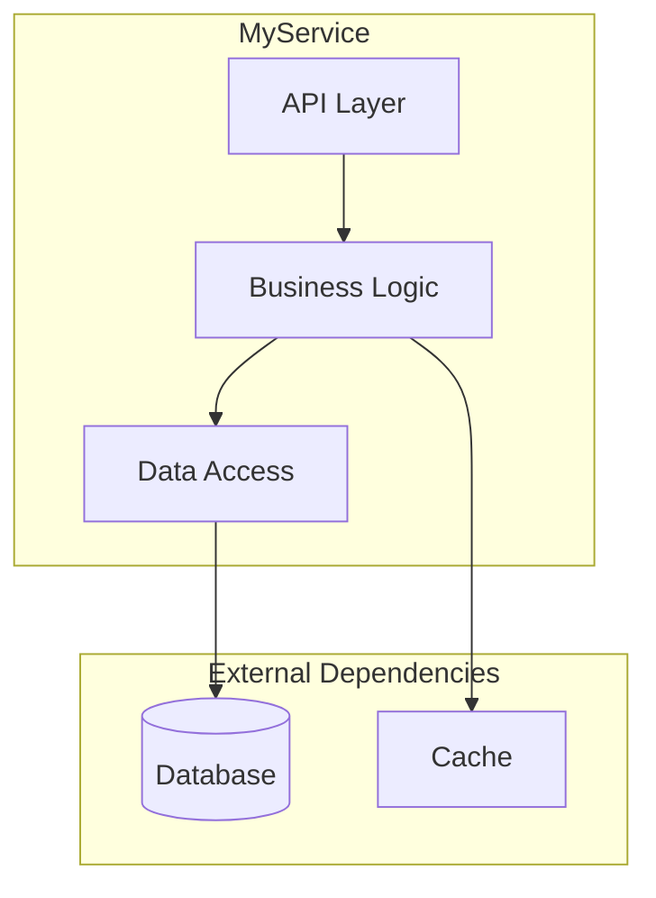
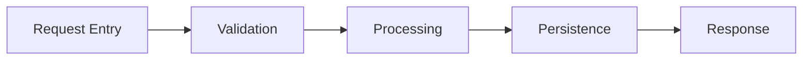
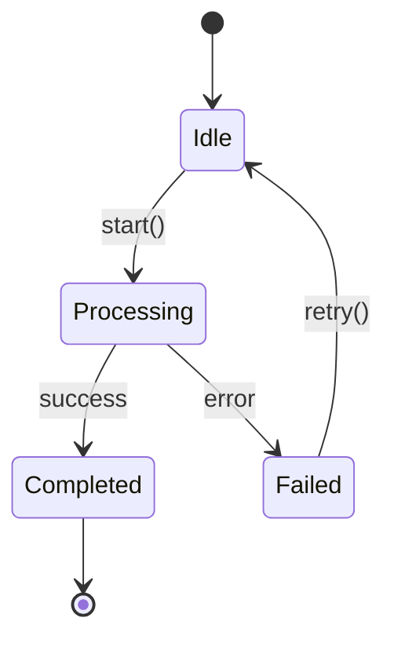
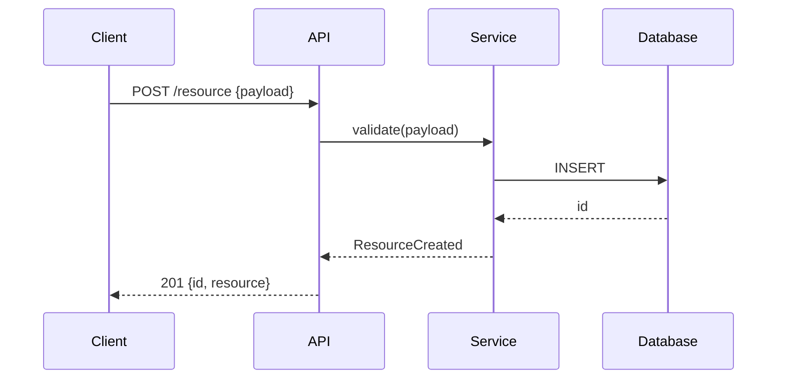
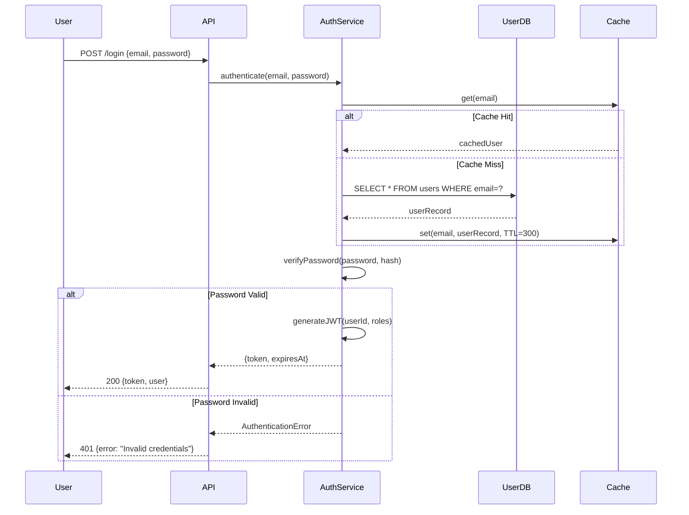
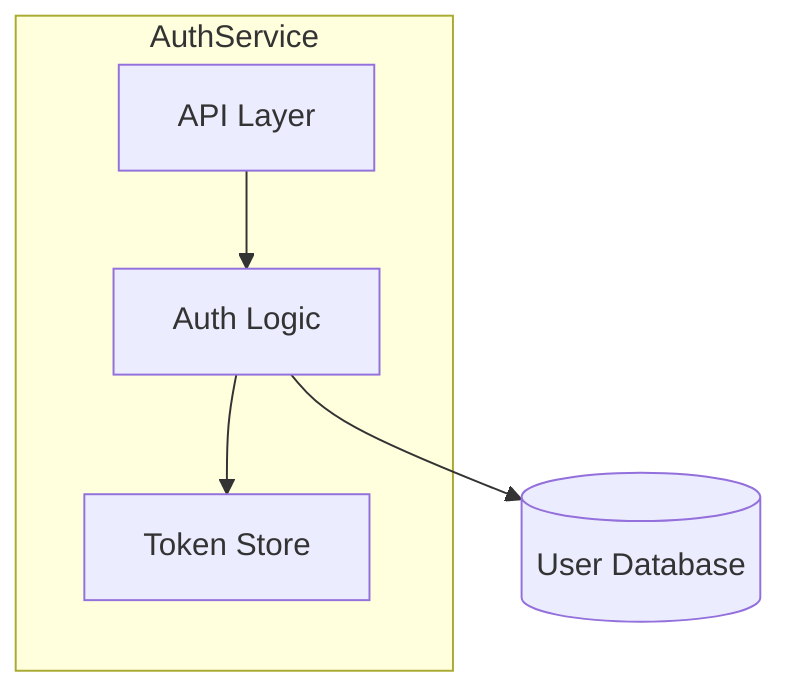

# Draft Init

You are initializing a Draft project for Context-Driven Development.

## Red Flags - STOP if you're:

- Re-initializing a project that already has `draft/` without using `refresh` mode
- Skipping brownfield analysis for an existing codebase
- Rushing through product definition questions without probing for detail
- Auto-generating tech-stack.md without verifying detected dependencies
- Not presenting .ai-context.md for developer review before proceeding
- Overwriting existing tracks.md (this destroys track history)
- **Producing copy-paste module descriptions** — if 3+ modules share identical Responsibilities or description text, you have NOT analyzed the source files
- **Writing architecture.md below the tier minimum** for the detected codebase tier — compute tier from Step 1.4.5 graph metrics (M, F, P); falling below the tier minimum indicates incomplete analysis, not conciseness
- **Writing sequence diagrams under 15 lines** of Mermaid code — shallow diagrams without alt/opt blocks, payloads, and error paths are useless
- **Writing module deep-dives under 100 lines each** — a module with hundreds of source files cannot be described in a paragraph
- **Using "See X/" or "follow BUILD patterns"** as a substitute for reading actual source files and documenting real content
- **Creating freeform sections** instead of the numbered 28-section template (e.g., "## Module deep-dive: X" instead of "## 7. Core Modules Deep Dive" with "#### 7.1 X" subsections) — the template structure is MANDATORY, graph data enriches it but does not replace it
- **Capping sub-module depth** — sub-modules with 50+ files get the SAME analysis depth as top-level modules; there is NO page limit; a 100-page architecture.md for a large codebase is correct

**Initialize once, refresh to update. Never overwrite without confirmation.**

---

## MANDATORY SECTION CHECKLIST — architecture.md

> **READ THIS BEFORE WRITING A SINGLE LINE OF architecture.md.**
> The document MUST use the EXACT numbered structure below. Freeform sections, renamed headings, or missing sections are FAILURES. Verify each item is present before considering architecture.md complete.

```
## 1.  Executive Summary
## 2.  AI Agent Quick Reference
## 3.  System Identity & Purpose
## 4.  Architecture Overview
## 5.  Component Map & Interactions
## 6.  Data Flow — End to End
## 7.  Core Modules Deep Dive
## 8.  Concurrency Model & Thread Safety
## 9.  Framework & Extension Points
## 10. Full Catalog of Implementations
## 11. Secondary Subsystem (V2 / Redesign)
## 12. API & Interface Definitions
## 13. External Dependencies
## 14. Cross-Module Integration Points
## 15. Critical Invariants & Safety Rules
## 16. Security Architecture
## 17. Observability & Telemetry
## 18. Error Handling & Failure Modes
## 19. State Management & Persistence
## 20. Reusable Modules for Future Projects
## 21. Key Design Patterns
## 22. Configuration & Tuning
## 23. Performance Characteristics & Hot Paths
## 24. How to Extend — Step-by-Step Cookbooks
## 25. Build System & Development Workflow
## 26. Testing Infrastructure
## 27. Known Technical Debt & Limitations
## 28. Glossary
### Appendix A: File Structure Summary
### Appendix B: Data Source → Implementation Mapping
### Appendix C: Output Flow — Implementation to Target
### Appendix D: Mermaid Sequence Diagrams — Critical Flows
### Appendix E: Proto Service Map (graph-derived)
```

**Self-check before finalizing**: Run a mental grep for `## 1.` through `## 28.` in your output. Any gap = incomplete document. Return and fill it.

> **If you are a subagent** executing this step via a delegation prompt: your prompt is a SUMMARY. The full 28-section structure above is the AUTHORITATIVE requirement. Do not infer section names from the summary — use the exact headings listed here.

---

## Standard File Metadata

**ALL files in `draft/` MUST include this metadata header.** This enables refresh tracking, sync verification, and traceability.

### Gathering Git Information

Before generating any file, run these commands to gather metadata:

```bash
# Project name (from manifest or directory)
basename "$(pwd)"

# Check if inside a git repository
if git rev-parse --is-inside-work-tree 2>/dev/null; then
  # Git branch
  git branch --show-current

  # Git remote tracking branch
  git rev-parse --abbrev-ref --symbolic-full-name @{upstream} 2>/dev/null || echo "none"

  # Git commit SHA (full) — fails on repos with zero commits
  git rev-parse HEAD 2>/dev/null || echo "none"

  # Git commit SHA (short)
  git rev-parse --short HEAD 2>/dev/null || echo "none"

  # Git commit date
  git log -1 --format="%ci" 2>/dev/null || echo "none"

  # Git commit message (first line)
  git log -1 --format="%s" 2>/dev/null || echo "none"

  # Check for uncommitted changes
  git status --porcelain | head -1
else
  # Non-git project: use fallback values
  echo "none"  # branch
  echo "none"  # remote
  echo "none"  # commit
  echo "none"  # commit_short
  echo "none"  # commit_date
  echo "none"  # commit_message
  # dirty: N/A for non-git projects
fi
```

> **Non-git projects:** If the project is not a git repository, all git metadata fields will be set to `"none"` and `git.dirty` to `false`. Refresh mode's incremental sync (`synced_to_commit`) will not function — full re-analysis is required on each refresh.

### Metadata Template

Insert this YAML frontmatter block at the **top of every draft/ file**:

```yaml
---
project: "{PROJECT_NAME}"
module: "{MODULE_NAME or 'root'}"
generated_by: "draft:{COMMAND_NAME}"
generated_at: "{ISO_TIMESTAMP}"
git:
  branch: "{LOCAL_BRANCH}"
  remote: "{REMOTE/BRANCH or 'none'}"
  commit: "{FULL_SHA}"
  commit_short: "{SHORT_SHA}"
  commit_date: "{COMMIT_DATE}"
  commit_message: "{FIRST_LINE_OF_COMMIT_MESSAGE}"
  dirty: {true|false}
synced_to_commit: "{FULL_SHA}"
---
```

> **Note**: `generated_by` uses `draft:command` format (not `/draft:command`) for cross-platform compatibility.

### Field Definitions

| Field | Description | Example |
|-------|-------------|---------|
| `project` | Project name from package.json/go.mod/Cargo.toml or directory name | `my-api-service` |
| `module` | Module name if in monorepo, otherwise `root` | `auth-service` |
| `generated_by` | The Draft command that created/updated this file | `draft:init` |
| `generated_at` | ISO 8601 timestamp when file was generated | `2024-01-15T14:30:00Z` |
| `git.branch` | Current local branch name | `main` |
| `git.remote` | Upstream tracking branch | `origin/main` |
| `git.commit` | Full SHA of HEAD when generated | `a1b2c3d4e5f6...` |
| `git.commit_short` | Short SHA (7 chars) | `a1b2c3d` |
| `git.commit_date` | Commit timestamp | `2024-01-15 10:00:00 -0500` |
| `git.commit_message` | First line of commit message | `feat: add user auth` |
| `git.dirty` | Were there uncommitted changes? | `true` or `false` |
| `synced_to_commit` | The commit SHA this doc is synchronized to | `a1b2c3d4e5f6...` |

### Usage in Refresh

The `synced_to_commit` field is critical for incremental refresh:
- `/draft:init refresh` reads this field to find changed files since last sync
- If `git.dirty: true`, warn user that docs may not reflect committed state
- After refresh, update `synced_to_commit` to current HEAD

### Example Header

```yaml
---
project: "payment-gateway"
module: "root"
generated_by: "draft:init"
generated_at: "2024-01-15T14:30:00Z"
git:
  branch: "main"
  remote: "origin/main"
  commit: "a1b2c3d4e5f6789012345678901234567890abcd"
  commit_short: "a1b2c3d"
  commit_date: "2024-01-15 10:00:00 -0500"
  commit_message: "feat: add stripe integration"
  dirty: false
synced_to_commit: "a1b2c3d4e5f6789012345678901234567890abcd"
---
```

---

## Pre-Check

Check for arguments:
- `refresh`: Update existing context without full re-init

### Standard Init Check

```bash
ls draft/ 2>/dev/null
```

If `draft/` exists with context files:
- Announce: "Project already initialized. Use `/draft:init refresh` to update context or `/draft:new-track` to create a feature."
- Stop here.

### Atomic File Staging

To prevent partial initialization from leaving a broken `draft/` directory:

1. **Stage all files** in a temporary directory (`draft.tmp/`) during init
2. **On success**: `mv draft.tmp/ draft/` (atomic rename on POSIX)
3. **On failure**: `rm -rf draft.tmp/` — no half-initialized state left behind

```bash
# Before writing any files:
mkdir -p draft.tmp/tracks

# Write all files to draft.tmp/ instead of draft/
# ... (product.md, tech-stack.md, workflow.md, tracks.md, architecture.md, .ai-context.md)

# After all files are written and verified:
mv draft.tmp/ draft/
```

> **Forced re-init:** If `draft/` exists and the user explicitly requests a fresh init (not refresh), confirm with user before removing the existing `draft/` directory.

### Monorepo Detection

Check for monorepo indicators:
- Multiple `package.json` / `go.mod` / `Cargo.toml` in child directories
- `lerna.json`, `pnpm-workspace.yaml`, `nx.json`, or `turbo.json` at root
- `packages/`, `apps/`, `services/` directories with independent manifests

If monorepo detected:
- Announce: "Detected monorepo structure. Consider using `/draft:index` at root level to aggregate service context, or run `/draft:init` within individual service directories."
- Ask user to confirm: initialize here (single service) or abort (use /draft:index instead)

### Migration Detection

If `draft/architecture.md` exists WITHOUT `draft/.ai-context.md`:
- Announce: "Detected architecture.md without .ai-context.md. Would you like to generate .ai-context.md? This will condense your existing architecture.md into a token-optimized AI context file."
- If user accepts: Run the Condensation Subroutine to derive `.ai-context.md` from existing `architecture.md`
- If user declines: Continue without .ai-context.md

If `draft/.ai-context.md` exists WITHOUT `draft/architecture.md`:
- Announce: "Detected .ai-context.md without its source architecture.md. The derived file exists but its primary source is missing (may have been accidentally deleted). Recommend running `/draft:init refresh` to regenerate architecture.md from codebase analysis."
- Do NOT delete the existing `.ai-context.md` — it still provides useful context until `architecture.md` is regenerated

### Refresh Mode

If the user runs `/draft:init refresh`:

**0. State-Aware Pre-Check** (before any refresh work):

   **a. Check for interrupted previous run:**
   ```bash
   cat draft/.state/run-memory.json 2>/dev/null
   ```
   If `status` is `"in_progress"`, offer to resume from `resumable_checkpoint` or start fresh.

   **b. Load freshness state (if available):**
   ```bash
   cat draft/.state/freshness.json 2>/dev/null
   ```
   If `freshness.json` exists, compute current file hashes and diff against stored hashes:
   - **Changed files**: Hash differs from stored → these files need re-analysis
   - **New files**: Present in current tree but not in stored → new modules/components to document
   - **Deleted files**: Present in stored but not in current tree → sections to prune
   - **Unchanged files**: Hash matches → skip re-reading these files entirely

   If NO files changed (all hashes match AND no new/deleted files), announce:
   "No source file changes detected since last init/refresh ({generated_at}). Architecture context is current. Nothing to refresh."
   Stop here unless the user insists.

   **c. Load signal state (if available):**
   ```bash
   cat draft/.state/signals.json 2>/dev/null
   ```
   If `signals.json` exists, re-run signal classification (Phase 1 step 5) and diff against stored signals:
   - **New signal categories** (0→N): A new architectural concern appeared (e.g., auth files added for the first time). Flag these — new architecture.md sections may need to be generated.
   - **Removed signal categories** (N→0): An architectural concern was removed. Flag for section pruning.
   - **Signal count changes**: Significant growth (>50% increase) suggests the section needs deeper treatment.

   Report signal drift:
   ```
   Signal drift detected:
     NEW:     auth_files (0 → 5) — §16 Security Architecture needs generation
     GROWN:   backend_routes (12 → 24) — §12 API Definitions, §14 Cross-Module Integration need expansion
     REMOVED: background_jobs (3 → 0) — §8 Concurrency can be simplified
     STABLE:  services (8 → 9), test_infra (15 → 16)
   ```

   **d. Create refresh run memory:**
   If starting fresh: write new `draft/.state/run-memory.json` with `run_type: "refresh"` and `status: "in_progress"`.
   If resuming from a checkpoint (step 0a): preserve existing fields (`phases_completed`, `resumable_checkpoint`, `active_focus_areas`) and only update `started_at` to current timestamp.

   **e. Load previous unresolved questions:**
   If the previous run had `unresolved_questions`, display them:
   "Previous run flagged these unresolved questions: {list}. Keep these in mind during refresh."

1. **Tech Stack Refresh**: Re-scan `package.json`, `go.mod`, etc. Compare with `draft/tech-stack.md`. Propose updates.

2. **Architecture Refresh**: If `draft/architecture.md` exists, use metadata-based incremental analysis. If freshness state is available from step 0b, use file-level deltas to scope the refresh more precisely than git-diff alone:

   **a. Read synced commit from metadata:**
   ```bash
   # Extract synced_to_commit from YAML frontmatter
   SYNCED_SHA=$(grep "synced_to_commit:" draft/architecture.md | head -1 | sed 's/.*synced_to_commit:[[:space:]]*"\{0,1\}\([^"]*\)"\{0,1\}/\1/')

   # Validate extracted SHA is a real git object
   if [ -z "$SYNCED_SHA" ] || ! git cat-file -t "$SYNCED_SHA" 2>/dev/null; then
     echo "Invalid or missing synced_to_commit — falling back to full refresh"
     # Jump to step (i) — full refresh
   fi
   ```
   This returns the commit SHA the docs were last synced to (more reliable than file modification time). The SHA is validated before use to prevent silent failures in `git diff`.

   **b. Get changed files since that commit:**
   ```bash
   git diff --name-only <SYNCED_SHA> HEAD -- . ':!draft/'
   ```
   This lists all source files changed since the last architecture sync, excluding the draft/ directory itself.

   **c. Check if docs were generated with dirty state:**
   If the original `git.dirty: true`, warn: "Previous generation had uncommitted changes. Full refresh recommended."

   **d. Categorize changes:**
   - **Added files**: New modules, components, or features to document
   - **Modified files**: Existing sections that may need updates
   - **Deleted files**: Components to remove from documentation
   - **Renamed files**: Update file references

   **e. Targeted analysis (only changed files):**
   > **Guardrail:** If more than 100 files changed since last sync, recommend full 5-phase refresh instead of incremental analysis. Too many changes means the incremental approach loses its token-efficiency advantage.

   - Read each changed file to understand modifications (up to 100 files; if more, fall back to full refresh)
   - Identify which architecture.md sections are affected:
     - New files → Component Map, Implementation Catalog, File Structure
     - Modified interfaces → API Definitions, Interface Contracts
     - Changed dependencies → External Dependencies, Dependency Graph
     - New tests → Testing Infrastructure
     - Config changes → Configuration & Tuning
   - Preserve unchanged sections exactly as-is
   - Preserve modules added by `/draft:decompose` (planned modules)

   **f. Present incremental diff:**
   Show user:
   - Files analyzed: `N changed files since <date>`
   - Sections updated: list of affected sections
   - Summary of changes per section

   **g. On user approval:**
   - Update only the affected sections in `draft/architecture.md`
   - Regenerate `draft/.ai-context.md` and `draft/.ai-profile.md` using the Condensation Subroutine

   **h. On user rejection:**
   - No changes made to `draft/architecture.md`
   - However, verify `.ai-context.md` consistency: if `.ai-context.md` is missing or its `synced_to_commit` differs from `architecture.md`, offer to regenerate it from the current (unchanged) `architecture.md`

   **i. Fallback to full refresh:**
   If `synced_to_commit` is missing from metadata, or the commit SHA doesn't exist in git history:
   ```bash
   git cat-file -t <SYNCED_SHA> 2>/dev/null || echo "not found"
   ```
   If this returns "not found", run full 5-phase architecture discovery instead.

   - If `draft/architecture.md` does NOT exist and the project is brownfield, offer to generate it now

   **j. Update metadata after refresh:**
   After successful refresh, update the YAML frontmatter in all modified files:
   - `generated_by`: `draft:init refresh`
   - `generated_at`: current timestamp
   - `git.*`: current git state
   - `synced_to_commit`: current HEAD SHA

   **k. Refresh state files:**
   After successful architecture refresh, regenerate all state files:
   - `draft/.state/facts.json` — re-extract atomic facts, perform contradiction detection (see step 2l)
   - `draft/.state/freshness.json` — recompute hashes of all source files (new baseline)
   - `draft/.state/signals.json` — re-run signal classification (update baseline)
   - `draft/.state/run-memory.json` — set `status: "completed"`, `completed_at: "{ISO_TIMESTAMP}"`, preserve `unresolved_questions`

   **l. Contradiction detection (if facts.json exists):**
   If `draft/.state/facts.json` exists from a previous run, perform fact-level diff:

   1. **Re-extract facts** from changed files identified in step 2b
   2. **Compare against existing facts** sourced from those files:
      - **CONFIRMED**: Fact still holds — update `last_verified_at` and `last_active_at`
      - **UPDATED**: Fact changed (e.g., API endpoint renamed) — mark old fact with `superseded_by` edge, create new fact
      - **EXTENDED**: Fact refined with new detail — add `extends` edge to original fact
      - **NEW**: Fact not previously recorded — add with full timestamps
      - **STALE**: Fact's source file was deleted — mark `last_active_at` as stale, reduce confidence
   3. **Generate Fact Evolution Report** — display summary to user:
      ```
      Fact Evolution Report:
        CONFIRMED:  N facts unchanged
        UPDATED:    N facts superseded (old → new)
        EXTENDED:   N facts refined
        NEW:        N facts discovered
        STALE:      N facts from deleted files
      ```
   4. **Update relationship edges** in `facts.json` knowledge graph

3. **Product Refinement**: Ask if product vision/goals in `draft/product.md` need updates.
4. **Workflow Review**: Ask if `draft/workflow.md` settings (TDD, commits) need changing.
5. **Preserve**: Do NOT modify `draft/tracks.md` unless explicitly requested.
6. **Core Guardrails Backfill**: Before running pattern re-discovery, verify that `draft/guardrails.md` contains the C++/Systems Hard Guardrails from `core/guardrails.md` (G1.x–G7.x). These guardrails are mandatory for all C++ projects.

   **Detection:** Check if `draft/guardrails.md` contains the marker `### C++/Systems — Object Lifecycle & Memory Safety` (the first C++ guardrail section heading).

   - **If missing:** The file predates `core/guardrails.md`. Backfill by inserting the full C++/Systems Hard Guardrails sections from `core/templates/guardrails.md` (G1.x–G7.x, all pre-checked) into the `## Hard Guardrails` section of the existing `draft/guardrails.md`, after any existing general guardrails. Preserve all existing Hard Guardrails, Learned Conventions, and Learned Anti-Patterns. Announce: "Backfilled C++/Systems Hard Guardrails (G1.x–G7.x) from core/guardrails.md into draft/guardrails.md."
   - **If present:** No action needed — guardrails are up to date.
   - **If project has no C++ code:** Skip backfill. The guardrails only apply to C++ projects.

7. **Pattern Re-Discovery**: Run `/draft:learn` (no arguments — full codebase scan) to update `draft/guardrails.md` with any new or changed patterns since the last init/refresh. This keeps learned conventions and anti-patterns in sync with codebase evolution.

Stop here after refreshing. Continue to standard steps ONLY for fresh init.

## Step 1: Project Discovery

Analyze the current directory to classify the project:

**Brownfield (Existing)** indicators:
- Has `package.json`, `requirements.txt`, `go.mod`, `Cargo.toml`, etc.
- Has `src/`, `lib/`, or similar code directories
- Has git history with commits

**Greenfield (New)** indicators:
- Empty or near-empty directory
- Only has README or basic config

Respect `.gitignore` and `.claudeignore` when scanning.

If **Brownfield**: proceed to Step 1.5 (Architecture Discovery).
If **Greenfield**: skip to Step 2 (Product Definition).

---

## Step 1.4: Graph Analysis (Automated, Before Manual Discovery)

**IMPORTANT**: Before reading any source files manually, run the graph builder to get precise structural data. This step is fast (seconds, not minutes) and dramatically accelerates all subsequent phases.

**CRITICAL ORDERING**: Phase 0 (this step) MUST complete before writing any section of architecture.md. The graph provides: (a) exhaustive module list, (b) hotspot-ranked module priority, (c) authoritative proto API surface, (d) mermaid diagrams ready for slot injection, (e) codebase tier for .ai-context.md budget.

### 1. Detect and run graph binary

```bash
# Find the graph binary shipped with the draft plugin.
# Method 1: .draft-install-path breadcrumb (written by install.sh)
# Method 2: search known install locations
# Method 3: check if 'graph' is on PATH
GRAPH_BIN=""

# Method 1: breadcrumb file (most reliable — works on any machine)
for breadcrumb in \
    "$HOME/.cursor/plugins/local/draft/.draft-install-path" \
    "$HOME/.claude-plugin/../.draft-install-path" \
    ; do
    if [ -f "$breadcrumb" ]; then
        PLUGIN_ROOT="$(cat "$breadcrumb")"
        if [ -x "$PLUGIN_ROOT/graph/bin/graph" ]; then
            GRAPH_BIN="$PLUGIN_ROOT/graph/bin/graph"
            break
        fi
    fi
done

# Method 2: search common install paths
if [ -z "$GRAPH_BIN" ]; then
    for candidate in \
        "$HOME/.cursor/plugins/local/draft/graph/bin/graph" \
        "$HOME/.claude-plugin/../graph/bin/graph" \
        "graph/bin/graph" \
        ; do
        if [ -x "$candidate" ]; then
            GRAPH_BIN="$candidate"
            break
        fi
    done
fi

# Method 3: check PATH
if [ -z "$GRAPH_BIN" ]; then
    GRAPH_BIN="$(command -v graph 2>/dev/null || true)"
fi

# Run if found
if [ -n "$GRAPH_BIN" ]; then
    echo "Found graph binary: $GRAPH_BIN"
    "$GRAPH_BIN" --repo . --out draft/graph/
else
    echo "Graph binary not found — skipping automated analysis"
fi
```

Run the above bash script. If the graph binary is found, it will analyze the codebase and produce `draft/graph/` with all artifacts.

### 2. If graph build succeeds, load the always-load artifacts

Read these files to get structural context for all subsequent phases:
- `draft/graph/schema.yaml` — module count, file count, edge count, language stats per module
- `draft/graph/module-graph.jsonl` — all module nodes + weighted dependency edges
- `draft/graph/proto-index.jsonl` — all proto services, RPCs, messages, enums
- `draft/graph/hotspots.jsonl` — all complexity hotspots (files ranked by lines + fanIn * 50)

### 3. Use graph data to accelerate Step 1.5

- **Module boundaries**: Exact module list with file counts — skip manual directory tree mapping
- **Dependency wiring**: Exact inter-module edges with weights — skip manual `#include` / import tracing
- **Proto API surface**: Exact services, RPCs, and message definitions — skip manual proto discovery
- **Hotspots**: Know which high-complexity, high-fanIn files to prioritize reading
- **Language mix**: Exact `.cc`, `.h`, `.go`, `.proto`, `.py` counts per module
- **Cycle detection**: Circular dependency paths between modules — flag for architecture.md

### 4. Compute codebase tier and module priority

**Step 1.4.5 — Compute Codebase Tier:**
Read `draft/graph/schema.yaml`. Extract:
- `M = stats.modules`
- `F = stats.go_functions + stats.py_functions`
- `P = stats.proto_rpcs`

Apply tier table:

| Tier | Label  | Condition                              | .ai-context.md Budget |
|------|--------|----------------------------------------|-----------------------|
| 1    | micro  | M≤5 AND F≤50 AND P≤10                 | 100–180 lines         |
| 2    | small  | M≤15 AND F≤300 AND P≤30               | 180–280 lines         |
| 3    | medium | M≤40 AND F≤1000 AND P≤100             | 280–400 lines         |
| 4    | large  | M≤100 AND F≤5000 AND P≤500            | 400–600 lines         |
| 5    | XL     | M>100 OR F>5000 OR P>500              | 600–900 lines         |

Hold tier in memory. This governs: architecture.md length minimum, .ai-context.md budget, and module deep-dive depth.

**Step 1.4.6 — Build Module Priority List:**
From `draft/graph/hotspots.jsonl`: count hotspot files per module (group by `module` field).
From `draft/graph/module-graph.jsonl`: count incoming edges per module (fan-in, from `kind: "edge"` records).
Rank modules by: `(hotspot_count × 2) + fan_in_count`.
Top-ranked modules drive Section 6 deep-dive ordering and depth. Modules ranked zero on both: summary treatment only.
Hold ranked list in memory — it replaces directory scanning for module discovery.

**Step 1.4.7 — Populate Graph Injection Slots:**
Query for diagram content and write into architecture.md slots using the standard marker format.

For Section 4.4 (module-deps slot):
```bash
"$GRAPH_BIN" --repo . --out draft/graph --query --mode mermaid --symbol module-deps
```
Parse JSON response: extract `.mermaid` string and `filtered` flag. Write between the markers:
```
<!-- GRAPH:module-deps:START -->
```mermaid
{diagram content}
```
{if filtered: Note: diagram filtered to top edges by weight — N of M total edges shown}
<!-- GRAPH:module-deps:END -->
```

For Section 20 (hotspots slot):
Read `draft/graph/hotspots.jsonl`, take top 10 by score, build markdown table:
```
<!-- GRAPH:hotspots:START -->
| File | Lines | fanIn | Score |
|------|-------|-------|-------|
| {path} | {lines} | {fanIn} | {score} |
...
<!-- GRAPH:hotspots:END -->
```

For Appendix E (proto-map slot):
```bash
"$GRAPH_BIN" --repo . --out draft/graph --query --mode mermaid --symbol proto-map
```
Parse JSON response: extract `.mermaid` string. If no proto files (`stats.services == 0`), write placeholder. Otherwise write:
```
<!-- GRAPH:proto-map:START -->
```mermaid
{diagram content}
```
<!-- GRAPH:proto-map:END -->
```

**If slot markers are absent** (first run on a repo that has no prior slot structure): write the slot content at the designated location in the template. The markers are always present in `core/templates/architecture.md`, so this path is only hit if a user has an older pre-slot architecture.md.

### 5. If graph binary not found or build fails

Proceed with standard Step 1.5 manual discovery. No degradation — the 5-phase analysis works as before. Architecture.md length minimum defaults to tier-2 guidance (medium-depth treatment).

See `core/shared/graph-query.md` for the full graph query subroutine reference.

---

## Step 1.5: Architecture Discovery (Brownfield Only)

Perform a **one-time, exhaustive analysis** of the existing codebase. This is NOT a summary — it is a comprehensive reference document that enables future AI agents and engineers to work without re-reading source files.

**Outputs**:
- `draft/architecture.md` — Human-readable, **comprehensive** engineering reference (PRIMARY)
- `draft/.ai-context.md` — Token-optimized, tier-scaled budget, condensed from architecture.md (DERIVED)
- `draft/.ai-profile.md` — Ultra-compact, 20-50 lines, always-injected project profile (DERIVED)
- `draft/graph/` — Knowledge graph artifacts (module-graph, proto-index, hotspots, per-module files) from Step 1.4

**Target output**: A single self-contained reference document designed for **dual consumption**:
1. **LLM / AI-agent context** — enabling future code changes, Q&A, and onboarding without re-reading source files.
2. **Engineer reference** — enabling debugging, extension, and operational understanding.

### Exhaustive Analysis Mandate

**CRITICAL**: This analysis must be EXHAUSTIVE, not representative. Specifically:
- **Read ALL relevant source files** — do not sample or skim
- **Enumerate ALL implementations** — no "and others", "etc.", or "similar patterns"
- **Generate REAL Mermaid diagrams** — every section calling for a diagram MUST have one
- **Include ACTUAL code snippets** — from the codebase, not pseudocode
- **Populate ALL tables** — with real data, not placeholders or examples
- **Target: comprehensive coverage** — shorter output indicates incomplete analysis

If the codebase is large (200+ files), focus on the module boundaries but still enumerate exhaustively within each module.

> **Large codebase guardrail:** If the codebase exceeds 500 source files, limit Section 7 deep dives to the top 20 most-imported modules and summarize others in a table. Rank modules by the number of unique files that import/reference them (descending) — use `draft/graph/module-graph.jsonl` hub weights if graph data is available. For dynamic languages where static import counting is impractical, rank by file count within each module directory (larger modules first). **Even for summarized modules, enumerate immediate sub-directories with file counts** (one-line per sub-dir) — this is cheap with graph data and provides essential navigation context.

### Parallel Analysis Protocol (Tiers 3–5)

**MANDATORY for tiers 3–5 (medium / large / XL).** Uses Map → IR+Prose → Reduce: parallel reader agents each produce both structured IR metadata and full §7 deep-dive prose, then a synthesis agent composes the final document. Cuts wall clock by ~55% at XL tier while preserving depth — readers write the module narratives from source; synthesis assembles the cross-cutting sections.

**For tiers 1–2 (micro / small): skip this protocol entirely.** Use the Sequential Generation Protocol below. At small scale, parallelism adds overhead with no speed benefit, and the IR intermediate step discards source-level depth that a direct sequential pass produces cheaply.

> Full protocol details, IR schema, and prompt templates are in `core/shared/parallel-analysis.md`.

#### Tier-Adaptive Agent Counts

From the tier computed in Step 1.4.5, determine reader agent count:

| Tier | Label  | Reader Agents                        | Strategy                             |
|------|--------|--------------------------------------|--------------------------------------|
| 1    | micro  | 1 (all modules in one agent)         | 1 reader → 1 synthesizer             |
| 2    | small  | 1–2 (all or half modules each)       | 1–2 readers → 1 synthesizer          |
| 3    | medium | 2–3 (ceil(M/6) agents)               | parallel readers → 1 synthesizer     |
| 4    | large  | ceil(M/4) agents                     | parallel readers → 1 synthesizer + parallel finalizers |
| 5    | XL     | ceil(M/4) agents                     | parallel readers → 1 synthesizer + parallel finalizers |

For tiers 1–2, the "parallel" phase is just a single reader agent — no overhead, same clean IR boundary.
For tier 3+, readers run simultaneously; wall clock = slowest reader, not the sum.

#### Phase 0: Graph Data (already done in Step 1.4)

The graph binary has already run. Use its output throughout this protocol:
- `draft.tmp/graph/schema.yaml` — module list, file counts, tier metrics
- `draft.tmp/graph/module-graph.jsonl` — fan-in counts per module (for grouping)
- `draft.tmp/graph/hotspots.jsonl` — top hotspot files per module (feed to readers)

#### Phase 1: Spawn Parallel Module Readers

**Step 1: Group modules.**

From `draft.tmp/graph/module-graph.jsonl`, extract all module names and their fan-in counts.
Apply dependency-aware grouping (see `core/shared/parallel-analysis.md`).
Use the modules-per-agent count from the tier table above (4 for tier 4/5; all modules in one agent for tier 1):
- Assign highest fan-in modules to separate readers (tier 3+)
- Co-locate coupled module pairs in the same reader
- Target balanced token budgets across groups

**Step 2: Build graph data summary per group.**

For each reader group, prepare a compact summary from graph artifacts:
```
Modules: [execution, fill_processor, order_manager]
Hotspot files:
  execution/engine.go (847 lines, fanIn=12)
  execution/router.go (412 lines, fanIn=8)
  fill_processor/handler.go (623 lines, fanIn=5)
Module edges (from module-graph.jsonl):
  execution → [risk, data, services]
  fill_processor → [execution, persistence]
```

**Step 3: Spawn all reader agents in parallel using the Agent tool.**

Spawn `ceil(module_count / 4)` agents simultaneously. Use the Module Reader Prompt Template from `core/shared/parallel-analysis.md`, replacing:
- `{MODULE_LIST}` — comma-separated module names for this agent
- `{REPO_ROOT}` — absolute path to repository root
- `{GRAPH_DATA_SUMMARY}` — the compact summary built in Step 2

Each reader agent:
- Reads source files in its assigned modules only
- Outputs a JSON array of IR objects (one per module)
- Produces NO prose, NO documentation

**Critical constraints to include in reader prompts:**
```
MUST output IR JSON array only.
MUST NOT write any documentation or architecture sections.
MUST NOT read files outside assigned modules.
Token budget: max 600 tokens per module in IR output.
```

**Step 4: Collect and validate reader outputs.**

Each reader produces two outputs, separated by `## IR` and `## Deep-Dives` headings.

After all readers complete:
1. Extract the `## IR` section from each reader output and parse as JSON. If parse fails, retry that reader (see failure modes in `core/shared/parallel-analysis.md`).
2. Check IR `token_budget_used` — if < 150 for a module with >20 files AND deep-dive for that module is < 100 lines, re-run that reader with explicit instruction to read more files.
3. Concatenate all IR objects into a single JSON array → `draft.tmp/.state/reader-irs.json`
4. Concatenate all `## Deep-Dives` sections from all readers → `draft.tmp/.state/reader-deep-dives.md`

#### Phase 2: Synthesis

Collect reader outputs before spawning synthesis:
1. Parse and concatenate all IR JSON arrays → `draft.tmp/.state/reader-irs.json`
2. Concatenate all reader deep-dive Markdown sections → `draft.tmp/.state/reader-deep-dives.md`

Spawn a **single synthesis agent** with the Synthesis Coordinator Prompt from `core/shared/parallel-analysis.md`, replacing:
- `{CONCATENATED_DEEP_DIVES}` — content of `draft.tmp/.state/reader-deep-dives.md`
- `{CONCATENATED_IRS}` — content of `draft.tmp/.state/reader-irs.json`
- `{GRAPH_DEPENDENCY_DIAGRAM}` — mermaid output from `--query --mode mermaid --symbol module-deps`
- `{ARCHITECTURE_TEMPLATE_STRUCTURE}` — the 28-section outline from `core/templates/architecture.md`

The synthesis agent:
- Pastes reader deep-dives verbatim into Section 7 — does not rewrite them
- Derives cross-cutting sections (component map, concurrency, error handling, invariants, extension points) from IR fields
- Reads source directly for §6 Data Flow, §12 API, §14 Integration, §15 Invariants verification, §18 Patterns, §22 Config
- Produces the full 28-section architecture.md

**Source reading policy for synthesis agent (enforce in prompt):**
```
Read source for: §6 Data Flow, §12 API Definitions, §14 Integration Points,
                 §15 Critical Invariants (verification), §18 Design Patterns, §22 Configuration

All other sections: compose from reader deep-dives (§7) and IR fields.
```

#### Phase 3: Parallel Finalization

Once `draft.tmp/architecture.md` is written, spawn two agents simultaneously:

**Finalizer A — Context Derivation:**
Run the Condensation Subroutine (defined later in this skill) to generate:
- `draft.tmp/.ai-context.md`
- `draft.tmp/.ai-profile.md`

**Finalizer B — State Files:**
Write all `.state/` artifacts from the concatenated IRs:
- `draft.tmp/.state/facts.json` — extract atomic facts from IR fields (key_classes, invariants, state, error_handling)
- `draft.tmp/.state/freshness.json` — compute hashes of all source files read (baseline for incremental refresh)
- `draft.tmp/.state/signals.json` — derive signal classification from IR module roles and graph data
- `draft.tmp/.state/run-memory.json` — set `status: "completed"`, record phase timings

Finalizers A and B have no dependency on each other — run truly in parallel.

#### Phase 4: Quality Gate

After both finalizers complete, run the Completion Verification (defined later in this skill) against the standard hard minimum thresholds. If any metric fails:
1. Identify the sparse sections (most likely cross-cutting sections: §14 Integration, §16 Security, §8 Concurrency)
2. Request the synthesis agent to expand those sections, providing the relevant IR fields as targeted input
3. Only proceed to atomic rename (`mv draft.tmp/ draft/`) after all metrics pass

#### Failure Recovery

If any reader agent fails to produce valid JSON after one retry:
- Log which modules failed: `draft.tmp/.state/failed-readers.json`
- Run those modules through the standard sequential analysis (Phase 3 in the Large Codebase Protocol below)
- Merge the resulting content into the IR set before synthesis
- The other readers' IRs remain valid — only the failed group needs re-work

---

### Sequential Generation Protocol (Primary for Tiers 1–2; Fallback for Tiers 3–5)

**Use this protocol for tiers 1–2 (micro/small) as the primary path.** At small scale, direct sequential analysis produces deeper output than the parallel IR pipeline with less overhead.

**Also use this protocol as fallback for tiers 3–5** if the Agent tool is unavailable, or if a reader agent fails entirely after retry. For 500+ file codebases running the fallback, limit sequential analysis to the top 20 modules by fan-in rank — the output will be shallower than parallel but still useful.

#### Pass 1: Foundation (Sections 1–6)

Generate Sections 1–6 (Executive Summary through Data Flow). Write the result to `draft/architecture.md`. These sections establish the structural skeleton: identity, topology diagrams, component map, and data flow diagrams. **Minimum 400 lines for Pass 1.**

#### Pass 2: Module Deep Dives (Section 7) — One Module at a Time, with Sub-Modules

**MANDATORY (graph-first)**: Use the ranked module list from Step 1.4.6 — do NOT re-discover modules by directory scanning if Phase 0 succeeded. The graph list is exhaustive. Read the top-3 hotspot files per module (from `draft/graph/hotspots.jsonl`) before writing its deep-dive.

For each module in ranked order (hotspot_count × 2 + fan_in_count, descending), up to top 20:

**Step A — Top-level module analysis:**
1. **READ** `draft/graph/modules/{module_name}.jsonl` — extract sub-directory structure, file list with line counts
2. **READ** `draft/graph/hotspots.jsonl` — identify high-complexity files in this module
3. **READ** at least 3 key source files for this module: the interface/header, the main implementation, and one representative op/handler. For modules with 200+ files, read at least 5 source files.
4. **CLASSIFY** each sub-directory by tier: Large (50+ files → full deep-dive), Medium (10-49 files → summary), Small (< 10 files → table row), Ops/Handler (→ operation catalog)
5. **WRITE** the top-level module deep-dive: role, sub-module structure table, responsibilities, internal architecture diagram (showing sub-module relationships), notable mechanisms, error handling, thread safety

**Step B — Sub-module deep-dives (within the same module):**

**CRITICAL — Sub-modules get the SAME depth as top-level modules.** A sub-module with 200+ files is as complex as many standalone services. Do NOT abbreviate. There is NO page limit.

For each Large sub-module (50+ files):
1. **READ** 2-3 key source files from this sub-module (interface header, main impl, one op/handler). For sub-modules with 200+ files, read at least 5 source files.
2. **WRITE** full sub-module deep-dive (`##### 7.X.Y`) using the SAME template as top-level modules: role, source files list, sub-sub-module structure table (if nested dirs exist), responsibilities (ALL, numbered), key operations/methods table (with signatures), state machine (if stateful), internal architecture diagram (if 100+ files), notable mechanisms, error handling, thread safety
3. **RECURSE** — if the sub-module itself has Large sub-sub-modules (50+ files), apply this same step recursively at `###### 7.X.Y.Z` level

For each Medium sub-module (10-49 files):
1. **READ** 1-2 key source files (interface, one impl)
2. **WRITE** summary sub-module deep-dive (`##### 7.X.Y`): role (2-3 sentences), key operations table (5+ entries with source file references), notable mechanisms, one interface/header code snippet

For each Ops/Handler directory:
1. **READ** file list from graph JSONL (no need to read each file — names and line counts are sufficient for the catalog)
2. **WRITE** numbered operation catalog table enumerating ALL operations — no sampling, no "and others"

**Step C — Verify and append:**
1. **VERIFY** the complete module section (top-level + all sub-modules) is at least 100 lines (150+ for modules with 200+ files), contains UNIQUE description text, and all Large/Medium sub-modules have their own subsections
2. **APPEND** the entire module section to `draft/architecture.md`

Do NOT batch all 20 modules into one write. Process them sequentially so each module and its sub-modules get dedicated analysis attention. **No upper limit on Pass 2 length** — it scales with codebase complexity. A 14-module C++ codebase with deep sub-module hierarchies may produce 5000+ lines in Pass 2 alone. That is correct and expected.

#### Pass 2 Completion Gate — MANDATORY before Pass 3

**YOU MUST PRODUCE THIS TABLE before writing a single line of Pass 3.** Do not skip, summarize, or defer it.

For every module written in Pass 2, count the lines in its section and fill in this table:

```
## Pass 2 Completion Report
| Module | Lines written | Sub-modules covered | PASS / FAIL |
|--------|--------------|---------------------|-------------|
| foo/bar | 142 | fill_processor, scheduler | PASS |
| foo/baz | 38  | none                | FAIL — below 100 line minimum |
```

**Rules:**
- PASS threshold: ≥ 100 lines for any module with < 200 source files; ≥ 150 lines for modules with 200+ source files
- A FAIL row means you MUST expand that module's section NOW, before continuing
- If any row shows FAIL: re-read additional source files for that module and expand until the line count passes
- If all rows PASS: print "All modules pass. Proceeding to Pass 3." and continue
- **Omitting this table is the same as failing the gate** — Pass 3 MUST NOT start without it

This gate exists because this skill requires exhaustive module coverage. Skipping modules or writing paragraph-level summaries is a violation of the Exhaustive Analysis Mandate, not an acceptable pragmatic trade-off.

#### Pass 3: Remaining Sections (Sections 8–28 + Appendices)

Generate Sections 8–28 and Appendices A–D. These cover concurrency, extensions, catalogs, APIs, dependencies, integration, invariants, security, observability, error handling, state, patterns, configuration, performance, cookbooks, build, testing, debt, glossary, and cross-reference appendices. **Minimum 600 lines for Pass 3.**

Read additional source files as needed for each section — do not rely solely on what was read in earlier passes.

#### Pass 4: Quality Gate Verification

After all sections are written, run the Completion Verification (defined later in this skill) against hard minimum thresholds. If any metric fails:
1. Identify the weakest sections
2. Read additional source files for those sections
3. Expand until all metrics pass
4. Only then proceed to `.ai-context.md` generation

**Minimum scale guidance:** Pass 1: 400+ lines, Pass 2: scales with modules (no cap), Pass 3: 600+ lines. For a 500+ file codebase with 10+ modules and deep sub-module hierarchies, total output of 5000-10000+ lines is expected and correct.

---

### Execution Strategy for Depth

**Mindset**: You are creating a PERMANENT reference document. Future AI agents and engineers will use this instead of reading source code. Incomplete analysis means they'll make mistakes.

**File Reading Strategy**:
1. **Read broadly first** (Phase 1-2): Map the entire codebase structure
2. **Read deeply second** (Phase 3-4): For each major module, read the FULL implementation
3. **Cross-reference** (Phase 5): Verify every component appears in all relevant sections

**Diagram Generation Strategy**:
1. **Generate diagrams AFTER understanding** — not during exploration
2. **Use proper Mermaid syntax** — validate mentally before writing
3. **One diagram per concept** — don't combine unrelated flows
4. **Annotate arrows** — show what data moves between nodes

**Iteration Guidance**:
- After initial generation, review each HIGH-priority section
- If any section is thin (< 1 page for HIGH priority), expand it
- If any required diagram is missing, add it
- If tables have < 5 rows, verify you've enumerated exhaustively

---

### Adaptive Sections

Not every codebase has every concept. Apply these rules:

| If the codebase... | Then... |
|---------------------|---------|
| Has no plugin / algorithm / handler system | Skip Section 9 (Framework & Extension Points) and Section 10 (Full Catalog) |
| Has no V1/V2 generational split | Skip Section 11 (Secondary Subsystem) |
| Has no RPC / proto / API definitions | Skip Section 12, or retitle to "API Definitions" and cover REST / GraphQL / OpenAPI |
| Is a library (no binary / process) | Adapt Section 4.2 (Process Lifecycle) to "Usage Lifecycle" — how consumers integrate it |
| Is a frontend / UI module | Add: Component hierarchy, route map, state management, styling system |
| Uses a database directly | Add to Section 19: schema definitions, migration system, ORM models |
| Is containerized / has infra config | Add: Dockerfile, Kubernetes manifests, Helm charts, Terraform, CI/CD pipeline |
| Is a single-threaded / simple module | Simplify Section 8 (Concurrency) to note "single-threaded" and skip detailed thread maps |
| Has no configuration flags | Adapt Section 22 to cover whatever config mechanism exists (env vars, YAML, JSON, TOML, .env) |

---

### Language-Specific Exploration Guide

#### C / C++
| What to Find | Where to Look |
|-------------|--------------|
| Build targets & deps | `BUILD`, `CMakeLists.txt`, `Makefile` |
| Entry point | `main()` in `*_exec.cc`, `main.cc`, `*_main.cc` |
| Interfaces | `.h` header files (class declarations, virtual methods) |
| Implementation | `.cc` / `.cpp` files |
| API definitions | `.proto` files (protobuf), `.thrift` files |
| Config / flags | gflags: `DEFINE_*` macros in `flags.cc` / `flags.h` |
| Tests | `*_test.cc`, `*_unittest.cc`, files in `test/` or `qa/` dirs |

#### Go
| What to Find | Where to Look |
|-------------|--------------|
| Build targets & deps | `go.mod`, `go.sum`, `BUILD` (if Bazel) |
| Entry point | `func main()` in `main.go` or `cmd/*/main.go` |
| Interfaces | `type XxxInterface interface` in `*.go` files |
| Implementation | `*.go` files (non-test) |
| API definitions | `.proto` files, or handler registrations in router setup |
| Config / flags | `flag.*`, Viper config, environment variables |
| Tests | `*_test.go` files |

#### Python
| What to Find | Where to Look |
|-------------|--------------|
| Build targets & deps | `requirements.txt`, `pyproject.toml`, `setup.py`, `setup.cfg`, `Pipfile` |
| Entry point | `if __name__ == "__main__"` blocks, `app.py`, `main.py`, CLI entry points in pyproject.toml |
| Interfaces | Abstract base classes (`ABC`), Protocol classes, type hints |
| Implementation | `.py` files |
| API definitions | FastAPI/Flask route decorators, OpenAPI spec, `.proto` files |
| Config / flags | `settings.py`, `.env`, `config.yaml`, `argparse`, Pydantic Settings |
| Tests | `test_*.py`, `*_test.py`, files in `tests/` dirs |

#### TypeScript / JavaScript
| What to Find | Where to Look |
|-------------|--------------|
| Build targets & deps | `package.json`, `tsconfig.json`, `yarn.lock` / `package-lock.json` |
| Entry point | `"main"` in package.json, `index.ts`, `app.ts`, `server.ts` |
| Interfaces | TypeScript `interface` / `type` definitions in `*.ts` / `*.d.ts` |
| Implementation | `*.ts` / `*.js` files |
| API definitions | Route files, OpenAPI spec, GraphQL `.graphql` / `.gql` files |
| Config / flags | `.env`, `config.ts`, environment variables, `process.env.*` |
| Tests | `*.test.ts`, `*.spec.ts`, files in `__tests__/` dirs |

#### Java / Kotlin
| What to Find | Where to Look |
|-------------|--------------|
| Build targets & deps | `pom.xml` (Maven), `build.gradle` / `build.gradle.kts` (Gradle), `BUILD` (Bazel) |
| Entry point | `public static void main(String[] args)`, Spring Boot `@SpringBootApplication` |
| Interfaces | Java `interface` declarations, abstract classes |
| Implementation | `*.java` / `*.kt` files in `src/main/` |
| API definitions | `@RestController` / `@RequestMapping` annotations, `.proto` files, OpenAPI |
| Config / flags | `application.yml` / `application.properties`, Spring `@Value`, env vars |
| Tests | `*Test.java`, `*Spec.kt`, files in `src/test/` |

#### Rust
| What to Find | Where to Look |
|-------------|--------------|
| Build targets & deps | `Cargo.toml`, `Cargo.lock` |
| Entry point | `fn main()` in `src/main.rs` or `src/bin/*.rs` |
| Interfaces | `trait` definitions |
| Implementation | `*.rs` files |
| API definitions | Handler registrations (Actix/Axum routes), `.proto` files |
| Config / flags | `clap` structs, `config` crate, `.env`, `config.toml` |
| Tests | `#[test]` functions, `tests/` directory, `#[cfg(test)]` modules |

---

### Analysis Strategy — How to Explore the Codebase

Follow these steps in order. The specific files to look for depend on the language — use the Language-Specific Exploration Guide above.

#### Phase 1: Discovery (Broad Scan)

1. **Map the directory tree**: Recursively list the project to understand the file layout. Note subdirectory groupings. (If Step 1.4 graph analysis succeeded, use `draft.tmp/graph/schema.yaml` module list instead — it is exhaustive and includes file counts.)

2. **Read build / dependency files**: These reveal the module structure, dependencies, and targets. (See language guide above for which files.)

3. **Read API definition files**: These define the module's data model and service interfaces. (See language guide above for which files. If Step 1.4 succeeded, `draft.tmp/graph/proto-index.jsonl` already has all proto services, RPCs, and message definitions.)

4. **Read interface / type definition files**: Class declarations, interface definitions, and type annotations reveal the public API and design intent.

5. **Classify codebase signals**: Walk the file tree from step 1 and tag every file that matches one or more signal categories. This drives adaptive section depth in later phases — sections with strong signals get deep treatment, sections with no signals get marked SKIP. (If Step 1.4 succeeded, use module file counts and dependency edges to accelerate signal classification.)

   | Signal Category | Detection Patterns | Drives Section(s) |
   |----------------|-------------------|-------------------|
   | `backend_routes` | `routes/`, `handlers/`, `controllers/`, `**/api/**`, route decorators (`@app.route`, `@router`, `@RequestMapping`) | §12 API Definitions, §14 Cross-Module Integration |
   | `frontend_routes` | `pages/`, `views/`, `**/routes.*`, `**/router.*`, React Router, Next.js `app/` dir | §4 Architecture (add UI topology) |
   | `components` | `components/`, `widgets/`, `*.component.ts`, `*.tsx` in component dirs | §7 Core Modules (add component hierarchy) |
   | `services` | `services/`, `*Service.*`, `*_service.*`, `**/service/**` | §5 Component Map, §7 Core Modules |
   | `data_models` | `models/`, `entities/`, `schemas/`, `*.model.*`, `*.entity.*`, `migrations/` | §19 State Management, §12 API Definitions |
   | `auth_files` | `auth/`, `**/auth/**`, `middleware/auth*`, `guards/`, JWT/OAuth imports | §16 Security Architecture |
   | `state_management` | `store/`, `reducers/`, `**/state/**`, Redux/Vuex/Zustand/Pinia imports | §19 State Management (frontend state) |
   | `background_jobs` | `jobs/`, `workers/`, `tasks/`, `queues/`, `**/cron/**`, Celery/Sidekiq/Bull imports | §8 Concurrency, §22 Configuration |
   | `persistence` | `repositories/`, `dao/`, `**/db/**`, ORM config files, migration directories | §19 State Management |
   | `test_infra` | `test/`, `tests/`, `__tests__/`, `*.test.*`, `*.spec.*`, test config files | §26 Testing Infrastructure |
   | `config_files` | `.env*`, `config/`, `*.config.*`, `application.yml`, `settings.*` | §22 Configuration |

   **Procedure:**

   ```bash
   # Count files matching each signal category
   # Example for backend_routes:
   find . -type f \( -path "*/routes/*" -o -path "*/handlers/*" -o -path "*/controllers/*" -o -path "*/api/*" \) \
     ! -path "*/node_modules/*" ! -path "*/.git/*" ! -path "*/vendor/*" ! -path "*/draft/*" | head -50

   # Repeat for each category, adapting patterns to the detected language
   ```

   **Build a signal summary** (hold in memory for Phase 5):

   ```
   Signal Classification:
     backend_routes:    12 files  → §12, §14 HIGH
     services:           8 files  → §5, §7 HIGH
     data_models:        6 files  → §19, §12 HIGH
     test_infra:        15 files  → §26 HIGH
     auth_files:         3 files  → §16 HIGH
     components:         0 files  → §7 (skip component hierarchy)
     frontend_routes:    0 files  → §4 (skip UI topology)
     state_management:   0 files  → §19 (skip frontend state)
     background_jobs:    0 files  → §8 (simplify concurrency)
     persistence:        4 files  → §19 HIGH
     config_files:       5 files  → §22 HIGH
   ```

   **Integration with Adaptive Sections table (above):** Use signal counts to override the default skip rules. A signal count of 0 means the section should be skipped or simplified. A count ≥ 3 means the section warrants deep treatment. Between 1-2, include the section but keep it brief.

#### Phase 2: Wiring (Trace the Graph)

6. **Find the entry point**: (See language guide above for common entry-point patterns.) Trace the initialization sequence.

7. **Follow the orchestrator**: From the top-level controller / app / server, trace how it creates, initializes, and wires all owned components.

8. **Find the registry / registration code**: Look for files that register handlers, plugins, routes, middleware, algorithms, etc. This reveals the full catalog.

9. **Map the dependency wiring**: Find the DI container, context struct, module system, or import graph that connects components.

#### Phase 3: Depth (Trace the Flows)

10. **Trace data flows end-to-end**: For each major flow, start at the data source / entry point and follow the code through processing stages to the output.

11. **Read implementation files**: For core modules, read the implementation to understand algorithms, error handling, retry logic, and state management.

12. **Identify concurrency model**: Find where thread pools, async executors, goroutines, or worker processes are created and what work is dispatched to each.

13. **Find safety checks**: Look for invariant assertions, validation logic, auth checks, version checks, lock acquisitions, and transaction boundaries.

#### Phase 4: Periphery

14. **Catalog external dependencies**: Check build/dependency files and import statements to map all external library and service dependencies.

15. **Examine test infrastructure**: Read test files and test utilities to understand the testing approach, mock patterns, and test harness.

16. **Scan for configuration**: Find all configuration mechanisms (flags, env vars, config files, feature gates, constants).

17. **Look for documentation**: Check for existing README, docs/, architecture decision records (ADRs), or inline comments that provide architectural context.

#### Phase 5: Synthesis

18. **Cross-reference**: Ensure every component mentioned in one section appears in all relevant sections (architecture, data flow, interaction matrix, etc.).

19. **Validate completeness**: Confirm ALL handlers / endpoints / plugins / schemas / dependencies are listed. Do not sample — enumerate exhaustively.

20. **Identify patterns**: Look for recurring design patterns and document them.

21. **Generate diagrams**: Create Mermaid diagrams AFTER understanding the full picture, not during exploration.

---

## architecture.md Specification

Generate `draft/architecture.md` — a comprehensive human-readable engineering reference.

**Output format**:
- Markdown report with Mermaid diagrams, tables, and code blocks
- **Target length: comprehensive** — cover all 28 sections + 5 appendices exhaustively
- Include a **Table of Contents** with numbered sections
- End the document with: `"End of analysis. Queries should reference the .ai-context.md file for token efficiency."`

**CRITICAL — Template Structure Compliance:**
- The output MUST use the EXACT 28-section numbered structure defined below (## 1. through ## 28. plus Appendix A–E)
- Do NOT create freeform/custom section names (e.g., "## Module deep-dive: X", "## Key architectural patterns")
- Do NOT collapse multiple template sections into one
- Do NOT skip section numbers — if a section does not apply, include the heading with "N/A — {reason}"
- Graph data ENRICHES the template sections — it does not REPLACE the template structure
- Sub-modules MUST receive the SAME depth of analysis as top-level modules — there is NO page limit; if the document reaches 100+ pages for a large codebase, that is correct and expected

### MANDATORY Header Format

**CRITICAL**: Every architecture.md file MUST start with this exact structure. Gather git metadata first, then fill in placeholders.

```markdown
---
project: "{PROJECT_NAME}"
module: "root"
generated_by: "draft:init"
generated_at: "{ISO_TIMESTAMP}"
git:
  branch: "{LOCAL_BRANCH}"
  remote: "{REMOTE/BRANCH}"
  commit: "{FULL_SHA}"
  commit_short: "{SHORT_SHA}"
  commit_date: "{COMMIT_DATE}"
  commit_message: "{COMMIT_MESSAGE}"
  dirty: {true|false}
synced_to_commit: "{FULL_SHA}"
---

# Architecture: {PROJECT_NAME}

> Comprehensive human-readable engineering reference.
> For token-optimized AI context, see `draft/.ai-context.md`.

---

## Table of Contents

1. [Executive Summary](#1-executive-summary)
2. [AI Agent Quick Reference](#2-ai-agent-quick-reference)
3. [System Identity & Purpose](#3-system-identity--purpose)
... (continue with all 28 sections + appendices)
```

**Do NOT skip the YAML frontmatter. It enables incremental refresh tracking.**

---

### Report Structure — Follow This Exact Section Ordering

_(Skip or adapt sections per the Adaptive Sections table above.)_

---

### 1. Executive Summary

Write **one paragraph** that states:
- What the module IS (identity)
- What it DOES (responsibilities)
- Its role in the larger system

Follow with a **Key Facts** bullet list:
- Primary language(s) and version
- Binary / entry-point / package name
- Architecture style (e.g., distributed master/worker, client-server, daemon, library, microservice, monolith, serverless, CLI tool)
- Generational variants if any (V1 / V2 / legacy + modern)
- Approximate count of major sub-components, plugins, handlers, or endpoints
- Primary data sources (what it reads from — databases, message queues, APIs, files)
- Primary action targets (what it writes to / calls — databases, downstream services, files)

---

### 2. AI Agent Quick Reference

A compact block optimized for fast AI-agent context loading. Fill in every field that applies; mark others as "N/A":

```
**Module**           : {PROJECT_NAME}
**Root Path**        : ./
**Language**         : (e.g., C++17, Go 1.21, Python 3.12, TypeScript 5.3, Rust 1.75, Java 21)
**Build**            : (e.g., `bazel build //path:target`, `npm run build`, `cargo build`,
                        `./gradlew build`, `mvn package`, `make`, `pip install -e .`)
**Test**             : (e.g., `bazel test //path/...:all`, `npm test`, `pytest`, `cargo test`,
                        `go test ./...`, `mvn test`)
**Entry Point**      : (file → class/function, e.g., `main.go → main()`, `app.py → create_app()`,
                        `index.ts → bootstrap()`, `Main.java → main()`)
**Config System**    : (e.g., gflags in flags.cc, .env + config.yaml, Spring application.yml,
                        environment variables, Viper config)
**Extension Point**  : (interface to implement + where to register, or "N/A" if not applicable)
**API Definition**   : (e.g., .proto files, OpenAPI spec, GraphQL schema, or "N/A")
**Key Config Prefix**: (e.g., `MODULE_*` env vars, `module.*` YAML keys, `--module-*` CLI flags)

**Before Making Changes, Always:**
1. (Primary invariant check — the #1 thing that must not break)
2. (Thread-safety / async-safety consideration, or "single-threaded — no concerns")
3. (Test command to run after changes)
4. (API / schema versioning rule, if applicable)

**Never:**
- (Critical safety rule 1 — e.g., "never delete data without tombstone check")
- (Critical safety rule 2 — e.g., "never bypass auth middleware")
- (Critical safety rule 3 — e.g., "never modify proto field numbers")
```

---

### 3. System Identity & Purpose

- **What {PROJECT_NAME} Does** — numbered list of core responsibilities.
- **Why {PROJECT_NAME} Exists** — the business / system problem it solves, including what would go wrong without it. Frame in terms of:
  - Data integrity
  - Performance / efficiency
  - Compliance / correctness
  - Operational safety
  - User experience (if user-facing)

---

### 4. Architecture Overview

**Expected length: 2-3 pages with diagrams**

#### 4.1 High-Level Topology

**MANDATORY: Generate a Mermaid `flowchart TD` diagram** showing:
- The main process / service and its internal components (as nested subgraphs)
- External services and dependencies (as a separate subgraph)
- Directional arrows showing primary data / control flow

Example structure (adapt to actual codebase):

```mermaid
flowchart TD
    subgraph Service["MyService"]
        A[API Layer] --> B[Business Logic]
        B --> C[Data Access]
    end
    subgraph External["External Dependencies"]
        D[(Database)]
        E[Cache]
    end
    C --> D
    B --> E
```

#### 4.4 Module Dependency Graph (graph-derived, auto-refreshed)

Write the `GRAPH:module-deps` injection slot into architecture.md:

If graph build succeeded (Step 1.4.7 completed), write the populated slot content using the diagram from Step 1.4.7. If filtered (>30 modules), include the filter note. Dashed edges indicate circular dependencies.

If graph binary was not found: write the slot with placeholder body so draft:index can populate it later:
```
<!-- GRAPH:module-deps:START -->
[Graph data unavailable — run draft:index to populate after graph binary is installed]
<!-- GRAPH:module-deps:END -->
```

The slot markers MUST always be written — they are required for draft:index refresh to function.

#### 4.2 Process Lifecycle (or Usage Lifecycle for libraries)

Numbered steps from startup to steady state. Reference the entry-point source file.

For services/daemons: binary start → config load → dependency init → server listen → event loop.
For libraries: import → configure → initialize → use → teardown.
For CLI tools: parse args → validate → execute → output → exit.

**Include 5-10 numbered steps with file:line references.**

---

### 5. Component Map & Interactions

#### 5.1 Top-Level Orchestrator

For the main controller / manager / app class:
- Describe its role in one sentence.
- **Owned Components** — table:

  | Component | Type | Purpose |
  |-----------|------|---------|

- **Initialization Stages** — Mermaid `flowchart TD` showing the state machine from uninitialized to fully ready (if applicable — skip for simple modules).

#### 5.2 Dependency Injection / Wiring Pattern

Describe how components reference each other. Common patterns to look for:
- Constructor injection (Spring, Guice, etc.)
- Service locator / context struct (C++ pattern)
- Module system (Python, Node.js imports)
- Dependency injection container (NestJS, .NET, Dagger)
- Global singletons / registries

List all injection tokens, getter categories, or module exports.

#### 5.3 Interaction Matrix

Table showing which components communicate with which:

| | Comp A | Comp B | Comp C | ... |
|---|---|---|---|---|
| Comp A | — | ✓ | ✓(RPC) | |
| Comp B | ✓ | — | | ✓(HTTP) |

Use ✓ for direct calls, ✓(RPC) for remote procedure calls, ✓(HTTP) for REST calls, ✓(queue) for message queue, ✓(DB) for shared database, ✓(event) for event bus.

---

### 6. Data Flow — End to End

**Expected length: 3-5 pages with 3-5 diagrams**

**MANDATORY: Create SEPARATE Mermaid flowcharts** for each major data-flow path. Do NOT combine flows into one diagram.

#### 6.1 Primary Processing Pipeline
**DIAGRAM REQUIRED**: Show the main request/job flow from entry to completion.

```mermaid
flowchart LR
    A[Request Entry] --> B[Validation]
    B --> C[Processing]
    C --> D[Persistence]
    D --> E[Response]
```
Annotate each arrow with the data type that moves between stages.

#### 6.2 Variant Flows
**DIAGRAM REQUIRED for each variant**: (e.g., sync vs async path, read vs write path, happy path vs error path).

#### 6.3 Multi-Phase Processing
**DIAGRAM REQUIRED if applicable**: (e.g., map → reduce, extract → transform → load, request → queue → worker → result).

#### 6.4 Output Delivery Pipeline
**DIAGRAM REQUIRED**: Show how processed data reaches external targets (APIs, databases, files, queues).

#### 6.5 Safety / Consistency Mechanisms
Document with diagram or prose: transactions, idempotency guards, version checks, distributed locks, retry boundaries.

**Annotate ALL arrows with the data/message type that moves between stages.**

---

### 7. Core Modules Deep Dive

**Expected length: NO UPPER LIMIT — scales with codebase complexity.**
- A 14-module codebase with sub-modules may produce 50+ pages for Section 7 alone. That is correct.
- A sub-module with 50+ files gets the SAME depth as a top-level module (full deep-dive template).
- Every sub-module at every nesting level gets dedicated analysis — do NOT summarize to save space.
- If the document reaches 100 pages, that is a sign of thoroughness, not a problem.

For each major internal module (typically 5–20), provide a COMPLETE deep dive:

#### Per-Module Template

```markdown
#### 7.X {ModuleName}

**Role**: One-line description of what this module does.

**Source Files**:
- `path/to/main.file` — primary implementation
- `path/to/types.file` — type definitions
- `path/to/utils.file` — helpers

**Sub-Module Structure** (for modules with sub-directories):

| Sub-Module | Path | Files | Role |
|------------|------|-------|------|
| `master` | `module/master/` | 45cc, 38h | Scheduling, job management, coordination |
| `slave` | `module/slave/` | 32cc, 28h | Task execution, data movement |
| `ops` | `module/master/ops/` | 60cc, 60h | Individual operation implementations |
| (enumerate ALL immediate sub-directories with source files) | | | |

> **MANDATORY (graph data)**: Before writing ANY module deep-dive, you MUST:
> 1. **READ** `draft/graph/modules/{module}.jsonl` — extract sub-directory structure from file paths in the JSONL records. Group files by their immediate sub-directory (e.g., `icebox/master/ops/foo.cc` → sub-module `master/ops`) and count files per sub-module. This provides exhaustive sub-module enumeration.
> 2. **READ** `draft/graph/hotspots.jsonl` — filter for files in this module to identify high-complexity, high-fanIn files that deserve explicit mention.
> 3. **READ** at least 3 key source files for this module: the primary interface/header (e.g., `*_interface.h`), the main implementation file, and one representative operation/handler. For modules with 200+ files, read at least 5 source files.
> 4. **ONLY THEN** write the module section. If graph data does not exist, perform equivalent manual scanning.
>
> Skipping these reads produces copy-paste descriptions. Every module deep-dive MUST reflect actual source file content.

**Responsibilities**:
1. First responsibility with detail
2. Second responsibility with detail
3. (list ALL, not just top 3)

**Key Operations / Methods**:

| Op / Method | Signature | Description |
|-------------|-----------|-------------|
| `methodName` | `(input: Type) → ReturnType` | What it does |
| (enumerate ALL public methods) | | |

**State Machine** (if stateful):
[Mermaid stateDiagram-v2 here]

**Internal Architecture** (if complex):
[Mermaid flowchart of subcomponents here]
> For modules with sub-directories, show the sub-module relationships
> as a flowchart (e.g., master → slave coordination, ops dispatch).

**Notable Mechanisms**:
- Caching: how and what is cached
- Retry logic: policy and backoff
- Connection pooling: pool size and management
- (document ALL mechanisms, not just existence)

**Error Handling**: How this module handles and propagates errors.

**Thread Safety**: Single-threaded / thread-safe / requires external synchronization.
```

#### Sub-Module Depth Requirements

**CRITICAL**: Do NOT stop at the top-level module. The per-module deep-dive template above applies **recursively** to significant sub-modules. A top-level module like `icebox/` (917 files) is really a system of sub-systems — `master/`, `slave/`, `client/`, `base/` — each of which is as large as a standalone module in a smaller project. Treating them as one-line table rows produces useless output.

#### Tiered Sub-Module Analysis

Apply the following tiers based on sub-module size (file count from graph data):

| Sub-Module Size | Treatment | What to Produce |
|----------------|-----------|-----------------|
| **Large (50+ files)** | **Full deep-dive** — apply the SAME per-module template recursively | Role, source files, sub-sub-module table (if nested dirs), responsibilities, key operations table, state machine (if stateful), internal architecture diagram, notable mechanisms, error handling, thread safety |
| **Medium (10–49 files)** | **Summary deep-dive** — abbreviated version of the template | Role (2-3 sentences), key operations table (5+ entries), notable mechanisms, one interface/header code snippet |
| **Small (< 10 files)** | **Catalog entry** — one-line in parent's sub-module table | Path, file count, role description |
| **Ops/Handler directories** | **Operation catalog** — regardless of size, enumerate ALL operations | Numbered table: operation name, source file, line count, one-line description |

#### Mandatory Steps for Each Sub-Module

1. **Enumerate immediate sub-directories** — list every sub-directory that contains source files, its file count, and a one-line role description
2. **Classify each sub-directory by tier** — use file counts from graph data to determine Large / Medium / Small / Ops treatment
3. **Apply the appropriate template for each tier** — Large sub-modules get their own `##### 7.X.Y {SubModuleName}` subsection with the full template; Medium sub-modules get a condensed subsection; Small sub-modules stay as table rows
4. **Use graph data (MANDATORY when available)** — read `draft/graph/modules/{module}.jsonl` and group file records by sub-directory path to get exhaustive sub-module enumeration. This is not optional — graph data provides deterministic file lists that prevent incomplete enumeration
5. **Document sub-module interfaces** — if sub-modules have distinct interfaces (e.g., `master/` vs `slave/`), describe their API boundary and interaction pattern
6. **For ops/handler directories** — enumerate ALL operations in a numbered table regardless of directory size. These are the primary extension points engineers need to find.

#### Per-Sub-Module Template (Large — 50+ files)

Apply this template for each sub-module at the Large tier. Nest it under the parent module as `##### 7.X.Y`:

```markdown
##### 7.X.Y {ParentModule}/{SubModuleName}

**Role**: What this sub-module does within the parent module.

**Source Files** (key files — not exhaustive, see table for full list):
- `path/to/interface.h` — public API
- `path/to/impl.cc` — primary implementation
- `path/to/types.h` — data types

**Sub-Sub-Module Structure** (if nested directories exist):

| Sub-Directory | Path | Files | Role |
|---------------|------|-------|------|
| `ops` | `module/submod/ops/` | 60cc, 60h | Operation implementations |
| `test` | `module/submod/test/` | 25cc | Test suites |

**Responsibilities**:
1. {Unique responsibility 1 — what this sub-module does that its siblings don't}
2. {Unique responsibility 2}
3. {list ALL}

**Key Operations / Methods**:

| Op / Method | Signature | Description |
|-------------|-----------|-------------|
| `methodName` | `(input: Type) → ReturnType` | What it does |
| (enumerate ALL public methods — at least 5 entries) | | |

**Interaction with Sibling Sub-Modules**:
- Calls `{sibling}/` for {purpose}
- Called by `{sibling}/` when {trigger}
- Shares `{base|common}/` types: {list key shared types}

**State Machine** (if stateful):
[Mermaid stateDiagram-v2]

**Notable Mechanisms**: {caching, retry, batching, scheduling, etc.}

**Error Handling**: How errors propagate within this sub-module and to the parent.
```

#### Per-Sub-Module Template (Medium — 10–49 files)

```markdown
##### 7.X.Y {ParentModule}/{SubModuleName}

**Role**: {2-3 sentence description}.

**Key Operations**:

| Op / Method | Source File | Description |
|-------------|-------------|-------------|
| (at least 5 entries with real data) | | |

**Notable Mechanisms**: {1-2 bullet points on key internal behavior}

**Key Interface** (code snippet from actual source):
```{language}
// actual code from the interface header, 10-20 lines
```
```

#### Operation Catalog Template (for ops/handler directories)

Regardless of tier, any directory whose name contains `ops`, `handlers`, `executors`, `workers`, `actions`, or `commands` MUST get a full enumeration:

```markdown
##### 7.X.Y {Module}/{SubModule}/ops — Operation Catalog

| # | Operation | Source File | Lines | Description |
|---|-----------|-------------|-------|-------------|
| 1 | `ArchiveFilesOp` | `icebox/master/ops/archive_files_op.cc` | 2100 | Archives files to cloud vault |
| 2 | `CancelJobOp` | `icebox/master/ops/cancel_job_op.cc` | 450 | Cancels running archive job |
| ... | (enumerate ALL — no sampling, no "and others") | | | |
```

Use `draft/graph/modules/{module}.jsonl` to get the complete file list with line counts. Use `draft/graph/hotspots.jsonl` to flag high-complexity operations.

#### Example: Full Sub-Module Treatment for `icebox/` (917 files)

For a module like `icebox/` with sub-directories `master/` (200+ files), `slave/` (150+ files), `client/` (20 files), `base/` (40 files):

```
#### 7.3 icebox
  [Top-level module deep-dive: role, overall architecture diagram, cross-sub-module interaction]

  ##### 7.3.1 icebox/master (Large — 200+ files → full deep-dive)
    [Full template: role, responsibilities, key ops table, state machine, mechanisms]

    ##### 7.3.1.1 icebox/master/ops — Operation Catalog
      [Numbered table of ALL 60+ operations with file, lines, description]

  ##### 7.3.2 icebox/slave (Large — 150+ files → full deep-dive)
    [Full template: role, responsibilities, key ops table, mechanisms]

    ##### 7.3.2.1 icebox/slave/ops — Operation Catalog
      [Numbered table of ALL slave operations]

  ##### 7.3.3 icebox/base (Medium — 40 files → summary deep-dive)
    [Summary: role, key ops table, one code snippet]

  ##### 7.3.4 icebox/client (Medium — 20 files → summary deep-dive)
    [Summary: role, key ops table, interface snippet]
```

This produces 300–500+ lines for `icebox/` alone, which is proportional to its 917-file complexity.

**MANDATORY for stateful modules and sub-modules**: Include a `stateDiagram-v2` showing state transitions:

```mermaid
stateDiagram-v2
    [*] --> Idle
    Idle --> Processing: start()
    Processing --> Completed: success
    Processing --> Failed: error
    Failed --> Idle: retry()
    Completed --> [*]
```

#### Section 7 Quality Gate (MANDATORY)

After writing ALL module and sub-module deep-dives for Section 7, run these checks before proceeding to Section 8. **If any check fails, STOP and fix before continuing.**

**Check 1 — Minimum depth per top-level module:**
Count the lines in each top-level module subsection (from `#### 7.X` to the next `#### 7.Y`). If ANY deep-dived module has fewer than 60 lines (or fewer than 150 lines for modules with 200+ files), the analysis is incomplete. Go back, read the module's source files, and expand.

**Check 2 — No duplicate descriptions (modules AND sub-modules):**
Compare the Responsibilities and description text across ALL modules AND sub-modules. If 3 or more share more than 50% of their description text (e.g., identical sentences like "Implement subsystem ops, expose RPC stubs"), you have NOT analyzed the source files. For each duplicated entry:
1. Read `draft/graph/modules/{module_name}.jsonl` to get its file list
2. Read the module/sub-module's primary interface header and at least one implementation file
3. Rewrite the description based on what it ACTUALLY does — what makes it UNIQUE from its siblings

**Check 3 — Sub-module tables present:**
For every module with more than 50 source files (check file count from graph data), verify a Sub-Module Structure table exists listing immediate sub-directories with file counts and roles. If missing, read the module's graph JSONL and generate the table.

**Check 4 — Sub-module tiering applied:**
For every sub-module listed in a Sub-Module Structure table, verify the correct tier treatment was applied:
- Large sub-modules (50+ files): MUST have their own `##### 7.X.Y` subsection with the full deep-dive template (role, responsibilities, key ops, mechanisms, error handling)
- Medium sub-modules (10-49 files): MUST have their own `##### 7.X.Y` subsection with summary (role, key ops table, one code snippet)
- Ops/handler directories: MUST have a numbered operation catalog table enumerating ALL operations
If any Large or Medium sub-module is missing its required subsection, generate it.

**Check 5 — Key operations populated (modules AND sub-modules):**
Each deep-dived module AND each Large/Medium sub-module MUST have a Key Operations / Methods table with at least 5 real entries (not placeholders). If a table has fewer than 5 entries, read additional source files.

**Check 6 — Diagrams for complex modules:**
Modules with more than 200 source files MUST have at least one internal architecture diagram (flowchart showing sub-module relationships and data flow between them). If missing, generate one from the sub-module dependency structure.

**Check 7 — Operation catalogs complete:**
For every ops/handler directory identified in sub-module tables, verify a numbered catalog exists enumerating ALL operations. Compare the count against graph data file counts. If the catalog has fewer entries than files in the directory, it is incomplete.

---

### 8. Concurrency Model & Thread Safety

_(For single-threaded or simple modules, state that explicitly and skip the detailed subsections.)_

- **Execution Model** — single-threaded, multi-threaded, async/await, actor model, goroutine-based, event-loop, etc.
- **Thread / Worker Pool Map** — table:

  | Pool / Executor | Purpose | What Runs On It |
  |-----------------|---------|-----------------|

- **Thread Affinity / Safety Rules** — which objects are single-threaded vs. thread-safe; which methods must be called from which context.
- **Locking Strategy** — what locks / mutexes / semaphores exist, their granularity, and ordering rules to prevent deadlocks.
- **Async Patterns** — how callbacks / promises / futures / channels chain; proper cancellation; timeout handling; lifetime management.
- **Common Concurrency Pitfalls** — specific anti-patterns to avoid in this codebase.

---

### 9. Framework & Extension Points

_(Skip if the module has no plugin / handler / middleware / algorithm system.)_

#### 9.1 Plugin / Handler / Middleware Types

Table:

| Type | Interface / Base Class | Description |
|------|----------------------|-------------|

#### 9.2 Registry / Registration Mechanism

Describe how plugins are registered. Common patterns:
- Explicit registry calls in an init file
- Decorator / annotation-based auto-registration
- Convention-based discovery (file naming, directory scanning)
- Configuration-driven (list in YAML / JSON)
- Self-registration via static initializers or module init

#### 9.3 Per-Plugin Metadata

Table of all properties stored per registered plugin:

| Property | Type | Description |
|----------|------|-------------|

#### 9.4 Core Interfaces

For each interface, show the key method signatures as **code blocks** with inline comments explaining inputs, outputs, and optional hooks. Use actual code from the codebase.

#### 9.5 Universal / Shared Data Types

Describe any type-erased, generic, or shared containers used across interfaces.

---

### 10. Full Catalog of Implementations

_(Skip if Section 9 was skipped AND the codebase has no operation/handler pattern.)_

#### 10.1 Legacy / V1 Implementations (if applicable)

Numbered table:

| # | Name | Type | Data Sources |
|---|------|------|--------------|

#### 10.2 Current Implementations

Table grouped by category:

| Category | Implementations |
|----------|-----------------|

**Include ALL implementations found in the codebase — enumerate exhaustively.**

#### 10.3 Sub-Module Operation Catalogs

**CRITICAL**: For large modules with operation/handler sub-directories (e.g., `icebox/master/ops/`, `magneto/vmware/`, `blob_store/blob_ops/`), enumerate ALL operation classes:

```markdown
##### 10.3.X {Module}/{SubModule} Operations

| # | Operation | Source File | Lines | Description |
|---|-----------|-------------|-------|-------------|
| 1 | ArchiveFilesOp | `icebox/master/ops/archive_files_op.cc` | 2100 | Archives files to cloud vault |
| 2 | CancelJobOp | `icebox/master/ops/cancel_job_op.cc` | 450 | Cancels running archive job |
| (enumerate ALL — use graph hotspots.jsonl and per-module JSONL for file list and line counts) |
```

> **MANDATORY (graph data)**: Read `draft/graph/modules/{module}.jsonl` to get the complete file
> list with line counts. Filter for files in operation sub-directories (paths containing `/ops/`,
> `/handlers/`, `/executors/`, `/workers/`). Use `draft/graph/hotspots.jsonl` to flag
> high-complexity operations (high line count or fanIn). Do NOT skip this step — incomplete
> catalogs cause AI agents to reinvent existing functionality.

**Why this matters**: Operation classes are the primary extension points in large systems. Engineers adding new functionality need to know what operations already exist, their complexity, and which files to use as templates. Missing even one operation from the catalog means the AI may suggest reinventing existing functionality.

---

### 11. Secondary Subsystem (V2 / Redesign)

_(Skip if there is no major generational redesign or parallel subsystem.)_

- **Architecture** — Mermaid flowchart of the redesigned subsystem.
- **Key Differences** — comparison table:

  | Aspect | V1 / Legacy | V2 / Current |
  |--------|------------|-------------|

- **Framework Details** — list key source files and their roles.
- **Advanced Features** — multi-tenant, cloud, distributed, or other capabilities absent in V1.

---

### 12. API & Interface Definitions

_(Adapt title and content based on what the module uses.)_

#### 12.1 RPC / REST / GraphQL Endpoints

Table:

| Endpoint / RPC | Method / Direction | Purpose |
|----------------|-------------------|---------|

#### 12.2 Key Data Models / Messages / Schemas

Table:

| Model / Message / Schema | Purpose |
|--------------------------|---------|

#### 12.3 External-Facing API (if distinct from internal)

List endpoints grouped by function. Reference the actual definition files:
- `.proto` files for gRPC / protobuf
- OpenAPI / Swagger specs for REST
- GraphQL schema files
- TypeScript type definitions for SDK / client libraries
- JSON Schema files

---

### 13. External Dependencies

#### 13.1 Service Dependencies

Table:

| Service / System | Library / Client Path | Usage |
|------------------|----------------------|-------|

(Databases, message queues, caches, peer services, cloud APIs, etc.)

#### 13.2 Sub-components of Major Dependencies

Table:

| Component | Usage |
|-----------|-------|

(e.g., if it depends on a storage service, list which sub-libraries or SDK modules it uses.)

#### 13.3 Infrastructure / Utility Libraries

Table:

| Library / Package | Usage |
|-------------------|-------|

(HTTP frameworks, ORM, serialization, logging, metrics, auth, crypto, test utilities, etc.)

---

### 14. Cross-Module Integration Points

**Expected length: 2-4 pages with 2-3 sequence diagrams**

For each external service this module interacts with:

- **Contract** — what this module expects (API version, response format, latency SLA).
- **Failure Isolation** — what happens when the dependency is down or slow.
- **Version Coupling** — compatibility requirements between module versions.
- **Shared Schemas** — which definition files are shared and who owns them.
- **Integration Test Coverage** — how the integration is tested.

**MANDATORY: Include 2-3 Mermaid sequence diagrams** for the most important cross-module flows:


```mermaid
sequenceDiagram
    participant Client
    participant API
    participant Service
    participant Database

    Client->>API: POST /resource {payload}
    API->>Service: validate(payload)
    Service->>Database: INSERT
    Database-->>Service: id
    Service-->>API: ResourceCreated
    API-->>Client: 201 {id, resource}
```

Each sequence diagram MUST show:
- All participant lifelines (components / services)
- Request → response arrows with payload descriptions
- Conditional branches (alt/opt blocks) where logic diverges
- Loop blocks for retry or iteration logic
- Error paths (not just happy path)

---

### 15. Critical Invariants & Safety Rules

**Expected length: 2-3 pages (8-15 invariants)**

**CRITICAL SECTION**: This section prevents AI agents from making dangerous changes. Be EXHAUSTIVE.

For each invariant, provide COMPLETE documentation:

#### Invariant Template

```markdown
#### [Category] Invariant Name

**What**: Clear statement of the invariant (what must always be true).

**Why**: What breaks if violated:
- Specific failure mode (data loss, corruption, crash, security breach, etc.)
- Blast radius (single user, all users, entire system)
- Recovery difficulty (automatic, manual intervention, unrecoverable)

**Where Enforced**:
- `path/to/file.ext:linenum` — `functionName()` — how it checks
- `path/to/another.ext:linenum` — secondary enforcement

**Common Violation Patterns**:
1. How someone might accidentally break this
2. Another way it could be violated
3. Edge case that's easy to miss

**Safe Modification Guide**: If you need to change code near this invariant, do X not Y.
```

#### Required Categories (enumerate ALL that apply)

1. **Data Safety Invariants** (prevent data loss / corruption)
   - Transaction boundaries
   - Foreign key relationships
   - Data validation rules

2. **Security Invariants** (auth, authz, input validation)
   - Authentication requirements
   - Authorization checks
   - Input sanitization boundaries

3. **Concurrency Invariants** (lock ordering, thread affinity)
   - Lock acquisition order
   - Thread-confined objects
   - Atomic operation requirements

4. **Ordering / Sequencing Invariants** (must-happen-before)
   - Initialization order dependencies
   - Event ordering requirements
   - State machine transitions

5. **Idempotency Requirements** (safe to retry?)
   - Which operations are idempotent
   - Which require deduplication
   - Retry safety rules

6. **Backward-Compatibility Rules** (schema evolution, API versioning)
   - Field addition/removal rules
   - Version negotiation requirements
   - Migration requirements

---

### 16. Security Architecture

- **Authentication & Initialization**: How identity is established (key exchange, tokens, certificates).
- **Authorization Enforcement**: Where permission checks happen (middleware, service layer, decorators).
- **Data Sanitization**: Input validation boundaries and sanitization logic.
- **Secrets Management**: How keys/credentials are loaded and used (never hardcoded!).
- **Network Security**: TLS termination, mTLS, allowlists/blocklists.

---

### 17. Observability & Telemetry

- **Logging Strategy**:
  - Key log levels and when used.
  - Structured logging keys (e.g., `request_id`, `user_id`, `trace_id`).
- **Distributed Tracing**:
  - Probes / Spans: Where trace context is extracted and injected.
  - Context propagation mechanism.
- **Metrics**:
  - Key counters, gauges, and histograms defined in this module.
  - Health check endpoints and logic (liveness vs. readiness).

---

### 18. Error Handling & Failure Modes

- **Error Propagation Model** — how errors flow through the system. Common patterns:
  - Return codes / error types (Go, Rust)
  - Exceptions (Python, Java, C++)
  - Result/Either monads (Rust, functional)
  - Callback error arguments (Node.js)
  - Error proto / error response objects (gRPC, REST)

  Show the canonical error-handling pattern with a real code example from the codebase.

- **Retry Semantics** — table:

  | Operation | Retry Policy | Backoff | Max Attempts |
  |-----------|-------------|---------|--------------|

- **Common Failure Modes** — table:

  | Failure Scenario | Symptoms | Root Cause | Recovery |
  |------------------|----------|------------|----------|

- **Alerting / Monitoring** — what conditions trigger alerts, severity mapping.
- **Graceful Degradation** — behavior when dependencies are unavailable.

---

### 19. State Management & Persistence

- **State Inventory** — table:

  | State | Storage | Durability | Recovery Mechanism |
  |-------|---------|------------|-------------------|

  (Storage examples: in-memory, Redis, PostgreSQL, file on disk, S3, environment variable, etc.)

- **Persistence Formats** — what is serialized, where, and in what format (protobuf, JSON, MessagePack, SQL rows, Avro, WAL, etc.).
- **Recovery Sequences** — what happens on crash-restart, how state is reconstructed.
- **Schema / State Migration** — how persistent state evolves across versions, migration mechanism (SQL migrations, proto field evolution, versioned keys, etc.).

---

### 20. Reusable Modules for Future Projects

Rate reusability with stars (★). Three tiers:

#### 20.1 Highly Reusable (Framework-Level) — ★★★★★

Table:

| Module | Path | Description |
|--------|------|-------------|

#### 20.2 Moderately Reusable (Pattern-Level) — ★★★★

Table:

| Module | Path |
|--------|------|

#### 20.3 Pattern Templates (Design-Level) — ★★★

Table:

| Pattern | Where Used | Description |
|---------|-----------|-------------|

---

### 21. Key Design Patterns

**Expected length: 2-4 pages with code snippets**

For each significant pattern (typically 4–8), provide a COMPLETE writeup:

#### Per-Pattern Template

```markdown
#### 21.X {PatternName} Pattern

**Description**: 2-4 sentences explaining the pattern and why it's used here.

**Where Used**:
- `path/to/file1.ext:linenum` — context
- `path/to/file2.ext:linenum` — context

**Implementation** (actual code from codebase):
```{language}
// Actual code snippet showing the pattern
// Include 10-30 lines, not just 2-3
// Add inline comments explaining key parts
```

**Anti-Pattern to Avoid**:
```{language}
// Show what NOT to do
// This helps AI agents avoid common mistakes
```

**When to Apply**: Guidance on when new code should use this pattern.
```

**MANDATORY**: Code snippets must be ACTUAL CODE from the codebase, not pseudocode or simplified examples. Include enough context (10-30 lines) to understand the pattern.

---

### 22. Configuration & Tuning

#### 22.1 Key Configuration Parameters

Table (aim for the 10–20 most important):

| Parameter / Flag / Env Var | Default | Purpose |
|----------------------------|---------|---------|

Look for configuration in ALL of these locations:
- CLI flags / arguments (gflags, argparse, cobra, clap, etc.)
- Environment variables
- Config files (YAML, TOML, JSON, .env, .ini, application.properties)
- Feature flags / remote config
- Constants in code that are clearly tuning knobs

#### 22.2 Scheduling / Periodic Configuration

Describe how recurring work is configured (cron jobs, intervals, frequencies, tickers, scheduled tasks, background workers).

#### 22.3 Relevant Config Code

Show any configuration-related enums, structs, schemas, or validation logic as code blocks.

---

### 23. Performance Characteristics & Hot Paths

- **Hot Paths** — identify performance-critical code paths with file references.
- **Scaling Dimensions** — table:

  | Dimension | Scales With | Bottleneck |
  |-----------|------------|------------|

- **Memory Profile** — large memory consumers, budgets, OOM risks.
- **I/O Patterns** — disk I/O, network I/O, database queries, and their expected characteristics.
- **Known Performance Pitfalls** — specific scenarios that cause degradation.

---

### 24. How to Extend — Step-by-Step Cookbooks

For each major extension point, provide a numbered, file-by-file cookbook that an AI agent can follow mechanically. Adapt the cookbook titles to match the module's actual extension points.

#### 24.1 "How to Add a New [Plugin / Handler / Algorithm / Middleware / Endpoint / ...]"

1. File to create and naming convention (path)
2. Interface / base class to implement (required vs. optional methods)
3. Where to register (registry file, module init, decorator, config entry)
4. Build / package dependencies to add
5. Configuration to add (if any)
6. Tests required (minimum expectations)
7. Schema / API definition changes needed (if any)
8. **Minimal working example** — the simplest possible implementation that compiles / runs and passes tests

#### 24.2 "How to Add a New API Endpoint"

1. Definition file to modify (proto, OpenAPI, GraphQL schema, route file)
2. Handler / controller implementation to create or extend
3. Client / SDK changes needed (if applicable)
4. Validation and auth requirements
5. Testing approach

#### 24.3 "How to Add a New Data Source / Sink / Integration"

1. Client / adapter to create
2. Registration / configuration mechanism
3. Serialization / schema requirements
4. Error handling and retry requirements
5. Testing approach (mocks, test containers, etc.)

---

### 25. Build System & Development Workflow

- **Build System** — identify what is used:
  - C/C++: Bazel, CMake, Make, Meson, Buck
  - Go: `go build`, Bazel
  - Python: pip, poetry, setuptools, conda
  - Java/Kotlin: Maven, Gradle, Bazel
  - TypeScript/JavaScript: npm, yarn, pnpm, Vite, webpack, esbuild
  - Rust: Cargo
  - Other: specify

- **Key Build Targets / Scripts** — table:

  | Target / Script | Type | What It Builds / Does |
  |-----------------|------|----------------------|

- **How to Build**:
  - Full module: `(command)`
  - Single component: `(command)`
  - With debug symbols / development mode: `(command)`

- **How to Run Tests**:
  - Full suite: `(command)`
  - Single test file / case: `(command with example)`
  - With sanitizers / coverage / verbose logging: `(command)`

- **How to Run Locally** (if applicable):
  - Development server / process: `(command)`
  - Required environment setup (databases, env vars, config files)

- **Common Build Issues** — known gotchas (dependency ordering, code generation, platform-specific issues, etc.).

- **Code Style & Naming Conventions** — file naming, class/function naming, package/module naming, config key naming conventions specific to this module.

- **CI/CD Integration** — what runs in pre-submit / PR checks, what runs nightly.

---

### 26. Testing Infrastructure

- **Test Framework** — identify what is used (GTest, pytest, Jest, JUnit, Go testing, Rust #[test], etc.) and describe any custom test harness or utilities. Reference key test infrastructure files.

- **Test Patterns** — bullet list of notable techniques:
  - Mock / stub / fake injection points
  - In-memory substitutes for external services
  - Test data builders / factories / fixtures
  - Integration test setup (test containers, embedded databases, mock servers)
  - Test synchronization mechanisms (completion notifiers, latches, waitgroups)
  - Snapshot / golden-file testing
  - Property-based / fuzz testing (if present)

- **Test-to-Feature Mapping**:
  | Feature | Test Suite Path |
  |---------|-----------------|
  | (e.g. User Login) | `tests/auth/test_login.py` |
  | (e.g. Payment Processing) | `src/payments/tests/` |

- **Test Coverage Expectations** — what should be tested for new code.

---

### 27. Known Technical Debt & Limitations

- **Deprecated Code** — components marked for removal, migration status.
- **Known Workarounds** — significant TODO / FIXME / HACK comments with context.
- **Scaling Limitations** — known ceilings and their causes.
- **Complexity Hotspots** — Identify "God Classes", files >1000 lines, or functions with high cyclomatic complexity (deep nesting).
- **Design Compromises** — decisions made for expediency that should be revisited.
- **Migration Status** — if a V1→V2 or legacy→modern migration is in progress, document what has migrated and what has not.

---

### 28. Glossary

Table:

| Term | Definition |
|------|-----------|

Include ALL domain-specific terms used in the report (aim for 15–30 terms).
Definitions should be concise (1–2 sentences) and self-contained.
Include both technical terms and business/domain terms.

---

### Appendix A: File Structure Summary

Full directory tree using `├──` / `└──` notation. Each file or directory gets a brief inline annotation: `← description`. Go 2–3 levels deep for all subdirectories.

---

### Appendix B: Data Source → Implementation Mapping

Table:

| Data Source | Implementations / Handlers Reading It |
|-------------|--------------------------------------|

Cover ALL data sources consumed by the module (database tables, message topics, API endpoints, file paths, config keys, etc.).

---

### Appendix C: Output Flow — Implementation to Target

Table:

| Implementation / Handler | Output Type | Target API / System |
|--------------------------|------------|-------------------|

Map every implementation to its outputs and the external APIs / systems it calls or writes to.

---

### Appendix D: Mermaid Sequence Diagrams — Critical Flows

**MANDATORY: Provide 2-3 detailed Mermaid sequence diagrams** for the most complex flows.

Each diagram MUST include:
- **All participant lifelines** (every component/service involved)
- **Request → response arrows** with actual payload descriptions (not just "data")
- **Conditional branches** using `alt`/`opt` blocks for different paths
- **Loop blocks** for retry logic or iteration
- **Notes** explaining non-obvious steps

Example of REQUIRED detail level:


```mermaid
sequenceDiagram
    participant User
    participant API
    participant AuthService
    participant UserDB
    participant Cache

    User->>API: POST /login {email, password}
    API->>AuthService: authenticate(email, password)

    AuthService->>Cache: get(email)
    alt Cache Hit
        Cache-->>AuthService: cachedUser
    else Cache Miss
        AuthService->>UserDB: SELECT * FROM users WHERE email=?
        UserDB-->>AuthService: userRecord
        AuthService->>Cache: set(email, userRecord, TTL=300)
    end

    AuthService->>AuthService: verifyPassword(password, hash)

    alt Password Valid
        AuthService->>AuthService: generateJWT(userId, roles)
        AuthService-->>API: {token, expiresAt}
        API-->>User: 200 {token, user}
    else Password Invalid
        AuthService-->>API: AuthenticationError
        API-->>User: 401 {error: "Invalid credentials"}
    end
```

**Do NOT provide simplified diagrams. Each diagram should be 20-40 lines of Mermaid code.**

---

### Appendix E: Proto Service Map (graph-derived)

Write the `GRAPH:proto-map` injection slot into architecture.md.

If graph build succeeded and proto files exist (Step 1.4.7 completed), write the populated slot content using the diagram from Step 1.4.7.

If graph binary was not found or no proto files exist, write the slot with placeholder:
```
<!-- GRAPH:proto-map:START -->
[Graph data unavailable — run draft:index to populate after graph binary is installed]
<!-- GRAPH:proto-map:END -->
```

The slot markers MUST always be written — they are required for draft:index refresh to function.

---

### Expected Output Summary — Hard Minimum Thresholds

Before finalizing architecture.md, verify your output meets these quality gates. These are **depth and coverage checks** — the goal is a document that genuinely captures the codebase, not one that hits a line count by repeating names.

**Depth gates (content quality — these matter most):**

| Gate | FAIL condition | How to fix |
|------|---------------|------------|
| **Module coverage** | Any module in the top-20 fan-in list has no `#### 7.X` section | Add the missing deep-dive — read source if needed |
| **Module depth** | Any top-level module section contains fewer than 150 words of prose (not counting tables/code) | Expand from source — re-read implementation files |
| **Sub-module depth** | Any Large sub-module (50+ files) has no `##### 7.X.Y` section | Add sub-module deep-dive |
| **No placeholder prose** | Any section contains "See X/", "similar to above", or bulleted file lists with no explanation | Replace with real content from source |
| **Invariants grounded** | §15 lists fewer than 5 invariants traceable to actual source assertions or comments | Read source assertions; add real invariants |
| **Data flow traced** | §6 contains no sequence diagram or step-by-step trace of at least one core request path | Read entry-point and pipeline source; write the trace |
| **Code snippets real** | Any code block contains pseudocode or placeholder | Replace with actual code from source |
| **All sections present** | Any of the 28 sections + 4 appendices is missing or contains only a heading | Fill with real content or state explicitly why it does not apply |

**Coverage scale targets** (use as a sanity check, not a hard gate — a shorter document with real depth passes; a longer document with padding fails):

| Tier | Label  | Expected scale of §7 | Expected total scale |
|------|--------|----------------------|----------------------|
| 1    | micro  | 3–5 modules × 150+ words | compact but complete |
| 2    | small  | 5–10 modules × 150+ words | substantial |
| 3    | medium | 10–15 modules × 200+ words | thorough |
| 4    | large  | 15–20 modules × 250+ words | extensive |
| 5    | XL     | 20+ modules × 300+ words | exhaustive |

**A document that fails depth gates but hits line counts is still INCOMPLETE. A document that passes all depth gates but is shorter than expected is ACCEPTABLE.**

**If any depth gate fails: re-read source for the failing sections and expand. Do NOT proceed to .ai-context.md generation until all depth gates pass.**

**Checklist additions:**
- [ ] Graph injection slots populated (GRAPH:module-deps, GRAPH:hotspots, GRAPH:proto-map) if schema.yaml exists
- [ ] At least 28 + 5 appendices present (including new Appendix E)

---

### Quality Requirements

- Every claim must be traceable to a specific source file.
- Mermaid diagrams must be syntactically valid.
- Tables must have consistent column alignment.
- Code snippets must be actual code from the codebase (with added inline comments for clarity), not pseudocode.
- The report should be comprehensive — all sections with real data, no placeholders.
- Prefer depth over brevity — this is a reference document, not a summary.
- Include ALL instances (handlers, endpoints, schemas, dependencies) — do not sample or abbreviate.
- When a section does not apply (per the Adaptive Sections table), state explicitly that it is skipped and why, rather than silently omitting it.

---

### Section Priority Guide

This table identifies which sections require the MOST depth and WHY. High-priority sections should never be abbreviated.

| # | Section | Depth | Diagram Required | Why This Matters |
|---|---------|-------|------------------|------------------|
| 1 | Executive Summary | Medium | No | Quick orientation — keep concise |
| 2 | AI Agent Quick Reference | High | No | **Fast context priming** — fill ALL fields |
| 3 | System Identity & Purpose | Medium | No | The "why" — 2-3 paragraphs sufficient |
| 4 | Architecture Overview | **HIGH** | **YES: flowchart TD** | Visual mental model — diagram is mandatory |
| 5 | Component Map & Interactions | **HIGH** | **YES: flowchart + matrix** | Know what talks to what |
| 6 | Data Flow — End to End | **HIGH** | **YES: multiple flowcharts** | Trace any request — separate diagram per major flow |
| 7 | Core Modules Deep Dive | **HIGH** | **YES: stateDiagram per module + sub-module architecture** | Top 20 modules × full deep-dive each + recursive sub-module deep-dives (Large: full, Medium: summary, Ops: catalog) |
| 3.3 | Initialization Sequence | **HIGH** | **YES: sequenceDiagram** | Startup failure diagnosis — init order, dependency gates, failure paths |
| 8 | Concurrency Model | High | **YES: flowchart TD** | **Prevents wrong-executor bugs** in generated code — topology must be visible |
| 9 | Framework & Extension Points | High | No | Understand the plugin architecture |
| 10 | Full Catalog | **HIGH** | No | **Exhaustive enumeration** — no sampling |
| 11 | Secondary Subsystem (V2) | Medium | YES: flowchart | Only if V1/V2 split exists |
| 12 | API & Interface Definitions | High | No | API surface — enumerate ALL endpoints |
| 13 | External Dependencies | High | No | ALL external services/libs |
| 14 | Cross-Module Integration | **HIGH** | **YES: sequence diagrams** | 2-3 sequence diagrams mandatory |
| 15 | Critical Invariants | **HIGH** | No | **Prevents dangerous changes** — 8-15 invariants |
| 16 | Security Architecture | Medium | No | Protocol & safety analysis |
| 17 | Observability & Telemetry | Medium | No | Production readiness |
| 18 | Error Handling & Failure Modes | High | **YES: flowchart TD** | Failure decision tree — AI agents need the visual, not just retry tables |
| 19 | State Management | High | No | Crash recovery understanding |
| 20 | Reusable Modules | Low | No | Engineer-facing only |
| 21 | Key Design Patterns | High | No | **Code snippets required** — actual code |
| 22 | Configuration & Tuning | High | No | 10-20 most important parameters |
| 23 | Performance Characteristics | Medium | No | Engineer-facing |
| 24 | How to Extend (Cookbooks) | **HIGH** | No | **Step-by-step guides** — AI agents need this |
| 25 | Build System & Dev Workflow | High | No | Produce correct build commands |
| 26 | Testing Infrastructure | High | No | Know how to test changes |
| 27 | Tech Debt & Limitations | Medium | No | Avoid deprecated foundations |
| 28 | Glossary | Medium | No | 15-30 domain terms |
| A | File Structure | High | No | Full tree with annotations |
| B | Data Source Mapping | High | No | Cross-reference: who reads what |
| C | Output Flow Mapping | High | No | Cross-reference: who writes what |
| D | Sequence Diagrams | **HIGH** | **YES: 2-3 diagrams** | Complex multi-step flows |

### Diagram Checklist

Before completing architecture.md, verify these diagrams exist:

- [ ] **Section 3.3**: Initialization sequence diagram — `sequenceDiagram` showing config load → dependency init → server bind → readiness gate, with `alt` blocks for each failure path
- [ ] **Section 4.1**: High-level topology flowchart (flowchart TD)
- [ ] **Section 5.1**: Initialization stages state machine (if applicable)
- [ ] **Section 6**: Separate flowchart for EACH major data-flow path (typically 3-5 diagrams)
- [ ] **Section 7**: State machine for each stateful module AND sub-module (stateDiagram-v2)
- [ ] **Section 7**: Internal architecture diagram for modules with 200+ files (flowchart showing sub-module relationships)
- [ ] **Section 7**: Sub-module interaction diagrams for Large sub-modules with sibling coordination patterns
- [ ] **Section 7.4**: Execution topology diagram — `flowchart TD` mapping all thread pools / goroutines / actors and the queues / channels between them, with lock ordering annotated (or explicit "Single-threaded" statement if N/A)
- [ ] **Section 11**: V2 architecture flowchart (if V1/V2 split exists)
- [ ] **Section 14**: Sequence diagram for top 2-3 cross-module flows
- [ ] **Section 16.2**: Failure decision tree — `flowchart TD` tracing error classification → retry → circuit breaker → fallback for the primary operation type
- [ ] **Appendix D**: 2-3 detailed sequence diagrams with payloads

### Anti-Pattern Detection (Run Before Writing)

**MANDATORY**: Before writing architecture.md (or before finalizing each pass in the Large Codebase Generation Protocol), scan your draft for these FAILURE indicators. If ANY failure is detected, fix it BEFORE writing.

**FAILURE 1 — Copy-Paste Modules:**
Detection: 3+ modules in Section 7 share identical or near-identical Responsibilities, description, or "Anchor files" text.
Example of failure: Multiple modules all saying "Responsibilities: Implement subsystem ops, expose RPC stubs, consume ComponentContext getters."
Fix: For each duplicated module, read its actual source files (interface header + one implementation file minimum) and rewrite the description to reflect what the module UNIQUELY does. Every module in a codebase does something different — describe THAT difference.

**FAILURE 2 — Skeleton Sequence Diagrams:**
Detection: Any `sequenceDiagram` block has fewer than 15 lines of Mermaid code.
Example of failure: A 5-line diagram showing `A->>B: request` / `B-->>A: response` with no payloads, no error paths, no conditional branches.
Fix: Add actual payload descriptions on arrows, `alt`/`opt` blocks for conditional paths, `loop` blocks for retry logic, `Note` annotations for non-obvious steps. Target 25-40 lines per diagram.

**FAILURE 3 — Empty Appendices:**
Detection: Appendix B, C, or D tables have fewer than 10 data rows.
Fix: Cross-reference ALL data sources (Appendix B), ALL implementation outputs (Appendix C), and add 2-3 detailed sequence diagrams to Appendix D. Use graph data (`module-graph.jsonl`, `proto-index.jsonl`) to enumerate exhaustively.

**FAILURE 4 — Missing Sub-Modules:**
Detection: A module with 100+ source files (check graph data) has no Sub-Module Structure table.
Fix: Read `draft/graph/modules/{name}.jsonl`, group files by immediate sub-directory, and generate the table with file counts and one-line role descriptions per sub-directory.

**FAILURE 4b — Shallow Sub-Module Treatment:**
Detection: Large sub-modules (50+ files) listed only as table rows with no dedicated deep-dive subsection. Or ops/handler directories have no operation catalog.
Example of failure: `icebox/master/` (200+ files) appears only as a row in icebox's sub-module table with "Scheduling, job management, coordination" — no `##### 7.X.Y` subsection, no key operations table, no responsibilities list.
Fix: Apply the tiered sub-module analysis. For each Large sub-module, create a `##### 7.X.Y` subsection using the full sub-module deep-dive template. For each ops/handler directory, create a numbered operation catalog. Read the sub-module's interface header and implementation files before writing.

**FAILURE 5 — Missing Operational Diagrams:**
Detection: Any of these three diagrams is absent from the document:
  - §3.3 initialization sequence diagram
  - §7.4 execution topology diagram
  - §16.2 failure decision tree
Fix: These diagrams cannot be skipped. For single-threaded services with no concurrency, §7.4 must explicitly state "Single-threaded — no topology diagram" rather than omitting the section. For trivially simple error handling (no retries, no circuit breaker), §16.2 can be a minimal 3-node flowchart (attempt → success/error) — the section must still exist with a diagram.

**FAILURE 6 — No Real Code:**
Detection: Code snippets are generic patterns, pseudocode, or contain only comments / TODOs. No actual code from the codebase appears.
Fix: Read actual source files and extract 10-30 line snippets that illustrate design patterns, error handling, or key interfaces. Include the file path and line range.

**FAILURE 7 — Placeholder Tables:**
Detection: Table cells contain only "See X/" directory references, "follow BUILD patterns", or similar deflections instead of real data.
Fix: Read the referenced files and populate the table with specific names, types, signatures, descriptions, and file paths.

---

### Self-Check Before Completion

Run this checklist before writing architecture.md:

- [ ] **Line count**: At least 1500 lines (2500+ for 500+ file codebases)
- [ ] **Diagram count**: At least 10 Mermaid diagrams present (15+ target)
- [ ] **Table population**: ALL tables have real data, not placeholders — minimum 20 tables with 3+ data rows
- [ ] **Code snippets**: At least 8 actual code snippets from codebase, not pseudocode
- [ ] **Exhaustive enumeration**: No "and others", "etc.", "similar to above", "follow patterns"
- [ ] **N/A sections**: Explicitly state why skipped, not silently omitted
- [ ] **File references**: At least 100 backtick-quoted file path references
- [ ] **Module uniqueness**: Every Section 7 module AND sub-module has UNIQUE description text — no copy-paste
- [ ] **Sub-module depth**: Every Large sub-module (50+ files) has its own ##### deep-dive subsection; every ops/handler dir has a numbered catalog
- [ ] **Sequence diagram depth**: Every sequence diagram has 15+ lines with payloads and alt/opt blocks
- [ ] **Glossary completeness**: At least 20 terms defined
- [ ] **Anti-patterns clear**: All anti-pattern checks above pass (including FAILURE 4b — Shallow Sub-Module Treatment)

**After completing analysis AND passing all checks: Write this content to `draft/architecture.md` using the Write tool. This is the PRIMARY output. Then run the Condensation Subroutine to derive .ai-context.md.**

---

## .ai-context.md Specification

Generate `draft/.ai-context.md` — a **machine-optimized** context file for AI/LLM consumption (200-400 lines).

### Design Principles

This file is **NOT for humans**. It is optimized for:
1. **Token efficiency** — minimize tokens while maximizing information density
2. **Machine parseability** — use consistent, structured formats that LLMs process efficiently
3. **Self-containment** — complete context without referencing other files
4. **Action-orientation** — everything an AI needs to make safe, correct code changes

**Format choices**:
- Use YAML-like key-value pairs (not prose paragraphs)
- Use arrow notation for graphs (not Mermaid)
- Use compact tables with `|` separators
- Use structured lists with consistent prefixes
- Abbreviate common patterns (e.g., `fn` for function, `ret` for returns)
- No markdown formatting for emphasis (no `**bold**` or `_italic_`)

### MANDATORY Header Format

**CRITICAL**: Every .ai-context.md file MUST start with this exact structure:

```markdown
---
project: "{PROJECT_NAME}"
module: "root"
generated_by: "draft:init"
generated_at: "{ISO_TIMESTAMP}"
git:
  branch: "{LOCAL_BRANCH}"
  remote: "{REMOTE/BRANCH}"
  commit: "{FULL_SHA}"
  commit_short: "{SHORT_SHA}"
  commit_date: "{COMMIT_DATE}"
  commit_message: "{COMMIT_MESSAGE}"
  dirty: {true|false}
synced_to_commit: "{FULL_SHA}"
---
```

**Do NOT skip the YAML frontmatter. It enables incremental refresh tracking.**

---

### Required Sections (all mandatory)

```markdown
# {PROJECT_NAME}

## META
type: {microservice|cli|library|daemon|webapp|api}
lang: {language} {version}
pattern: {Hexagonal|MVC|Pipeline|Event-driven|Layered}
build: {exact command}
test: {exact command}
entry: {file}:{function|class}
config: {mechanism}@{location}

## GRAPH:COMPONENTS
{ComponentA}
  ├─{SubComponentA1}: {5-word purpose}
  ├─{SubComponentA2}: {5-word purpose}
  └─{SubComponentA3}
      ├─{NestedComponent}: {purpose}
      └─{NestedComponent}: {purpose}
{ComponentB}
  └─...

## GRAPH:DEPENDENCIES
{Internal} -[{protocol}]-> {External}
{Internal} -[{protocol}]-> {External}
Examples:
  AuthService -[gRPC]-> UserDB
  API -[HTTP/REST]-> PaymentGateway
  Worker -[AMQP]-> MessageQueue

## GRAPH:DATAFLOW
FLOW:{FlowName}
  {source} --{data_type}--> {stage1} --{data_type}--> {stage2} --> {sink}
FLOW:{AnotherFlow}
  {source} --> {stage} --> {sink}
FLOW:ERROR
  {component} --{error_type}--> {handler} --> {recovery_action}

## WIRING
mechanism: {constructor_injection|context_struct|module_imports|DI_container|singleton}
tokens: [{token1}, {token2}, {token3}]
getters: [{getter1}, {getter2}]

## INVARIANTS
[DATA] {name}: {rule} @{file}:{line}
[DATA] {name}: {rule} @{file}:{line}
[SEC] {name}: {rule} @{file}:{line}
[CONC] {name}: {rule} @{file}:{line}
[ORD] {name}: {rule} @{file}:{line}
[COMPAT] {name}: {rule} @{file}:{line}
[IDEM] {name}: {rule} @{file}:{line}

## INTERFACES
```{language}
// Condensed interface definitions - signatures only
interface {Name} {
  {method}({params}): {return}  // {one-line purpose}
  {method}?({params}): {return} // optional
}
```

## CATALOG:{Category}
{id}|{type}|{file}|{purpose}
{id}|{type}|{file}|{purpose}

## CATALOG:{AnotherCategory}
{id}|{type}|{file}|{purpose}

## THREADS
{pool_name}|{count}|{runs_what}
{pool_name}|{count}|{runs_what}

## CONFIG
{param}|{default}|{critical:Y/N}|{purpose}
{param}|{default}|{critical:Y/N}|{purpose}

## ERRORS
{scenario}: {recovery}
{scenario}: {recovery}
retry_policy: {policy}
backoff: {strategy}

## CONCURRENCY
{component}: {rule} -> {violation_consequence}
{component}: {rule} -> {violation_consequence}
locks: [{lock1}@{file}, {lock2}@{file}]
lock_order: {lock1} < {lock2} < {lock3}

## EXTEND:{ExtensionType}
create: {path/pattern}
implement: {interface}@{file}
required: [{method1}, {method2}]
optional: [{method3}]
register: {registry}@{file}:{function}
deps: [{dep1}, {dep2}]
test: {test_pattern}

## EXTEND:{AnotherType}
...

## TEST
unit: {command}
integration: {command}
hooks: [{hook1}@{file}, {hook2}@{file}]

## FILES
entry: {path}
config: {path}
routes: {path}
models: {path}
services: {path}
tests: {path}
build: {path}

## VOCAB
{term}: {definition}
{term}: {definition}

## REFS
tech_stack: draft/tech-stack.md
workflow: draft/workflow.md
product: draft/product.md
```

### Machine-Readable Graph Notation

Use these consistent notations for graphs:

**Component hierarchy** (tree notation):
```
Root
  ├─Child1: purpose
  ├─Child2: purpose
  │   ├─Grandchild1: purpose
  │   └─Grandchild2: purpose
  └─Child3: purpose
```

**Dependency arrows** (directed graph):
```
A -[protocol]-> B      # A depends on B via protocol
A --> B                # A depends on B (direct call)
A -.-> B               # A optionally depends on B
A <--> B               # bidirectional dependency
```

**Data flow** (pipeline notation):
```
Source --{DataType}--> Transform --{DataType}--> Sink
         |
         +--> Branch --{DataType}--> AlternateSink
```

**State transitions**:
```
State1 --(event)--> State2
State2 --(event)--> State3 | State4  # conditional
```

### Compression Techniques

Apply these to minimize tokens:

1. **Abbreviate common words**:
   - `fn` = function, `ret` = returns, `req` = required, `opt` = optional
   - `cfg` = config, `impl` = implementation, `dep` = dependency
   - `auth` = authentication, `authz` = authorization

2. **Use symbols**:
   - `@` = at/in file, `->` = leads to/calls, `|` = or/separator
   - `?` = optional, `!` = critical/required, `~` = approximate

3. **Omit obvious context**:
   - Skip "The" and "This" at start of descriptions
   - Skip file extensions when unambiguous
   - Skip common prefixes (e.g., `src/` if all files are there)

4. **Use consistent column formats**:
   - Tables: `col1|col2|col3` (no spaces around `|`)
   - Key-value: `key: value` (single space after colon)
   - Lists: `[item1, item2, item3]` (comma-space separator)

### What to EXCLUDE from .ai-context.md

Exclude (belongs only in architecture.md):
- Mermaid diagram syntax (use text graphs)
- Full code implementations (use signatures only)
- Prose explanations (use structured key-values)
- Human formatting (bold, italic, headers beyond ##)
- Redundant information (don't repeat across sections)
- Historical context (focus on current state)
- Performance details (unless critical for correctness)
- Security details (unless needed for code changes)

### Quality Checklist for .ai-context.md

Verify before writing:
- [ ] Agent can implement new extension using ONLY this file
- [ ] Agent knows correct thread pool for async work
- [ ] Agent knows invariants to check before side effects
- [ ] Agent knows error handling pattern
- [ ] Agent can find correct file for any modification
- [ ] Agent knows test command and patterns
- [ ] Agent knows V1/V2 boundary (if applicable)
- [ ] No prose paragraphs (all structured data)
- [ ] No references to architecture.md
- [ ] 200-400 lines total

---

## Architecture Discovery Output (End of Step 1.5)

After completing the 5-phase analysis:

1. **Gather git metadata FIRST**: Run these commands to collect current state:
   ```bash
   PROJECT_NAME=$(basename "$(pwd)")
   GIT_BRANCH=$(git branch --show-current)
   GIT_REMOTE=$(git rev-parse --abbrev-ref --symbolic-full-name @{upstream} 2>/dev/null || echo "none")
   GIT_COMMIT=$(git rev-parse HEAD)
   GIT_COMMIT_SHORT=$(git rev-parse --short HEAD)
   GIT_COMMIT_DATE=$(git log -1 --format="%ci")
   GIT_COMMIT_MSG=$(git log -1 --format="%s")
   GIT_DIRTY=$([ -n "$(git status --porcelain)" ] && echo "true" || echo "false")
   ISO_TIMESTAMP=$(date -u +"%Y-%m-%dT%H:%M:%SZ")
   ```

2. **Write `draft/architecture.md`** with this EXACT structure:
   ```markdown
   ---
   project: "{PROJECT_NAME from above}"
   module: "root"
   generated_by: "draft:init"
   generated_at: "{ISO_TIMESTAMP from above}"
   git:
     branch: "{GIT_BRANCH}"
     remote: "{GIT_REMOTE}"
     commit: "{GIT_COMMIT}"
     commit_short: "{GIT_COMMIT_SHORT}"
     commit_date: "{GIT_COMMIT_DATE}"
     commit_message: "{GIT_COMMIT_MSG}"
     dirty: {GIT_DIRTY}
   synced_to_commit: "{GIT_COMMIT}"
   ---

   # Architecture: {PROJECT_NAME}

   > Comprehensive human-readable engineering reference.
   > For token-optimized AI context, see `draft/.ai-context.md`.

   ---

   ## Table of Contents
   ... (then continue with full 28 sections + appendices)
   ```

3. **Run Completion Verification (MANDATORY)** — Before proceeding to `.ai-context.md`, verify architecture.md meets all hard minimums:

   ```
   COMPLETION VERIFICATION — Score against Hard Minimum Thresholds:

   Step 1: Count total lines in draft/architecture.md
     → Hard minimum: 2000 (3000+ for 500+ file codebases using multi-pass protocol)
     → PASS / FAIL: ___

   Step 2: Count Mermaid diagram blocks (```mermaid)
     → Hard minimum: 8
     → PASS / FAIL: ___

   Step 3: Count tables with 3+ data rows (including sub-module tables and op catalogs)
     → Hard minimum: 25
     → PASS / FAIL: ___

   Step 4: Count non-Mermaid code blocks with actual source code
     → Hard minimum: 8
     → PASS / FAIL: ___

   Step 5: Count backtick-quoted file path references
     → Hard minimum: 100
     → PASS / FAIL: ___

   Step 6: Check Section 7 — verify UNIQUE descriptions at ALL levels
     → Compare Responsibilities text across all modules AND sub-modules
     → If 3+ entries (modules or sub-modules) share >50% of text: FAIL
     → PASS / FAIL: ___

   Step 7: Check Section 7 — verify sub-module tiering was applied
     → Every module with 50+ files MUST have a sub-module structure table
     → Every Large sub-module (50+ files) MUST have its own ##### deep-dive subsection
     → Every Medium sub-module (10-49 files) MUST have its own ##### summary subsection
     → Every ops/handler directory MUST have a numbered operation catalog
     → PASS / FAIL: ___

   Step 8: Check Section 15 — count invariants documented
     → Hard minimum: 10
     → PASS / FAIL: ___

   Step 9: Check Appendix D — verify sequence diagrams have alt/opt blocks and 15+ lines each
     → PASS / FAIL: ___

   Step 10: Check Section 28 — count glossary terms
     → Hard minimum: 20
     → PASS / FAIL: ___

   Step 11: Check Appendix B and C — count table rows
     → Hard minimum: 10 rows each
     → PASS / FAIL: ___

   Step 12: Check operation catalogs — verify completeness
     → For each ops/handler directory, compare catalog entry count against file count from graph data
     → If catalog entries < 80% of actual files in the directory: FAIL
     → PASS / FAIL: ___
     → PASS / FAIL: ___

   OVERALL: If ANY step is FAIL, identify the weakest sections and expand them.
   Do NOT proceed to .ai-context.md until ALL steps PASS.
   ```

   If any verification step fails:
   - Read additional source files relevant to the failing sections
   - Expand the weak sections with real content
   - Re-run verification
   - Repeat until all steps pass

4. **Derive `draft/.ai-context.md`** with the SAME metadata header, then use the Condensation Subroutine to transform architecture.md content into machine-optimized format.

5. **Derive `draft/.ai-profile.md`** — ultra-compact 20-50 line always-injected profile using the Profile Generation Subroutine (defined at the end of this skill).

6. **Present for review**: Show the user a summary of what was discovered, including the Completion Verification scores, before proceeding to Step 2.

**CRITICAL**:
- Do NOT skip the YAML frontmatter metadata block — it enables incremental refresh
- Do NOT skip the Completion Verification — it catches shallow output before it becomes permanent
- Generate architecture.md FIRST, verify it meets thresholds, then derive .ai-context.md, then .ai-profile.md
- All three files MUST have the metadata header at the very top

---

> **Note:** After generating or updating `architecture.md`, run the **Completion Verification** above, then the **Condensation Subroutine** (defined at the end of this skill) to derive `.ai-context.md`.

## Step 1.7: Persist State (Brownfield Only)

**Skip for Greenfield projects** — there are no source files to hash and no signals to classify. Greenfield projects only get `run-memory.json` (written during Completion).

After generating `architecture.md`, `.ai-context.md`, and `.ai-profile.md`, persist four state files to `draft/.state/` for incremental refresh and cross-session continuity.

### 1.7.0 Fact Registry (`draft/.state/facts.json`)

Extract atomic architectural facts discovered during Phases 1-5. Each fact is a single, verifiable claim about the codebase with dual-layer timestamps and relationship edges.

```json
{
  "generated_at": "{ISO_TIMESTAMP}",
  "git_commit": "{FULL_SHA}",
  "total_facts": 0,
  "categories": ["data-flow", "architecture", "invariant", "dependency", "api", "security", "concurrency", "configuration", "testing", "convention"],
  "facts": [
    {
      "id": "fact-001",
      "category": "architecture",
      "statement": "Express app uses service layer pattern — routes delegate to services, services access repositories",
      "confidence": 0.95,
      "source_files": ["src/routes/users.ts", "src/services/user.service.ts", "src/repositories/user.repo.ts"],
      "discovered_at": "{ISO_TIMESTAMP}",
      "established_at": "{ISO_TIMESTAMP from git blame}",
      "last_verified_at": "{ISO_TIMESTAMP}",
      "last_active_at": "{ISO_TIMESTAMP from file modification}",
      "access_count": 0,
      "edges": {
        "updates": [],
        "extends": [],
        "derives": ["fact-003"],
        "superseded_by": null
      }
    }
  ]
}
```

**Fact categories:**
- `data-flow` — How data moves through the system
- `architecture` — Structural patterns and module organization
- `invariant` — Rules that must always hold true
- `dependency` — External service and library dependencies
- `api` — Endpoint definitions and contracts
- `security` — Auth, authz, crypto, and access control patterns
- `concurrency` — Thread safety, async patterns, lock ordering
- `configuration` — Config mechanisms and critical settings
- `testing` — Test infrastructure and patterns
- `convention` — Coding conventions and naming patterns

**Target:** 50-150 facts per typical project. Focus on facts that are actionable for AI agents making code changes.

### 1.7.1 Freshness State (`draft/.state/freshness.json`)

Compute SHA-256 hashes of all source files analyzed during Phases 1-5. This enables **file-level staleness detection** on subsequent refreshes — more granular than `synced_to_commit` which only detects that _some_ commits happened.

```bash
# Generate SHA-256 hashes for all analyzed source files (exclude draft/, node_modules/, .git/, vendor/)
find . -type f \
  ! -path "./draft/*" ! -path "./.git/*" ! -path "*/node_modules/*" ! -path "*/vendor/*" \
  ! -path "*/__pycache__/*" ! -path "*/dist/*" ! -path "*/build/*" \
  \( -name "*.ts" -o -name "*.tsx" -o -name "*.js" -o -name "*.jsx" \
     -o -name "*.py" -o -name "*.go" -o -name "*.rs" -o -name "*.java" -o -name "*.kt" \
     -o -name "*.c" -o -name "*.cc" -o -name "*.cpp" -o -name "*.h" \
     -o -name "*.rb" -o -name "*.php" -o -name "*.swift" -o -name "*.cs" \
     -o -name "*.proto" -o -name "*.graphql" -o -name "*.gql" \
     -o -name "*.yaml" -o -name "*.yml" -o -name "*.toml" -o -name "*.json" \
     -o -name "*.sql" -o -name "*.md" -o -name "Dockerfile" -o -name "Makefile" \) \
  -exec sha256sum {} \; 2>/dev/null | sort -k2
```

Write `draft/.state/freshness.json`:

```json
{
  "generated_at": "{ISO_TIMESTAMP}",
  "git_commit": "{FULL_SHA}",
  "total_files": 0,
  "files": {
    "src/index.ts": "sha256:a1b2c3d4...",
    "src/auth/login.ts": "sha256:e5f6a7b8...",
    "package.json": "sha256:c9d0e1f2..."
  }
}
```

**On refresh:** Compare stored hashes against current file hashes. Files with changed/new/deleted hashes are the delta that drives targeted section updates.

### 1.7.2 Signal State (`draft/.state/signals.json`)

Persist the signal classification from Phase 1 step 5:

```json
{
  "generated_at": "{ISO_TIMESTAMP}",
  "git_commit": "{FULL_SHA}",
  "total_files_scanned": 0,
  "signals": {
    "backend_routes": { "count": 12, "sample_files": ["src/routes/auth.ts", "src/routes/users.ts"] },
    "frontend_routes": { "count": 0, "sample_files": [] },
    "components": { "count": 0, "sample_files": [] },
    "services": { "count": 8, "sample_files": ["src/services/auth.service.ts"] },
    "data_models": { "count": 6, "sample_files": ["src/models/user.ts"] },
    "auth_files": { "count": 3, "sample_files": ["src/auth/guard.ts"] },
    "state_management": { "count": 0, "sample_files": [] },
    "background_jobs": { "count": 0, "sample_files": [] },
    "persistence": { "count": 4, "sample_files": ["src/db/repository.ts"] },
    "test_infra": { "count": 15, "sample_files": ["tests/auth.test.ts"] },
    "config_files": { "count": 5, "sample_files": [".env.example", "config/default.yml"] }
  }
}
```

**Section relevance is derived at read-time**, not persisted. Use the signal counts and the "Drives Section(s)" column from the Phase 1 step 5 signal table to determine which architecture.md sections need deep treatment (signal count ≥ 3), brief treatment (1-2), or can be skipped (0).

**On refresh:** Compare current signals against stored signals. New signal categories appearing (e.g., `auth_files` going from 0→3) indicate **structural drift** — new architecture sections may need to be generated for the first time.

### 1.7.3 Run Memory (`draft/.state/run-memory.json`)

Persist run state for cross-session continuity. If `draft:init` is interrupted mid-analysis, the next invocation can detect the incomplete run and offer to resume.

```json
{
  "run_id": "{UUID}",
  "started_at": "{ISO_TIMESTAMP}",
  "completed_at": null,
  "run_type": "init",
  "status": "in_progress",
  "phases_completed": ["phase_1", "phase_2", "phase_3"],
  "phases_remaining": ["phase_4", "phase_5"],
  "files_analyzed": 142,
  "files_generated": ["draft/architecture.md", "draft/.ai-context.md", "draft/.ai-profile.md"],
  "unresolved_questions": [
    "Could not determine if src/legacy/ is actively used or deprecated",
    "Multiple auth patterns detected — unclear which is canonical"
  ],
  "active_focus_areas": ["backend_routes", "services", "data_models"],
  "resumable_checkpoint": {
    "last_phase": "phase_3",
    "last_file_read": "src/services/billing.service.ts",
    "pending_sections": ["§14 Cross-Module Integration", "§15 Critical Invariants"]
  }
}
```

**On completion:** Update `status` to `"completed"` and set `completed_at`. Keep `unresolved_questions` — these are surfaced to the user in the completion report and are valuable context for future refreshes.

**On next invocation:** If `run-memory.json` exists with `status: "in_progress"`:
- Announce: "Detected incomplete previous run (started {started_at}, completed phases: {list}). Resume from {last_phase} or start fresh?"
- If resume: Skip completed phases, continue from `resumable_checkpoint`
- If fresh: Overwrite run memory and start from Phase 1

---

## Step 2: Product Definition

Create `draft/product.md` using the template from `core/templates/product.md`.

**Include the Standard File Metadata header at the top of the file.**

Engage in structured dialogue:

1. **Vision**: "What does this product do and why does it matter?"
2. **Users**: "Who uses this? What are their primary needs?"
3. **Core Features**: "What are the must-have (P0), should-have (P1), and nice-to-have (P2) features?"
4. **Success Criteria**: "How will you measure if this product is successful?"
5. **Constraints**: "What technical, business, or timeline constraints exist?"
6. **Non-Goals**: "What is explicitly out of scope?"

Present for approval, iterate if needed, then write to `draft/product.md`.

## Step 3: Tech Stack

For Brownfield projects, auto-detect from:
- `package.json` → Node.js/TypeScript
- `requirements.txt` / `pyproject.toml` → Python
- `go.mod` → Go
- `Cargo.toml` → Rust

Create `draft/tech-stack.md` using the template from `core/templates/tech-stack.md`.

**Include the Standard File Metadata header at the top of the file.**

Present detected stack for verification before writing.

## Step 4: Workflow Configuration

Create `draft/workflow.md` using the template from `core/templates/workflow.md`.

**Include the Standard File Metadata header at the top of the file.**

Ask about:
- TDD preference (strict/flexible/none)
- Commit style and frequency
- Validation settings (auto-validate, blocking behavior)

## Step 4.1: Guardrails Configuration

Create `draft/guardrails.md` using the template from `core/templates/guardrails.md`.

**Include the Standard File Metadata header at the top of the file.**

The template includes general hard guardrails (Git, Code Quality, Security, Testing) — ask which to enable for this project. The Learned Conventions and Learned Anti-Patterns sections start empty — they are populated automatically by the learn step at the end of init (brownfield only) and by quality commands over time.

## Step 5: Initialize Tracks

Create `draft/tracks.md` with metadata header:

```markdown
---
project: "{PROJECT_NAME}"
module: "root"
generated_by: "draft:init"
generated_at: "{ISO_TIMESTAMP}"
git:
  branch: "{LOCAL_BRANCH}"
  remote: "{REMOTE/BRANCH}"
  commit: "{FULL_SHA}"
  commit_short: "{SHORT_SHA}"
  commit_date: "{COMMIT_DATE}"
  commit_message: "{COMMIT_MESSAGE}"
  dirty: {true|false}
synced_to_commit: "{FULL_SHA}"
---

# Tracks

## Active
<!-- No active tracks -->

## Completed
<!-- No completed tracks -->

## Archived
<!-- No archived tracks -->
```

## Step 6: Create Directory Structure

```bash
mkdir -p draft/tracks draft/.state
```

## Step 7: Pattern Discovery (Brownfield Only)

For **brownfield** projects, run `/draft:learn` (no arguments — full codebase scan) to populate `draft/guardrails.md` with initial learned conventions and anti-patterns. This ensures quality commands (`/draft:bughunt`, `/draft:review`, `/draft:deep-review`) have guardrails data from the first run.

**Skip this step for greenfield projects** — there is no existing codebase to scan.

> **Note:** This is the same full scan that `/draft:learn` performs when run standalone. The guardrails can be further refined later with `/draft:learn promote` or by quality commands that discover new patterns.

---

## Completion

**Finalize run memory:** Update `draft/.state/run-memory.json`:
- `status`: `"completed"`
- `completed_at`: current ISO timestamp
- Preserve `unresolved_questions` — these are displayed in the completion report below

For **Brownfield** projects, announce:
"Draft initialized successfully with comprehensive analysis!

Created:
- draft/.ai-profile.md (20-50 lines — ultra-compact always-injected profile, Tier 0)
- draft/.ai-context.md (200-400 lines — token-optimized AI context, self-contained, Tier 1)
- draft/architecture.md (comprehensive human-readable engineering reference, Tier 2)
- draft/product.md
- draft/tech-stack.md
- draft/workflow.md
- draft/guardrails.md (populated with learned conventions and anti-patterns from codebase scan)
- draft/tracks.md
- draft/.state/facts.json (atomic fact registry with knowledge graph edges)
- draft/.state/freshness.json (file-level hash baseline for incremental refresh)
- draft/.state/signals.json (codebase signal classification)
- draft/.state/run-memory.json (run metadata and unresolved questions)

{Include /draft:learn summary report here — conventions learned, anti-patterns detected, skipped entries}

{If unresolved_questions is non-empty, show:}
Unresolved questions from analysis:
{list each question — these are areas where the AI couldn't determine the answer with confidence}

Next steps:
1. Review draft/product.md — verify product vision, users, and goals reflect current reality
2. Review draft/tech-stack.md — verify languages, frameworks, and accepted patterns are accurate
3. Review draft/workflow.md — verify TDD, commit, and review settings match your team's process
4. Review draft/guardrails.md — verify learned conventions and anti-patterns are accurate
5. Review draft/.ai-context.md — verify the AI context is complete and accurate
6. Review draft/architecture.md — human-friendly version for team onboarding
7. Run `/draft:new-track` to start planning a feature
8. Run `/draft:init refresh` after significant codebase changes — refresh is now incremental (only stale files re-analyzed)
9. Run `/draft:learn promote` to promote high-confidence patterns to Hard Guardrails"

For **Greenfield** projects, announce:
"Draft initialized successfully!

Created:
- draft/product.md
- draft/tech-stack.md
- draft/workflow.md
- draft/guardrails.md
- draft/tracks.md
- draft/.state/run-memory.json (run metadata)

Next steps:
1. Review draft/product.md — verify product vision, users, and goals reflect current reality
2. Review draft/tech-stack.md — verify languages, frameworks, and accepted patterns are accurate
3. Review draft/workflow.md — verify TDD, commit, and review settings match your team's process
4. Review draft/guardrails.md — configure hard guardrails for your project
5. Run `/draft:new-track` to start planning a feature
6. Run `/draft:init refresh` after adding substantial code — this will generate architecture context and auto-run `/draft:learn` to populate guardrails"

---

## Condensation Subroutine

> This subroutine is also available at `core/shared/condensation.md` for cross-skill reference.

This is a self-contained, callable procedure for generating `draft/.ai-context.md` and `draft/.ai-profile.md` from `draft/architecture.md`. Any skill that mutates `architecture.md` should execute this subroutine afterward to keep the derived context files in sync.

**Called by:** `/draft:init`, `/draft:init refresh`, `/draft:implement`, `/draft:decompose`, `/draft:coverage`, `/draft:index`

### Inputs

| Input | Path | Description |
|-------|------|-------------|
| architecture.md | `draft/architecture.md` | Comprehensive human-readable engineering reference (source of truth) |
| schema.yaml | `draft/graph/schema.yaml` | Graph metrics for tier computation (optional — skip if absent) |

### Outputs

| Output | Path | Description |
|--------|------|-------------|
| .ai-context.md | `draft/.ai-context.md` | Token-optimized, machine-readable AI context (tier-scaled budget) |
| .ai-profile.md | `draft/.ai-profile.md` | Ultra-compact, always-injected project profile (20-50 lines) |

### Target Size

Compute tier from `draft/graph/schema.yaml` after graph build:

  M = stats.modules
  F = stats.go_functions + stats.py_functions
  P = stats.proto_rpcs

| Tier | Label  | Condition                              | Budget        |
|------|--------|----------------------------------------|---------------|
| 1    | micro  | M≤5 AND F≤50 AND P≤10                 | 100–180 lines |
| 2    | small  | M≤15 AND F≤300 AND P≤30               | 180–280 lines |
| 3    | medium | M≤40 AND F≤1000 AND P≤100             | 280–400 lines |
| 4    | large  | M≤100 AND F≤5000 AND P≤500            | 400–600 lines |
| 5    | XL     | M>100 OR F>5000 OR P>500              | 600–900 lines |

If `schema.yaml` does not exist: default to tier 2 (180–280 lines).

- Below tier minimum: incomplete condensation — ensure all sections are represented
- Above tier maximum: insufficient compression — apply prioritization rules below

### Procedure

#### Step 1: Read Source

Read the full contents of `draft/architecture.md`. Extract the YAML frontmatter metadata block — it will be reused (with updated `generated_by` and `generated_at`) for the output file.

#### Step 2: Write YAML Frontmatter

Start `draft/.ai-context.md` with an updated YAML frontmatter block. Copy all `git.*` and `synced_to_commit` fields from `architecture.md`. Set:
- `generated_by`: the calling command (e.g., `draft:init`, `draft:implement`)
- `generated_at`: current ISO 8601 timestamp

#### Step 3: Transform Sections

Transform each `architecture.md` section into machine-optimized format using this mapping:

| architecture.md Section | .ai-context.md Section | Transformation |
|------------------------|------------------------|----------------|
| Executive Summary | META | Extract key-value pairs only (type, lang, pattern, build, test, entry, config) |
| Architecture Overview (Mermaid) | GRAPH:COMPONENTS | Convert Mermaid diagrams to tree notation using `├─` / `└─` |
| Component Map | GRAPH:COMPONENTS | Merge into the same tree |
| Data Flow (Mermaid) | GRAPH:DATAFLOW | Convert to `FLOW:{Name}` with arrow notation: `source --{type}--> sink` |
| External Dependencies | GRAPH:DEPENDENCIES | Convert to `A -[protocol]-> B` format |
| Dependency Injection | WIRING | Extract mechanism + tokens/getters lists |
| Critical Invariants | INVARIANTS | One line per invariant: `[CATEGORY] name: rule @file:line` |
| Framework/Extension Points | INTERFACES + EXTEND | Condensed signatures + cookbook steps |
| Full Catalog | CATALOG:{Category} | Pipe-separated rows: `id|type|file|purpose` |
| Concurrency Model | THREADS + CONCURRENCY | Pipe-separated rows + rules with violation consequences |
| Configuration | CONFIG | Pipe-separated rows: `param|default|critical:Y/N|purpose` |
| Error Handling | ERRORS | Key-value pairs: `scenario: recovery` |
| Build/Test | TEST + META | Extract exact commands |
| File Structure | FILES | Concept-to-path mappings: `entry: path`, `config: path`, etc. |
| Glossary | VOCAB | `term: definition` pairs |

#### Step 3.5: Generate Graph Summary Sections

If `draft/graph/schema.yaml` exists, generate these three sections from graph JSONL:

**GRAPH:MODULES** (tier ≥ 2 only):
- Read `draft/graph/module-graph.jsonl`, extract `kind: "node"` records and `kind: "edge"` records
- For each node: `{name}|{sizeKB}KB|{lang_counts} → {comma-separated target modules}`
- `lang_counts` = `go:N,proto:N,cc:N` from node.files (omit zero-count languages)
- `deps` = edge targets where `source == this module name`
- Order by sizeKB descending
- Omit this section entirely for tier-1 codebases (≤5 modules) where Component Graph is sufficient

**GRAPH:HOTSPOTS** (all tiers):
- Read `draft/graph/hotspots.jsonl`, take top 10 by score (score = lines + fanIn × 50)
- Format: `{file}|{lines}L|fanIn:{fanIn}`
- Always include regardless of tier

**GRAPH:CYCLES** (all tiers):
- Inspect `draft/graph/module-graph.jsonl` edges; detect cycles using DFS
- Output `None ✓` if no cycles
- Otherwise output each cycle path on its own line: `"A → B → C → A"`
- Always include — absence is positive signal that architecture is acyclic

#### Step 4: Apply Compression

- Remove all prose paragraphs — use structured key-value pairs instead
- Remove Mermaid syntax — use text-based graph notation (`├─`, `-->`, `-[proto]->`)
- Remove markdown formatting (no `**bold**`, no `_italic_`, no headers beyond `##`)
- Abbreviate common words: `fn`=function, `ret`=returns, `cfg`=config, `impl`=implementation, `req`=required, `opt`=optional, `dep`=dependency, `auth`=authentication, `authz`=authorization
- Use symbols: `@`=at/in file, `->`=calls/leads-to, `|`=column separator, `?`=optional, `!`=required/critical

#### Step 5: Prioritize Content

If the output exceeds the tier maximum, cut sections in this order (bottom = cut first):

| Priority | Section | Rule |
|----------|---------|------|
| 1 (never cut) | INVARIANTS | Safety critical — preserve every invariant |
| 2 (never cut) | EXTEND | Agent productivity critical — preserve all cookbook steps |
| 3 (keep) | GRAPH:HOTSPOTS | Always include — needed for impact awareness |
| 3 (keep) | GRAPH:CYCLES | Always include — always 1-2 lines; absence is signal |
| 3 | GRAPH:* | Keep all component, dependency, and dataflow graphs |
| 4 (scale) | GRAPH:MODULES | Include tier ≥ 2; omit for tier 1 |
| 4 | INTERFACES | Keep all signatures |
| 5 | CATALOG | Can abbreviate to top 20 entries per category |
| 6 | CONFIG | Can abbreviate to `critical:Y` entries only |
| 7 (cut first) | VOCAB | Can abbreviate to 10 most important terms |

#### Step 6: Quality Check

Before writing `draft/.ai-context.md`, verify:

- [ ] No prose paragraphs remain (all content is structured data)
- [ ] No Mermaid syntax (all diagrams converted to text graphs)
- [ ] No references to `architecture.md` (file must be self-contained)
- [ ] All invariants from architecture.md are preserved
- [ ] Extension cookbooks are complete (an agent can follow them without other files)
- [ ] Output is within tier budget bounds (compute from schema.yaml or default tier 2)
- [ ] GRAPH:HOTSPOTS present (or note "No hotspot data available" if graph absent)
- [ ] GRAPH:CYCLES present ("None ✓" or cycle list; or note if graph absent)
- [ ] YAML frontmatter metadata is present at the top

#### Step 7: Write Output

Write the completed content to `draft/.ai-context.md`.

### Example Transformation

**architecture.md input:**
```markdown
### 4.1 High-Level Topology

The AuthService is a microservice that handles user authentication...


```mermaid
flowchart TD
    subgraph AuthService
        API[API Layer] --> Logic[Auth Logic]
        Logic --> Store[Token Store]
    end
    Logic --> UserDB[(User Database)]
```
```

**.ai-context.md output:**
```
## GRAPH:COMPONENTS
AuthService
  ├─API: handles HTTP requests
  ├─Logic: validates credentials, generates tokens
  └─Store: caches active tokens

## GRAPH:DEPENDENCIES
AuthService.Logic -[PostgreSQL]-> UserDB
```

### Reference for Other Skills

Other skills that mutate `draft/architecture.md` should invoke this subroutine with:
> "After updating `draft/architecture.md`, regenerate `draft/.ai-context.md` and `draft/.ai-profile.md` using the Condensation Subroutine defined in `/draft:init`."

---

## Profile Generation Subroutine

This is a self-contained procedure for generating `draft/.ai-profile.md` from `draft/.ai-context.md`. Run after every Condensation Subroutine execution.

### Purpose

The profile is the **Tier 0 context** — an ultra-compact 20-50 line file always loaded by every Draft command. It provides the absolute minimum context needed for simple tasks (quick edits, config changes, small fixes) without requiring the full `.ai-context.md`.

### Procedure

#### Step 1: Read Source

Read `draft/.ai-context.md`. Extract the YAML frontmatter metadata block.

#### Step 2: Write YAML Frontmatter

Start `draft/.ai-profile.md` with an updated YAML frontmatter block. Copy all `git.*` and `synced_to_commit` fields. Set:
- `generated_by`: the calling command (e.g., `draft:init`, `draft:implement`)
- `generated_at`: current ISO 8601 timestamp

#### Step 3: Extract Profile Content

From `.ai-context.md`, extract:

1. **Stack** — Language, framework, database, auth method, API style, test framework, deploy target, build command, entry point (from `## META`)
2. **INVARIANTS** — Top 3-5 critical invariants with `file:line` references (from `## INVARIANTS`)
3. **NEVER** — 2-3 safety rules — the most dangerous things that must never happen (from `## INVARIANTS` or architecture.md safety rules)
4. **Active Tracks** — List of currently active track IDs and one-line descriptions (from `draft/tracks.md`)
5. **Recent Changes** — Last 3-5 significant commits (from `git log --oneline -5`)

#### Step 4: Write Output

Write to `draft/.ai-profile.md` using the template from `core/templates/ai-profile.md`.

#### Step 5: Size Check

- **Minimum**: 20 lines
- **Maximum**: 50 lines
- If over 50 lines, trim Recent Changes and reduce INVARIANTS to top 3

---

## Cross-Skill Dispatch

After initialization completes, suggest relevant follow-up skills based on project type:

### Brownfield Projects (Debt Signals Detected)

If during architecture discovery (Step 1.5), anti-patterns or technical debt signals are detected in signal classification:

```
"Detected architectural debt patterns in this codebase. Consider running:
  → /draft:tech-debt — Catalog and prioritize existing technical debt"
```

### All Projects (Post-Init Suggestions)

At completion (Step 6), after announcing next steps, present categorized follow-up skills:

```
What's Next:
─────────────────────────────
Start building:
  → /draft:new-track "description" — Start a feature, bug fix, or refactor

Quality & Testing:
  → /draft:testing-strategy — Establish test coverage targets and testing pyramid
  → /draft:tech-debt — Catalog technical debt (recommended for brownfield projects)

Documentation:
  → /draft:documentation readme — Generate README from discovered context

Debugging & Operations:
  → /draft:debug — Investigate a specific bug
  → /draft:standup — Generate standup from recent activity
```

### Jira Sync

If Jira MCP is available and a project ticket is linked, sync initialization artifacts via `core/shared/jira-sync.md`.
