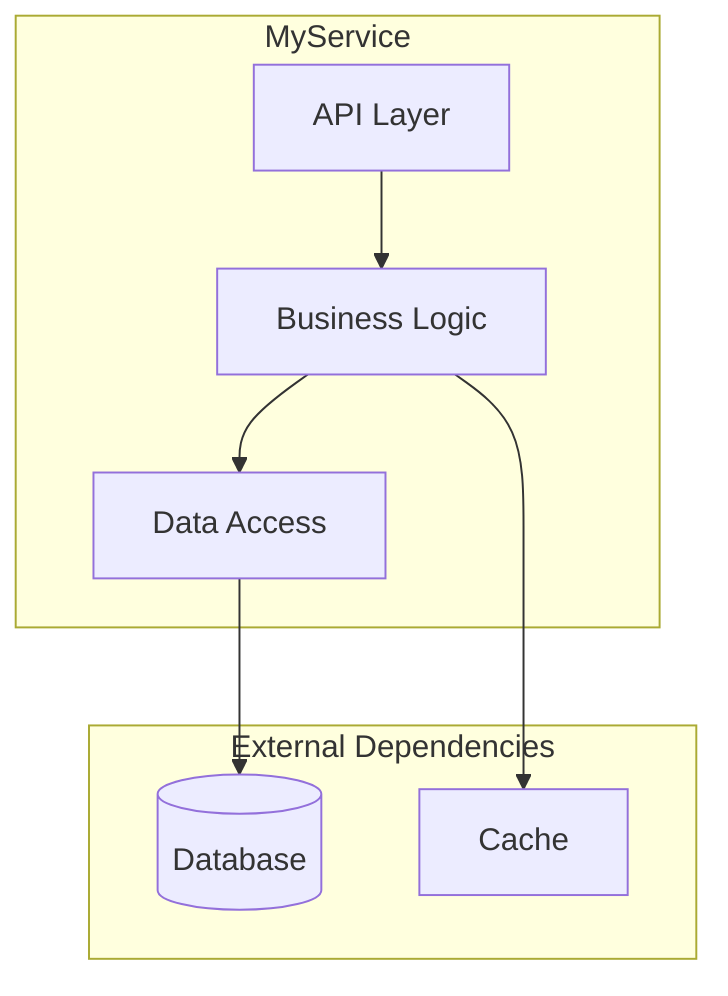
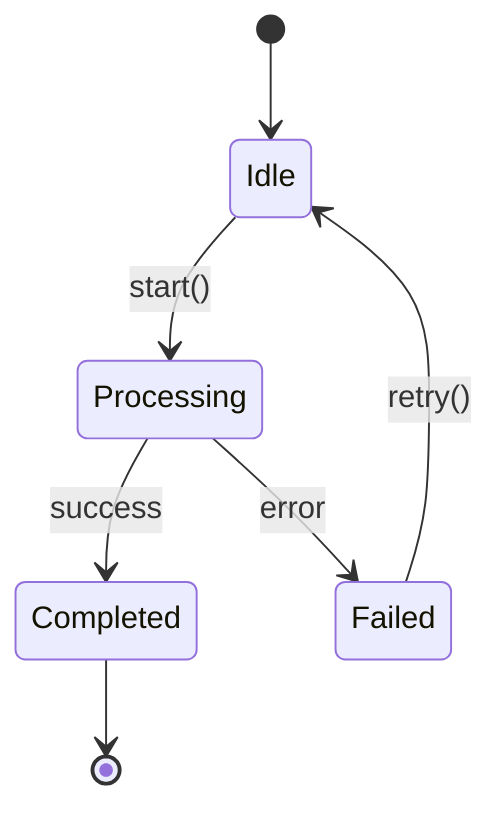
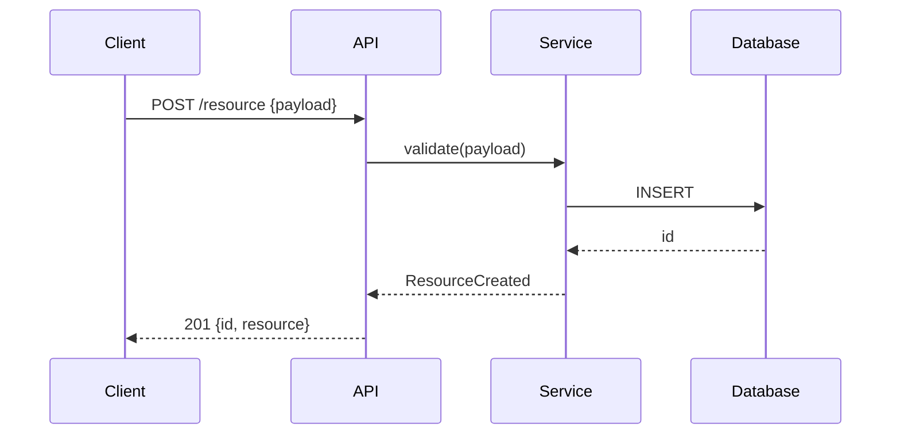
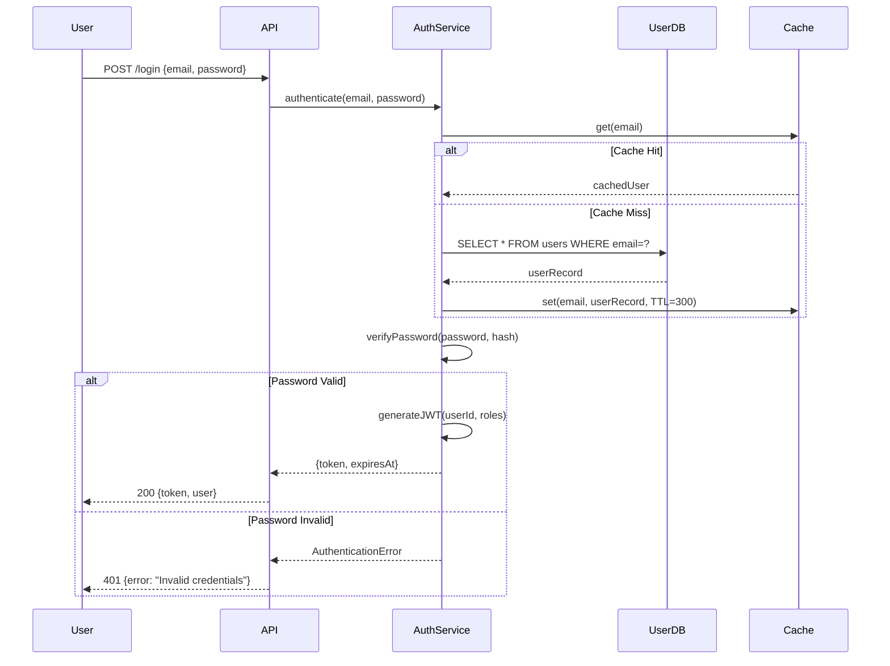

## architecture.md Specification (Supplementary Notes)

> **DEPRECATED for structure.** The authoritative contract is `core/templates/architecture.md` (10-section graph-primary). If anything below conflicts with that template or `skills/init/SKILL.md`, the template wins.

Generate `draft/architecture.md` — a graph-primary human-readable engineering reference.

**Output format**:
- Markdown report with Mermaid diagrams, tables, and code blocks
- **Target length: fidelity-first** — cover all 10 mandatory sections with graph-grounded accuracy and diagram correctness
- End the document with: `"End of analysis. Queries should reference the .ai-context.md file for token efficiency."`

**CRITICAL — Template Structure Compliance:**
- The output MUST use the EXACT 10-section structure from `core/templates/architecture.md` (§1–§10)
- Do NOT create freeform/custom section names or resurrect 28-section numbering
- Do NOT skip mandatory sections — if a section does not apply, include the heading with "N/A — {reason}"
- The knowledge graph (`draft/graph/`) is the **deterministic ground truth** for structure (modules, dependencies, public surfaces, edges, hotspots). LLM synthesis exists to interpret the graph into actionable behavioral understanding — primarily through accurate diagrams — plus minimal narrative that does not contradict the graph.
- **Diagrams over prose volume.** Prefer one correct workflow/state/sequence diagram per major module or operational model over long responsibility paragraphs. A 20-line Mermaid diagram that faithfully reflects real call paths and state transitions from the graph is more valuable for downstream code generation than 300 words of generic description.
- **Accuracy and fidelity to graph + host index > historical length targets.** It is acceptable (and preferred) for sections to be short when the graph block + diagrams already convey the design.
- **No contradiction with graph.** Any prose claim about module boundaries, dependencies, entry points, or public API must be consistent with the corresponding graph record. Discrepancies must be noted explicitly.
- Sub-modules receive depth only when the graph shows clear internal boundaries (distinct public surface or high internal fan-in). Depth is bounded by observable graph structure, never by a desire for exhaustive enumeration.

### MANDATORY Header Format

**CRITICAL**: Every architecture.md file MUST start with this exact structure. Gather git metadata first, then fill in placeholders.

```markdown
---
project: "{PROJECT_NAME}"
module: "root"
generated_by: "draft:init"
generated_at: "{ISO_TIMESTAMP}"
git:
  branch: "{LOCAL_BRANCH}"
  remote: "{REMOTE/BRANCH}"
  commit: "{FULL_SHA}"
  commit_short: "{SHORT_SHA}"
  commit_date: "{COMMIT_DATE}"
  commit_message: "{COMMIT_MESSAGE}"
  dirty: {true|false}
synced_to_commit: "{FULL_SHA}"
---

# Architecture: {PROJECT_NAME}

> Comprehensive human-readable engineering reference.
> For token-optimized AI context, see `draft/.ai-context.md`.

---

## Table of Contents

1. [Executive Summary](#1-executive-summary)
2. [AI Agent Quick Reference](#2-ai-agent-quick-reference)
3. [System Identity & Purpose](#3-system-identity--purpose)
... (continue with all 28 sections + appendices)
```

**Do NOT skip the YAML frontmatter. It enables incremental refresh tracking.**

---

### Report Structure — Follow This Exact Section Ordering

_(Skip or adapt sections per the Adaptive Sections table above.)_

---

### 1. Executive Summary

Write **one paragraph** that states:
- What the module IS (identity)
- What it DOES (responsibilities)
- Its role in the larger system

Follow with a **Key Facts** bullet list:
- Primary language(s) and version
- Binary / entry-point / package name
- Architecture style (e.g., distributed master/worker, client-server, daemon, library, microservice, monolith, serverless, CLI tool)
- Generational variants if any (V1 / V2 / legacy + modern)
- Approximate count of major sub-components, plugins, handlers, or endpoints
- Primary data sources (what it reads from — databases, message queues, APIs, files)
- Primary action targets (what it writes to / calls — databases, downstream services, files)

---

### 2. AI Agent Quick Reference

A compact block optimized for fast AI-agent context loading. Fill in every field that applies; mark others as "N/A":

```
**Module**           : {PROJECT_NAME}
**Root Path**        : ./
**Language**         : (e.g., C++17, Go 1.21, Python 3.12, TypeScript 5.3, Rust 1.75, Java 21)
**Build**            : (e.g., `bazel build //path:target`, `npm run build`, `cargo build`,
                        `./gradlew build`, `mvn package`, `make`, `pip install -e .`)
**Test**             : (e.g., `bazel test //path/...:all`, `npm test`, `pytest`, `cargo test`,
                        `go test ./...`, `mvn test`)
**Entry Point**      : (file → class/function, e.g., `main.go → main()`, `app.py → create_app()`,
                        `index.ts → bootstrap()`, `Main.java → main()`)
**Config System**    : (e.g., gflags in flags.cc, .env + config.yaml, Spring application.yml,
                        environment variables, Viper config)
**Extension Point**  : (interface to implement + where to register, or "N/A" if not applicable)
**API Definition**   : (e.g., .proto files, OpenAPI spec, GraphQL schema, or "N/A")
**Key Config Prefix**: (e.g., `MODULE_*` env vars, `module.*` YAML keys, `--module-*` CLI flags)

**Before Making Changes, Always:**
1. (Primary invariant check — the #1 thing that must not break)
2. (Thread-safety / async-safety consideration, or "single-threaded — no concerns")
3. (Test command to run after changes)
4. (API / schema versioning rule, if applicable)

**Never:**
- (Critical safety rule 1 — e.g., "never delete data without tombstone check")
- (Critical safety rule 2 — e.g., "never bypass auth middleware")
- (Critical safety rule 3 — e.g., "never modify proto field numbers")
```

---

### 3. System Identity & Purpose

- **What {PROJECT_NAME} Does** — numbered list of core responsibilities.
- **Why {PROJECT_NAME} Exists** — the business / system problem it solves, including what would go wrong without it. Frame in terms of:
  - Data integrity
  - Performance / efficiency
  - Compliance / correctness
  - Operational safety
  - User experience (if user-facing)

---

### 4. Architecture Overview

**Expected length: 2-3 pages with diagrams**

#### 4.1 High-Level Topology

**MANDATORY: Generate a Mermaid `flowchart TD` diagram** showing:
- The main process / service and its internal components (as nested subgraphs)
- External services and dependencies (as a separate subgraph)
- Directional arrows showing primary data / control flow

Example structure (adapt to actual codebase):


#### 4.4 Module Dependency Graph (graph-derived, auto-refreshed)

Write the `GRAPH:module-deps` injection slot into architecture.md:

If graph build succeeded (Step 1.4.7 completed), write the populated slot content using the diagram from Step 1.4.7. If filtered (>30 modules), include the filter note. Dashed edges indicate circular dependencies.

If graph binary was not found: write the slot with placeholder body so draft:init --graph-only can populate it later:
```
<!-- GRAPH:module-deps:START -->
[Graph data unavailable — run draft:init --graph-only to populate after graph binary is installed]
<!-- GRAPH:module-deps:END -->
```

The slot markers MUST always be written — they are required for draft:init --graph-only refresh to function.

#### 4.2 Process Lifecycle (or Usage Lifecycle for libraries)

Numbered steps from startup to steady state. Reference the entry-point source file.

For services/daemons: binary start → config load → dependency init → server listen → event loop.
For libraries: import → configure → initialize → use → teardown.
For CLI tools: parse args → validate → execute → output → exit.

**Include 5-10 numbered steps with file:line references.**

---

### 5. Component Map & Interactions

#### 5.1 Top-Level Orchestrator

For the main controller / manager / app class:
- Describe its role in one sentence.
- **Owned Components** — table:

  | Component | Type | Purpose |
  |-----------|------|---------|

- **Initialization Stages** — Mermaid `flowchart TD` showing the state machine from uninitialized to fully ready (if applicable — skip for simple modules).

#### 5.2 Dependency Injection / Wiring Pattern

Describe how components reference each other. Common patterns to look for:
- Constructor injection (Spring, Guice, etc.)
- Service locator / context struct (C++ pattern)
- Module system (Python, Node.js imports)
- Dependency injection container (NestJS, .NET, Dagger)
- Global singletons / registries

List all injection tokens, getter categories, or module exports.

#### 5.3 Interaction Matrix

Table showing which components communicate with which:

| | Comp A | Comp B | Comp C | ... |
|---|---|---|---|---|
| Comp A | — | ✓ | ✓(RPC) | |
| Comp B | ✓ | — | | ✓(HTTP) |

Use ✓ for direct calls, ✓(RPC) for remote procedure calls, ✓(HTTP) for REST calls, ✓(queue) for message queue, ✓(DB) for shared database, ✓(event) for event bus.

---

### 6. Core Operational Flows, Lifecycles & State Machines

> **Source:** llm-synthesis + graph (primary structural truth) + full project index from host environment  
> **Required:** high+ (this is one of the highest-ROI sections for any downstream coding assistant)  
> **Length:** 2–5 high-quality behavioral diagrams + minimal supporting prose  
> **N/A when:** the system is trivial (single linear script with no meaningful state or branching) — write explicit N/A.  
> **Verification:** diagram fidelity to graph + indexed understanding + citation-check

**Purpose**: This section captures the **real behavioral architecture** — the primary ways the system moves through time, state, and control flow. It is more valuable for correct code generation and modification than static component descriptions.

The LLM **must** combine:
- The deterministic knowledge graph (modules, edges, entry points, public surfaces, hotspots, call targets)
- Its full indexed project understanding from the host Cursor / Claude Code / Copilot environment
- Targeted source reads only for confirmation and detail

to identify and accurately diagram the most important operational models.

### 6.1 Primary Operational Models (MANDATORY — 2 to 5 diagrams)

Synthesize the 2–5 most important operational views for the system. Typical candidates:

- The dominant request / job / user-action lifecycle (end-to-end, with decision points and error paths)
- Main state machine(s) for stateful components or the overall system
- Critical background / async / batch / worker pipelines
- Startup / initialization / shutdown lifecycle (especially valuable for services and tooling)
- For plugin / meta-tooling / agent platforms: the core execution or dispatch model (skill/command/agent lifecycle, frontmatter contract enforcement, generation/condensation pipeline, parallel analysis protocol, track/decompose/implement lifecycle, etc.)

Each diagram must be a **stateDiagram-v2**, **sequenceDiagram**, or detailed **flowchart** containing:
- Real actor / state / stage names from the actual codebase
- Labeled transitions using actual function, message, or event names where possible
- `alt` / `opt` / `loop` / `critical` where branching, repetition, or error handling exists

Prioritize **accuracy and usefulness for future code generation** over visual polish. A correct diagram of the real initialization sequence or request dispatch path is far more valuable than a generic "data flow" picture.

### 6.2 Error & Recovery Paths

For every primary flow above, explicitly surface (in prose or inside the diagrams) the main error classification, retry/backoff, circuit-breaker, fallback, and recovery behaviors.

### 6.3 Cross-Cutting Concerns in Flows

Only when material: authentication/authorization checkpoints, distributed transaction boundaries, observability hooks, rate limiting, idempotency, cancellation, or resource lifecycle rules that appear inside the operational models.

**For plugin platforms and meta-tooling projects**: This section must include clear diagrams of the primary internal processes (initialization with graph gate, skill/agent/command dispatch and frontmatter enforcement, condensation + profile derivation, parallel reader→synthesis protocol, etc.). These diagrams document how the platform itself executes.

---

### 7. Core Modules Deep Dive

> **Source:** graph (primary structural truth) + llm-synthesis (secondary, minimal)  
> **Required:** always  
> **Length:** Graph block + one high-signal workflow/state diagram + ≤80 words synthesis per module  
> **N/A when:** never  
> **Verification:** graph-fence fidelity + diagram correctness + citation-check

**Core rule:** The graph is the source of truth for structure. LLM synthesis exists only to interpret the graph into actionable design understanding — primarily via one accurate workflow or state diagram per module — plus tiny supporting notes. The previous volume-oriented deep-dive expectations are superseded.

For each module in `draft/graph/architecture.json` (`.packages[]`), produce a subsection whose **primary content** is the deterministic graph block followed by one synthesized behavioral diagram. Every module gets a slot; do not sample. The block's fan-in/out and node counts come from `.packages[]`; public API and key call edges come from live per-package queries (`scripts/tools/graph-callers.sh`, `graph-impact.sh`) and `hotspots.jsonl`.

#### 7.{N} {module-name}

<!-- GRAPH:module-deep/{module-name}:START -->
<!-- Rendered deterministic block: package name, node count, public API list, fan-in/fan-out (from
     architecture.json .packages), hotspot fan-in (from hotspots.jsonl), key call edges (from
     graph-callers.sh/graph-impact.sh), entry points if known. No LLM prose inside fence. -->
<!-- GRAPH:module-deep/{module-name}:END -->

**Role** (≤25 words, derived strictly from graph role + primary source files read).

**Primary Workflow / State** (MANDATORY — one diagram per module)
Synthesize a single, accurate Mermaid diagram (`stateDiagram-v2`, `sequenceDiagram`, or `flowchart LR/TD` with clear stages) that captures the dominant control flow, data transformation pipeline, or lifecycle state machine for this module, grounded in the call graph / entry points / public surface from the graph record. Label transitions with the actual function or message names where possible. This diagram is more important than any prose.

**Public Surface** (from graph `public_api` + verified source). Enumerate only the highest-fan-in or architecturally significant symbols. Format: `symbol (kind) — path:line`. No exhaustive dump of every getter.

**Design Notes** (≤80 words total). Only what the graph + one or two key source reads reveal about invariants, error boundaries, or concurrency that is not already visible in the graph block or the workflow diagram. Cite specific `path:line`.

**Sub-modules / Subsystems**. Recurse **only** when the graph shows a clear internal boundary (distinct public surface or high internal fan-in). Each child follows the identical pattern (graph block + one workflow diagram + minimal notes). Depth is strictly bounded by observable graph structure, never by a desire for "completeness."

**Anti-pattern:** Do not emit long "Responsibilities" paragraphs or exhaustive file lists. If the graph block + one workflow diagram already communicate the design, the synthesis may be two sentences. Accuracy and diagram correctness are the success criteria.

#### Sub-Module Guidance (when graph justifies recursion)

When a module has clear internal structure visible in `draft/graph/architecture.json` (`.packages` fan-in/out) or live per-package queries:
- Create `##### 7.X.Y {Parent}/{Child}` subsections only for children that have their own meaningful public surface or high internal fan-in.
- Each sub-module subsection follows the same compact pattern: graph facts + **one mandatory workflow/state diagram** + ≤60 words Design Notes.
- Do not descend further unless the child itself shows additional clear boundaries in the graph data.
- For ops/handler directories that are primary extension points, a short numbered operation catalog is acceptable even if small.

**Never** produce the old exhaustive "Source Files + list ALL responsibilities + 5+ operations + full mechanisms" template unless the module is genuinely tiny and the extra detail adds unique value not visible in the graph + diagram. The graph + one excellent diagram is the required primary artifact.
**Key Operations / Methods**:

| Op / Method | Signature | Description |
|-------------|-----------|-------------|
| `methodName` | `(input: Type) → ReturnType` | What it does |
| (enumerate ALL public methods — at least 5 entries) | | |

**Interaction with Sibling Sub-Modules**:
- Calls `{sibling}/` for {purpose}
- Called by `{sibling}/` when {trigger}
- Shares `{base|common}/` types: {list key shared types}

**State Machine** (if stateful):
[Mermaid stateDiagram-v2]

**Notable Mechanisms**: {caching, retry, batching, scheduling, etc.}

**Error Handling**: How errors propagate within this sub-module and to the parent.
```

#### Per-Sub-Module Template (Medium — 10–49 files)

```markdown
##### 7.X.Y {ParentModule}/{SubModuleName}

**Role**: {2-3 sentence description}.

**Key Operations**:

| Op / Method | Source File | Description |
|-------------|-------------|-------------|
| (at least 5 entries with real data) | | |

**Notable Mechanisms**: {1-2 bullet points on key internal behavior}

**Key Interface** (code snippet from actual source):
```{language}
// actual code from the interface header, 10-20 lines
```
```

#### Operation Catalog Template (for ops/handler directories)

Regardless of tier, any directory whose name contains `ops`, `handlers`, `executors`, `workers`, `actions`, or `commands` MUST get a full enumeration:

```markdown
##### 7.X.Y {Module}/{SubModule}/ops — Operation Catalog

| # | Operation | Source File | Lines | Description |
|---|-----------|-------------|-------|-------------|
| 1 | `ArchiveFilesOp` | `icebox/master/ops/archive_files_op.cc` | 2100 | Archives files to cloud vault |
| 2 | `CancelJobOp` | `icebox/master/ops/cancel_job_op.cc` | 450 | Cancels running archive job |
| ... | (enumerate ALL — no sampling, no "and others") | | | |
```

Use `draft/graph/modules/{module}.jsonl` to get the complete file list with line counts. Use `draft/graph/hotspots.jsonl` to flag high-complexity operations.

#### Example: Full Sub-Module Treatment for `icebox/` (917 files)

For a module like `icebox/` with sub-directories `master/` (200+ files), `slave/` (150+ files), `client/` (20 files), `base/` (40 files):

```
#### 7.3 icebox
  [Top-level module deep-dive: role, overall architecture diagram, cross-sub-module interaction]

  ##### 7.3.1 icebox/master (Large — 200+ files → full deep-dive)
    [Full template: role, responsibilities, key ops table, state machine, mechanisms]

    ##### 7.3.1.1 icebox/master/ops — Operation Catalog
      [Numbered table of ALL 60+ operations with file, lines, description]

  ##### 7.3.2 icebox/slave (Large — 150+ files → full deep-dive)
    [Full template: role, responsibilities, key ops table, mechanisms]

    ##### 7.3.2.1 icebox/slave/ops — Operation Catalog
      [Numbered table of ALL slave operations]

  ##### 7.3.3 icebox/base (Medium — 40 files → summary deep-dive)
    [Summary: role, key ops table, one code snippet]

  ##### 7.3.4 icebox/client (Medium — 20 files → summary deep-dive)
    [Summary: role, key ops table, interface snippet]
```

This produces 300–500+ lines for `icebox/` alone, which is proportional to its 917-file complexity.

**MANDATORY for stateful modules and sub-modules**: Include a `stateDiagram-v2` showing state transitions:


#### Section 7 Graph Fidelity + Diagram Check (MANDATORY)

After writing Section 7, run these checks before proceeding. **If any check fails, STOP and fix.**

**Check 1 — Graph block present and faithful for every module:**
Every top-level module from `draft/graph/architecture.json` (`.packages`) has its `<!-- GRAPH:module-deep/...:START --> ... <!-- GRAPH:module-deep/...:END -->` fence rendered verbatim. No LLM prose inside the fence. No modules missing.

**Check 2 — One mandatory workflow/state diagram per module:**
Every `#### 7.X` (and every `##### 7.X.Y` that the graph justified) contains exactly one high-signal `Primary Workflow / State` Mermaid diagram (`stateDiagram-v2`, `sequenceDiagram`, or clear `flowchart`). The diagram must reflect facts from the module's graph record (entry points, public symbols, call targets). Generic placeholder diagrams fail this check.

**Check 3 — Role ≤25 words + Design Notes ≤80 words:**
Role is one tight sentence. Design Notes are ≤80 words and cite specific `path:line` only for observations not already visible in the graph block or the diagram. Long prose paragraphs or "Responsibilities" lists fail this check.

**Check 4 — No contradiction with graph:**
Any prose claim (dependencies, public surface, entry points, sub-module boundaries) must be consistent with the corresponding graph record. If source reading revealed behavior the graph did not capture, the discrepancy is noted explicitly rather than silently overriding the graph.

**Check 5 — No exhaustive file lists or volume padding:**
The section does not lead with "Source Files:" tables or "enumerate ALL" language. If the graph + one diagram already communicate the design, extra prose is minimal. Historical line-count or "at least 5 operations" quotas are ignored.

**Check 6 — Sub-module recursion is graph-bounded:**
Deeper `#####` subsections exist only where the graph data shows distinct internal public surface or high fan-in. No descent "because the module is large."

---

### 8. Concurrency Model & Thread Safety

_(For single-threaded or simple modules, state that explicitly and skip the detailed subsections.)_

- **Execution Model** — single-threaded, multi-threaded, async/await, actor model, goroutine-based, event-loop, etc.
- **Thread / Worker Pool Map** — table:

  | Pool / Executor | Purpose | What Runs On It |
  |-----------------|---------|-----------------|

- **Thread Affinity / Safety Rules** — which objects are single-threaded vs. thread-safe; which methods must be called from which context.
- **Locking Strategy** — what locks / mutexes / semaphores exist, their granularity, and ordering rules to prevent deadlocks.
- **Async Patterns** — how callbacks / promises / futures / channels chain; proper cancellation; timeout handling; lifetime management.
- **Common Concurrency Pitfalls** — specific anti-patterns to avoid in this codebase.

---

### 9. Framework & Extension Points

_(Skip if the module has no plugin / handler / middleware / algorithm system.)_

#### 9.1 Plugin / Handler / Middleware Types

Table:

| Type | Interface / Base Class | Description |
|------|----------------------|-------------|

#### 9.2 Registry / Registration Mechanism

Describe how plugins are registered. Common patterns:
- Explicit registry calls in an init file
- Decorator / annotation-based auto-registration
- Convention-based discovery (file naming, directory scanning)
- Configuration-driven (list in YAML / JSON)
- Self-registration via static initializers or module init

#### 9.3 Per-Plugin Metadata

Table of all properties stored per registered plugin:

| Property | Type | Description |
|----------|------|-------------|

#### 9.4 Core Interfaces

For each interface, show the key method signatures as **code blocks** with inline comments explaining inputs, outputs, and optional hooks. Use actual code from the codebase.

#### 9.5 Universal / Shared Data Types

Describe any type-erased, generic, or shared containers used across interfaces.

---

### 10. Full Catalog of Implementations

_(Skip if Section 9 was skipped AND the codebase has no operation/handler pattern.)_

#### 10.1 Legacy / V1 Implementations (if applicable)

Numbered table:

| # | Name | Type | Data Sources |
|---|------|------|--------------|

#### 10.2 Current Implementations

Table grouped by category:

| Category | Implementations |
|----------|-----------------|

Include architecturally significant implementations (high fan-in, core extension points, or primary execution paths). Exhaustive enumeration of every helper class is not required when the graph + operational diagrams already surface the important ones.

#### 10.3 Sub-Module Operation Catalogs

**When the graph identifies operation/handler directories as primary extension points**, provide a short numbered catalog of the key operations (focus on the highest-fan-in or most architecturally central ones; exhaustive listing of every internal helper is not required):

```markdown
##### 10.3.X {Module}/{SubModule} Operations

| # | Operation | Source File | Lines | Description |
|---|-----------|-------------|-------|-------------|
| 1 | ArchiveFilesOp | `icebox/master/ops/archive_files_op.cc` | 2100 | Archives files to cloud vault |
| 2 | CancelJobOp | `icebox/master/ops/cancel_job_op.cc` | 450 | Cancels running archive job |
| (enumerate ALL — use graph hotspots.jsonl and per-module JSONL for file list and line counts) |
```

> **MANDATORY (graph data)**: Read `draft/graph/modules/{module}.jsonl` to get the complete file
> list with line counts. Filter for files in operation sub-directories (paths containing `/ops/`,
> `/handlers/`, `/executors/`, `/workers/`). Use `draft/graph/hotspots.jsonl` to flag
> high-complexity operations (high line count or fanIn). Do NOT skip this step — incomplete
> catalogs cause AI agents to reinvent existing functionality.

**Why this matters**: Operation classes are the primary extension points in large systems. Engineers adding new functionality need to know what operations already exist, their complexity, and which files to use as templates. Missing even one operation from the catalog means the AI may suggest reinventing existing functionality.

---

### 11. Secondary Subsystem (V2 / Redesign)

_(Skip if there is no major generational redesign or parallel subsystem.)_

- **Architecture** — Mermaid flowchart of the redesigned subsystem.
- **Key Differences** — comparison table:

  | Aspect | V1 / Legacy | V2 / Current |
  |--------|------------|-------------|

- **Framework Details** — list key source files and their roles.
- **Advanced Features** — multi-tenant, cloud, distributed, or other capabilities absent in V1.

---

### 12. API & Interface Definitions

_(Adapt title and content based on what the module uses.)_

#### 12.1 RPC / REST / GraphQL Endpoints

Table:

| Endpoint / RPC | Method / Direction | Purpose |
|----------------|-------------------|---------|

#### 12.2 Key Data Models / Messages / Schemas

Table:

| Model / Message / Schema | Purpose |
|--------------------------|---------|

#### 12.3 External-Facing API (if distinct from internal)

List endpoints grouped by function. Reference the actual definition files:
- `.proto` files for gRPC / protobuf
- OpenAPI / Swagger specs for REST
- GraphQL schema files
- TypeScript type definitions for SDK / client libraries
- JSON Schema files

---

### 13. External Dependencies

#### 13.1 Service Dependencies

Table:

| Service / System | Library / Client Path | Usage |
|------------------|----------------------|-------|

(Databases, message queues, caches, peer services, cloud APIs, etc.)

#### 13.2 Sub-components of Major Dependencies

Table:

| Component | Usage |
|-----------|-------|

(e.g., if it depends on a storage service, list which sub-libraries or SDK modules it uses.)

#### 13.3 Infrastructure / Utility Libraries

Table:

| Library / Package | Usage |
|-------------------|-------|

(HTTP frameworks, ORM, serialization, logging, metrics, auth, crypto, test utilities, etc.)

---

### 14. Cross-Module Integration Points

**Expected length: 2-4 pages with 2-3 sequence diagrams**

For each external service this module interacts with:

- **Contract** — what this module expects (API version, response format, latency SLA).
- **Failure Isolation** — what happens when the dependency is down or slow.
- **Version Coupling** — compatibility requirements between module versions.
- **Shared Schemas** — which definition files are shared and who owns them.
- **Integration Test Coverage** — how the integration is tested.

**MANDATORY: Include 2-3 Mermaid sequence diagrams** for the most important cross-module flows:



Each sequence diagram MUST show:
- All participant lifelines (components / services)
- Request → response arrows with payload descriptions
- Conditional branches (alt/opt blocks) where logic diverges
- Loop blocks for retry or iteration logic
- Error paths (not just happy path)

---

### 15. Critical Invariants & Safety Rules

**Expected length: 2-3 pages (8-15 invariants)**

**CRITICAL SECTION**: This section prevents AI agents from making dangerous changes. Be EXHAUSTIVE.

For each invariant, provide COMPLETE documentation:

#### Invariant Template

```markdown
#### [Category] Invariant Name

**What**: Clear statement of the invariant (what must always be true).

**Why**: What breaks if violated:
- Specific failure mode (data loss, corruption, crash, security breach, etc.)
- Blast radius (single user, all users, entire system)
- Recovery difficulty (automatic, manual intervention, unrecoverable)

**Where Enforced**:
- `path/to/file.ext:linenum` — `functionName()` — how it checks
- `path/to/another.ext:linenum` — secondary enforcement

**Common Violation Patterns**:
1. How someone might accidentally break this
2. Another way it could be violated
3. Edge case that's easy to miss

**Safe Modification Guide**: If you need to change code near this invariant, do X not Y.
```

#### Required Categories (enumerate ALL that apply)

1. **Data Safety Invariants** (prevent data loss / corruption)
   - Transaction boundaries
   - Foreign key relationships
   - Data validation rules

2. **Security Invariants** (auth, authz, input validation)
   - Authentication requirements
   - Authorization checks
   - Input sanitization boundaries

3. **Concurrency Invariants** (lock ordering, thread affinity)
   - Lock acquisition order
   - Thread-confined objects
   - Atomic operation requirements

4. **Ordering / Sequencing Invariants** (must-happen-before)
   - Initialization order dependencies
   - Event ordering requirements
   - State machine transitions

5. **Idempotency Requirements** (safe to retry?)
   - Which operations are idempotent
   - Which require deduplication
   - Retry safety rules

6. **Backward-Compatibility Rules** (schema evolution, API versioning)
   - Field addition/removal rules
   - Version negotiation requirements
   - Migration requirements

---

### 16. Security Architecture

- **Authentication & Initialization**: How identity is established (key exchange, tokens, certificates).
- **Authorization Enforcement**: Where permission checks happen (middleware, service layer, decorators).
- **Data Sanitization**: Input validation boundaries and sanitization logic.
- **Secrets Management**: How keys/credentials are loaded and used (never hardcoded!).
- **Network Security**: TLS termination, mTLS, allowlists/blocklists.

---

### 17. Observability & Telemetry

- **Logging Strategy**:
  - Key log levels and when used.
  - Structured logging keys (e.g., `request_id`, `user_id`, `trace_id`).
- **Distributed Tracing**:
  - Probes / Spans: Where trace context is extracted and injected.
  - Context propagation mechanism.
- **Metrics**:
  - Key counters, gauges, and histograms defined in this module.
  - Health check endpoints and logic (liveness vs. readiness).

---

### 18. Error Handling & Failure Modes

- **Error Propagation Model** — how errors flow through the system. Common patterns:
  - Return codes / error types (Go, Rust)
  - Exceptions (Python, Java, C++)
  - Result/Either monads (Rust, functional)
  - Callback error arguments (Node.js)
  - Error proto / error response objects (gRPC, REST)

  Show the canonical error-handling pattern with a real code example from the codebase.

- **Retry Semantics** — table:

  | Operation | Retry Policy | Backoff | Max Attempts |
  |-----------|-------------|---------|--------------|

- **Common Failure Modes** — table:

  | Failure Scenario | Symptoms | Root Cause | Recovery |
  |------------------|----------|------------|----------|

- **Alerting / Monitoring** — what conditions trigger alerts, severity mapping.
- **Graceful Degradation** — behavior when dependencies are unavailable.

---

### 19. State Management & Persistence

- **State Inventory** — table:

  | State | Storage | Durability | Recovery Mechanism |
  |-------|---------|------------|-------------------|

  (Storage examples: in-memory, Redis, PostgreSQL, file on disk, S3, environment variable, etc.)

- **Persistence Formats** — what is serialized, where, and in what format (protobuf, JSON, MessagePack, SQL rows, Avro, WAL, etc.).
- **Recovery Sequences** — what happens on crash-restart, how state is reconstructed.
- **Schema / State Migration** — how persistent state evolves across versions, migration mechanism (SQL migrations, proto field evolution, versioned keys, etc.).

---

### 20. Reusable Modules for Future Projects

Rate reusability with stars (★). Three tiers:

#### 20.1 Highly Reusable (Framework-Level) — ★★★★★

Table:

| Module | Path | Description |
|--------|------|-------------|

#### 20.2 Moderately Reusable (Pattern-Level) — ★★★★

Table:

| Module | Path |
|--------|------|

#### 20.3 Pattern Templates (Design-Level) — ★★★

Table:

| Pattern | Where Used | Description |
|---------|-----------|-------------|

---

### 21. Key Design Patterns

**Expected length: 2-4 pages with code snippets**

For each significant pattern (typically 4–8), provide a COMPLETE writeup:

#### Per-Pattern Template

```markdown
#### 21.X {PatternName} Pattern

**Description**: 2-4 sentences explaining the pattern and why it's used here.

**Where Used**:
- `path/to/file1.ext:linenum` — context
- `path/to/file2.ext:linenum` — context

**Implementation** (actual code from codebase):
```{language}
// Actual code snippet showing the pattern
// Include 10-30 lines, not just 2-3
// Add inline comments explaining key parts
```

**Anti-Pattern to Avoid**:
```{language}
// Show what NOT to do
// This helps AI agents avoid common mistakes
```

**When to Apply**: Guidance on when new code should use this pattern.
```

**MANDATORY**: Code snippets must be ACTUAL CODE from the codebase, not pseudocode or simplified examples. Include enough context (10-30 lines) to understand the pattern.

---

### 22. Configuration & Tuning

#### 22.1 Key Configuration Parameters

Table (aim for the 10–20 most important):

| Parameter / Flag / Env Var | Default | Purpose |
|----------------------------|---------|---------|

Look for configuration in ALL of these locations:
- CLI flags / arguments (gflags, argparse, cobra, clap, etc.)
- Environment variables
- Config files (YAML, TOML, JSON, .env, .ini, application.properties)
- Feature flags / remote config
- Constants in code that are clearly tuning knobs

#### 22.2 Scheduling / Periodic Configuration

Describe how recurring work is configured (cron jobs, intervals, frequencies, tickers, scheduled tasks, background workers).

#### 22.3 Relevant Config Code

Show any configuration-related enums, structs, schemas, or validation logic as code blocks.

---

### 23. Performance Characteristics & Hot Paths

- **Hot Paths** — identify performance-critical code paths with file references.
- **Scaling Dimensions** — table:

  | Dimension | Scales With | Bottleneck |
  |-----------|------------|------------|

- **Memory Profile** — large memory consumers, budgets, OOM risks.
- **I/O Patterns** — disk I/O, network I/O, database queries, and their expected characteristics.
- **Known Performance Pitfalls** — specific scenarios that cause degradation.

---

### 24. How to Extend — Step-by-Step Cookbooks

For each major extension point, provide a numbered, file-by-file cookbook that an AI agent can follow mechanically. Adapt the cookbook titles to match the module's actual extension points.

#### 24.1 "How to Add a New [Plugin / Handler / Algorithm / Middleware / Endpoint / ...]"

1. File to create and naming convention (path)
2. Interface / base class to implement (required vs. optional methods)
3. Where to register (registry file, module init, decorator, config entry)
4. Build / package dependencies to add
5. Configuration to add (if any)
6. Tests required (minimum expectations)
7. Schema / API definition changes needed (if any)
8. **Minimal working example** — the simplest possible implementation that compiles / runs and passes tests

#### 24.2 "How to Add a New API Endpoint"

1. Definition file to modify (proto, OpenAPI, GraphQL schema, route file)
2. Handler / controller implementation to create or extend
3. Client / SDK changes needed (if applicable)
4. Validation and auth requirements
5. Testing approach

#### 24.3 "How to Add a New Data Source / Sink / Integration"

1. Client / adapter to create
2. Registration / configuration mechanism
3. Serialization / schema requirements
4. Error handling and retry requirements
5. Testing approach (mocks, test containers, etc.)

---

### 25. Build System & Development Workflow

- **Build System** — identify what is used:
  - C/C++: Bazel, CMake, Make, Meson, Buck
  - Go: `go build`, Bazel
  - Python: pip, poetry, setuptools, conda
  - Java/Kotlin: Maven, Gradle, Bazel
  - TypeScript/JavaScript: npm, yarn, pnpm, Vite, webpack, esbuild
  - Rust: Cargo
  - Other: specify

- **Key Build Targets / Scripts** — table:

  | Target / Script | Type | What It Builds / Does |
  |-----------------|------|----------------------|

- **How to Build**:
  - Full module: `(command)`
  - Single component: `(command)`
  - With debug symbols / development mode: `(command)`

- **How to Run Tests**:
  - Full suite: `(command)`
  - Single test file / case: `(command with example)`
  - With sanitizers / coverage / verbose logging: `(command)`

- **How to Run Locally** (if applicable):
  - Development server / process: `(command)`
  - Required environment setup (databases, env vars, config files)

- **Common Build Issues** — known gotchas (dependency ordering, code generation, platform-specific issues, etc.).

- **Code Style & Naming Conventions** — file naming, class/function naming, package/module naming, config key naming conventions specific to this module.

- **CI/CD Integration** — what runs in pre-submit / PR checks, what runs nightly.

---

### 26. Testing Infrastructure

- **Test Framework** — identify what is used (GTest, pytest, Jest, JUnit, Go testing, Rust #[test], etc.) and describe any custom test harness or utilities. Reference key test infrastructure files.

- **Test Patterns** — bullet list of notable techniques:
  - Mock / stub / fake injection points
  - In-memory substitutes for external services
  - Test data builders / factories / fixtures
  - Integration test setup (test containers, embedded databases, mock servers)
  - Test synchronization mechanisms (completion notifiers, latches, waitgroups)
  - Snapshot / golden-file testing
  - Property-based / fuzz testing (if present)

- **Test-to-Feature Mapping**:
  | Feature | Test Suite Path |
  |---------|-----------------|
  | (e.g. User Login) | `tests/auth/test_login.py` |
  | (e.g. Payment Processing) | `src/payments/tests/` |

- **Test Coverage Expectations** — what should be tested for new code.

---

### 27. Known Technical Debt & Limitations

- **Deprecated Code** — components marked for removal, migration status.
- **Known Workarounds** — significant TODO / FIXME / HACK comments with context.
- **Scaling Limitations** — known ceilings and their causes.
- **Complexity Hotspots** — Identify "God Classes", files >1000 lines, or functions with high cyclomatic complexity (deep nesting).
- **Design Compromises** — decisions made for expediency that should be revisited.
- **Migration Status** — if a V1→V2 or legacy→modern migration is in progress, document what has migrated and what has not.

---

### 28. Glossary

Table:

| Term | Definition |
|------|-----------|

Include ALL domain-specific terms used in the report (aim for 15–30 terms).
Definitions should be concise (1–2 sentences) and self-contained.
Include both technical terms and business/domain terms.

---

### Appendix A: File Structure Summary

Full directory tree using `├──` / `└──` notation. Each file or directory gets a brief inline annotation: `← description`. Go 2–3 levels deep for all subdirectories.

---

### Appendix B: Data Source → Implementation Mapping

Table:

| Data Source | Implementations / Handlers Reading It |
|-------------|--------------------------------------|

Cover ALL data sources consumed by the module (database tables, message topics, API endpoints, file paths, config keys, etc.).

---

### Appendix C: Output Flow — Implementation to Target

Table:

| Implementation / Handler | Output Type | Target API / System |
|--------------------------|------------|-------------------|

Map every implementation to its outputs and the external APIs / systems it calls or writes to.

---

### Appendix D: Mermaid Sequence Diagrams — Critical Flows

**MANDATORY: Provide 2-3 detailed Mermaid sequence diagrams** for the most complex flows.

Each diagram MUST include:
- **All participant lifelines** (every component/service involved)
- **Request → response arrows** with actual payload descriptions (not just "data")
- **Conditional branches** using `alt`/`opt` blocks for different paths
- **Loop blocks** for retry logic or iteration
- **Notes** explaining non-obvious steps

Example of REQUIRED detail level:



**Do NOT provide simplified diagrams. Each diagram should be 20-40 lines of Mermaid code.**

---

### Appendix E: Proto Service Map (graph-derived)

Write the `GRAPH:proto-map` injection slot into architecture.md.

If graph build succeeded and proto files exist (Step 1.4.7 completed), write the populated slot content using the diagram from Step 1.4.7.

If graph binary was not found or no proto files exist, write the slot with placeholder:
```
<!-- GRAPH:proto-map:START -->
[Graph data unavailable — run draft:init --graph-only to populate after graph binary is installed]
<!-- GRAPH:proto-map:END -->
```

The slot markers MUST always be written — they are required for draft:init --graph-only refresh to function.

---

### Expected Output Summary — Hard Minimum Thresholds

Before finalizing architecture.md, verify your output meets these quality gates. These are **depth and coverage checks** — the goal is a document that genuinely captures the codebase, not one that hits a line count by repeating names.

**Depth gates (content quality — these matter most):**

| Gate | FAIL condition | How to fix |
|------|---------------|------------|
| **Module coverage** | Any module in the top-20 fan-in list has no `#### 7.X` section | Add the missing deep-dive — read source if needed |
| **Module depth** | Any top-level module section contains fewer than 150 words of prose (not counting tables/code) | Expand from source — re-read implementation files |
| **Sub-module depth** | Any Large sub-module (50+ files) has no `##### 7.X.Y` section | Add sub-module deep-dive |
| **No placeholder prose** | Any section contains "See X/", "similar to above", or bulleted file lists with no explanation | Replace with real content from source |
| **Invariants grounded** | §15 lists fewer than 5 invariants traceable to actual source assertions or comments | Read source assertions; add real invariants |
| **Data flow traced** | §6 contains no sequence diagram or step-by-step trace of at least one core request path | Read entry-point and pipeline source; write the trace |
| **Code snippets real** | Any code block contains pseudocode or placeholder | Replace with actual code from source |
| **All sections present** | Any of the 28 sections + 4 appendices is missing or contains only a heading | Fill with real content or state explicitly why it does not apply |

**Coverage scale targets** (use as a sanity check, not a hard gate — a shorter document with real depth passes; a longer document with padding fails):

| Tier | Label  | Expected scale of §7 | Expected total scale |
|------|--------|----------------------|----------------------|
| 1    | micro  | 3–5 modules × 150+ words | compact but complete |
| 2    | small  | 5–10 modules × 150+ words | substantial |
| 3    | medium | 10–15 modules × 200+ words | thorough |
| 4    | large  | 15–20 modules × 250+ words | extensive |
| 5    | XL     | 20+ modules × 300+ words | exhaustive |

**A document that fails depth gates but hits line counts is still INCOMPLETE. A document that passes all depth gates but is shorter than expected is ACCEPTABLE.**

**If any depth gate fails: re-read source for the failing sections and expand. Do NOT proceed to .ai-context.md generation until all depth gates pass.**

**Checklist additions:**
- [ ] Graph injection slots populated (GRAPH:module-deps, GRAPH:hotspots, GRAPH:proto-map) if schema.yaml exists
- [ ] At least 28 + 5 appendices present (including new Appendix E)

---

### Quality Requirements

- Every claim must be traceable to a specific source file.
- Mermaid diagrams must be syntactically valid.
- Tables must have consistent column alignment.
- Code snippets must be actual code from the codebase (with added inline comments for clarity), not pseudocode.
- The report should be comprehensive — all sections with real data, no placeholders.
- Prefer depth over brevity — this is a reference document, not a summary.
- Include ALL instances (handlers, endpoints, schemas, dependencies) — do not sample or abbreviate.
- When a section does not apply (per the Adaptive Sections table), state explicitly that it is skipped and why, rather than silently omitting it.

---

### Section Priority Guide

This table identifies which sections require the MOST depth and WHY. High-priority sections should never be abbreviated.

| # | Section | Depth | Diagram Required | Why This Matters |
|---|---------|-------|------------------|------------------|
| 1 | Executive Summary | Medium | No | Quick orientation — keep concise |
| 2 | AI Agent Quick Reference | High | No | **Fast context priming** — fill ALL fields |
| 3 | System Identity & Purpose | Medium | No | The "why" — 2-3 paragraphs sufficient |
| 4 | Architecture Overview | **HIGH** | **YES: flowchart TD** | Visual mental model — diagram is mandatory |
| 5 | Component Map & Interactions | **HIGH** | **YES: flowchart + matrix** | Know what talks to what |
| 6 | Core Operational Flows, Lifecycles & State Machines | **HIGHEST** | **YES: 2–5 high-fidelity behavioral diagrams (state/sequence/flow)** | The behavioral architecture that coding assistants need most for correct implementation and modification. Highest ROI section for downstream accuracy. |
| 7 | Core Modules Deep Dive | High | **YES: one workflow/state diagram per module** | Graph block primary + one diagram per module + ≤80 words synthesis. Sub-modules only when graph shows clear boundaries. |
| 3.3 | Initialization Sequence | **HIGH** | **YES: sequenceDiagram** | Startup failure diagnosis — init order, dependency gates, failure paths |
| 8 | Concurrency Model | High | **YES: flowchart TD** | **Prevents wrong-executor bugs** in generated code — topology must be visible |
| 9 | Framework & Extension Points | High | No | Understand the plugin architecture |
| 10 | Full Catalog of Implementations | Medium | No | Architecturally significant implementations and extension points (graph hotspots + public surfaces). Exhaustive helper enumeration not required. |
| 11 | Secondary Subsystem (V2) | Medium | YES: flowchart | Only if V1/V2 split exists |
| 12 | API & Interface Definitions | High | No | Public API surface from graph + verified source (highest-fan-in symbols first) |
| 13 | External Dependencies | High | No | ALL external services/libs |
| 14 | Cross-Module Integration | **HIGH** | **YES: sequence diagrams** | 2-3 sequence diagrams mandatory |
| 15 | Critical Invariants | **HIGH** | No | **Prevents dangerous changes** — 8-15 invariants |
| 16 | Security Architecture | Medium | No | Protocol & safety analysis |
| 17 | Observability & Telemetry | Medium | No | Production readiness |
| 18 | Error Handling & Failure Modes | High | **YES: flowchart TD** | Failure decision tree — AI agents need the visual, not just retry tables |
| 19 | State Management | High | No | Crash recovery understanding |
| 20 | Reusable Modules | Low | No | Engineer-facing only |
| 21 | Key Design Patterns | High | No | **Code snippets required** — actual code |
| 22 | Configuration & Tuning | High | No | 10-20 most important parameters |
| 23 | Performance Characteristics | Medium | No | Engineer-facing |
| 24 | How to Extend (Cookbooks) | **HIGH** | No | **Step-by-step guides** — AI agents need this |
| 25 | Build System & Dev Workflow | High | No | Produce correct build commands |
| 26 | Testing Infrastructure | High | No | Know how to test changes |
| 27 | Tech Debt & Limitations | Medium | No | Avoid deprecated foundations |
| 28 | Glossary | Medium | No | 15-30 domain terms |
| A | File Structure | High | No | Full tree with annotations |
| B | Data Source Mapping | High | No | Cross-reference: who reads what |
| C | Output Flow Mapping | High | No | Cross-reference: who writes what |
| D | Sequence Diagrams | **HIGH** | **YES: 2-3 diagrams** | Complex multi-step flows |

### Diagram Checklist

Before completing architecture.md, verify these diagrams exist:

- [ ] **Section 3.3**: Initialization sequence diagram — `sequenceDiagram` showing config load → dependency init → server bind → readiness gate, with `alt` blocks for each failure path
- [ ] **Section 4.1**: High-level topology flowchart (flowchart TD)
- [ ] **Section 5.1**: Initialization stages state machine (if applicable)
- [ ] **Section 6**: Separate flowchart for EACH major data-flow path (typically 3-5 diagrams)
- [ ] **Section 7**: State machine for each stateful module AND sub-module (stateDiagram-v2)
- [ ] **Section 7**: Internal architecture diagram for modules with 200+ files (flowchart showing sub-module relationships)
- [ ] **Section 7**: Sub-module interaction diagrams for Large sub-modules with sibling coordination patterns
- [ ] **Section 7.4**: Execution topology diagram — `flowchart TD` mapping all thread pools / goroutines / actors and the queues / channels between them, with lock ordering annotated (or explicit "Single-threaded" statement if N/A)
- [ ] **Section 11**: V2 architecture flowchart (if V1/V2 split exists)
- [ ] **Section 14**: Sequence diagram for top 2-3 cross-module flows
- [ ] **Section 16.2**: Failure decision tree — `flowchart TD` tracing error classification → retry → circuit breaker → fallback for the primary operation type
- [ ] **Appendix D**: 2-3 detailed sequence diagrams with payloads

### Anti-Pattern Detection (Run Before Writing)

**MANDATORY**: Before writing architecture.md (or before finalizing each pass in the Large Codebase Generation Protocol), scan your draft for these FAILURE indicators. If ANY failure is detected, fix it BEFORE writing.

**FAILURE 1 — Copy-Paste Modules:**
Detection: 3+ modules in Section 7 share identical or near-identical Responsibilities, description, or "Anchor files" text.
Example of failure: Multiple modules all saying "Responsibilities: Implement subsystem ops, expose RPC stubs, consume ComponentContext getters."
Fix: For each duplicated module, read its actual source files (interface header + one implementation file minimum) and rewrite the description to reflect what the module UNIQUELY does. Every module in a codebase does something different — describe THAT difference.

**FAILURE 2 — Skeleton Sequence Diagrams:**
Detection: Any `sequenceDiagram` block has fewer than 15 lines of Mermaid code.
Example of failure: A 5-line diagram showing `A->>B: request` / `B-->>A: response` with no payloads, no error paths, no conditional branches.
Fix: Add actual payload descriptions on arrows, `alt`/`opt` blocks for conditional paths, `loop` blocks for retry logic, `Note` annotations for non-obvious steps. Target 25-40 lines per diagram.

**FAILURE 3 — Empty Appendices:**
Detection: Appendix B, C, or D tables have fewer than 10 data rows.
Fix: Cross-reference ALL data sources (Appendix B), ALL implementation outputs (Appendix C), and add 2-3 detailed sequence diagrams to Appendix D. Use graph data (`architecture.json` `.packages`/`.routes`) to enumerate exhaustively.

**FAILURE 4 — Missing Sub-Modules:**
Detection: A module with 100+ source files (check graph data) has no Sub-Module Structure table.
Fix: Read `draft/graph/modules/{name}.jsonl`, group files by immediate sub-directory, and generate the table with file counts and one-line role descriptions per sub-directory.

**FAILURE 4b — Shallow Sub-Module Treatment:**
Detection: Large sub-modules (50+ files) listed only as table rows with no dedicated deep-dive subsection. Or ops/handler directories have no operation catalog.
Example of failure: `icebox/master/` (200+ files) appears only as a row in icebox's sub-module table with "Scheduling, job management, coordination" — no `##### 7.X.Y` subsection, no key operations table, no responsibilities list.
Fix: Apply the tiered sub-module analysis. For each Large sub-module, create a `##### 7.X.Y` subsection using the full sub-module deep-dive template. For each ops/handler directory, create a numbered operation catalog. Read the sub-module's interface header and implementation files before writing.

**FAILURE 5 — Missing Operational Diagrams:**
Detection: Any of these three diagrams is absent from the document:
  - §3.3 initialization sequence diagram
  - §7.4 execution topology diagram
  - §16.2 failure decision tree
Fix: These diagrams cannot be skipped. For single-threaded services with no concurrency, §7.4 must explicitly state "Single-threaded — no topology diagram" rather than omitting the section. For trivially simple error handling (no retries, no circuit breaker), §16.2 can be a minimal 3-node flowchart (attempt → success/error) — the section must still exist with a diagram.

**FAILURE 6 — No Real Code:**
Detection: Code snippets are generic patterns, pseudocode, or contain only comments / TODOs. No actual code from the codebase appears.
Fix: Read actual source files and extract 10-30 line snippets that illustrate design patterns, error handling, or key interfaces. Include the file path and line range.

**FAILURE 7 — Placeholder Tables:**
Detection: Table cells contain only "See X/" directory references, "follow BUILD patterns", or similar deflections instead of real data.
Fix: Read the referenced files and populate the table with specific names, types, signatures, descriptions, and file paths.

---

### Self-Check Before Completion

Run this checklist before writing architecture.md:

- [ ] **Line count**: At least 1500 lines (2500+ for 500+ file codebases)
- [ ] **Diagram count**: At least 10 Mermaid diagrams present (15+ target)
- [ ] **Table population**: ALL tables have real data, not placeholders — minimum 20 tables with 3+ data rows
- [ ] **Code snippets**: At least 8 actual code snippets from codebase, not pseudocode
- [ ] **Exhaustive enumeration**: No "and others", "etc.", "similar to above", "follow patterns"
- [ ] **N/A sections**: Explicitly state why skipped, not silently omitted
- [ ] **File references**: At least 100 backtick-quoted file path references
- [ ] **Module uniqueness**: Every Section 7 module AND sub-module has UNIQUE description text — no copy-paste
- [ ] **Sub-module depth**: Every Large sub-module (50+ files) has its own ##### deep-dive subsection; every ops/handler dir has a numbered catalog
- [ ] **Sequence diagram depth**: Every sequence diagram has 15+ lines with payloads and alt/opt blocks
- [ ] **Glossary completeness**: At least 20 terms defined
- [ ] **Anti-patterns clear**: All anti-pattern checks above pass (including FAILURE 4b — Shallow Sub-Module Treatment)

**After completing analysis AND passing all checks: Write this content to `draft/architecture.md` using the Write tool. This is the PRIMARY output. Then run the Condensation Subroutine to derive .ai-context.md.**

---
